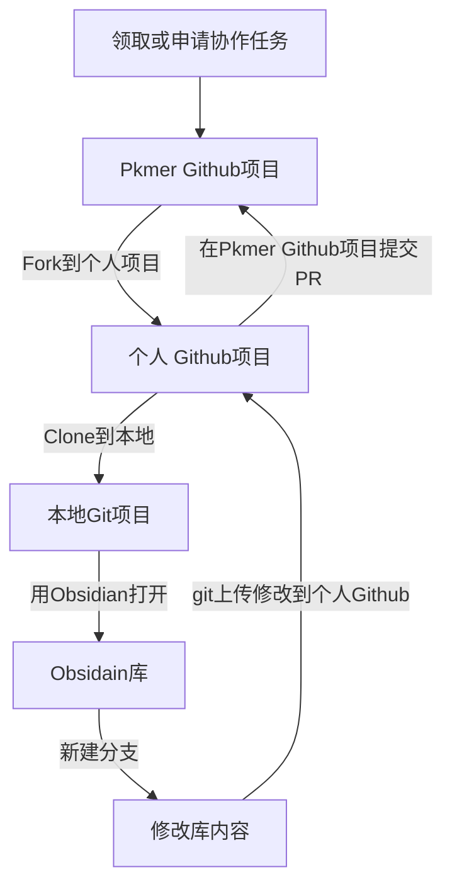

# 协作者指南

## 关于协作者

我们把整个 PKMer 社区成员分为三类：

1. 普通用户：关注个人知识管理，喜欢优秀软件，不断进去的任何人。
2. 协作者：对社区作出一定贡献，包括写教程、文档、帮助开发测试，运营，维护社群秩序，处理 issue，disccuss，他们是社区建立的中坚力量，可享有 PKMer 社区大部分权益。
3. 管理者：从协作者中诞生，对社区有着卓越贡献，并且持续贡献的人。这个群体可以很庞大，PKMer 发展方向和决策都会在管理者群中收集意见并执行。

## 协作者收益

1. PKMer 网站，Github 上署名，共享社区影响力，任何人都可以从小白变大佬。
2. 协作者/管理者的贡献会换算成 PKMer 积分，该积分可以升级成为**PKMer 官方认定协作者**或者兑换**PKMer 付费服务**。
3. **PKMer 协作者/管理者**：
	- 享有未来 PKMer 所有开发的**付费项目专属折扣**，甚至是免费。包括但不限于付费文章，付费教程，付费资源收集，付费插件，付费软件等。[最近一次是 Memos 2.0](https://pkmer.cn/products/productDetails/)
	- 可以获得 PKMer 各板块的运营维护权限
	- PKMer 可提供一切必要的资源，以及一切可能的未来受益。
	- 可以加入 PKMer 项目的**核心团队**，参与包括组织，运营等活动。
	- 成员享有专属讨论群，该群由于有很多协作者，**高质量的发言**有助于解决成员的问题。

## 协作规范

协作任务需要按照一定的格式规范书写，其规范在 [[文档写作规范]]。任务的成果将无偿贡献给社区，同时适用于 GPL-v3.0 开源协议，包括但不限于：

- 翻译：插件翻译，文档翻译，论文翻译，网页翻译等内容
- 教程和分享：知识管理，软件，工作流等具有参考价值和普适性的内容
- 开发：插件开发，软件开发，脚本，主题开发等内容
- 管理：管理社区的帖子，运营，积极反馈 bug，提出新问题，组织和运营活动等内容

如果您认可协作规范，便可：

- 可以加入 QQ 群或者为微信群来领取或者主动贡献
- 领取协作任务：可在 [Pkmer-Docs · Discussions](https://github.com/PKM-er/Pkmer-Docs/discussions) 领取由社区发布的任务，任务完成后会发放对应的积分。
- 申请协作任务：可在 [Pkmer-Docs · Issues ](https://github.com/PKM-er/Pkmer-Docs/issues) 提出您自己想要贡献的任务，积分将由管理者确定，谈妥后便可完成任务获得积分。

## 文档协作流程

由于涉及到多人的协作，版本管理和人员组织都是比较大的问题。好在 Git 和 Github 提供了一系列完善的机制来处理这个问题，难点就仅存在于这套工具的使用上了。因此为了让更多人更轻松的使用这套工具，拟定了以下资源以供参考：

- [[Git协作手把手教程]]：手把手带领操作整个协作流程。
- [[文档写作规范]]：规范化使用语法，提供了一点自动化工具。

协作流程根据有无 Git 协作经验分成两种流程，二者的主要区别在于：

- 有 Git 协作经验者能够自主修改任何内容。
- 无 Git 协作经验者可能需要更多的和我们进行沟通，双方花费的时间也相对更多。

二者没有优劣之分，选择能接受的方式就好。

### 无 Git 协作经验的协作者

- 加入 QQ 群或者微信群，举手告知管理员，自己希望积极为社区贡献
- 也可以直接将您的文章或者需要提的建议和意见通过 Github 的 [Issue](https://github.com/PKM-er/Pkmer-Docs/issues) 或者 [Disccuss](https://github.com/PKM-er/Pkmer-Docs/discussions) 进行讨论

我们将安排核心维护者与您沟通

如果你能够访问 Github，具体操作如下：

1. 访问 Github 的 [Issue](https://github.com/PKM-er/Pkmer-Docs/issues) 网址，点击右侧绿色按钮 `New issue` 创建一个 issue
2. 填写您想参与的标题和内容
3. 和我们的核心维护者沟通，确定此次贡献的具体细节
4. 核心维护者将您的意见或文章更新到网站
5. 完成一次协作

ps：建议您下载我们的 Obsidian 库，里面内置了格式规范和一些有用的工具，体验可能会更好，当然，这不是必须的。

> [!Tip] 无经验又想为社区贡献
> - 如果你学习 Git 有难度
> - 或者说 你登录 Github 有难度
> - 这里也可以加入我们的微信或者 QQ 群，主动向管理员举手，我们有专人帮你上传

### 有 Git 协作经验的协作者

#### 前置条件

1. 本地安装 obsidian 笔记软件。
2. 本地安装 `git` 软件：git 是一款多人协作版本控制系统，能够流程化管理多人的协作项目，可以在 [git 官网](https://git-scm.com/downloads) 下载。（请注意，您最好需要了解什么是 `Git` 再进行操作，[Git - Book](https://git-scm.com/book/zh/v2) 是很好的资源，大致翻看一下有个概念就好了）
3. 注册 `Github` 帐号：[Github 地址](https://github.com/) 。
4. `Fork` 到个人项目：打开 [Pkmer-Docs](https://github.com/PKM-er/Pkmer-Docs) 链接地址，点击右上角 `Fork` 按钮，此操作会在用户的个人 Github 生成和地址一样的项目，这里称之为个人 Github 项目。
5. `Clone` 到本地：在 Github 网站点击头像，接着点击 `Your Repositories` 跳到你个人项目的页面，找到刚刚 `Fork` 的 `Pkmer-Docs` 项目，进入项目。然后点击绿色按钮 `Code`，复制那一串链接。在本地找个目录，右键打开命令行（git bash），输入 `git clone <刚刚复制的链接>`(不要带尖括号)，这会在该目录下载这个个人项目到本地。
6. 用 obsidian 打开：打开 Obsidian，点击左下角打开其它仓库，打开本地仓库，选中个人项目的位置，即可打开这个项目。

#### 协作流程概述

我们将 obsidian 库整个托管在 Github 上，这样任何人都能下载并且修改该库的内容，其基本流程如下：

1. `同步主分支`：登陆到 **个人** Github 项目的网站，选择 Pkmer-Docs 项目，点击 Sync fork 更新个人库，更新完毕后回到 obsidian 拉取（`pull`）更新到本地，即 `ctrl + p` 打开命令窗口，输入 `Obsidian Git: Pull`，回车即可更新本地库。
2. `新建分支`：这个 Obsidian 库带有一个 git 插件，`ctrl + p` 打开命令窗口，输入 `create new branch`，回车，接着输入新分支名 (一般是对你想要修改内容的简短总结，如 `doc-md-tutorial` 表示一个 md 教程的文档，记得用英文)。
3. `贡献`：根据 `issue` 领取的主题，为 Pkmer 文档添砖加瓦。
4. `git` 上传到个人 Github：`ctrl + p` 打开命令窗口，输入并选择 `commit all changes with specific message`，接着输入你做出的修改概要 (如：添加了一个 md 教程)；最后，`ctrl + p` 打开命令窗口，输入并选择 `QuickAdd:PushNewBranch`，接着输入分支名，即可完成上传。
5. `PR`：Pull Request 的简称，你可以理解为申请合并到 Pkmer Github 主项目。登录到个人 Github 项目的网站，即第一步的做完后的网址，会有一个 `Pull Request` 的绿色提示，点击后按照指示操作即可。
6. `沟通与合并`：`PR` 之后维护者会对内容进行 `review`，通过 `PR` 里面进行沟通交流做出相应修改，最后维护者会将您的贡献合并到主项目，完成整个贡献流程（此过程主要在 GitHub 网站上 **Pkmer Github 主项目** `PR` 进行）。
7. `删除分支`：切换回主分支，`ctrl + p` 打开命令窗口，输入 `Switch branch`，选择 `main` 主分支（也可以直接点击 obsidian 有下角切换到 `main` 分支），再次 `ctrl + p` 打开命令窗口，输入 `Delete branch`，选择删除对应分支。

详细步骤可以参阅 [[Git协作手把手教程]]。

## 协作内容

共同的目的是打造一个个人知识管理者的参考指南，目录是围绕个人知识管理构建的，前期以 Obsidian 为载体，从资源收集，知识管理，知识工具，知识管理理论，再到工作流依次组织，后期可能会引入其他如专业领域的内容形式。

### 近期主要协作内容（建议）

- 高频社区插件使用教程
- OB 使用过程中的问题

## 常见问题

### pkmer 只是为爱发电吗？

并不全是。在过去三年里，pkmer 建设者 [boninall](https://github.com/Quorafind)，[cumany](https://github.com/cumany) 二位无偿为社区贡献了十几个插件，[[obsidian-memos]]，[[floating-toc]]，[[editing-toolbar]] 等深受好评，贡献了如 [PKM-er/Blue-topaz-example](https://github.com/PKM-er/Blue-topaz-example) 的 Obsidian 用法示例库，写了许多知识管理文章分享。[whyt-byte](https://github.com/whyt-byte) 做出了国内用户最多的 Obsidian 主题。除此之外，翻译插件，贡献功能，答疑的 pkmer 就不说了，这些大佬都是牺牲宝贵的业余时间，为爱发电。

但写插件并不能让更多人收益，做知识管理的普及工作可能会惠及更多的人，所以有了 pkmer，旨在建立东半球最大的知识管理社区，和一群同道中人分享经验与交流是一件很让人激动的事情。但维持 pkmer 的运作需要服务器成本，图床成本，也需要拿出一些激励，让社区更有活力的发展，所以不得不做出妥协。但是别担心，pkmer 的知识管理文档==完全开源免费==，对所有人开放，永远！我们将采取其它措施维持整个 pkmer 的运营，比如开发比较复杂且刚需的付费插件，软件，提供定制等服务，希望有能力的人可以支持一下。

### 协作流程能不能更友好？

目前国内并没有开源的良好土壤，即使我们开发用户友好的协作平台，凭我们几个以业余时间贡献的人，也拿不到国内平台的运营资质。所以迫不得已在 Github，利用其成熟的工作流进行协作，我们再搬运到网站上供所有人在网站无障碍访问。如果您有更好的建议和意见，非常欢迎在社群里提出，我们会积极响应。