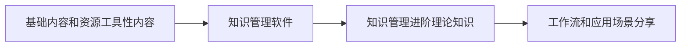

# 文档写作规范

鉴于需要保证文档的规范性和可读性，将规范文档的使用语法和格式，以带给读者最佳的阅读体验。

## 文档规范

文档规范有三个：

1. 文件和文件夹规范：文件名应尽可能简短，最好不超过 12 个字符，不能包含特殊的字符比如空格，`/`，`$` ,为了网站显示正常，建议==文件名只能包含：中英文、数字、短横线、下划线==，网站实际显示的标题是文档`frontmatter`中的title字段，跟文件名无关。除一级文件夹为了维持文件夹在 Obsidian 中的显示顺序外，子文件夹不需要再进行编码以保证显示顺序 (考虑到有索引文件，顺序的重要性降低了)。Obsidian 社区插件的写作，文件名必须用插件的 id，可以在插件文件夹的 `manifest.json` 文件中查看。
2. 文档的 `frontmatter` 规范：用于方便检索和展示元数据。
3. 文档语法规范：除了本文的语法规范，Obsidian 社区插件的协作可以参考 [[obsidian-textgenerator-plugin]] 提供的示例，须在一级标题下放置说明卡片，介绍基本功能，介绍基本用法后，方可随意发挥。

### 文件和文件夹规范

文档的目录结构和说明如下：

```txt
Pkmer-Docs
├── 00-关于
├── 01-社区资源合集
├── 02-知识管理基础
├── 03-知识管理工具
├── 10-Obsidian
├── 20-深入理解知识管理
├── 30-知识管理具体应用
├── 40-开发者指南
|—— 90-其它
├── Config
│   └── QuickAdd
│       └── update-yaml-title.js
├── License
├── README.md
└── Resource
    └── Images
```

- 编号以 0 开头的是基础内容和一些推荐阅读内容。比如了解本组织，资源合集，知识管理基础，笔记软件横评等内容。
- 编号以 1 开头的是具体知识管理软件的使用
- 编号以 2 开头的是知识管理进阶内容
- 编号以 3 开头的是知识管理具体应用
- 编号以 4 开头的是插件开发，脚本等内容
- 编号以 9 开头的是其它内容，暂时不好分类或者偏离主题的内容
- Config 文件夹放置本库的脚本，库内配置
- Resource 文件夹放置本地图片，canvas，excalidraw 等其它非 md 资源

大致按照下述思路组织：

0 开头的文件夹内容是最基础的内容和一些资源工具类内容。进而是笔记软件的使用，建立在基础内容之上。紧接着是高级内容，阐述信息组织，信息管理等一些理论知识。最后是结合笔记软件和笔记方法，分享工作流和经验。扁平化组织，逐级递进。



### 文档 frontmatter 规范

文档 frontmatter 是自动生成的，可通过内置的 `ctrl + s` 快捷键在 Obsidian 内快速实现。

- 如果你使用我们提供的库，下面内容是自动生成的
	1. uid：自动生成，文件的唯一定位标识符，也是文档创建的时间戳
	2. title：文件名，自动生成
	3. draft：用于标识是否发布
	4. editable：文章创作者是否允许修改
	5. modified：修改时间的时间戳
- 这些需要手动完成
	1. author：英文逗号分割的作者名，后续修订者记得加上自己的笔名。加不加都会成为贡献者
	2. tags：标签，以 `[tag1,tag2]` 的格式呈现，文中的标签会自动更新到 yaml 中
	3. description：文件内容描述，用于网站展示内容和 SEO 优化
	4. type：文档类型，默认为 other。其余可选类型为：
		- tutorial——教程，除了需要知道电脑的基本知识外，完全不需要任何前置条件，手把手教会读者主题内容
		- basic——基础，用于学习一些核心概念，同时回答一些基础性问题。只有学习这些基础才能理解后续主题内容
		- advanced——进阶，进阶使用，包含高级玩法，奇技淫巧
		- practice——实践，介绍完整的工作流，查询手册
		- awesome——索引，MOC 索引页，资源收集等
		- other——其它：关于笔记的轶闻趣事等其它内容的分享

### 文件名

因为对应的文件会成为网页链接地址，所以文件中不能使用中文的 `—,!@#:&`

### 文档语法规范

> [!Warning] 特别声明
> 如你是搬运或者翻译，那么请要获得原作者许可，已经提供我们原文链接

**标题语法**

- 一级标题是文档名，对应我们上网时候的文章标题和网页标题
	- 以前的文档都规定一篇文章只有一个 `h1` 标题，所以为了保证兼容其它发布工具，我们也采取这个规范。
- 文档内容从二级标题开始，文档内不超过 4-5 级标题。这是出于对 SEO 优化所制定的规范，这可通过内置的 `ctrl + s` 快捷键在 Obsidian 内快速实现。
- 只使用 `#` 语法表示标题。理论上 ---，=都可用来表示标题，但不建议这样做。
- 标题不应含有特殊字符：如 latex 公式，代码块，数字编号等
- 标题前后要有空行。这可通过内置的 `ctrl + s` 快捷键在 Obsidian 内快速实现。

**无序列表和有序列表**

- 列表不应该混用：Obsidian 的某些限制，在嵌套列表语法时会导致排版错乱，不建议混用。
- 仅使用 `-` 作为无序列表标记：这可通过内置的 `ctrl + s` 快捷键在 Obsidian 内自动修正。
- 自动修正编号：这可通过内置的 `ctrl + s` 快捷键在 Obsidian 内快速实现。

**文字及样式**

- 加粗：`** **`
- 斜体：`* *`，不使用下划线的写法
- 高亮：`== ==` 这尽管不是通用 md 语法，但在各大平台有兼容
- 删除线：`~~ ~~` ~~删除~~
- 行内代码：\` 使用反引号
- 引用：`>`
- 表格：Github 风格的表格，即 Obsidian 支持的表格
- callout：Obsidian 内置的几种 callout 语法
- 代码块：使用默认三反引号语法
- 脚注：仅支持 `[^1]` 风格的脚注，脚注内容须放到文章末尾，以 `[^1]: footnote` 的形式呈现。
- 除上述文字样式外，不使用 html 语法改变文字样式，仅在特殊情况下使用 html 语法增添文档的趣味性。

**链接**

- 文档链接使用双链语法：链接在 README 文件中使用相对路径写法，除此之外使用双链语法。双链语法在 Obsidian 中简洁且优雅。
- 网址使用 `[]()` 语法

**图片**

- 使用本地图片的方式：放置图片到 `Resource/Images` 内，不要求命名格式，后续我们统一处理。
- 使用 `![[]]` 的语法：除 README 外，其余各处使用优雅的 Obsidain 双括号语法。
- 格式：尽量使用 `png`，`jpg`，`gif` 这三种格式的图片和动图。

**视频**

- 不支持插入本地视频
- 支持插入网页视频，通过 `iframe` 标签语法引用 B 站视频，通过 `![[]]` 引用远程地址视频。

**正文**

- 正文内不使用 html 标签
- 中英文间隔：这可通过内置的 `ctrl + s` 快捷键在 Obsidian 内快速实现。
- 中文和数字：这可通过内置的 `ctrl + s` 快捷键在 Obsidian 内快速实现。
- 大小写：尽量别简写，专有名词首字母大小写，且符合缩写规律。如：Obsidian 需要一位熟悉 JavaScript、HTML5，至少理解一种框架（如 Backbone.js、AngularJS、React 等）的前端开发者。
- 标点符号：中英文段落中标点符号不混用。末尾是否有标点不要求。
- 专有名词适当保持英文：主要是考虑到 OB 自身汉化的完整度不高，而且有时候交流中，使用英文称呼更能精准传达意思

## 库内置插件和工具

> [!warning] 注意
> 使用内置插件和工具需要您确保已手动打开插件

- `dataview`：用于库的统计和追踪
- `obsidian-git`：用于查看和可视化操作 git
- `obsidian-linter`：规范和格式化 md 文档，按 `ctrl + s` 进行格式化，建议没事按着玩
- `qucikadd`：自动化处理脚本，帮助处理一些繁琐内容，目前有快捷打开命令行，css 片段，script 文件夹，gvim，Vscode 和自动更新 frontmatter 的 `title` 字段的功能，`ctrl + p` 打开命令窗口选择对应的命令即可。
- `obsidian-advanced-table`：快捷输入表格
- `obsidian-outliner`：快捷操作无序列表
- `latex-suite`：快捷输入 callout 等内容片段

对于其它您爱使用的插件和主题，请随意安装，由于有 `.gitignore` 文件，并不会影响到上游库的更改。

其中 `latex-suite` 内置两个自定义的片段：

1. 输入 `!note<tab>` 则会拓展为 note callout 样式，note 可以是任意字符，比如 `!tips<tab>` 等
2. 输入\`mermaid 则会拓展为 mermaid 代码块

> [!note] 其它
> 如您需要其它帮助协作者开发的工具，可以在 Github 提交 Issue 联系我们开发，或者 PR 分享