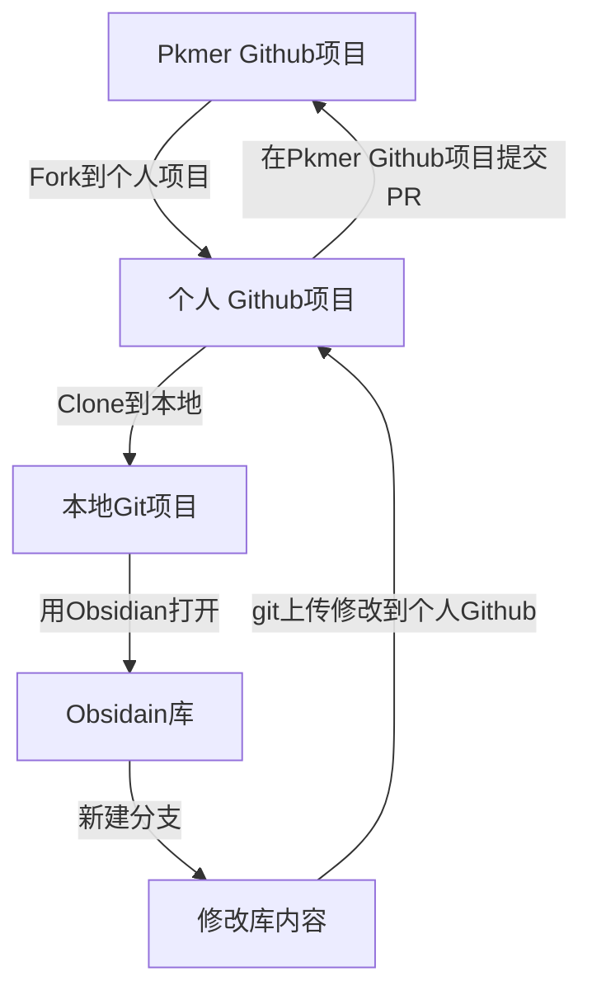

# 文档协作流程

我们的协作流程根据有无 Git 协作经验分成两种流程，二者的主要区别在于，有 Git 协作经验者能够自主修改任何内容，我们的核心维护者仅需合并即可。无 Git 协作经验者可能需要更多的和我们进行沟通，双方花费的时间也相对更多。二者没有优劣之分，选择你们能接受的方式就好。

## 无 Git 协作经验的协作者

可以直接将您的文章或者需要提的建议和意见通过 Github 的 [Issue](https://github.com/PKM-er/Pkmer-Docs/issues) 或者 [Disccuss](https://github.com/PKM-er/Pkmer-Docs/discussions) 进行讨论，我们将安排核心维护者与您沟通。具体操作如下：

1. 访问 Github 的 [Issue](https://github.com/PKM-er/Pkmer-Docs/issues) 网址，点击右侧绿色按钮 `New issue` 创建一个 issue
2. 填写您想参与的标题和内容
3. 和我们的核心维护者沟通，确定此次贡献的具体细节
4. 核心维护者将您的意见或文章更新到网站
5. 完成一次协作

ps：建议您下载我们的 Obsidian 库，里面内置了格式规范和一些有用的工具，体验可能会更好，当然，这不是必须的。

## 有 Git 协作经验的协作者

### 前置条件

1. 本地安装 obsidian 笔记软件。
2. 本地安装 `git` 软件：git 是一款多人协作版本控制系统，能够流程化管理多人的协作项目，可以在 [git 官网](https://git-scm.com/downloads) 下载。（请注意，您最好需要了解什么是 `Git` 再进行操作，[Git - Book](https://git-scm.com/book/zh/v2) 是很好的资源，大致翻看一下有个概念就好了）
3. 注册 `Github` 帐号：[Github 地址](https://github.com/) 。
4. `Fork` 到个人项目：打开 [Pkmer-Docs](https://github.com/PKM-er/Pkmer-Docs) 链接地址，点击右上角 `Fork` 按钮，此操作会在用户的个人 Github 生成和地址一样的项目，这里称之为个人 Github 项目。
5. `Clone` 到本地：在 Github 网站点击头像，接着点击 `Your Repositories` 跳到你个人项目的页面，找到刚刚 `Fork` 的 `Pkmer-Docs` 项目，进入项目。然后点击绿色按钮 `Code`，复制那一串链接。在本地找个目录，右键打开命令行（git bash），输入 `git clone <刚刚复制的链接>`(不要带尖括号)，这会在该目录下载这个个人项目到本地。
6. 用 obsidian 打开：打开 Obsidian，点击左下角打开其它仓库，打开本地仓库，选中个人项目的位置，即可打开这个项目。

### 协作流程概述

我们将 obsidian 库整个托管在 Github 上，这样任何人都能下载并且修改该库的内容，其基本流程如下：

### 具体协作流程

1. `同步主分支`：登陆到 **个人** Github 项目的网站，选择 Pkmer-Docs 项目，点击 Sync fork 更新个人库，更新完毕后回到 obsidian 拉取（`pull`）更新到本地，即 `ctrl + p` 打开命令窗口，输入 `Obsidian Git: Pull`，回车即可更新本地库。
2. `新建分支`：这个 Obsidian 库带有一个 git 插件，`ctrl + p` 打开命令窗口，输入 `create new branch`，回车，接着输入新分支名 (一般是对你想要修改内容的简短总结，如 `doc-md-tutorial` 表示一个 md 教程的文档，记得用英文)。
3. `贡献`：根据 `issue` 领取的主题，为 Pkmer 文档添砖加瓦。
4. `git` 上传到个人 Github：`ctrl + p` 打开命令窗口，输入并选择 `commit all changes with specific message`，接着输入你做出的修改概要 (如：添加了一个 md 教程)；最后，`ctrl + p` 打开命令窗口，输入并选择 `QuickAdd:PushNewBranch`，接着输入分支名，即可完成上传。
5. `PR`：Pull Request 的简称，你可以理解为申请合并到 Pkmer Github 主项目。登录到个人 Github 项目的网站，即第一步的做完后的网址，会有一个 `Pull Request` 的绿色提示，点击后按照指示操作即可。
6. `沟通与合并`：`PR` 之后维护者会对内容进行 `review`，通过 `PR` 里面进行沟通交流做出相应修改，最后维护者会将您的贡献合并到主项目，完成整个贡献流程（此过程主要在 GitHub 网站上 **Pkmer Github 主项目** `PR` 进行）。
7. `删除分支`：切换回主分支，`ctrl + p` 打开命令窗口，输入 `Switch branch`，选择 `main` 主分支（也可以直接点击 obsidian 有下角切换到 `main` 分支），再次 `ctrl + p` 打开命令窗口，输入 `Delete branch`，选择删除对应分支。

详细步骤可以参阅 [[Git协作手把手教程]]。
