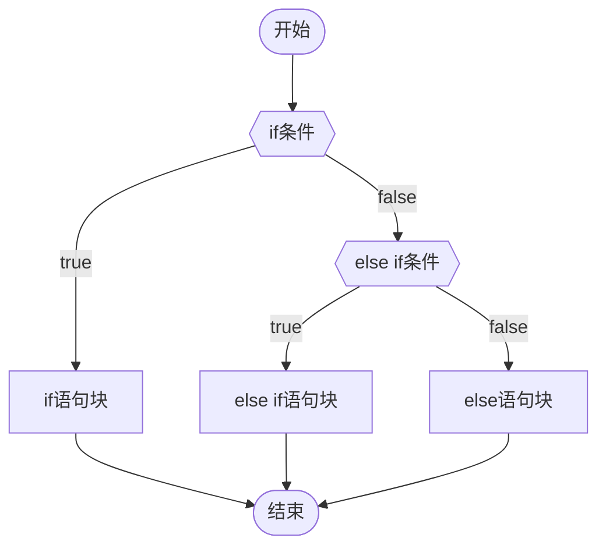
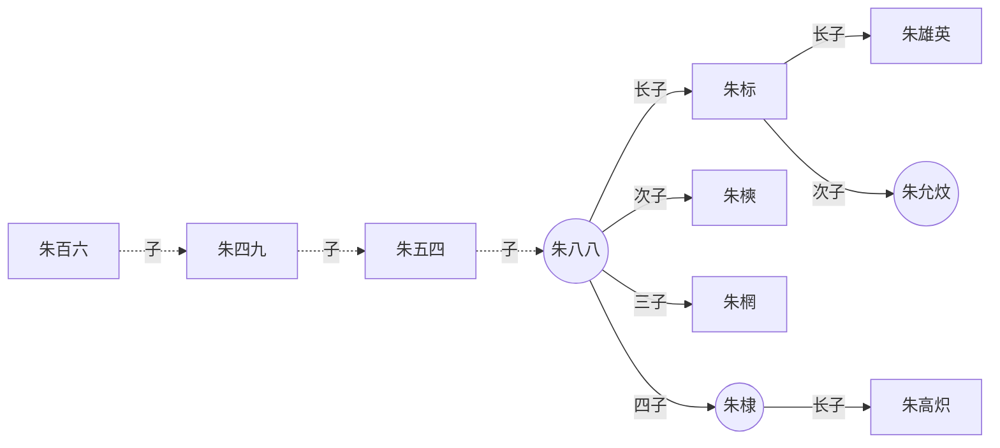
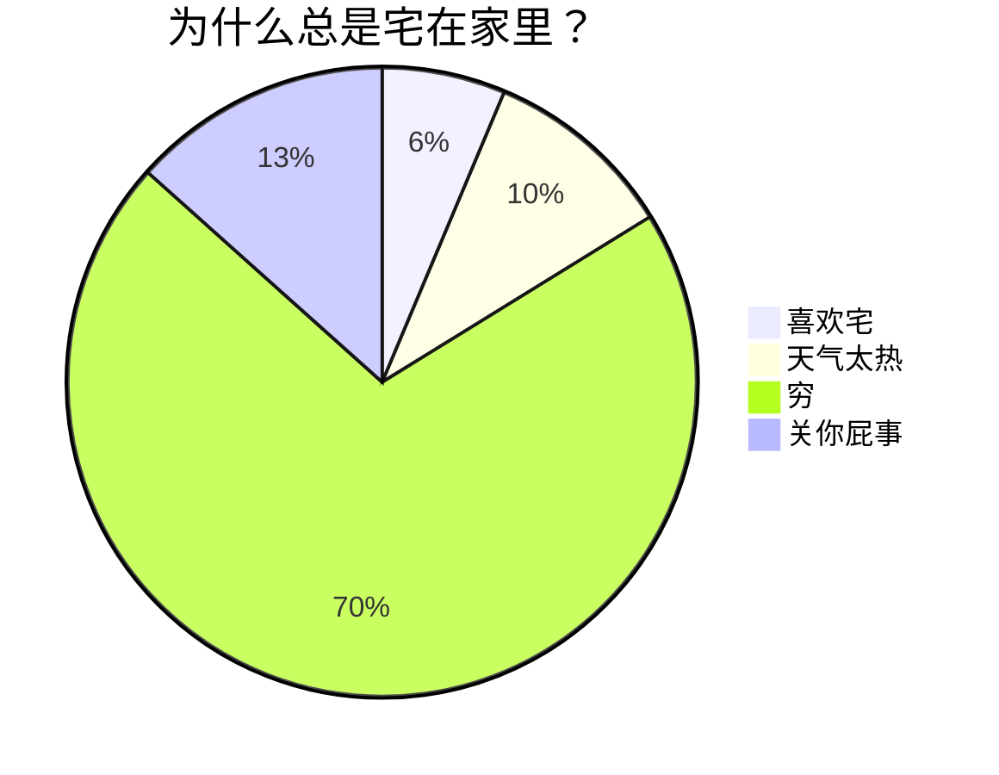
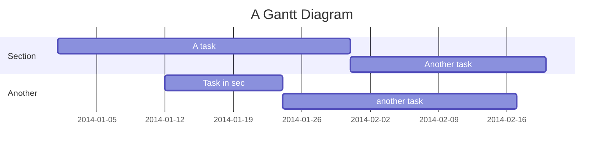
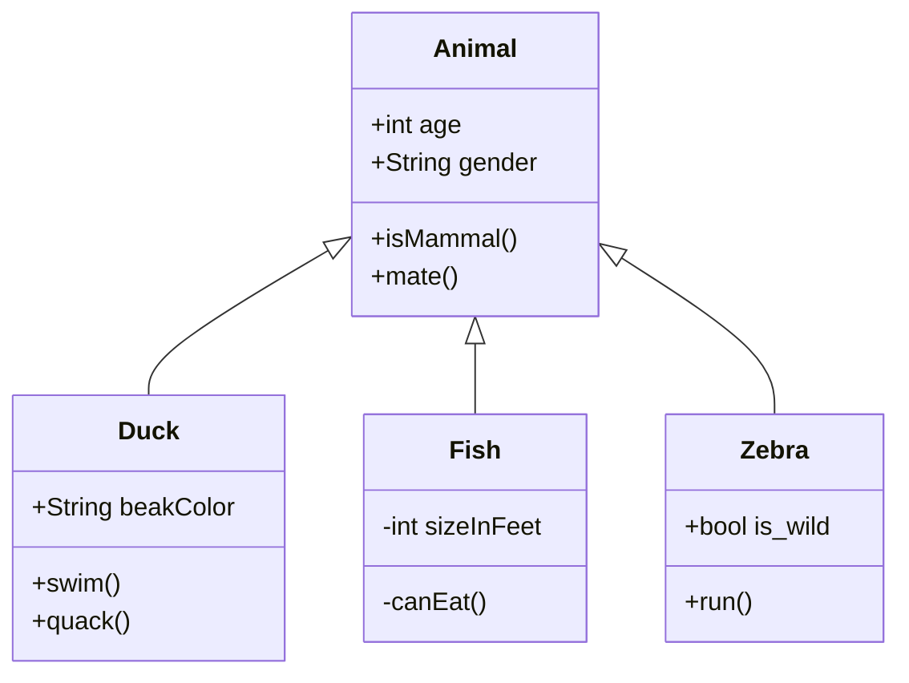

# 适合 Obsidian 的 Markdown 超级教程

# 什么是 Markdown?

1. **Markdown** 是一款轻量级标记语言，不同于 HTML **(Hypertext Markup Language)**，**Markdown** 的语法非常简单，且容易上手
2. **Markdown** 以 **纯文本格式** 编写文档，依赖键盘而非鼠标，专注于**写作本身**，感受**书写**的魅力
3. **Markdown** 的通过添加一些简单的 **标识符**，让文本具有**恰到好处**的格式
4. **Markdown** 核心特征就是 **删繁剪芜**， **简扼** + **精炼**
5. **Markdown** 是 **笔记** 与 **网页文章** 的最佳载体
6. **Down** 的核心：坐 **下** 来，就能把思维写 **下** 来
   - **牛津高阶英汉双解词典第九版** 中，关于 **down** 的释义：


## 为什么要使用 Markdown?

有朋友问我 ，**Markdown** 的效果 用 Word 完全可以复现，甚至功能更多，那为何要用 **Markdown** 呢？

**答：**

- 功能多，不一定是好事
	- 功能一多，选择就会变多，然后你会开始纠结……
		- 这个字号是不是该大一点呢？
		- 这个颜色好像有点不太搭呢？
		- 这个粗体，是不是该再加点颜色呢？
		- 这个图片的位置看起来有点不大对劲呢？
	- 结果，写了半天，就憋出一点点东西
		- 写出来的内容...好像...也不咋滴

**MD 的优势：**

1. **Markdown** 让我们免于 **被繁杂臃肿的功能晃花了眼** 的困扰
2. **Markdown** 让我们回归内容本身，拥抱笔记的**内核**，而非浮于**表象**的样式，写出**高效精练**的笔记！

用 **Markdown** 写东西，记住一个原则

> 能用 10 个字搞定的，绝不用 11 个字

经常使用 **Markdown** 书写的朋友，也许会有一种奇妙的感触

- 书写，会==倒逼==思维的跃进。像是有东西拽着你的思绪往前冲
	- 倒逼：逆向逼迫，反向推动

**关于标识符的滥用**

这个其实是写在最后的，之所以放在这里，是因为它**很重要**！

如果你有一定的 MD 语法基础，可以直接 [[#19 避免标识符的滥用|点击跳转]]


## Markdown 相关软件推荐

- **Markdown** **书写软件** 推荐：**Typora** 优秀的 MD 网页文章 书写软件
  - [点击跳转下载地址](https://www.typora.io/ "Typora编辑器")
    - #提示 以前是免费的，现在收费了，不过是买断制
- **Markdown** **笔记软件** 推荐：**Obsidian** **银河系最强** **MD+ 双向链** 笔记软件
  - [点击跳转下载地址](https://obsidian.md/ "银河系第一笔记软件 Obsidian")


# Markdown 语法

- **提示 1：** 本教程推荐使用 **Obsidian** 打开阅读
- **提示 2：** 下文提到的所有标识符都是 **英文状态** 的 **！**

## 1. 标题&目录


### 1.1 标题

- Markdown 标题共有 **六级**，和 HTML 一样
- 区分 **一级标题 → 六级标题**
  - **标题 的格式：**
    - **<kbd>#</kbd>** × 标题级数 + **<kbd>空格</kbd>** + 文本内容

```md
这是一段普通的文本

# 这是一级标题
## 这是二级标题
### 这是三级标题
#### 这是四级标题
##### 这是五级标题
###### 这是六级标题 
```


### 1.2 目录

- **目录的 格式：**
  - 在文档的顶部 输入 **`[toc]`** ，会根据 **标题** 自动生成目录 ( **Table of Content** )
- 不是所有 **MD 编辑器** 都支持目录生成
	- **Obsidian** 就不支持，不过 **OB** 是自带大纲的，就是目录的效果

```md
输入下方内容会生成一个目录：

[toc]
```


## 2. 斜体&粗体


### 2.1 斜体

- **斜体 的格式：**
  1. `*` + 文本内容 + `*`
  2. `_` + 文本内容 + `_` ( 下划线 )
- **说明：**
	- 斜体文本，首尾只有 **单个** 标识符

```md
这是一段普通文本

*这里是一段斜体文本*
_这也是一段斜体文本_
```

#### 示范

这是一段普通文本

*这里是一段斜体文本*

*这也是一段斜体文本*

 

### 2.2 粗体

- **粗体 的格式：**
  1. `**` + 文本内容 + `**`
  2. `__` + 文本内容 + `__` (这里是两个 **<kbd>_</kbd>** )

- **说明：**
  - 粗体文本，首尾各有 **两个** 标识符

```md
这是一段普通文本

**这里是一段加粗文本**
__这也是一段加粗文本__
```

#### 示范

这是一段普通文本

**这里是一段加粗文本**

**这也是一段加粗文本**


### 2.3 粗斜体 (斜粗体)

- **粗斜体 的格式：**
  1. `***` + 文本内容 + `***`
  2. `___` + 文本内容 + `___` （ 这里是 3 个 <kbd>_</kbd> )
  3. `**_` + 文本内容 + `_**`
  4. `__*` + 文本内容 + `*__`
  5. `*__` + 文本内容 + `__*`
  6. `_**` + 文本内容 + `**_`

- **说明：**
  - 粗斜体文本，首尾各有 **三个** 标识符

```md
这是一段普通文本

***粗斜体文本1***
___粗斜体文本2___
**_粗斜体文本3_**
__*粗斜体文本4*__
*__粗斜体文本5__*
_**粗斜体文本6**_
```

#### 示范

这是一段普通文本

***粗斜体文本 1***

***粗斜体文本 2***

***粗斜体文本 3***

***粗斜体文本 4***

***粗斜体文本 5***

***粗斜体文本 6***


### 2.4 斜体包含粗体

- **斜体中包含粗体 的格式：**
  1. `*` + 斜体文本 + `**` + 粗体文本 + `**` + 斜体文本 + `*`
  2. `_` + 斜体文本 + **`__`** + 粗体文本 + `__` + 斜体文本 + `_` （ 这里是两个 **<kbd>_</kbd>** )
  3. `*` + 斜体文本 + `__` + 粗体文本 + `__` + 斜体文本 + `*`
  4. `_` + 斜体文本 + `**` + 粗体文本 + `**` + 斜体文本 + `_`

- **说明：**
  - **斜体** 中包含 **粗体**，其实就是嵌套的关系，**外层** 是 **斜体**，**内层** 是 **粗体**
  - 外层是**斜体**，标识符是**单个**；内层是**粗体**，标识符是**两个**
  - 因为 **粗体** 是被包裹在 **斜体** 中的，所以显示效果为 **斜粗体**

```md
这是一段普通文本

*这里是一段斜体中**包含粗体**的文字*
_这也是一段斜体中**包含粗体**的文字_
*这又是一段斜体中__包含粗体__的文字*
_这还是一段斜体中**包含粗体**的文字_
```

#### 示范

这是一段普通文本

*这里是一段斜体中**包含粗体**的文字*

*这也是一段斜体中**包含粗体**的文字*

*这又是一段斜体中 __ 包含粗体 __ 的文字*

*这还是一段斜体中**包含粗体**的文字*


### 2.5 粗体包含斜体

- **粗体中包含斜体 的格式：**
  1. `**` + 粗体文本 + `*` + 斜体文本 + `*` + 粗体文本 + `**`
  2. `__` + 粗体文本 + `_` + 斜体文本 + `_` + 粗体文本 + `__` （ 这里是两个 **<kbd>_</kbd>** )
  3. `**` + 粗体文本 + `_` + 斜体文本 + `_` + 粗体文本 + `**`
  4. `__` + 粗体文本 + `*` + 斜体文本 + `*` + 粗体文本 + `__`
- **说明：**
  - **粗体** 中包含 **斜体**，也就是嵌套的关系，**外层** 是 **粗体**，**内层** 是 **斜体**
  - 外层是**粗体**，标识符是**两个**；内层是**斜体**，标识符是**单个**
  - 因为 **斜体** 是被包裹在 **粗体** 中的，所以显示效果为 **粗斜体**

```md
这是一段普通文本

**这里是一段粗体中*包含斜体*的文字**
__这也是一段粗体中_包含斜体_的文字__
**这又是一段粗体中_包含斜体_的文字**
__这还是一段粗体中*包含斜体*的文字__
```

#### 示范

这是一段普通文本

**这里是一段粗体中 * 包含斜体 * 的文字**

**这也是一段粗体中 _ 包含斜体 _ 的文字**

**这又是一段粗体中 _ 包含斜体 _ 的文字**

**这还是一段粗体中 * 包含斜体 * 的文字**


## 3. 线


### 3.1 水平分割线

- 水平分割线由至少 **3** 个 `*` 或 `-` 组成

```md
下面是一条水平分割线：
---
***
```

#### 示范

---
***


### 3.2 文本删除线

- **删除线 的格式：**
  - **`~~`** + 文本内容 +**`~~`** 首尾各加两个 **<kbd>~</kbd>** 波浪号

```md
~~这是一段加了删除线的文本~~
```

#### 示范

~~这是一段加了删除线的文本~~

  

### 3.3 文本下划线

- 下划线的格式，和 HTML 是一样的
  - **`<u>`** + 文本内容 + **`</u>`**

```html
<u>这是一段加了下划线的文本</u>
```

#### 示范

<u>这是一段加了下划线的文本</u>


## 4. 列表&引用


### 4.1 有序列表

- **有序列表 的格式：**
  - **`1.`** + **<kbd>空格</kbd>** + 文本内容
- **说明：**
  - 输入文本内容后，敲击 **<kbd>Enter</kbd>** 自动补全格式，并进入 **下个** 有序列表
  - 若需要在同个列表内，增加 **换行显示** 的内容 (**但不进入下个列表**)
    敲击 **<kbd>Shift</kbd>** + **<kbd>Enter</kbd>** ，即可另起一行输入文本
  - 在有序列表的中间，插入一个新的列表，后面列表的 **数字序号** 会自动 **递进** 一层
  - 即便在源代码模式中修改了数字序号，渲染界面依然是 **依照顺序** 显示的

```md
1. 这是第一个有序列表 <!-- (Enter) -->
2. 这是第二个有序列表 <!-- (Enter) -->
3. 这是第三个有序列表 


1. 这是第一个有序列表 <!-- (Shift + Enter) -->
   这是同个列表下，另起一行的文本内容 <!-- (Enter) -->
2. 这是第二个有序列表 <!-- (Shift + Enter) -->
   这是同个列表下，另起一行的文本内容 
```

#### 示范

1. 这是第一个有序列表
2. 这是第二个有序列表
3. 这是第三个有序列表
4. 这是第一个有序列表
   这是同个列表下，另起一行的文本内容
5. 这是第二个有序列表
   这是同个列表下，另起一行的文本内容

#### 补充

- 由于有序列表存在**强制排序性**，它的数字序号必然是**逐一递进**的
	若你希望内容前的数字，不依照**递进顺序**排序，或者以 **整百**，**整十数** 排序
- 可以配合**无序列表**，在无序列表中输入：
	- `数字` + `.` + 内容
		#注意 点号 与 内容 之间，**没有空格** (其实有空格也行，就是会感觉有点奇怪)

```md
- 10.这是无序列表下，整十数排列的内容
- 20.这是无序列表下，整十数排列的内容
- 30.这是无序列表下，整十数排列的内容


- 100.这是无序列表下，整百数排列的内容
- 200.这是无序列表下，整百数排列的内容
- 300.这是无序列表下，整百数排列的内容
```

**效果：**

- 10.这是无序列表下，整十数排列的内容
- 20.这是无序列表下，整十数排列的内容
- 30.这是无序列表下，整十数排列的内容


- 100.这是无序列表下，整百数排列的内容
- 200.这是无序列表下，整百数排列的内容
- 300.这是无序列表下，整百数排列的内容


### 4.2 无序列表

- **无序列表 的格式：**
- **<kbd>-</kbd>** + **<kbd>空格</kbd>** + 文本内容
- **说明：**
  - 输入文本内容后，敲击 **<kbd>Enter</kbd>** 自动补全格式，并进入 **下个** 无序列表
  - 若需要在同个列表内，增加**换行**显示的内容 (**但不进入下个列表**)
    敲击 **<kbd>Shift</kbd>** + **<kbd>Enter</kbd>** ，即可另起一行输入文本

```md
- 这是第1个无序列表 <!-- (Enter) -->
- 这是第2个无序列表 <!-- (Enter) -->
- 这是第3个无序列表

- 这是第一个无序列表 <!-- (Shift + Enter) -->
  这是同个列表下，另起一行的文本内容
- 这是第二个无序列表 <!-- (Shift + Enter) -->
  这是同个列表下，另起一行的文本内容 
```

#### 示范

- 这是第 1 个无序列表
- 这是第 2 个无序列表
- 这是第 3 个无序列表


- 这是第一个无序列表
  这是同个列表下，另起一行的文本内容
- 这是第二个无序列表
  这是同个列表下，另起一行的文本内容

> 列表可在 OB 中，设置快捷键，在 批量处理与取消上 会更方便


### 4.3 引用

- **引用 的格式：**
  - **<kbd>></kbd>** + `空格` + 文本内容 （**空格可加可不加，我推荐是加上**)
- **说明：**
  - **同个引用段落**内的换行直接敲击 **<kbd>Enter</kbd>** 即可
  - 若需添加 **第二个独立引用段落** ，连续敲击 **两下** **<kbd>Enter</kbd>** 即可

```markdonw
> 这是第一段引用文本的第1行 <!-- (Enter) -->
> 这是第一段引用文本的第2行 <!-- (Enter) -->
<!-- (Enter) -->
> 这是第二段引用文本的第1行 <!-- (Enter) -->
> 这是第二段引用文本内第2行
```

**注：** 后面的 `>` 敲 `回车` 会自动补上

#### 示范

> 这是第一段引用文本的第 1 行
> 这是第一段引用文本的第 2 行

> 这是第二段引用文本的第 1 行
> 这是第二段引用文本的第 2 行


### 4.4 缩进&退格

**在列表和引用的书写过程中，我们需要利用 ==缩进== 与 ==退格== ，让文章肌理分明，更具层级**

- **缩进：**
  1. **<kbd>Tab</kbd>**
  2. **<kbd>Ctrl</kbd>** + **<kbd>[</kbd>** &nbsp; (左中括号)

- **退格：**
  1. **<kbd>Shift</kbd>** + **<kbd>Tab</kbd>**
  2. **<kbd>Ctrl</kbd>** + **<kbd>]</kbd>**&nbsp;（右中括号）


#### 4.4.1 有序列表的缩&退

```md
1. 第一级有序列表1 <!-- (Enter) -->
	1. 第二级有序列表1    <!-- 写文本之前，先( Tab 或 Ctrl + ] ) ；写完文本后，再(Enter) -->
	2. 第二级有序列表2 <!-- (Enter) -->
2. 第一级有序列表2    <!-- 写文本前，先 ( Shift + Tab 或 Ctrl + [ ) --> 
```

- **补充说明：**
  - 有序列表的**数字序号**，即便你在源代码模式里 强行改掉 数字，它仍然会 **依照顺序** 显示

##### 示范

1. 第一级有序列表 1
   1. 第二级有序列表 1
   2. 第二级有序列表 2
2. 第一级有序列表 2


#### 4.4.2 无序列表的缩&退

```md
- 第一级无序列表1 <!-- (Enter) -->
	- 第二级无序列表1  <!-- 写文本前，先( Tab 或 Ctrl + ] ) ；写完后，再(Enter) -->
	- 第二级无序列表2 <!-- (Enter) -->
- 第一级无序列表2  <!-- 写文本前，先 ( Shift + Tab 或 Ctrl + [ ) -->
```

##### 示范

- 第一级无序列表 1
  - 第二级无序列表 1
  - 第二级无序列表 2
- 第一级无序列表 2


#### 4.4.3 引用的缩&退

- 引用的 **缩进** 和列表 **不同**
  - 引用需另起一行，并额外多打一个 <kbd>></kbd> 来完成 **缩进**
- 如果要退回上一级，敲**2 下回车键**即可

##### 源码

```md
> 这是第一级引用
> > 这是第二级引用 <!-- 这里手动加一个 > ，打完后，敲 2 下回车键 -->
> 
> 这里又是第一级引用了
```

---

##### 示范

> 这是第一级引用
>
> > 这是第二级引用
>
> 这里又是第一级引用了


#### 4.4.4 有序&无序&引用 连续套娃

- **有序列表**、**无序列表**、**引用** 三者之间，可以相互嵌套
- **核心键** ： **<kbd>Shift</kbd>** + **<kbd>Enter</kbd>** **&** **<kbd>Enter</kbd>** **&** **<kbd>Shift</kbd>** + **<kbd>Tab</kbd>** ( 或 **<kbd>Ctrl</kbd>** + **<kbd>[</kbd>** )
  - **<kbd>Shift</kbd>** + **<kbd>Enter</kbd>** 在切换格式的嵌套中，是 自带一层 **缩进** 效果的

```md
1. 第一级 有序列表1 <!-- (Shift + Enter) --> 
	- 第二级 无序列表1 <!-- (Shift + Enter) -->
		>第三级 引用1  <!-- (Enter) -->
			- 第四级 无序列表2 <!-- (Shift + Enter) -->
            	1. 第五级 有序列表2 <!-- (Enter) -->
            - 第四级 无序列表3   <!-- 写文本前，先( Shift + Tab 或 Ctrl + [ ) ；写完后再 (Enter) -->
        >第三级 引用2  <!-- 写文本前，先( Shift + Tab 或 Ctrl + [ ) ；写完后再 (Enter × 2) -->
    - 第二级 无序列表4  <!-- 写文本前，先( Shift + Tab 或 Ctrl + [ ) -->
2. 第一级 有序列表3  <!-- 写文本前，先( Shift + Tab 或 Ctrl + [ ) -->
```

##### 示范

1. 第一级 有序列表 1

   - 第二级 无序列表 1

     > 第三级 引用 1
     >
     > - 第四级 无序列表 2
     > 2. 第五级 有序列表 2
     > - 第四级 无序列表 3
     >
     > 第三级 引用 2

   - 第二级 无序列表 4

3. 第一级 有序列表 3

#### 4.4.5 Obsidian 的一些缩退问题

- **Obsidian** 在列表首行使用缩进的时候，后续的列表会出现一些问题
	- `Tab` 和 `Shift + tab` 会无法 缩进 退格
		- 可以使用 `Ctrl + ]` 与 `Ctrl + [` 来解决问题

```md
- - 这是第一段就被缩进的列表
	- 这是第二段被再次缩进的列表  <!-- 这里需按两次 Ctrl + ] ,Tab键是无效的 -->
  - 这是第三段列表  <!-- Ctrl + [ -->
```

- - 这是第一段就被缩进的列表
		- 这是第二段被再次缩进的列表
	- 这是第三段列表


## 5. 网页链接与图像


### 5.1 网页链接

- **网页链接的 格式：**
  - **<kbd>[</kbd>** + 显示文本内容 + **<kbd>]</kbd>** + **<kbd>(</kbd>** + 链接地址 + **<kbd>空格</kbd>** + **<kbd>"</kbd>** + 提示信息文本 + **<kbd>"</kbd>** + **<kbd>)</kbd>**
- **说明：**
  - 显示文本内容，是在渲染界面实际 **可见** 的文本，用以 **说明** 链接
  - 提示信息文本，需鼠标悬停于 **显示文本内容** 方可触发，用于增加额外提示信息
    - #注意 **`"提示信息文本"`** 是**可选项**，一般不会填
    - 一般来讲，需按住 **<kbd>Ctrl</kbd>** + **`鼠标左键点击`** 才可跳转链接，不过也有 **直接鼠标点击** 就能跳转的

```md
[显示文本内容](链接地址 "提示信息文本")

[百度一下，你就知道](http://www.baidu.com "按住Ctrl点击跳转百度")
```

**示范：**

[百度一下，你就知道](http://www.baidu.com "按住Ctrl点击跳转百度")


#### 5.1.1 链接的加粗

- **格式有两种：**
	 1. 把一对 <kbd>**</kbd> 加在 ==显示文本内容==的首尾
	 	 - **格式 1：**`[**显示文本内容**](链接地址)`
	 	 - **效果：** [**百度一下，你就知道**](http://www.baidu.com)
	 2. 把一对 <kbd>**</kbd> 加在 链接格式==整体== 的首尾
	 	- **格式 2：**`**[显示文本内容](链接地址)**`
	 	- **效果：** **[百度一下，你就知道](http://www.baidu.com)**


### 5.2 图像

- **图像格式：**
  - 图像格式，就是在网页链接前面加个 **<kbd>!</kbd>** (英文格式的)，**`!`** 代表 **可见**
  - 图片的提示信息，和网页链接一样，写在 **`" "`** 内
  - **`[ ]`** 方括号里的文字信息在 **Markdown** 没啥实质的作用，只是方便在源代码模式下，知道这个图片是什么，在渲染界面是不会显示的。有点类似于 HTML **img 标签** 里的 **alt 属性**。

```md
	


```

- **补充：**
  - 图像链接可以是**本地**的，也可以是**在线**的
    - 本地图像直接 **`Ctrl + C`** 黏贴，**`Ctrl + V`** 复制 就可以
    - 在线图像推荐使用 [图床](https://imgtu.com/ "这是一个在线图床网址")
  - 调整图像的大小需要使用 HTML 和 CSS，在 **Typora 编辑器** 中右键可以直接缩放图片
    本质是转成了 HTML 的格式，最后会有一个 `style="zoom: %;"` ，这里数值可以自己修改
  - 如果有使用 **Obsidian** 的朋友，在线图片链接是通用的。不过，因为 **Obsidian** 是双向链笔记
    它的**本地图片**格式不太一样
    - **`![[图片名]]`**
      - **Obsidian** 中的图片是以**双链**的格式引用在目标笔记中，用 **<kbd>!</kbd>** 使它可见
      - **Obsidian**的图片设置大小是用 `|` 分隔，后面写宽度数值，单位默认是 px
        设定好宽度，高度会自动**等比例调整**
        - `![[图片名|宽度数值]]`
					- 若想自主调整图片宽高，则用：
						- `![[图片名|宽度数值x高度数值]]`
							- #提示 这里的 `x` 是 英文字母**x**
	- 如果是**在线图床**，需要调整图片大小：
		- ``

#### 示范


## 6. 表格

- Markdown 的表格，比 HTML 简单很多
  - **<kbd>|</kbd>** 是构成表格的主要 **框架**
  - **<kbd>-</kbd>** 区分 **表头** 和 **表格主体**
  - **<kbd>:</kbd>** 控制 表格内 **文本内容** 的 **对齐方式**
  - **Typora 编辑器中 ** 输入 **`Ctrl + T`** 即可快速插入表格，自由定义样式

```md
|这里是表头1|这里是表头2|这里是表头3|
|:-|:-:|-:|    <!--区分表头和表格主体，:代表文本对齐方式，分别是左对齐，居中对齐，右对齐-->
|单元格数据1|单元格数据2|单元格数据3|
|单元格数据4|单元格数据5|单元格数据6|
```

#### 示范

| 这里是表头 1 | 这里是表头 2 | 这里是表头 3 |
| :-- | :-:| -: |
| 单元格数据 1 | 单元格数据 2            | 单元格数据 3            |
|单元格数据 4|单元格数据 5|单元格数据 6|


### 6.1 表格中文本内容的换行

- Mardown 中表格，它的宽高是由 单元格数据内的文本内容 **撑开** 的
- 当我们输入一段很长很长的文本，它所在的单元格会变得过宽

**如下图所示：**

|                            表头 1                             |  表头 2   |
| :----------------------------------------------------------: | :------: |
| 这是一段很长很长很长很长很长很长很长很长很长很长很长很长很长很长的文本 | 普通文本 |

- 若想对一段长文本进行换行，可以在 **中间** 插入一个 **``** （ 换行标签 )

```md
| 表头1 |  表头2 |
|:-:|:-:|
|这是第一行文本这是另起一行的文本|普通文本|
```

#### 示范

|                表头 1                 |  表头 2   |
|:------------------------------------:|:--------:|
| 这是第一行文本这是另起一行的文本 | 普通文本 |


## 7. 代码域


### 7.1 行内代码

- **行内代码 的格式：**
  - 输入两个 **<kbd>`</kbd>** 反引号 ，在中间写代码内容
- **补充：**
  - 行内代码不一定非得写代码，也可以作为**`着重标记`**，突出显示内容
  - 行内代码中，源代码界面和渲染界面是完全一致的，标识符会失效
  - **所谓行内代码：** 只要你的屏幕足够宽，它就不会换行

```md
`这是一段行内代码`

`<table border="1" cellspacing="0" width="500" height="500">`

`print("Hello, World!")`

`这是一行突出显示的文本内容`
```

#### 示范

`<table border="1" cellspacing="0" width="500" height="500">`


`print("Hello, World!")`


`这是一行突出显示的文本内容`


### 7.2 代码块

- **代码块 的格式：**
  1. 在首行和末行各加 **三个** **<kbd>`</kbd>** 反引号
     - **`` ``` ``** + 语言种类
       代码内容
       **`` ``` ``**
  2. 在首行和末行各加 **三个** **<kbd>~</kbd>** 波浪号
     - **`~~~`** + 语言种类
       代码内容
       **`~~~`**
- **补充：**
  - 在代码块也不一定要写代码，可以写**一段**突出的文本内容，语言类型可以填写 **txt** 或者 **干脆不写**
  - 代码块中，源代码界面和渲染界面是完全一致的，标识符会失效
  - 在 **Typora 编辑器** ，用键盘按键脱离代码块区域，需输入： **<kbd>Ctrl</kbd> + <kbd>Enter</kbd>**

````md
```语言种类
代码内容
代码内容
代码内容
```

下面是HTML代码块

```html
<table border="1">
    <tr>
        <td>row 1, cell 1</td>
        <td>row 1, cell 2</td>
    </tr>
    <tr>
        <td>row 2, cell 1</td>
        <td>row 2, cell 2</td>
    </tr>
</table>
```

下面是CSS代码块

```css
.box {
	width: 600px;
	height: 400px;
	margin: 100px auto;
	background-image: linear-gradient(black 33.3%,red 33.3%, red 66.6%, yellow 66.6%, yellow);
}	
```

下面是JavaScript代码块

```js
    // 定义一个30个整数的数组，按顺序分别赋予从2开始的偶数；然后按顺序每五个数求出一个平均值，放在另一个数组中并输出。试编程
    let arr = [2, 4, 6, 8, 10, 12, 14, 16, 18, 20, 22, 24, 26, 28, 30, 32, 34, 36, 38, 40, 42, 44, 46, 48, 50, 52, 54, 56, 58, 60]
    let newarr = [];
    for (let i = 0, count = 0, sum = 0, len = arr.length; i < len; i++) {
        sum += arr.shift();
        count++;
        if (count % 5 === 0) {
            newarr.push(sum / 5);
            sum =  0;
        }
    }
    console.log(newarr);

    let arr = [2, 4, 6, 8, 10, 12, 14, 16, 18, 20, 22, 24, 26, 28, 30, 32, 34, 36, 38, 40, 42, 44, 46, 48, 50, 52, 54, 56, 58, 60]
    let newarr = [];
    for (let i = 0, len = arr.length; i < len / 5; i++) {
        let subarr = arr.splice(0, 5)
        for (let j = 0, sum = 0; j < subarr.length; j++) {
            sum += subarr[j];
        }
        newarr.push(sum / 5);
    }
    console.log(newarr);
```


下面是Python代码块

```python
#!/usr/bin/python
# -*- coding: UTF-8 -*-

i = 2
while(i < 100):
   j = 2
   while(j <= (i/j)):
      if not(i%j): break
      j = j + 1
   if (j > i/j) : print i, " 是素数"
   i = i + 1
 
print "Good bye!"
```

下面是一块突出显示的文本

```txt
这是一段
突出显示的
文本内容
```
````

#### 示范

 ```html
 <table border="1">
     <tr>
         <td>row 1, cell 1</td>
         <td>row 1, cell 2</td>
     </tr>
     <tr>
         <td>row 2, cell 1</td>
         <td>row 2, cell 2</td>
     </tr>
 </table>
 ```

```css
.box {
	width: 600px;
	height: 400px;
	margin: 100px auto;
	background-image: linear-gradient(black 33.3%, red 33.3%, red 66.6%, yellow 66.6%, yellow);
}	
```

```js
// 定义一个30个整数的数组，按顺序分别赋予从2开始的偶数；然后按顺序每五个数求出一个平均值，放在另一个数组中并输出。试编程
let arr = [2, 4, 6, 8, 10, 12, 14, 16, 18, 20, 22, 24, 26, 28, 30, 32, 34, 36, 38, 40, 42, 44, 46, 48, 50, 52, 54, 56, 58, 60]
let newarr = [];
for (let i = 0, count = 0, sum = 0, len = arr.length; i < len; i++) {
	sum += arr.shift();
	count++;
	if (count % 5 === 0) {
		newarr.push(sum / 5);
		sum =  0;
	}
}
console.log(newarr);

let arr = [2, 4, 6, 8, 10, 12, 14, 16, 18, 20, 22, 24, 26, 28, 30, 32, 34, 36, 38, 40, 42, 44, 46, 48, 50, 52, 54, 56, 58, 60]
let newarr = [];
for (let i = 0, len = arr.length; i < len / 5; i++) {
	let subarr = arr.splice(0, 5)
	for (let j = 0, sum = 0; j < subarr.length; j++) {
		sum += subarr[j];
	}
	newarr.push(sum / 5);
}
console.log(newarr);
```

```python
#!/usr/bin/python
# -*- coding: UTF-8 -*-

i = 2
while(i < 100):
   j = 2
   while(j <= (i/j)):
      if not(i%j): break
      j = j + 1
   if (j > i/j) : print i, " 是素数"
   i = i + 1
 
print "Good bye!"
```

```txt
这是一段
突出显示的
文本内容
```


#### 7.2.1 代码块的嵌套


**格式：**

- 使用**4**个 `` ` `` 包裹 **3**个 `` ` ``

##### 示范

`````md
````txt
```js
// 3. 输出 100以内(不包括100) 所有偶数的和
// 这类求和问题的核心 ： 利用循环  (总和 = 旧数的和 + 新数)

let sum = 0;

for (let i = 1, sum = 0; i < 100; i++) {
 if (i % 2 == 0) {
 // 筛选偶数
 sum += i; // sum = sum + i // 累加偶数并赋值给sum
 // sum为(旧的，已经进入循环的数)的和，i 为新进入循环的数。当加到(最后一个新数i)时，sum就是最后的 总和
 }
}

console.log(sum); // 打印总和
```
````
`````


如果要再套一层，就在最外层 加 **5**个 `` ` `` ，以此类推……


### 7.3 如何在行内代码里显示反引号

首尾各用 两个反引号 `` ` ``+ `空格` 包裹

**格式：**

```md
``+空格+带`的内容+空格+``  <!-- 不要忘记前后的两个空格 -->

`` 这是一段能显示`反引号`的行内代码 ``
```

**效果：**

`` 这是一段能显示`反引号`的行内代码 ``


## 8. 任务列表（待办）

- **任务列表 的格式：**
  - **<kbd>-</kbd>** + **<kbd>空格</kbd>** +**`[ ]`** +**<kbd>空格</kbd>** + 任务列表内容 ( 中括号 `[ ]` 里面必须有个空格)
  - 给待办任务列表打 **`√`** ，变成 **已办**
    1. 在渲染界面，直接鼠标左键点击框框
    2. 在源代码界面，在中括号内输入 **英文字母 x**
       - 部分编辑器，在 中括号内 输入**任意字符**都可以打 **`√`** ( 例如 **Obsidian** )
- **补充：**
  - 大部分 MD 编辑器 支持输入第一个任务列表后，按下 **<kbd>Enter</kbd>** 进入下一行会 **自动补全待办格式**
  - 在**Obsidian**中，输入 `Ctrl + Enter` ，即可生成一个待办列表
    - 再输入一次 `Ctrl + Enter` ，会在待办列表 打 **`√`**
- **格式：**

```md
- [ ] 待办任务列表1
- [ ] 待办任务列表2
- [x] 已办任务列表1    <!-- 英文字母X -->
- [x] 已办任务列表2
```

### 示范

- [ ] 待办任务列表 1
- [ ] 待办任务列表 2
- [x] 已办任务列表 1
- [x] 已办任务列表 2


- **任务列表也是可以缩进 + 退格的，操作跟 无序、有序列表一样**

### 示范

- [ ] 第一级待办列表 1
	- [ ] 第二级待办列表 1
		另起一行的第二级待办列表 1
		- [x] 第三级已办列表 1
		- [x] 第三级已办列表 2
	- [ ] 第二级待办列表 2
		另起一行的第二级待办列表 2
- [ ] 第一级待办列表 2

 

## 9. 注释

**Markdown** 的 **注释** 和 **HMTL** 一样，注释的内容在 **渲染界面** **不可见** （部分编辑器可见)

- **注释 的格式：**
  - `<!-- 这里是注释的内容 -->`
    - 注释可以是单行，也可以是多行
  - 如果有在使用 **Obsidian** 的，它的注释格式是不一样的
    - **`%%这是Obsidian的注释内容%%`**

```md
<!-- 这里是一行注释 -->

<!--
这里是
一段
假装有
很多行的
注释
-->

%%这是一行Obsidian里的注释%%

%%
这里是
一段
假装有
很多行的
Obsidian里的
注释
%%
```

### 示范 <small>(只有切换至 编辑模式 才能看到喔) </small>

<!-- 这里是一行注释 -->

<!--
这里是一段
假装有
很多行的
注释
-->

%% 这是一行 Obsidian 里的注释%%

%%
这里是
一段
假装有
很多行的
Obsidian 里的
注释
%%


## 10. 变量


### 10.1 网页链接变量

- **网页链接变量 的格式：**
  1. 首先输入
     - **`[显示文本内容]`** + **`[变量名]`**
       - 变量名可以自己取，没啥限制，任意字符都可以
  2. 在文档任意一个区域，输入：
     - **`[变量名]`** + **<kbd>:</kbd>** + **<kbd>空格</kbd>** + 链接地址 （这个**<kbd>空格</kbd>** 不打也没事)

```md
[百度一下，你就知道][度娘]
[知乎-有问题，就会有答案][知乎]

<!-- 这里是变量区域 -->
[度娘]: http://www.baidu.com 
[知乎]: https://www.zhihu.com    
```

#### 示范

[百度一下，你就知道][度娘]

[知乎 - 有问题，就会有答案][知乎]


### 10.2 脚注

- **脚注 的格式：**
  - 在需要脚注的地方，输入：
    - **`[^脚注代号]`** ( 脚注代号会直接显示在渲染界面 )
      - 脚注代号可以随便命名，不过推荐使用 **数字序号**
  - 在其他区域，输入：
    - **`[^脚注代号]`** + **<kbd>:</kbd>** + **<kbd>空格</kbd>** + 脚注内容 （这个 **<kbd>空格</kbd>** 不打也没事)

```md
鲁迅原名是什么[^1] ，浙江哪里人[^2]

<!-- 这里是变量区域 -->
[^1]: 周树人
[^2]: 绍兴人
```

#### 示范

鲁迅原名是什么 [^1]，浙江哪里人 [^2]


## 11. 拓展文本格式标记

- **Markdown** 想实现更多的文本显示效果，只能依赖 HTML 标记实现
- 个人**不是很推荐**在 MD 中使用 HTML，不过一些简单的标记还是可以 **轻度使用** 的


### 11.1 键盘文本

- **键盘文本的 格式：**
  - **`<kbd>键盘文本</kbd>`**
  - **`<kbd>Ctrl</kbd> + <kbd>X</kbd>`**
- **效果：**
  - **<kbd>键盘文本</kbd>**
  - **<kbd>Ctrl</kbd>** + **<kbd>X</kbd>** ( 剪切 )
- **说明：**
  - 键盘文本也不一定非得是键盘按键，也可以作为**着重文本**突出显示
    - **效果：** <kbd>这也算一种着重文本的方式</kbd>

#### 11.1.1 加粗键盘文本

- **加粗**键盘文本的格式有**两种**：
	- `<kbd>**键盘文本**</kbd>`
	- `**<kbd>ctrl + x</kbd>**`
- **效果：**
	1. <kbd>**键盘文本**</kbd>
	2. **<kbd>ctrl + x</kbd>**


### 11.2 放大文本

- **放大文本 的格式：**
  - **`这是一段普通文本`**
  	`<big>这是一段放大文本</big>`

- **效果：**
	- 这是一段普通文本
		<big>这是一段放大文本</big>

#### 11.2.1 放大粗体文本

- 放大**加粗**文本的格式有**两种**：
	1. `**<big>这是一段放大粗体文本</big>**`
	2. `<big>**这是一段放大粗体文本**</big>`
- **效果：**
	1. **<big>这是一段放大粗体文本</big>**
	2. <big>**这是一段放大粗体文本**</big>


### 11.3 缩小文本

- **缩小文本 的格式：**
  - **`这是一段普通文本`**
  	**`<small>这是一段缩小文本</small>`**
- **效果：**
  - 这是一段普通文本
  	<small>这是一段缩小文本</small>

#### 11.3.1 缩小斜体文本

- **斜体**缩小文本 的格式有**两种**：
	1. `<small>*这是一段缩小斜体文本*</small>`
	2. `*<small>这是一段缩小斜体文本</small>*`
- **效果：**
	1. <small>*这是一段缩小斜体文本*</small>
	2. *<small>这是一段缩小斜体文本</small>*


### 11.4 多彩文本

- **多彩文本 的格式：**
  - **`<font color=orange>这是一段橘色文本</font>`**
- **效果：**
  - <font color=orange>这是一段橘色文本</font>
    - color 里的颜色支持 英文单词，**[16进制](http://c.runoob.com/front-end/55 "可跳转至菜鸟教程了解")，[rgb](https://www.runoob.com/cssref/func-rgb-css.html "可跳转至菜鸟教程了解")，[rgba](https://www.runoob.com/cssref/func-rgba.html "可跳转至菜鸟教程了解")**


#### 11.4.1 多彩粗体文本

- 只需要在上面示例的基础上，加上 **加粗标识符**，有**两种**格式：
	1. **格式 1：** `**<font color=teal>这是一段加粗的水鸭色文本</font>**`
		- **效果：** **<font color=teal>这是一段加粗的水鸭色文本</font>**
	2. **格式 2：** `<font color=teal>**这是一段加粗的水鸭色文本**</font>`
		- **效果：** <font color=teal>**这是一段加粗的水鸭色文本**</font>
- 若上述混搭方法的样式**失效** ，可以使用 纯 HTML 标记
	- **格式：** `<strong style="color:teal;">这是一段加粗的水鸭色文本</strong>` (标记略复杂，不是很推荐)
	- **效果：** <strong style="color:teal;">这是一段加粗的水鸭色文本</strong>


#### 11.4.2 多彩斜体文本

- 跟多彩加粗文本完全一样，只需把首尾的 `**` 换成 `*` 即可
1. **格式 1：** `*<font color=teal>This is an italic teal text</font>*`
	- **效果：** *<font color=teal>This is an italic teal text</font>*
2. **格式 2：** `<font color=teal>*This is an italic teal text*</font>`
	- **效果：** <font color=teal>*This is an italic teal text*</font>


#### 11.4.2 多彩粗斜体文本

- 首尾换成 `***`
1. **格式 1：** `***<font color=teal>This is a bold italic teal text</font>***`
	- **效果：** ***<font color=teal>This is a bold italic teal text</font>***
2. **格式 2：** `<font color=teal>***This is a bold italic teal text***</font>`
	- **效果：** <font color=teal>***This is a bold italic teal text***</font>


#注意 多彩文本尽量慎用，**Markdown** 的核心就是 **简洁精炼**，注重 **实质内容**，而非花哨的 颜色样式


## 12. 拓展文本显示效果

- 拓展显示效果既不是原生 **Markdown 语法** 支持的，也非 HTML 标记，而是部分编辑器 提供的 **额外标识符**，属于拓展语法，旨在为 **Markdown 使用者** 提供更多样式选择
- 不同编辑器，支持不一样，这里以 **Typora 编辑器** 为例


### 12.1 文本高亮

- **文本高亮 的格式：**
  - **`==这里是一段高亮文本==`**
- **效果：**
  - ==这里是一段高亮文本==


### 12.2 上标

- 用一对 **<kbd>^</kbd>** 包裹 (**<kbd>Shift</kbd>+ <kbd>6</kbd>**)
  - **格式：** **`x^2^`**
  - **效果：** x^2^
- **Obsidian** 没效果的，可以用后面会讲的 **Latex**
- 或者，也可以使用 **HTML 标记**
	- `<sup>这里是上标内容</sup>`
	- `X<sup>2</sup>`
- **效果：**
	- **X<sup>2</sup>**


### 12.3 下标

- 用一对 **<kbd>~</kbd>** 包裹 (**<kbd>Shift</kbd> + <kbd>`</kbd>**)
  - **格式：** **`H~2~O`**
  - **效果：** H~2~O
- **Obsidian** 没效果的，可以用后面会讲的 **Latex**
- 或者，也可以使用 **HTML 标记**
	- `<sub>这里是下标内容</sub>`
	- `H<sub>2</sub>O`
- **效果：**
	- **H<sub>2</sub>O**


### 12.4 Emoji 符号

用一对 <kbd>:</kbd> 包裹，里面是 **Emoji** 符号的 **语义化文本** ( **Typora 编辑器** 中，输入 `:` 就会带提示器 )

- **示例：**
    - `:smile:`
      `:sweat:`
      `:cat:`
      `:woman_cartwheeling:`
- **效果：**
	- :smile:
	  :sweat:
	  :cat:
	  :woman_cartwheeling:


 - **补充：**
	 - 不支持上述方式的 MD 编辑器或笔记软件，直接用 **输入法** 输入也是可以的
	 - **Windows 系统** 用户 **<kbd>win</kbd> + <kbd>.</kbd>** 就可以输入 Emoji 了
	 - **Obsidian** 用户可以安装**第三方插件**来支持 **Emoji** 的输入，推荐两个
		 1. ==Emoji Shortcodes==
		 2. ==Emoji Toolbar==


## 13. 转义字符

- 在 **Markdown** 中，我们 通过 **标识符** 改变 **文本显示效果**
- 现在我们希望它不作为标识符，而是 **作为字符本身呈现出来** （不具备改变文本显示效果的功能，只是一个**普通字符**)
  - 首先我们可以用前面介绍的 **代码域** ，因为代码模式的显示效果就是源代码**完全一致**的
  - 还有一种方法，可以利用转义字符，在这些标识符 **前面** 加上 **反斜线** **<kbd>\\</kbd>** ( 反斜线要紧贴在标识符前面，**不能** 有 **<kbd>空格</kbd>** )
    - **原理：**
      - **`\`** 的作用是让标识符 **转义** 变为一个**普通字符**，完成这个效果后，反斜线会**自动隐藏**
      - 隐藏后的反斜线仅在**源代码**界面**可见**，在**渲染**界面**不可见**
      - 反斜线只**争对标识符**起作用，其他字符添加 **`\`**，**`\`** 不会自动隐藏
    - **补充：**
      - 如果想给已经被加在标识符前面，会自动隐藏的 **`\`** 显示出来，可以在反斜线前面再加一个 **<kbd>\\</kbd>** ，用它**自己来转义自己**
        - **示例：** **`这里紧跟在标识符前面的反斜线\\*会被转义成普通字符显示出来，不会自动隐藏，且这段文件会是斜体*`**
        - **效果： ** 这里紧跟在标识符前面的 反斜线\\*会被转义成普通字符显示出来，不会自动隐藏，且这段文件会是斜体*


### 例 1 以普通字符显示星号

  - 如何让被一对或多对 **`*`** 号 包裹的文本内容，能够正常显示 **`*`** ，且文本不改变格式
    - `\*这段文本被一对星号包裹，但不会倾斜\*`
      - **效果：** \* 这段文本被 1 对星号包裹，但不会倾斜\*
    - `\*\*这段文本被2对星号包裹，但不会加粗\*\*`
      - **效果：** \*\* 这段文本被 2 对星号包裹，但不会加粗\*\*
    - `\*\*\*这段文本被3对星号包裹，但它既不倾斜也不加粗\*\*\*`
      - **效果：** \*\*\* 这段文本被 3 对星号包裹，但它既不倾斜也不加粗\*\*\*


### 例 2 表格内 单元格中的竖杠

- 在表格中，使用 **<kbd>|</kbd>** 作为单元格的内容，但**不会**被识别为**表格的结构**，不会增加额外的单元格

```md
|表头1|表头2|
|-|-|
|这里的文本被\|分隔|这里的文本也被\|分隔|
```

- **效果：**

|       表头 1        |        表头 2         |
|:------------------:|:--------------------:|
| 这里的文本被\|分隔 | 这里的文本也被\|分隔 |


#补充 该技巧可用于 **Obsidian** 表格内 双链的文本修饰

**文本修饰：**

在 双链 `[[ ]]` 内 以 `|` 引导的内容

- **格式：** `[[链接的内容|文本修饰]]`
- **说明：** 文本修饰是渲染界面实际显示的文本，便于更好地融入语境

**表格内的格式：**

在 `|` 前面加上 `\`

- `[[表格内的链接内容\|文本修饰]]`

**示例：**

```md
|                  表头1                  |                        表头2                        |
|:---------------------------------------:|:---------------------------------------------------:|
| [[#例2 表格内 单元格中的竖杠\|单元格中的竖杠]] | [[#例3 不会变成代码的反引号\|不会变成代码的反引号]] |
```

**效果：**

|                  表头 1                  |                        表头 2                        |
|:---------------------------------------:|:---------------------------------------------------:|
| [[#例2 表格内 单元格中的竖杠\|单元格中的竖杠]] | [[#例3 不会变成代码的反引号\|不会变成代码的反引号]] |


### 例 3 不会变成代码的反引号

使用 转义符号 `\` 让 反引号 `` ` `` 变成普通字符，不再具有 [[#7 1 行内代码|行内代码]] 的标识符功能

**格式：**

`` \`这段被反引号包裹的内容不会变成行内代码\` ``

**效果：**

\`这段被反引号包裹的内容不会变成行内代码\`


### 例 4 链接中的中括号

在 **网页链接** 的 **显示文本内容** 中，使用 **中括号** **`[ ]`**

- 在显示文本内容中，在其中一个中括号前面，加上**转义符号** 反斜杠 **<kbd>\\</kbd>**
  - **格式：** **`[链接里的 \[中括号\] 能被正常显示](https://www.runoob.com)`**
  - **效果：** [链接里的 \[中括号\] 能被正常显示](https://www.runoob.com)


### 例 5 不是列表的连接符 (横杠)

- 引用一段话，一般会在换行之后，加上 **`- 出处`**
- 因为 **<kbd>-</kbd>** 是标识符，会变成一个无序列表

**如下所示：**

>The Web, the Tree, and the String.
>写作之难，在于把网状的思考，用树状结构，体现在线性展开的语句里。
>- 史蒂芬·平克

- **解决方法：**
  - 在 **<kbd>-</kbd>** 前面加上 转义符号 **<kbd>\\</kbd>**

  ```md
  >The Web, the Tree, and the String.
  >写作之难，在于把网状的思考，用树状结构，体现在线性展开的语句里。
  >\- 史蒂芬·平克   <!-- 加上转义符号 \ , 不会变成无序列表 -->
  ```

- **效果：**

>The Web, the Tree, and the String.
>写作之难，在于把网状的思考，用树状结构，体现在线性展开的语句里。
>\- 史蒂芬·平克


### 例 6 不是标题的 \#

让 `#` 不被识别为标题标识符

**格式：**

`\# 这里的内容不会被识别为标题`

**效果：**

\# 这里的内容不会被识别为标题


### 例 7 不会注释的 \%

在 **Obsidian** 中 注释是前后各两个 `%` 号

使用 转义符号 `\`，让 `%%` 作为普通字符显示出来，不具备注释的功能

- **格式：** `\%\%这里的内容可以被显示喔\%\%`
- **效果：** \%\% 这里的内容可以被显示喔\%\%


### 例 8 木有链接的双链

**Obsidian** 的双向链格式是 2 个方括号 `[[ ]]` (双方)，使用 转义符号 `\`，让 `[` `]` 不再具有 双链功能

**格式：**

`\[\[这段文本被双方包裹，但不是一个双向链\]\]`

**效果：**

\[\[这段文本被双方包裹，但不是一个双向链\]\]


### 例 9 页链接里 显示文本内的 中括号

使用转义符号 `\`，让 `中括号` 可以作为 `显示文本` 在 [[#5 1 网页链接|网页链接]] 中显示出来

**格式：**

```md
[\[这是一个带中括号的网页链接显示文本，点击会跳转至百度\]](https://www.baidu.com/)
```

**效果：**

[\[这是一个带中括号的网页链接显示文本，点击会跳转至百度\]](https://www.baidu.com/)


### 特殊情况 文本修饰的中括号

文本修饰的 中括号 `[ ]` **不需要**使用 转义符号 `\`

**示范：**

`[[#例8 木有链接的双链|[这是一个带中括号的文本修饰]]]`

**效果：**

[[#例 8 木有链接的双链|[这是一个带中括号的文本修饰]]]


## 14. 空格&换行&强制删除


### 14.1 空格

- 在一些编辑器或者支持 MD 的笔记软件里，无论你打多少个**空格**，它只会显示单个 **空格** 的距离
  - 可以使用 HTML 中 **空格** 的 **字符实体** —— **`&nbsp;`**
  - 若要添加 **多个** 空格，就输入多个 —— **`&nbsp;&nbsp;&nbsp;&nbsp;&nbsp;&nbsp;&nbsp;`**
- **格式：**
  - **`这里有&nbsp;&nbsp;&nbsp;&nbsp;&nbsp;&nbsp;6个空格分隔`**
- **效果：**
  - 这里有&nbsp;&nbsp;&nbsp;&nbsp;&nbsp;&nbsp;6 个空格分隔


### 14.2 换行

**场景 1：**

- 在一些编辑器或者支持 MD 的笔记软件里，无论你打多少个 **回车**，它只会显示单个 **回车** 的空行间距
  - 可以使用之前表格里提到的 **``** 标签，在 **单独一行** 中使用，增加额外的空行间距
  - 如果要增加 **多个**，就输入 **多个** —— **``**
  - #注意 当单独一行使用 `` 标签的时候，如果前后有标题标识符或者列表标识符，确保 **br 元素** 前后两行都是空白行

**格式：**

````md
这里是第一段文本

     <!-- 这里插入了5个空行间距 -->

这里是第二段文本
````

**效果：**

这里是第一段文本


这里是第二段文本


**场景 2：**

- 在列表中也可以插入换行符

```md
- 这是一段无序列表
       <!-- 插入一个空行间距，需单独一行，上下不用预留空格 -->
  这是同一段无序列表中，空一行距离显示的内容
- 这是第二段无序列表
```

**效果：**

- 这里是第一段无序列表
  
  这里是同一段无序列表中，空一行距离显示的内容
- 这里是第二段无序列表


- **补充：**
  - 有一些 MD 编辑器或笔记软件，严格遵循 MD 的换行规则，你敲一个回车是没法换行的，必须在 **行末** 敲 **2 个空格**，再按回车键
    - **格式：**
      - 这里是一段想换行的文本<kbd>空格</kbd> <kbd>空格</kbd> <kbd>Enter</kbd>
        这是换行后的文本


### 14.3 强制删除

- 很多编辑器都有英文标点自动补全功能，自动生成一对，光标落在中间
	只想删除前面 1 个，却会把 **一整对** 都删掉
- 在多个列表的嵌套中，也许会遇到一些 **无法被删除** 的 **列表标识符**
- **解决方法：**
	使用 **`Shift`** + **`Backspace`** 即可强制删除
	- **<kbd>Bcakspace</kbd>** &nbsp; ( 退格键 )


## 15. 嵌入

- 嵌入都是依赖 **HTML 标签** 实现的，嵌入的都是**在线**链接格式
	- 如果是本地的，**Obsidian** 中音频是有自带的可录制的录音机插件的，其他的 **音频、视频** 直接复制黏贴就可以了，也可以直接拖拽到 OB 的笔记界面
		- 其他的媒体文件在 **Obsidian** 也和图片一样，以**双链**的格式引用在目标笔记中，使用 **<kbd>!</kbd>** 使它可见


### 15.1 嵌入音频

- **格式：**
  - **`<audio controls="controls" preload="none" src="音频链接地址"></audio>`**
- **示例：**

```html
<audio controls="controls" preload="none" src="https://www.ldoceonline.com/media/english/exaProns/p008-001803372.mp3?version=1.2.37"></audio>
```

- **效果：**

<audio controls="controls" preload="none" src="https://www.ldoceonline.com/media/english/exaProns/p008-001803372.mp3?version=1.2.41"></audio>


### 15.2 嵌入视频

- **格式：**

```html
<video width="600" height="420" controls>
  <source src="movie.mp4" type="video/mp4">
  <source src="movie.ogg" type="video/ogg">
  <source src="movie.webm" type="video/webm">  
</video>
```

- **说明：**
  - width ( 宽度 ) height ( 高度 ) ，可以自己设置，直接输入数字即可，单位默认是 px(像素)
    也可以使用 **百分比**
    **`width=100%`** 代表水平撑满整个窗口
    **`height=50%`** 代表垂直撑满半个窗口
  - **Video 标签** 支持的视频格式 ：MP4 ogg webm


### 15.3 嵌入页面

- **格式：** **`<iframe width=600 height=400 src="页面链接地址" scrolling="auto" border="0" frameborder="no" framespacing="0" allowfullscreen="true"> </iframe>`**

 ```html
 <iframe width=600 height=400 src="https://www.runoob.com/html/html-tutorial.html" scrolling="auto" border="0" frameborder="no" framespacing="0" allowfullscreen="true"> </iframe>
 ```


- **iframe 标签** 除了嵌入页面，也可以嵌入**在线视频**，主流的视频网站都会提供**嵌入代码**
  - **B 站** 的视频，得在 **`//`** 前面补充 **`http:`**
  - 不是所有的 编辑器和笔记软件 都支持这个
- **示例：**

```html
<iframe width=600 height=400 src="http://player.bilibili.com/player.html?aid=915396535&bvid=BV1Mu4y1v7FG&cid=1252667599&p=1" scrolling="no" border="0" frameborder="no" framespacing="0" allowfullscreen="true"> </iframe>
```

- 宽高设置和前面的 **video** 一样


## 16. Latex 数学公式

- 主要用于 **数学公式** 与 **化学公式** 的书写


### 16.1 行内公式

- **格式：**
  - **<kbd>$</kbd>** + 行内公式 + **<kbd>$</kbd>**


- **示例：**
  - **`$x^2 + 2x + 5 + \sqrt x = 0$`**
  - **`$\ce{CO2 + C -> 2 CO}$`**
  - `$\ce{CO2 + C -> 2 CO}$`
  - `$\ce{2Mg + O2 ->[燃烧] 2 MgO}$`


- **效果：**
	 - $x^2 + 2x + 5 + \sqrt x = 0$
	 - $e^{i\pi} + 1 = 0$
	 - $\ce{CO2 + C -> 2 CO}$
	 - $\ce{2Mg + O2 ->[燃烧] 2 MgO}$


### 16.2 公式块

- **格式：**
  - **`$$`**
    公式块
    **`$$`**


- **示例：**

```latex
% 化学公式
$$
\ce{Zn^2+  <=>[+ 2OH-][+ 2H+]  $\underset{\text{amphoteres Hydroxid}}{\ce{Zn(OH)2 v}}$  <=>[+ 2OH-][+ 2H+]  $\underset{\text{Hydroxozikat}}{\ce{[Zn(OH)4]^2-}}$}
$$
```

```latex
% 麦克斯韦方程组
$$
\begin{array}{lll}
\nabla\times E &=& -\;\frac{\partial{B}}{\partial{t}}   
\ \nabla\times H &=& \frac{\partial{D}}{\partial{t}}+J   
\ \nabla\cdot D &=& \rho
\ \nabla\cdot B &=& 0
\ \end{array}
$$
```

```latex
% 薛定谔方程
$$
i\hbar\frac{\partial \psi}{\partial t} = \frac{-\hbar^2}{2m} \left(\frac{\partial^2}{\partial x^2} + \frac{\partial^2}{\partial y^2}+\frac{\partial^2}{\partial z^2} \right) \psi + V \psi
$$
```


- **效果：**

$$
% 化学公式
\ce{Zn^2+  <=>[+ 2OH-][+ 2H+]  $\underset{\text{amphoteres Hydroxid}}{\ce{Zn(OH)2 v}}$  <=>[+ 2OH-][+ 2H+]  $\underset{\text{Hydroxozikat}}{\ce{[Zn(OH)4]^2-}}$}
$$


$$
% 麦克斯韦方程组
\begin{array}{lll}
\nabla\times E &=& -\;\frac{\partial{B}}{\partial{t}}   
\ \nabla\times H &=& \frac{\partial{D}}{\partial{t}}+J   
\ \nabla\cdot D &=& \rho
\ \nabla\cdot B &=& 0
\ \end{array}
$$


$$
i\hbar\frac{\partial \psi}{\partial t} = \frac{-\hbar^2}{2m} \left(\frac{\partial^2}{\partial x^2} + \frac{\partial^2}{\partial y^2}+\frac{\partial^2}{\partial z^2} \right) \psi + V \psi
$$

- **补充：**
  - 需要详细教程的，可戳下方链接
  - [Latex详细教程](https://www.wolai.com/wolai/egjDbHiAfGfJmwR972fcEW)


## 17. Mermaid

- 一些 **MD 编辑器** 和 **笔记软件** 支持通过 [**Mermaid**](https://mermaid-js.github.io/ "Mermaid官网") 及其所提供的 [编译器](https://mermaid-js.github.io/mermaid-live-editor  "Mermaid在线编译器") 来为用户提供图表的绘制功能
- 这里只提供一些演示的图表，具体教程可戳下方
  - [[Mermaid语法-流程图]]


### 17.1 流程图


**<big>源码 1：</big>**

````txt

````

**<big>渲染 1：</big>**


**<big>源码 2：</big>**

````txt

````

**<big>渲染 2：</big>**


### 17.2 饼图


**<big>源码：</big>**

````md

````

**<big>渲染：</big>**


### 17.3 序列图 (时序图)


**<big>源码：</big>**

````txt
```mermaid
sequenceDiagram
	%% 自动编号
	autonumber
	%% 定义参与者并取别名，aliases：别名
        participant A as Aly
        participant B as Bob
        participant C as CofCai
        %% 便签说明
        Note left of A: 只复习了一部分
        Note right of B: 没复习
        Note over A,B: are contacting
        
        A->>B: 明天是要考试吗？
        B-->>A: 好像是的！
        
        %% 显示并行发生的动作，parallel：平行
        %% par [action1]
        rect rgb(0, 25, 155)
            par askA
                C -->> A:你复习好了吗？
            and askB
                C -->> B:你复习好了吗？
            and self
                C ->>C:我还没准备复习......
            end
        end
        
        %% 背景高亮，提供一个有颜色的背景矩形
        rect rgb(25, 55, 0)
            loop 自问/Every min
            %% <br/>可以换行
            C ->> C:我什么时候<br/>开始复习呢？
            end
        end
        
        %% 可选择路径
        rect rgb(153, 83, 60)
            alt is good
                A ->> C:复习了一点
            else is common
                B ->> C:我也是
            end
            %% 没有else时可以提供默认的opt
            opt Extra response
                C ->> C:你们怎么不回答我
            end
        endsequenceDiagram
	%% 自动编号
	autonumber
	%% 定义参与者并取别名，aliases：别名
        participant A as Aly
        participant B as Bob
        participant C as CofCai
        %% 便签说明
        Note left of A: 只复习了一部分
        Note right of B: 没复习
        Note over A,B: are contacting
        
        A->>B: 明天是要考试吗？
        B-->>A: 好像是的！
        
        %% 显示并行发生的动作，parallel：平行
        %% par [action1]
        rect rgb(0, 25, 155)
            par askA
                C -->> A:你复习好了吗？
            and askB
                C -->> B:你复习好了吗？
            and self
                C ->>C:我还没准备复习......
            end
        end
        
        %% 背景高亮，提供一个有颜色的背景矩形
        rect rgb(25, 55, 0)
            loop 自问/Every min
            %% <br/>可以换行
            C ->> C:我什么时候<br/>开始复习呢？
            end
        end
        
        %% 可选择路径
        rect rgb(153, 83, 60)
            alt is good
                A ->> C:复习了一点
            else is common
                B ->> C:我也是
            end
            %% 没有else时可以提供默认的opt
            opt Extra response
                C ->> C:你们怎么不回答我
            end
        end
```
````

**<big>渲染：</big>**




```mermaid
sequenceDiagram
	%% 自动编号
	autonumber
	%% 定义参与者并取别名，aliases：别名
        participant A as Aly
        participant B as Bob
        participant C as CofCai
        %% 便签说明
        Note left of A: 只复习了一部分
        Note right of B: 没复习
        Note over A,B: are contacting
        
        A->>B: 明天是要考试吗？
        B-->>A: 好像是的！
        
        %% 显示并行发生的动作，parallel：平行
        %% par [action1]
        rect rgb(0, 25, 155)
            par askA
                C -->> A:你复习好了吗？
            and askB
                C -->> B:你复习好了吗？
            and self
                C ->>C:我还没准备复习......
            end
        end
        
        %% 背景高亮，提供一个有颜色的背景矩形
        rect rgb(25, 55, 0)
            loop 自问/Every min
            %% <br/>可以换行
            C ->> C:我什么时候<br/>开始复习呢？
            end
        end
        
        %% 可选择路径
        rect rgb(153, 83, 60)
            alt is good
                A ->> C:复习了一点
            else is common
                B ->> C:我也是
            end
            %% 没有else时可以提供默认的opt
            opt Extra response
                C ->> C:你们怎么不回答我
            end
        end
```

### 17.4 甘特图


**<big>源码：</big>**

````txt

````

**<big>渲染：</big>**


### 17.5 类图


**<big>源码：</big>**

````md

````

**<big>渲染：</big>**


## 18. 标签 (Tag)

- 标签是 **Obsidian** 特有的一个功能，标签可以通过点击唤起快速搜索 (搜索包含该标签的所有笔记)

**格式：**

- **\#** + **标签名**
	- `#标签名`

### 关于空格

- 在一段正文文本的后面添加 Tag， <kbd>**\#**</kbd> 的**前面** 需要有个空格
	- <kbd>**空格**</kbd> + **\#** + 标签名


- \# 与 标签名 **之间**，**不能**有空格，否则就变成 一级标题 了


- 标签名的**内部**，**不允许**使用空格，若想区分标签中的词语，可使用以下**三种**方法：
	1. 驼峰式大小写： `#BlueTopaz`
	2. 下划线： `#blue_topaz`
	3. 连字符： `#blue-topaz`


### 关于数字

- 标签内允许使用数字，但不能完全由数字组成
	- `#1984` ❌
	- `#1984Date` ⭕
	- `#da_1984_te` ⭕
	- `#date-1984` ⭕


### 标签的嵌套

在标签名内，使用 `/` 斜杠 可以实现标签的嵌套

**格式：**

- `#主标签/子标签1`
- `#主标签/子标签2`
- `#主标签/子标签3`

嵌套标签可以像普通标签一样通过点击来唤起搜索，嵌套标签允许你选择搜索的层次。**例如：**

- 搜索 `#主标签` ，即可找到包含任意一个子标签的所有笔记
	- 返回的结果会是上述的三个例子
- 当你在一个主分类下设置了多个子分类，想找到这个主分类包含的所有内容时，该功能会很实用


### 能被使用的符号

综上所述，标签内能被使用的符号共有三种

1. `_` 下划线
2. `-` 连字符
3. `/` 斜杠


### 如何让 \# 不被识别

可以使用前面提到的转义符号 `\` 反斜杠，与上述的 转义标题 类似

**格式：**

`\#这里的内容不会被识别为标签`

**效果：**

\#这里的内容不会被识别为标签


## 19. 避免标识符的滥用

即使在 **Markdown** 中，也要尽量**避免**标识符的滥用

比如我的这篇教程，就存在一定程度的滥用

- 其实是因为我这篇是教学性质的，不太一样，有些不能避免
	- **(好吧，我就是在甩锅)**

标识符的本质是突出显示，代表**重点**

- 一篇笔记里的某段文本，使用**各式各样的**的标识符，会造成**重点不清晰**

有**三种**标识，**慎用**！

1. 词中对**单个汉字**的标识
	1. 卧==虎==藏==龙==
2. 短语中对**单个英语单词**的标识
	1. get a ==bang== out of
3. 标识符的**多层嵌套**
	1. **我感觉快要==原地 `起飞`==了**

**原因：**

- 词义的割裂
- 视觉的混乱
- 不利于搜索
	- `卧==虎==藏==龙==`
		- 搜 `卧虎` -- 搜不到
		- 搜 `藏龙` -- 搜不到


## 20. Callouts


### 20.1 Callouts 语法

**Callouts** 以前是第三方插件 **Admonitions** 的功能，现在被内置到 OB 自身，在 ==Publish== 中也可使用

- 最方便的使用方式，是安装第三方插件—— **Admonitions**
	- `ctrl+p` 命令 ，输入 `admontion`
	


---

- 也可以直接命令面板 输入 `标注`
	


---

-  斜杠命令方式插入。开启 Obsidian核心插件`斜杠命令` 后，也可 用 `/` 引导，输入 `/标注 也可快速插入
-  右键菜单插入。右键 insert-Callout


**格式**

```md
> [!类型] 标题
> 内容
```

---

**注：**

1. 不要忘记 `>`
2. `]` 与 **标题** 间有 `空格`

---

**示范**

> [!note] 这是一个 callout 标题
> 这里是 callout 里的内容
> [[#20 Callout blocks|callout]] 内部支持双链
> - 同样支持==MD 语法==

**源码**

```md
> [!note] 这是一个callout标题
> 这里是callout里的内容
> [[#20 Callout blocks|callout]]内部支持双链
> - 同样支持==MD语法==
```


### 20.2 折叠与展开

`[!note]` 默认是展开的，且不能折叠

如果想让 Callouts 有折叠的功能，可在 `]` 后面加上 `+` 加号

- 注意，是没空格的

**示范**

```md
> [!note]+ 这是一个可折叠的标题
> 这里的内容可通过点击 **Callouts标题** 折叠起来
```

**效果**

> [!note]+ 这是一个可折叠的标题
> 这里的内容可通过点击 **Callouts 标题** 折叠起来

---

在后面加上 `-` 减号，默认处于折叠状态 `[!note]-`

**示范**

```md
> [!note]- 这是一个已被折叠的标题 （点击可展开）
> 里面的内容默认看不到
```

**效果**

>[!note]- 这是一个已被折叠的标题（点击可展开）
>里面的内容默认看不到


### 20.3 Callouts 类别

默认共支持**12 种**类别 （可自己在 **Admonitions 插件** 里添加）

1. note
2. abstract, summary, tldr
3. info, todo
4. tip, hint, important
5. success, check, done
6. question, help, faq
7. warning, caution, attention
8. failure, fail, missing
9. danger, error
10. bug
11. example
12. quote, cite


**举例**

```md
> [!bug] 这是一个bug类别
> 这里是内容
```

---

> [!bug] 这是一个 bug 类别
> 这里是内容


### 20.4 多层嵌套

**Callouts** 支持**多层嵌套**

**示范**

```md
> [!failure] 这是第一层
> 这里是第一层的内容
>> [!bug]+ 这是嵌套的第二层
>> 这里是第二层的内容
>>> [!warning]- 这是嵌套的第三层，且默认为折叠状态
>>> 这里是第三层被折叠的内容
```

**效果**

> [!failure] 这是第一层
> 这里是第一层的内容
>
>> [!bug]+ 这是嵌套的第二层
>> 这里是第二层的内容
>>
>>> [!warning]- 这是嵌套的第三层，且默认为折叠状态
>>> 这里是第三层被折叠的内容


---

支持用 CSS 来**自定义类型和图标**，不过我个人没怎么用

具体可戳 [Use callouts - Obsidian Help](https://help.obsidian.md/How+to/Use+callouts#Customizations)

<!-- 变量区域 -->

[度娘]: <http://www.baidu.com>
[知乎]: <https://www.zhihu.com>

[^1]: 周树人
[^2]: 绍兴人