# Mermaid 语法 - 时序图

> 时序图 Sequence Diagram 是一种交互图，显示了流程如何彼此操作以及以什么顺序进行操作。

mermaid 可以渲染时序图。

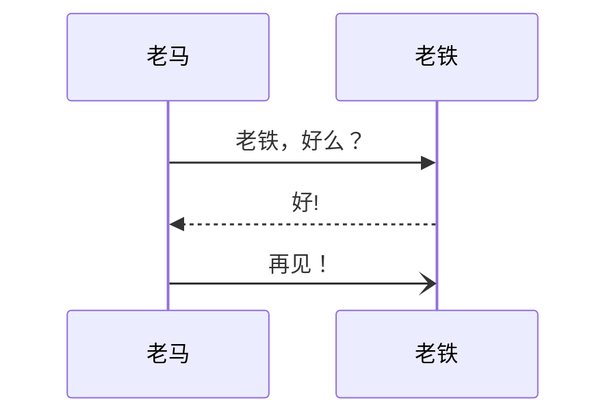

** 注意：** 由于 mermaid 语法的特性，“end” 一词可能会中断图表语法的解析。如果一定要使用“end”，则必须使用括号 `()`，引号 `""` 或括号 `{}`，`[]` 来括起“end”。即 `(end)` 、`[end]` 、`{end}`。

## 语法

### 参与者 Participants

可以像上面第一个示例中一样隐式定义参与者。参与者或角色的渲染由定义中出现的顺序决定。有时，您可能希望以与参与者在第一条消息中显示的顺序不同的顺序显示参与者。可以通过执行以下操作来指定角色的出现顺序：

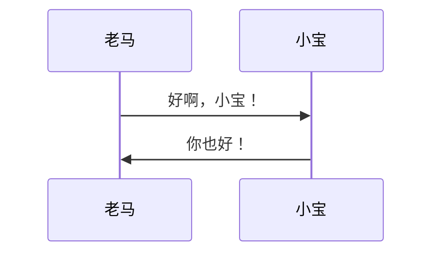

### 角色 Actors

如果你要使用角色符号而不是带有文本的矩形框表示参与者，则可以使用 actor 语句，如下所示：

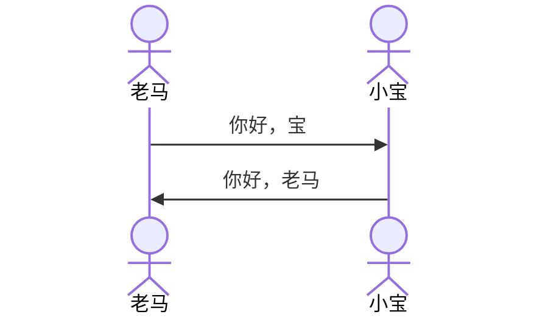

### 别名 Aliases

角色可以以别名的形式定义一个方便输入的 id：

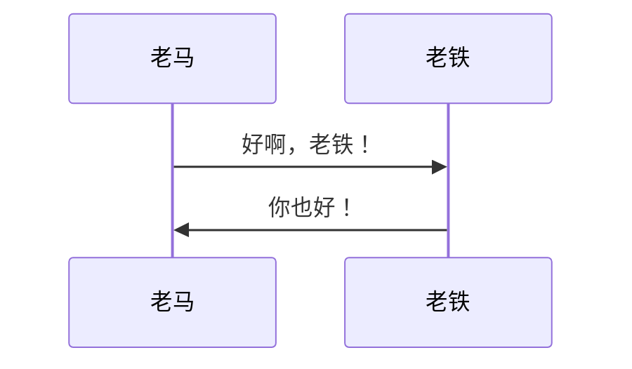

## 消息 Messages

消息既可以实线，也可以虚线显示。

目前支持的箭头有 6 种：

|**类型**|**描述**|
|-|-|
|->|无箭头实线|
|-->|无箭头虚线|
|->>|带箭头实线|
|-->>|带箭头虚线|
|-x|带×的实线|
|--x|带×的虚线|
|-)|带开放箭头的实线|
|--)|带开放箭头的虚线|

## 激活期 Activations

可以激活和停用角色。激活/停用可以显式声明：

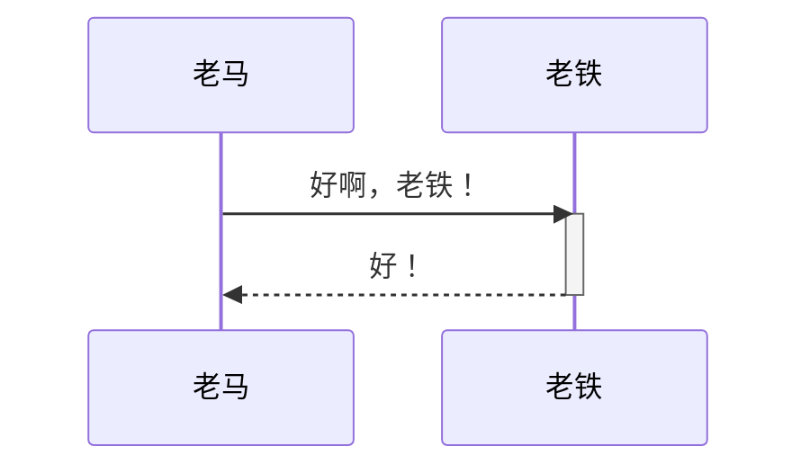

通过在消息箭头上附加 `+`/`-` 后缀的快捷表示法：

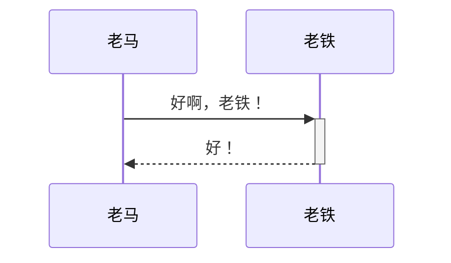

可以为同一角色堆叠多个激活：

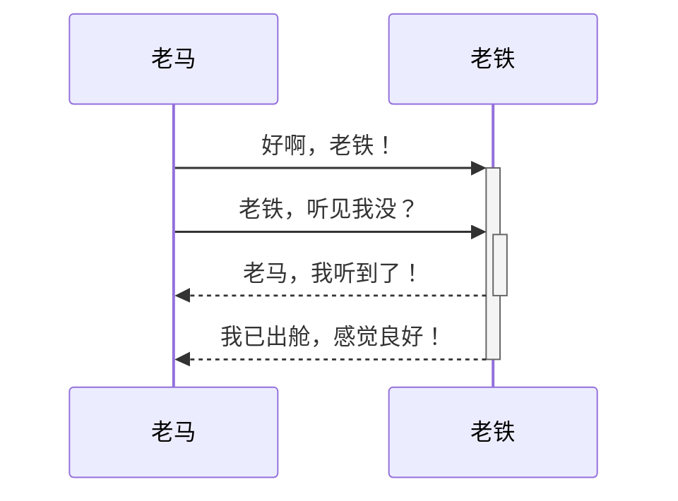

## 注解 Notes

可以在序列图中添加注解。通过语法 Note right of | left of | over Actor：注解内容

参见下面的示例：

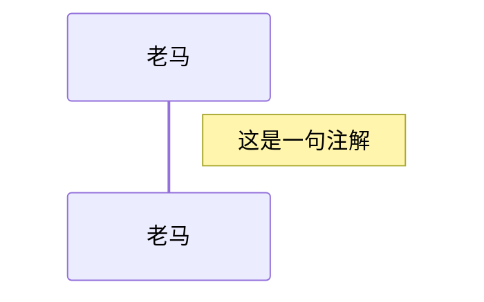

也可以创建跨越两个参与者的注解：

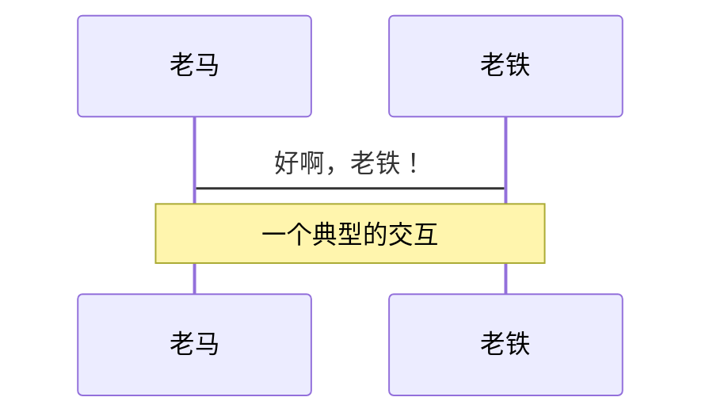

## 循环 Loops

可以在时序图中表现循环，通过如下语法：

```mermaid
loop Loop text
... statements ...
end
```

参见下面的示例：

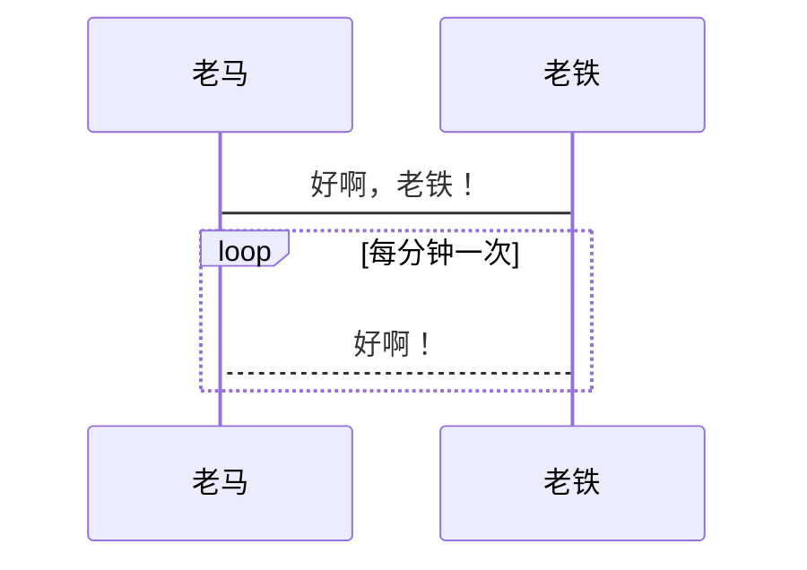

## 抉择 Alt

可以在时序图中表现抉择路径，通过如下语法：

```mermaid
alt Describing text
... statements ...
else
... statements ...
end
```

或者如果有时序是可选的 (如果没有其他)。

```mermaid
opt Describing text
... statements ...
end
```

参见下面的示例：

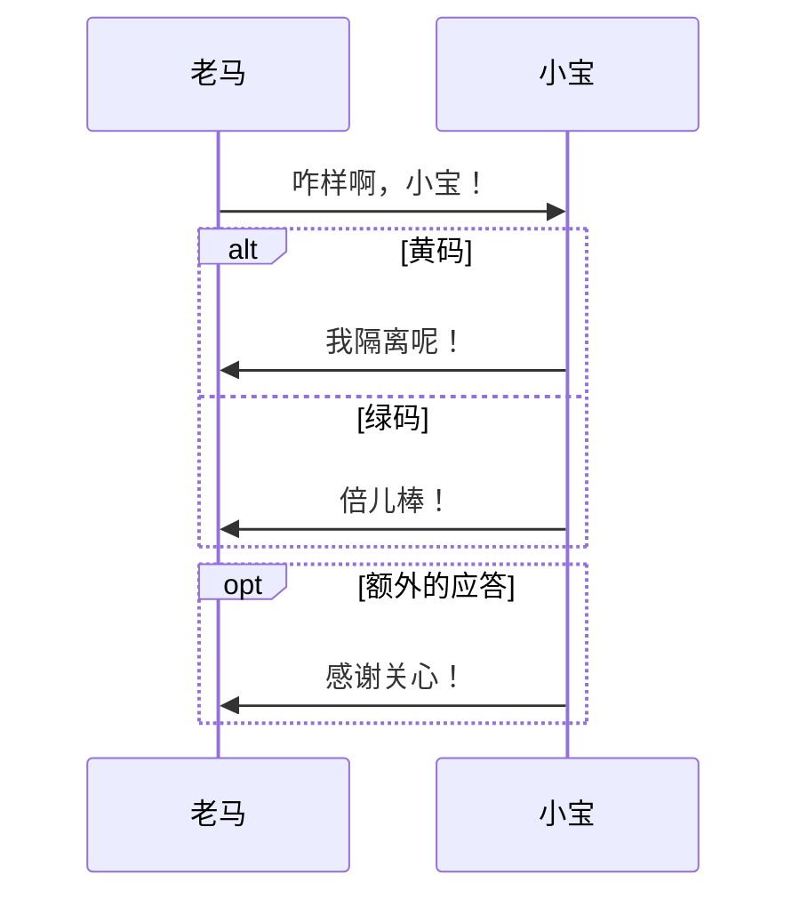

## 并行 Parallel

可以显示并行发生的动作，通过下面的语法：

```mermaid
par [Action 1]
... statements ...
and [Action 2]
... statements ...
and [Action N]
... statements ...
end
```

参见下面的示例：

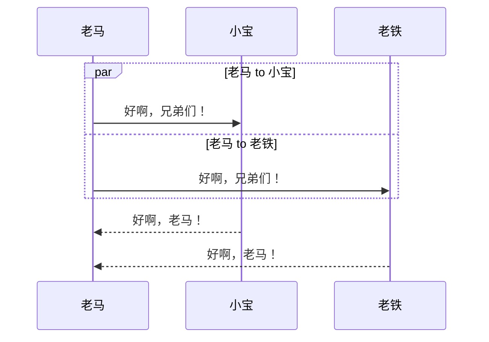

也可以嵌套并行的块：

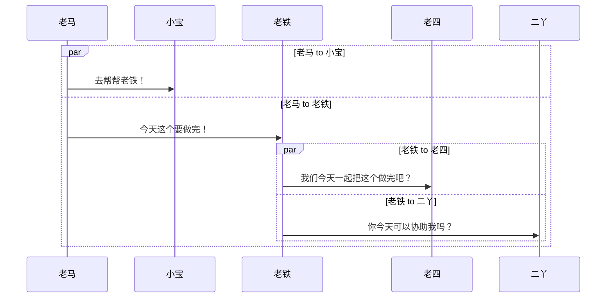

## 背景高亮 Background Highlighting

可以通过提供指定颜色的背景来突出动作流，通过下面的语法：

（颜色使用 rgb 和 rgba 语法定义）

```mermaid
rect rgb(184, 76, 78)
... content ...
end
```

```mermaid
rect rgba(184, 76, 78, .1)
... content ...
end
```

参见下面的示例：

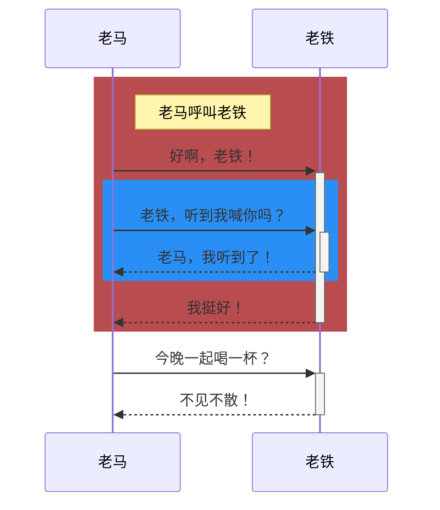

## 注释

可以在时序图代码中写注释，解析器将忽略这些注释。注释需要写在单独的行，并且必须以 `%%` 开头。注释开始到下一个换行符之后的任何文本都将被视为注释，包括任何时序图语法。

```mermaid
sequenceDiagram
    老马->>老铁: 好啊，老铁！
    %% 这里是注释，图中不起作用
    老铁-->>老马: 好！
```

## 字符转义

可以使用如下所示的语法转义字符：

```mermaid
sequenceDiagram
    老铁->>二丫: 我 #9829; 你！
    二丫->>老铁: 我 #9829; 你 #infin; 次！
```

数字为十进制，因此 `#` 可以编码为 `#35;`。也支持使用 HTML 字符名称。

因为可以使用分号代替换行符来定义标记，所以你需要使用 `#59;` 在消息文本中表示分号。

## 序列号 sequenceNumbers

可以在时序图中获得添加到每个箭头的序列号，语法如下：

```mermaid
sequenceDiagram
    autonumber
    老马->>老铁: 好啊，老铁！
    loop 体检
        老铁->>老铁: 与新冠做斗争
    end
    Note right of 老铁: 理性的思考
    老铁-->>老马: 我好了!
    老铁->>小宝: 你呢？
    小宝-->>老铁: 我身体倍儿棒！
```

## 角色菜单 Actor Menus

角色可以定义一个弹出菜单，其中包含指向外部页面的自定义链接。例如，如果角色代表一个 web 服务，则有用的链接可能包括指向服务运行状况的仪表板的链接，包含服务源代码的代码库或或描述该服务的 wiki 页面。

可以通过以下语法为角色添加一个或多个链接：

```mermaid
link <actor>: <link-label> @ <link-url>
```

```mermaid
sequenceDiagram
    participant 老马
    participant 老铁
    link 老马: Dashboard @ https://pkmer.cn/authors/pkmer/
    link 老马: Wiki @ https://pkmer.cn/show/%E5%8D%8F%E4%BD%9C%E8%80%85%E6%8C%87%E5%8D%97 
    link 老铁: Dashboard @ https://pkmer.cn/authors/os/
    link 老铁: Wiki @ https://pkmer.cn/show/%E6%96%87%E6%A1%A3%E5%86%99%E4%BD%9C%E8%A7%84%E8%8C%83
    老马->>老铁: 好啊，老铁！
    老铁-->>老马: 好！
    老马-)老铁: 回见！
```

#### 高级菜单语法 Advanced Menu Syntax

There is an advanced syntax that relies on JSON formatting. If you are comfortable with JSON format, then this exists as well.

高级菜单语法依赖于 JSON 格式。如果你了解 JSON 格式，可以使用下面的语法：

```mermaid
links <actor>: <json-formatted link-name link-url pairs>
```

参见下面的示例：

```mermaid
sequenceDiagram
    participant 老马
    participant 老铁
    links 老马: {"Dashboard": "https://pkmer.cn/authors/pkmer/", "Wiki": "https://pkmer.cn/show/%E5%8D%8F%E4%BD%9C%E8%80%85%E6%8C%87%E5%8D%97 "}
    links 老铁: {"Dashboard": "https://pkmer.cn/authors/os/", "Wiki": "https://pkmer.cn/show/%E6%96%87%E6%A1%A3%E5%86%99%E4%BD%9C%E8%A7%84%E8%8C%83"}
    老马->>老铁: 好啊，老铁！
    老铁-->>老马: 好！
    老马-)老铁: 回见！
```