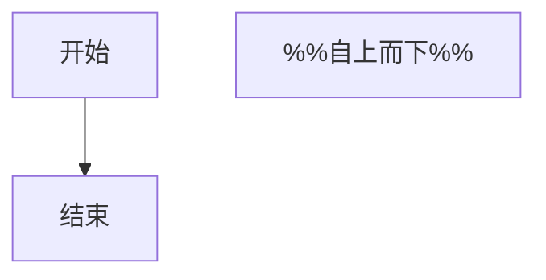
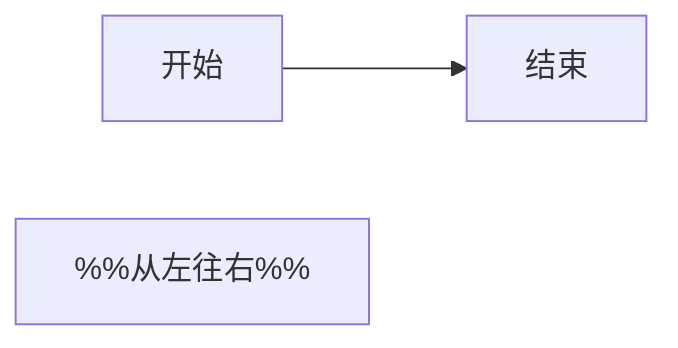
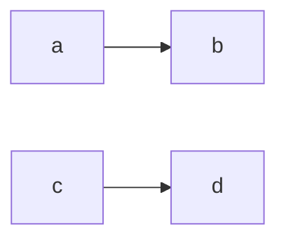
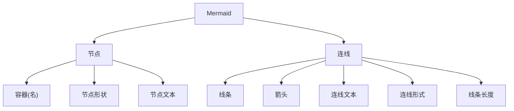
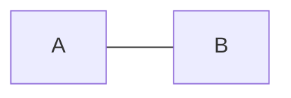
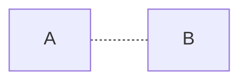
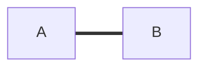
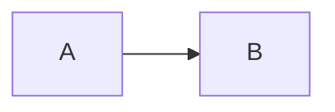

# Mermaid 流程图

## Flowchart 流图

> 注意 以下提及的所有符号都是**英文状态**的！！！

### 关键字与方向

关键字和方向，是最基本的。你得告诉 **Mermaid**，你要画的是个什么图，图的走向是什么？

- 使用 `关键字`，声明图的**类型**
- 使用 `方向`，声明图的**方向**(走向)

**关键字有两种：**

1. `graph`
2. `flowchart`

`flowchart` 支持一些额外的效果，两者渲染后的样式，存在些微差异

> 注意 关键字的所有字母，必须**全部小写**！任何一个字母大写都会导致报错！

**方向有四种 (五种写法)：**

1. - `TB`
		- top to bottom ==自上而下==
	- `TD`
		- top-down ==自上而下==
2. `BT`
	- bottom to top ==自下而上==
3. `LR`
	- left to right ==从左往右==
4. `RL`
	- right to left ==从右往左==

> 注意 方向的字母必须全部**大写**！否则会报错！

**语法：**

- **关键字**与**方向** 写在**首行**
- 先写**关键字**，用一个**空格**隔开，再写**方向**
- 书写后续代码时，**推荐**用一个 制表符 `tab` 缩进后书写
	- 只是推荐，不缩进也不会报错

**示范：**

````txt

````

````txt

````

**渲染：**


---


### 语句的结束

**Mermaid** 语句的结束，有**两种**方式:

1. 在结尾加 分号 `;`
2. 换行

**示范：**

````txt

````

````txt

````

**效果：**


---


<big>也可以两个都用，**换行 + 分号**</big>

**示范：**

````txt

````

**效果：**


### 什么是流图？

在正式学习相关语法之前，我们得先了解，**流图**到底是个什么东西？

可以“望文生义”一下，流图流图，就是流动的图

- 流图反映了我们的思维逻辑，让思维如流水般**跃然纸上**

### 流图由什么组成?

流程图的组成包含**两**个主部分

- **节点 + 连线**

主部分又各自包括 **3+5** 个子部分

1. 节点
	1. 容器 (名)
	2. 节点形状
	3. 节点文本
2. 连线
	1. 线条
	2. 箭头
	3. 连线文本
	4. 连线形式
	5. 线条长度

**如下图所示：**



**上图源码：**

````txt

````

### 连线

连线，是连接各个节点的**纽带**，也是流图中最为重要的部分

#### 1. 线条

##### 1.1 实线

**语法：**

- 使用三个 `-` (连接符)，代表一条**实线**
	- `---`

**示范：**

````txt

````

**渲染：**


##### 1.2 虚线

**语法：**

- 使用两个 `-` (连接符) 中间**夹**一个 `.` (句号)，代表一条**虚线**
	- `-.-`

**示范：**

````txt

````

**效果：**


##### 1.3 粗实线

**语法：**

- 使用三个 `=` (等号)，代表一条**粗实线**
	- `===`

**示范：**

````txt

````

**渲染：**


#### 2. 箭头

##### 2.1 箭头实线

**语法：**

- 使用 两个 `-` (连接符) **+** 一个 `>` (大于号)，代表一条**箭头实线 **
	- `-->`

**示范：**

````txt

````

**效果：**


##### 2.2 箭头虚线

**语法：**

- 在上述虚线格式 `-.-` 的基础上，再加一个 `>` (大于号)，代表一条**箭头虚线**
	- `-.->`

**示范：**

````txt
```mermaid
graph LR
	A-.->B; 
%% AB之间，以一条箭头虚线连接
```
````

**效果：**

```mermaid
graph LR
	A-.->B; 
%% AB之间，以一条箭头虚线连接
```

##### 2.3 箭头粗实线

**语法：**

- 使用两个 `=` (连接符) **+** 一个 `>` (大于号)，代表一条**箭头粗实线**
	- `==>`

**示范：**

````txt
```mermaid
graph LR
	A==>B; 
%% AB之间，以一条箭头粗实线连接
```
````

**效果：**

```mermaid
graph LR
	A==>B; 
%% AB之间，以一条箭头粗实线连接
```

##### 2.4 箭头的反向

让箭头**反向**，**不能**把 `>` 变成 `<`

- `-->` 变成 `<--` ❌ 会报错

只需把**流图的方向**反一下，再把 节点 `A` 与 节点 `B` 位置互换一下，即可达到反向箭头的效果

1. 把 `graph LR` 变成 `graph RL`
2. `A` 与 `B` 交换位置

**示范：**

````txt
```mermaid
graph RL
	B-->A; 
%% 这是一条从B到A的反向实线箭头
```
````

**渲染：**

```mermaid
graph RL
	B-->A; 
%% 这是一条从B到A的反向实线箭头
```

##### 2.5 额外箭头类型

额外的箭头类型，需使用 `flowchart` 关键字

###### 2.5.1 单向箭头

配合英文字母 `o` 与 `x`，形成新的箭头类型

- > 注意 `o` 与 `x` 必须 ==小写==！否则报错

**示范：**

````txt
```mermaid
flowchart LR 
%% 使用flowchart关键字
	A --o B;  
	%% 实线o
	C --x D;  
	%% 实线x
	E -.-o F; 
	%% 虚线o
	G -.-x H; 
	%% 虚线x
	I ==o J;  
	%% 粗实线o
	K ==x L;  
	%% 粗实线x
```
````

**效果：**

```mermaid
flowchart LR 
%% 使用flowchart关键字
	A --o B;  
	%% 实线o
	C --x D;  
	%% 实线x
	E -.-o F; 
	%% 虚线o
	G -.-x H; 
	%% 虚线x
	I ==o J;  
	%% 粗实线o
	K ==x L;  
	%% 粗实线x
```

#补充 **连线样式** `x` 与 `o` 不会和 **节点** x 与 o 冲突

**示范：**

````txt
```mermaid
graph LR
	start --x x --o o;
```
````

**效果：**

```mermaid
graph LR
	start --x x --o o;
```

###### 2.5.2 多向箭头

多向箭头有三种

使用首尾相同的 `o` 或 `x` ，或者一对 `< >`

**不能**使用 `o--x` 这样首尾不同的

**示范：**

#建议 书写多向箭头连线，连线前后推荐**各留一个空格**，优化代码阅读体验

````txt
```mermaid
flowchart LR 
	%% 实线
	A o--o B; 
	%% 多向实线o
	C <--> D; 
	%% 多向实线箭头
	E x--x F; 
	%% 多向实线x

	%% 虚线
	G o-.-o H; 
	%% 多向虚线o
	I <-.-> J; 
	%% 多向虚线箭头
	K x-.-x L; 
	%% 多向虚线x

	%% 粗实线
	M o==o N; 
	%% 多向粗实线o
	O <==> P; 
	%% 多向粗实线箭头
	R x==x S; 
	%% 多向粗实线x
```
````

**效果：**

```mermaid
flowchart LR 
	%% 实线
	A o--o B; 
	%% 多向实线o
	C <--> D; 
	%% 多向实线箭头
	E x--x F; 
	%% 多向实线x

	%% 虚线
	G o-.-o H; 
	%% 多向虚线o
	I <-.-> J; 
	%% 多向虚线箭头
	K x-.-x L; 
	%% 多向虚线x

	%% 粗实线
	M o==o N; 
	%% 多向粗实线o
	O <==> P; 
	%% 多向粗实线箭头
	R x==x S; 
	%% 多向粗实线x
```

#### 3. 连线文本

连线文本，有两种方式：**嵌入式 + 外部式**

#建议 推荐使用 [[#3 2 外部式|外部式]]

##### 3.1 嵌入式

嵌入式，是指将文本嵌入至线条**内部**

###### 实线间的文本

**语法：**

- 嵌入 一对 `--` 之间
	- `--实线间的文本--`

**示范：**

````txt
```mermaid
graph LR
	A--实线间的文本-->B; 
	%% AB之间以实线连接，且有一段连线文本
```
````

**渲染：**

```mermaid
graph LR
	A--实线间的文本-->B; 
	%% AB之间以实线连接，且有一段连线文本
```

###### 虚线间的文本

**语法：**

- 嵌入 **对称** 的 `-.` 与 `.-` 之间
	- `-.虚线间的文本.-`

**示范：**

````txt
```mermaid
graph LR
	A-.虚线间的文本.->B; 
	%% AB之间以虚线连接，且有一段连线文本
```
````

**渲染：**

```mermaid
graph LR
	A-.虚线间的文本.->B; 
	%% AB之间以虚线连接，且有一段连线文本
```

###### 粗实线间的文本

**语法：**

- 嵌入 **一对** 的 `==` 之间
	- `==粗实线间的文本==`

**示范：**

````txt
```mermaid
graph LR
	A==粗实线间的文本==>B; 
	%% AB之间以粗实线连接，且有一段连线文本
```
````

**渲染：**

```mermaid
graph LR
	A==粗实线间的文本==>B; 
	%% AB之间以粗实线连接，且有一段连线文本
```

##### 3.2 外部式

外部式，是指将连线文本置于连线**外部**

**语法：**

- 用一对 `|` 包裹
	- `A-->|连线文本|B`

**示范：**

````txt
```mermaid
graph LR
	A-->|实线间文本|B;
	
	C-.->|虚线间文本|D;
	
	E==>|粗实线间文本|F;
```
````

**渲染：**

```mermaid
graph LR
	A-->|实线间文本|B;
	
	C-.->|虚线间文本|D;
	
	E==>|粗实线间文本|F;
```

#### 4. 连线形式

连线形式有**两种**：**直向连线 + 多重连线**

##### 4.1 直向连线

直向连线就是前面举例的那些

**示范：**

````txt
```mermaid
graph LR
	A-->B-->C-->D-->E;
```
````

**渲染：**

```mermaid
graph LR
	A-->B-->C-->D-->E;
```

##### 4.2 多重连线

**多重连线** 用更少的代码 写出 较为复杂的 连线关系

#建议 **不推荐**使用多重连线，代码不利于阅读，逻辑也不够清晰

**语法：**

- 用 一个或多个 `&` (ampersand) 连接
	- `a-->b & c-->d`

**示范 1：**

````txt
```mermaid
graph LR
   a-->b & c-->d;
```
````

**渲染 1：**

```mermaid
graph LR
   a-->b & c-->d;
```

**以上的多重连线写法，等效下方的直向写法**

````txt
```mermaid
graph LR
	a-->b;
	a-->c;
	b-->d;
	c-->d;
```
````

**示范 2：**

````txt
```mermaid
graph LR
   a-->b & c-->d & e-->f; 
```
````

**渲染 2：**

```mermaid
graph LR
   a-->b & c-->d & e-->f;
```

**以上的多重连线写法，等效下方的直向写法**

````txt
```mermaid
graph LR
	a-->b;
	a-->c;
	b-->d;
	b-->e;
	c-->d;
	c-->e;
	d-->f;
	e-->f;
```
````

#### 5. 线条长度

线条可以增加长度，默认为**1 级**，可加至**3 级**

##### 5.1 graph 线条

**表格：**

| 连线/长度  |   1    |    2    |    3     |
|:----------:|:------:|:-------:|:--------:|
|    实线    | `---`  | `----`  | `-----`  |
|    虚线    | `-.-`  | `-..- ` | `-...- ` |
|   粗实线   | `===`  | `====`  | `===== ` |
|  箭头实线  | `-->`  | `--->`  | `---->`  |
|  箭头虚线  | `-.->` | `-..->` | `-...->` |
| 箭头粗实线 | `==>`  | `===>`  | `====>`  |

**示范：**

````txt
```mermaid
graph LR
	%% 实线
	a1---a2----a3-----a4;

	%% 虚线
	b1-.-b2-..-b3-...-b4;

	%% 粗实线
	c1===c2====c3=====c4;

	%% 箭头实线
	d1-->d2--->d3---->d4;

	%% 箭头虚线 
	e1-.->e2-..->e3-...->e4;

	%% 箭头粗实线
	f1==>f2===>f3====>f4;
```
````

**渲染：**

```mermaid
graph LR
	%% 实线
	a1---a2----a3-----a4;

	%% 虚线
	b1-.-b2-..-b3-...-b4;

	%% 粗实线
	c1===c2====c3=====c4;

	%% 箭头实线
	d1-->d2--->d3---->d4;

	%% 箭头虚线 
	e1-.->e2-..->e3-...->e4;

	%% 箭头粗实线
	f1==>f2===>f3====>f4;
```

##### 5.2 flowchart 线条

`flowchart` 关键字 支持的额外线条，也能加长，和 `graph` 一样

**表格：**

|  连线/长度   |    1    |    2     |     3     |
|:------------:|:-------:|:--------:|:---------:|
|  多向实线 o   | `o--o`  | `o---o`  |  `o---o`  |
| 多向实线箭头 | `<-->`  | `<--->`  | `<---->`  |
|  多向实线 x   | `x--x`  | `x---x`  | `x----x`  |
|  多向虚线 o   | `o-.-o` | `o-..-o` | `o-...-o` |
| 多向虚线箭头 | `<-.->` | `<-..->` | `<-...->` |
|  多向虚线 x   | `x-.-x` | `x-..-x` | `x-...-x` |
| 多向粗实线 o  | `o==o`  | `o===o`  | `o====o`  |
|  多向粗实线  | `<==>`  | `<===>`  | `<====>`  |
| 多向粗实线 x  | `x==x`  | `x===x`  | `x====x`  |

**示范：**

````txt
```mermaid
flowchart LR
	%% 实线
	a1 o--o a2 o---o a3 o----o a4; 
	%% 多向实线o
	b1 <--> b2 <---> b3 <----> b4; 
	%% 多向实线箭头
	c1 x--x c2 x---x c3 x----x c4; 
	%% 多向实线x
	
	%% 虚线
	d1 o-.-o d2 o-..-o d3 o-...-o d4; 
	%% 多向虚线o
	e1 <-.-> e2 <-..-> e3 <-...-> e4; 
	%% 多向虚线箭头
	f1 x-.-x f2  x-..-x f3 x-...-x f4; 
	%% 多向虚线x
	
	%% 粗实线
	g1 o==o g2 o===o g3 o====o g4; 
	%% 多向粗实线o
	h1 <==> h2 <===> h3 <====> h4; 
	%% 多向粗实线
	i1 x==x i2 x===x i3 x====x i4; 
	%% 多向粗实线x
```
````

**渲染：**

```mermaid
flowchart LR
	%% 实线
	a1 o--o a2 o---o a3 o----o a4; 
	%% 多向实线o
	b1 <--> b2 <---> b3 <----> b4; 
	%% 多向实线箭头
	c1 x--x c2 x---x c3 x----x c4; 
	%% 多向实线x
	
	%% 虚线
	d1 o-.-o d2 o-..-o d3 o-...-o d4; 
	%% 多向虚线o
	e1 <-.-> e2 <-..-> e3 <-...-> e4; 
	%% 多向虚线箭头
	f1 x-.-x f2  x-..-x f3 x-...-x f4; 
	%% 多向虚线x
	
	%% 粗实线
	g1 o==o g2 o===o g3 o====o g4; 
	%% 多向粗实线o
	h1 <==> h2 <===> h3 <====> h4; 
	%% 多向粗实线
	i1 x==x i2 x===x i3 x====x i4; 
	%% 多向粗实线x
```

#### 6. 节点间的多条连线

两个节点之间，可以有**多条**连线，方向 可正可反

**示范：**

````txt
```mermaid
graph LR
	A-->|A指向B|B;
	B-->|B指向A|A;
```
````

**渲染：**

```mermaid
graph LR
	A---->|A指向B|B;
	B---->|B指向A|A;
	A-...->|A又一次指向了B|B;
	B-...->|B又一次指向了A|A;
	A====>|A又双叒叕指向了B|B;
	B====>|B又双叒叕指向了A|A
```

##### 具体应用

**示范：**

````txt
```mermaid
graph TB
	得出答案A-->确定么?-->|确定|好吧;
	好吧-->再想一想-->|不对劲|确定么?---->|恍然大悟|修正为答案B;
```
````

**渲染：**

```mermaid
graph TB
	得出答案A-->确定么?-->|确定|好吧;
	好吧-->再想一想-->|不对劲|确定么?---->|恍然大悟|修正为答案B;
```

### 节点

节点，可以通俗地理解为一个**信息块**

节点由以下**三**部分组成

1. 容器 (名)
2. 文本内容
3. 形状

若没有**主动赋予**形状，一些简单的信息，**Mermaid** 给予了默认的节点样式

**示范：**

````txt
```mermaid
graph LR
	默认的矩形;
```
````

**渲染：**

```mermaid
graph LR
	默认的矩形;
```

可以看到，节点的 默认形状 是一个**矩形**，所写的信息，自动变成了节点内的 **文本内容**

如果有小伙伴试过英文的，就会发现问题

**源码：**

````txt
```mermaid
graph LR
	Default rectangle; 
	%% 会报错
```
````

**渲染：**

```mermaid
graph LR
	Default rectangle; 
	%% 会报错
```

没错，它会**报错**，因为英语单词之间存在 **空格**

那么问题来了，这类稍显复杂的文本，要如何存入节点呢？

#重点 这个时候我们需要一个容器，来存放这类信息

#### 1. 节点的容器 (名)

文本内容 是个==东西==，是东西，就需要一个==容器==，用以**存放**

那么，为什么有个 `(名)` 呢？

因为会有 不同的文本内容 存入 不同的节点容器，想要**一一对应**，必须借助容器名

容器名，可以理解为容器的**身份证**，是贴在容器上的一块**名牌**，帮我们找到 **已存入信息** 的位置

容器拥有一个特性，它具有 ==形状==，形状都是由 **成对的符号** 组成的

- 默认的矩形，就是一对方括号 `[ ]`

举个例子

- 现在有一个 文本内容 `小 明`[^1] ，要把它存进一个 名为 `id1` 的容器，且形状为 **矩形**

**源码：**

````txt
```mermaid
graph LR
	id1[小 明];
```
````

**渲染：**

```mermaid
graph LR
	id1[小 明];
```

> 注意 一个文本内容可以存放在**多个容器**里

**示范：**

````txt
```mermaid
graph LR
	id1[A]-->id2[A]-->id3[A];
```
````

**渲染：**

```mermaid
graph LR
	id1[A]-->id2[A]-->id3[A]; 
```

> 注意 一个容器只能存储**一个文本内容**

- 若有新的文本内容传递进来，会踢走旧文本内容，进行替换操作

**示范：**

````txt
```mermaid
graph LR
	id1[A];
	id1[B]; 
	%% 这里的B覆盖了前面的A
```
````

**渲染：**

```mermaid
graph LR
	id1[A];
	id1[B]; 
	%% 这里的B覆盖了前面的A
```

##### 1.1 容器的命名规则

容器 (名) 的 命名，有一定的规则限制

1. 可以使用汉字，英文字母，数字，大部分**英文状态**下的的符号
2. **不能**使用空格
	1. 多个英文单词的容器命名，有以下**三种**方法：
		1. **驼峰命名法**
			1. 小驼峰 (第二个单词开始首字母大写)
				1. peppa==P==ig
			2. 大驼峰 (每个单词首字母都大写)
				1. ==P==eppa==P==ig
		2. **连接符**
			1. peppa==-==pig
		3. **下划线**
			1. peppa==_==pig
3. 不能使用下以下符号
	1. `@` `~` `<` `>` `^` `(` `)` `{` `}` `==` `" "`
4. 不能使用 `end` 关键字
	1. `end` 是声明 [[#1 子图关键字|子图]] 的关键字，后面会讲
		1. 可以使用 **大小写**，就不会报错
			1. `End` `END`
		2. 使用 **缩写**
			1. `e` `E`

**示范 1：**

````txt
```mermaid
graph LR
	end[a]; 
	%% 这里会报错
```
````

**渲染 1：**

```mermaid
graph LR
	end[a]; 
	%% 这里会报错
```

**示范 2：**

````txt
```mermaid
graph LR
	End[a]-->END[a]-->e[a]-->E[a]; 
	%% 这里都能正常渲染
```
````

**渲染 2：**

```mermaid
graph LR
	End[a]-->END[a]-->e[a]-->E[a]; 
	%% 这里都能正常渲染
```

##### 1.2 利用容器名 精简代码

先来看一个简单的亲戚关系图

```mermaid
graph BT
	id1[我]-->id2[父亲]
	id1[我]-->id3[母亲]
	
	id2[父亲]--妈妈-->id4[奶奶]
	id2[父亲]--爸爸-->id5[爷爷]
	
	id3[母亲]--妈妈-->id6[外婆]
	id3[母亲]--爸爸-->id7[外公]
```

它的源码是这样的

````txt
```mermaid
graph BT
	id1[我]-->id2[父亲]
	id1[我]-->id3[母亲]
	
	id2[父亲]--妈妈-->id4[奶奶]
	id2[父亲]--爸爸-->id5[爷爷]
	
	id3[母亲]--妈妈-->id6[外婆]
	id3[母亲]--爸爸-->id7[外公]
```
````

可以看到，`id1[我]` `id2[父亲]` `id3[母亲]`，这三个节点重复地在源码中出现了

已存入容器的 文本内容，后续若要重复使用，只需要写 `容器名` 即可

- **原因：** 容器名已经绑定了 具体的信息块，建立了对应关系
	- **通俗理解：** 在火锅店办了卡，卡没带不要紧，报手机号就行

**上述代码可精简为：**

````txt
```mermaid
graph BT
	id1[我]-->id2[父亲]
	id1-->id3[母亲]
	
	id2--妈妈-->id4[奶奶]
	id2--爸爸-->id5[爷爷]
	
	id3--妈妈-->id6[外婆]
	id3--爸爸-->id7[外公]
```
````

**渲染效果是完全一致的：**

```mermaid
graph BT
	id1[我]-->id2[父亲]
	id1-->id3[母亲]
	
	id2--妈妈-->id4[奶奶]
	id2--爸爸-->id5[爷爷]
	
	id3--妈妈-->id6[外婆]
	id3--爸爸-->id7[外公]
```

#### 2. 节点的形状

有了 `容器(名)` ，就能为节点赋予 各种形状

目前，形状一共有 **13 种**

##### 2.0 如何使用形状?

在具体说明前，得先思考一个**问题**

- 这么多形状，该怎么用呢？

如果你 [百度一下](https://baike.baidu.com/item/%E6%B5%81%E7%A8%8B%E5%9B%BE%E7%AC%A6%E5%8F%B7/12727793?fr=aladdin)，你会发现：

- 特定的形状 被**限制**了 固定的功能

我个人并不推荐这种做法，细心的小伙伴也许注意到了，我一直用 `流图` 而非 `流程图`

- 流图是==自由==的，是思维流动的具象化

形状，在于你自己的思考和理解

- 你觉得属于同一**类**的，就**赋予**它们同个形状

一般情况，使用上述提及的默认形状 `矩形` 即可，若有一些特殊节点，可更换 任意其他形状

- 目的在于**突出显示** (和标识符的原理一样)

##### 汇总表格

|                      形状类型                       |  代码   |
|:---------------------------------------------------:|:-------:|
|        [[Mermaid 流图#2 1 矩形 默认\|矩形]]         |  `[ ]`  |
|           [[Mermaid 流图#2 2 圆形\|圆形]]           | `(( ))` |
|           [[Mermaid 流图#2 3 菱形\|菱形]]           |  `{ }`  |
|       [[Mermaid 流图#2 4 圆角矩形\|圆角矩形]]       |  `( )`  |
|         [[Mermaid 流图#2 5 跑道型\|跑道型]]         | `([ ])` |
|     [[Mermaid 流图#2 6 平行四边形\|平行四边形]]     |  `[/ /]`  |
| [[Mermaid 流图#2 7 反向平行四边形\|反向平行四边形]] | `[\ \]` |
|         [[Mermaid 流图#2 8 六边形\|六边形]]         | `{{ }}` |
|           [[Mermaid 流图#2 9 梯形\|梯形]]           | `[/ \]` |
|      [[Mermaid 流图#2 10 倒立梯形\|倒立梯形]]       | `[\ /]` |
|        [[Mermaid 流图#2 11 燕尾型\|燕尾型]]         |  `> ]`  |
|    [[Mermaid 流图#2 12 子程序型 编程\|子程序型]]    | `[[ ]]` |
|      [[Mermaid 流图#2 13 圆柱形 编程\|圆柱形]]      | `[( )]` |

##### 2.1 矩形 (默认)

使用一对方括号 `[ ]` ，包裹文本内容

**示范：**

````txt
```mermaid
graph LR
	id1[矩形];
```
````

**渲染：**

```mermaid
graph LR
	id1[矩形];
```

<span style="float: right"> [[## 汇总表格|点击 🥰 回到表格]]</span>

##### 2.2 圆形

使用**两对**圆括号 ((圆形)) ，包裹文本内容

**示范：**

````txt
```mermaid
graph LR
	id2((圆形));
```
````

**渲染：**

```mermaid
graph LR
	id2((圆形));
```

<span style="float: right"> [[## 汇总表格|点击 🥰 回到表格]]</span>

##### 2.3 菱形

使用一对花括号 `{ }` ，包裹文本内容

**示范：**

````txt
```mermaid
graph LR
	id3{菱形};
```
````

**渲染：**

```mermaid
graph LR
	id3{菱形};
```

<span style="float: right"> [[## 汇总表格|点击 🥰 回到表格]]</span>

##### 2.4 圆角矩形

使用一对圆括号 `( )`，包裹文本内容

**示范：**

````txt
```mermaid
graph LR
	id4(圆角矩形);
```
````

**渲染：**

```mermaid
graph LR
	id4(圆角矩形);
```

<span style="float: right"> [[## 汇总表格|点击 🥰 回到表格]]</span>

##### 2.5 跑道型

使用 一对圆括号 `( )` **嵌套** 一对方括号 `[ ]`，包裹文本内容

**示范：**

````txt
```mermaid
graph LR
	id5([跑道型]);
```
````

**渲染：**

```mermaid
graph LR
	id5([跑道型]);
```

<span style="float: right"> [[## 汇总表格|点击 🥰 回到表格]]</span>

##### 2.6 平行四边形

使用 一对方括号 `[ ]` **嵌套** 一对斜杠 `/`，包裹文本内容

**示范：**

````txt
```mermaid
graph LR
	id6[/平行四边形/];
```
````

**渲染：**

```mermaid
graph LR
	id6[/平行四边形/];
```

<span style="float: right"> [[## 汇总表格|点击 🥰 回到表格]]</span>

##### 2.7 反向平行四边形

使用 一对方括号 `[ ]` **嵌套** 一对**反**斜杠 `\`，包裹文本内容

**示范：**

````txt
```mermaid
graph LR
	id7[\反向平行四边形\];
```
````

**渲染：**

```mermaid
graph LR
	id7[\反向平行四边形\];
```

<span style="float: right"> [[## 汇总表格|点击 🥰 回到表格]]</span>

##### 2.8 六边形

使用 **两对**花括号 `{ }`，包裹文本内容

**示范：**

````txt
```mermaid
graph LR
	id8{{六边形}};
```
````

**渲染：**

```mermaid
graph LR
	id8{{六边形}};
```

<span style="float: right"> [[## 汇总表格|点击 🥰 回到表格]]</span>

##### 2.9 梯形

使用 一对方括号 `[ ]` **嵌套** 一个斜杠 `/` + 一个**反**斜杠 `\` ，包裹文本内容

**示范：**

````txt
```mermaid
graph LR
	id9[/梯形\];
```
````

**渲染：**

```mermaid
graph LR
	id9[/梯形\];
```

<span style="float: right"> [[## 汇总表格|点击 🥰 回到表格]]</span>

##### 2.10 倒立梯形

使用 一对方括号 `[ ]` **嵌套** 一个**反**斜杠 `\` + 一个斜杠 `/` ，包裹文本内容

**示范：**

````txt
```mermaid
graph LR
	id10[\倒立梯形/];
```
````

**渲染：**

```mermaid
graph LR
	id10[\倒立梯形/];
```

<span style="float: right"> [[## 汇总表格|点击 🥰 回到表格]]</span>

##### 2.11 燕尾型

被 一个大于号 `>` 和 一个右方括号 `]` ，包裹文本内容

**示范：**

````txt
```mermaid
graph LR
	id11>燕尾型];
```
````

**渲染：**

```mermaid
graph LR
	id11>燕尾型];
```

> 注意 目前，燕尾型是**没有**反向的 (未来可能会有)

<span style="float: right"> [[## 汇总表格|点击 🥰 回到表格]]</span>

##### 2.12 子程序型 (编程)

使用 **两对**方括号 `[ ]`，包裹文本内容

**示范：**

````txt
```mermaid
graph LR
	id12[[子程序型]];
```
````

**渲染：**

```mermaid
graph LR
	id12[[子程序型]];
```

##### 2.13 圆柱形 (编程)

使用 一对方括号 `[ ]` **嵌套** 一对圆括号 `( )` ，包裹文本内容

**示范：**

````txt
```mermaid
graph LR
	id13[(圆柱形)];
```
````

**渲染：**

```mermaid
graph LR
	id13[(圆柱形)];
```

<span style="float: right"> [[## 汇总表格|点击 🥰 回到表格]]</span>

### 文本内容

节点内的文本内容，有几个需要注意的地方

#### 1. 区分大小写

文本内容是**严格区分大小写**的

**==a==pple** 与 **==A==pple** 会被视为 两个**不同**的文本内容

**示范：**

````txt
```mermaid
graph LR
	apple-->Apple;
```
````

**渲染：**

```mermaid
graph LR
	apple-->Apple;
```

#### 2. 会报错的文本

上述提及的，[[#1 1 容器的命名规则|容器命名规则]] 中**不能**使用的 `end` 关键字，在文本内容中**允许**被使用，不会报错

**示范：**

````txt
```mermaid
graph LR
	id1[end];
```
````

**渲染：**

```mermaid
graph LR
	id1[end];
```

**在文本内容输入以下 `形状` 标识符 ，会报错**

- `[ ]` `{ }` `( )`
	- `>` `\` `/` 可以用，不会报错

````txt
```mermaid
graph LR
	%% 下面的都会报错
	id1[苹果(apple)爱上了桃子]; 
	id2(苹果[apple]爱上了桃子);
	id3(苹果{apple}爱上了桃子);
```
````

**一些生僻的汉字、部首，也会报错**

````txt
```mermaid
graph LR
	id1[⻖]; 
	%% 会报错
```
````

```mermaid
graph LR
	id1[⻖]; 
	%% 会报错
```

**那么，要怎样才能 在文本内容中 显示这些 会报错的字符呢？**

- 可以使用，**双引号**`" "`

#### 3. 关于引号

使用 双引号 `" "` 包裹，可以让破坏语法的字符，合法地进入节点，**不会**报错

**示范：**

````txt
```mermaid
graph LR
	%% 使用双引号包裹，都不会报错
	id1["苹果(apple)爱上了桃子"]; 
	id2("苹果[apple]爱上了桃子");
	id3("苹果{apple}爱上了桃子");
	id4["⻖"];
```
````

**渲染：**

```mermaid
graph LR
	%% 使用双引号包裹，都不会报错
	id1["苹果(apple)爱上了桃子"]; 
	id2("苹果[apple]爱上了桃子");
	id3("苹果{apple}爱上了桃子");
	id4["⻖"];
```

可以看到，双引号 `" "` 在渲染后是不会被显示的

- 那么，如何让 双引号 `" "` 作为文本内容显示出来呢？

有**两个**方法

1. 使用 **单引号**`' '`
2. 利用 [[HTML 字符实体|字符实体]]

##### 3.1 单引号

文本内容中使用 **单引号**`' '`，不会报错

**示范：**

````txt
```mermaid
graph LR
	id1['这是一段被单引号包裹的文本'];
```
````

**源码：**

```mermaid
graph LR
	id1['这是一段被单引号包裹的文本'];
```

##### 3.2 字符实体

[[HTML 字符实体|字符实体]] 是 HTML 的内容

- 一些特殊字符，因某些原因，不能很好地显示在网页里
	- 通过使用 **几个其他字符** 的组合，来替代上述 特殊字符 的显示

在 **Mermaid**，我们可以在 双引号 `" "` 中 加入 [[HTML 字符实体|字符实体]]，让一些无法显示的字符显示出来

###### 3.2.1 双引号字符实体

使用双引号 [[HTML 字符实体|字符实体]] `&quot;`，代替一个真正的双引号

> 注意 外层的 双引号 `" "` 是作为一个**功能符号**，里面的 字符实体 `&quot;`，才是能被显示的 `真·双引号`

**示范：**

````txt
```mermaid
graph LR
	id1["&quot;这里的文本被一对双引号包裹&quot;"];
```
````

**渲染：**

```mermaid
graph LR
	id1["&quot;这里的文本被一对双引号包裹&quot;"];
```

###### 3.2.2 空格字符实体

在源码中输入多个空格，仅显示**单个空格**的效果

**示范：**

````txt
```mermaid
graph LR
	id1[这里只显示              一个空格];
```
````

**渲染：**

```mermaid
graph LR
	id1[这里只显示              一个空格];
```

使用**连续多个** 空格 [[HTML 字符实体|字符实体]]`&nbsp;` ，达到显示**多个空格**的效果

**示范：**

````txt
```mermaid
graph LR
	id1["这里会显示&nbsp;&nbsp;&nbsp;&nbsp;&nbsp;&nbsp;&nbsp;&nbsp;8个空格"]; 
	%% 记得外面加功能性双引号
```
````

**渲染：**

```mermaid
graph LR
	id1["这里会显示&nbsp;&nbsp;&nbsp;&nbsp;&nbsp;&nbsp;&nbsp;&nbsp;8个空格"]; 
	%% 记得外面加功能性双引号
```

#### 4. 文本内容的换行

当我们将一段**特别长的文本内容**放入节点时，它会显得很突兀

**示范：**

````txt
```mermaid
graph LR
	id1[开始]-->id2[这是一段很长很长很长很长很长很长很长很长很长很长很长很长很长很长很长很长的文本]-->id3[结束];
```
````

**渲染：**

```mermaid
graph LR
	id1[开始]-->id2[这是一段很长很长很长很长很长很长很长很长很长很长很长很长的文本]-->id3[结束];
```

**解决方法：**

可以在文本内容中插入一个 `元素`，代表一个换行符，和 **Markdown** 中 [[Markdown超级教程 Obsidian版#6 1 表格中文本内容的换行|表格中的文本内容换行]] 是一样的

- 换行符可以插入多个

**示范：**

````txt
```mermaid
graph LR
	id1[开始]-->id2[这是一段很长很长很长很长很长很长很长很长很长很长很长很长的文本]-->id3[结束];
```
````

**渲染：**

```mermaid
graph LR
	id1[开始]-->id2[这是一段很长很长很长很长很长很长很长很长很长很长很长很长的文本]-->id3[结束];
```

### 语义化书写

> ***重点 这个非常重要！！！***

对 **容器名** + **连线**，赋予**语义化**

容器名是**显式**语义化；连线是**隐式**语义化

#### 容器名的语义化

显式语义化，就是字面意义的语义化

之前提过，`容器名` 其实就是节点的**本体**

如果用之前举例的 ==id1, id2, id3 ...... id99==，后面肯定人麻了，这类名字是**缺乏**真正语义的

我们要为容器名分个类，并为它们赋予有意义的名字

使用 `s` `e` `n` `f` `c`，**五**个**类**，作为容器名

1. `s`
	1. start (开始)。代表**开始节点**，若有多个，则用：
		1. `s1` `s2` `s3` ...
2. `e`
	1. end (结束)。代表**结束节点**，若有多个，则用：
		1. `e1` `e2` `e3` ...
3. `n`
	1. normal (普通)。代表**普通节点**，若有多个，则用：
		1. `n1` `n2` `n3` ...
4. `f`
	1. fork (分支)。代表**分支节点**，若有多个，则用：
		1. `f1` `f2` `f3` ...
5. `c`
	1. convergence (汇聚，聚合)。代表**聚合节点**，若有多个，则用：
		1. `c1` `c2` `c3` ...

> 注意

- **开始节点**一定有，**结束节点**可能无
	- 如果是闭环的，就**没有**结束节点
- 若**开始节点**出现了**分支**，则优先命名为 `s`
	- **开始节点**不可能出现**聚合**
- 若**结束节点**出现了聚合，则优先命名为 `e`
	- **结束节点**不可能出现**分支**

>建议 可以为特殊的容器名增加一些辅助说明

推荐使用 下划线 `_`

- `n1_说明`

**示范：**

````txt
```mermaid
graph  LR
%% s=start  f=fork  n=normal  c=convergence  e=end

s1[开始节点1]-->f1[分支节点1];

s2[开始节点2]-->n1[普通节点1];
s2-->n2[普通节点2];

f1-->n3[普通节点3];
f1-->n4[普通节点4];

n2-->c_重点(("聚合节点(重点!)")); %% 这里是重点喔
n3-->c;
n4-->c;

c-->e[结束节点];
n1-->e;
```
````

```mermaid
graph  LR
%% s=start  f=fork  n=normal  c=convergence  e=end

s1[开始节点1]-->f1[分支节点1];

s2[开始节点2]-->n1[普通节点1];
s2-->n2[普通节点2];

f1-->n3[普通节点3];
f1-->n4[普通节点4];

n2-->c_重点(("聚合节点(重点!)")); %% 这里是重点喔
n3-->c;
n4-->c;

c-->e[结束节点];
n1-->e;
```

#### 连线的语义化

连线 的语义化，是 **隐式语义化**

它不像容器那样，可以特定的英文单词表现出来，很直观

连线包括 **线 + 箭头**

线有 `实线` `虚线` `粗实线 `

箭头有 多向箭头 `o` `x`

线和箭头 的 `语义化` 是要靠自己去理解和感受的，目的是为了凸显 不同于周边的连接关系

一般来讲 `实线` 是最普通的连线

##### 案例 1

**这是一段人物关系图**

**示范：**

````txt
```mermaid
graph LR
	%% s=start  e=end  f= fork n=normal 
	
	s[朱百六]-.->|子|n1[朱四九]-.->|子|n2[朱五四]-.->|子|f1_帝((朱八八))
	
	%% 分支点 朱八八
	f1_帝-->|长子|f2[朱标]
	f1_帝-->|次子|n3[朱樉]
	f1_帝-->|三子|n4[朱棢]
	f1_帝-->|四子|n5_帝((朱棣))
	
	%% 分支点 朱标
	f2-->|长子|e1[朱雄英]
	f2-->|次子|e2_帝((朱允炆))
	
	%% 分支点 朱棣
	n5_帝-->|长子|e3[朱高炽]
```
````

**渲染：**

```mermaid
graph LR
	%% s=start  e=end  f= fork n=normal 
	
	s[朱百六]-.->|子|n1[朱四九]-.->|子|n2[朱五四]-.->|子|f1_帝((朱八八))
	
	%% 分支点 朱八八
	f1_帝-->|长子|f2[朱标]
	f1_帝-->|次子|n3[朱樉]
	f1_帝-->|三子|n4[朱棢]
	f1_帝-->|四子|n5_帝((朱棣))
	
	%% 分支点 朱标
	f2-->|长子|e1[朱雄英]
	f2-->|次子|e2_帝((朱允炆))
	
	%% 分支点 朱棣
	n5_帝-->|长子|e3[朱高炽]
```

##### 案例 2

这是一段 **JavaScript** 中的 [[if语句]]，其他语言也基本是酱紫

**示范：**

````txt
```mermaid
graph TB
	%% s=start  e=end  f=fork  n=normal
	
	s([开始])-->f1{{if条件}};

	%% 分支点1 
	f1--true-->n1[if语句块]-->e([结束]);
	f1--false-->f2{{else if条件}};

	%% 分支点2 
	f2--true-->n2[else if语句块]-->e;
	f2--false-->n3[else语句块]-->e;
```
````

**渲染：**

```mermaid
graph TB
	%% s=start  e=end  f=fork  n=normal
	
	s([开始])-->f1{{if条件}};

	%% 分支点1 
	f1--true-->n1[if语句块]-->e([结束]);
	f1--false-->f2{{else if条件}};

	%% 分支点2 
	f2--true-->n2[else if语句块]-->e;
	f2--false-->n3[else语句块]-->e;
```

### 子图

子图的创建，需要**3 个**因素

1. 开始关键字
2. 字图名
3. 结束关键字

#### 1 子图关键字

子图相关，推荐使用 `flowchart` 关键字

- `graph` 在部分子图中会报错

 子图还需**另外两个**关键字

1. 使用 关键字 `subgraph` 声明一个子图，敲一个空格，再写**子图名**
2. 使用 关键字 `end`，代表子图的**结束**

**语法：**

````txt
```mermaid
flowchart 方向
	subgraph 子图名
	子图内代码;
	end;
```
````

#### 2 子图名 命名规则

- 可以使用汉字，数字，英文字母，**英文状态**下的大部分符号
- **可以**使用空格
- **不能**使用 `end` 关键字
	- `subgraph` 关键字**可以**使用
- **不能**用以下符号
	- `{` `}` `" "` `@` `[` `]` `(` `)`

**示范：**

````txt
```mermaid
flowchart TB
    id1(c1)-->id2((a2))
	
    subgraph 子图1
	%% 中文+数字命名
    id3{a1}-->id2;
    end;
	
    subgraph subgraph2
	%% 英文+数字命名
    id4([b1])-->id5{{b2}};
    end;
	
    subgraph subgraph 3
	%% 有空格
    id1-->id6[c2];
    end;
```
````

**渲染：**

```mermaid
flowchart TB
    id1(c1)-->id2((a2))
	
    subgraph 子图1
	%% 中文+数字命名
    id3{a1}-->id2;
    end;
	
    subgraph subgraph2
	%% 英文+数字命名
    id4([b1])-->id5{{b2}};
    end;
	
    subgraph subgraph 3
	%% 有空格
    id1-->id6[c2];
    end;
```

#### 3 子图间的连接

子图之间也可以连接

利用 `子图名` 来连接

**示范：**

````txt
flowchart TB
    subgraph one
    a1-->a2;
    end;
	
    subgraph two
    b1-->b2;
    end;
	
    subgraph three
    c1-->c2;
    end;
	
	%% 节点与节点的连接
	c1-->a2;
	
	%% 子图与子图的连接
    one-->two;
    three-->two;
	
	%% 子图与节点的连接
    two-->c2;
```
````

```mermaid
flowchart TB
    subgraph one
    a1-->a2;
    end;
	
    subgraph two
    b1-->b2;
    end;
	
    subgraph three
    c1-->c2;
    end;
	
	%% 节点与节点的连接
	c1-->a2;
	
	%% 子图与子图的连接
    one-->two;
    three-->two;
	
	%% 子图与节点的连接
    two-->c2;
```

**不过会遇到一些问题，当你子图名 包含空格之类的复杂文本，会报错**

**示范：**

````txt
```mermaid
flowchart TB
    subgraph one 子图1
	%% 上面的子图名里有了空格
    a1-->a2;
    end;
	
    subgraph two
    b1-->b2;
    end;
	
    subgraph three
    c1-->c2;
    end;
	
	%% 节点与节点的连接
	c1-->a2;
	
	%% 子图与子图的连接
    one 子图1-->two;
    three-->two;
	
	%% 子图与节点的连接
    two-->c2;
```
````

**渲染：**

```mermaid
flowchart TB
    subgraph one 子图1
	%% 上面的子图名里有了空格
    a1-->a2;
    end;
	
    subgraph two
    b1-->b2;
    end;
	
    subgraph three
    c1-->c2;
    end;
	
	%% 节点与节点的连接
	c1-->a2;
	
	%% 子图与子图的连接
    one 子图1-->two;
    three-->two;
	
	%% 子图与节点的连接
    two-->c2;
```

**解决方法：**

1. 给 `子图名` 也加一个 `容器(名)`，用一个中括号 `[ ]` ，里面放置 子图名文本
	1. 容器 推荐命名为 `sub`，如果有多个
		1. `sub1` `sub2` `sub3` ...
2. 用 `容器(名)` 来连接子图

> 注意 必须用 中括号 `[ ]`，其他不行，`容器名[子图名文本]`

**示范：**

````txt
```mermaid
flowchart TB
    subgraph sub1[one 子图1]
    a1-->a2;
    end;
	
    subgraph sub2[two 子图2]
    b1-->b2;
    end;
	
    subgraph sub3[three 子图3]
    c1-->c2;
    end;
	
	%% 节点与节点的连接
	c1-->a2;
	
	%% 子图与子图的连接
    sub1-->sub2;
    sub3-->sub2;
	
	%% 子图与节点的连接
    sub2-->c2;
```
````

**渲染：**

```mermaid
flowchart TB
    subgraph sub1[one 子图1]
	%% 上面的子图名里有了空格
    a1-->a2;
    end;
	
    subgraph sub2[two 子图2]
    b1-->b2;
    end;
	
    subgraph sub3[three 子图3]
    c1-->c2;
    end;
	
	%% 节点与节点的连接
	c1-->a2;
	
	%% 子图与子图的连接
    sub1-->sub2;
    sub3-->sub2;
	
	%% 子图与节点的连接
    sub2-->c2;
```

#### 4 子图的嵌套与方向

子图支持嵌套

- 一个子图内，再塞一个子图进去

一旦子图发生了嵌套，子图内便可设置 **独立** 的方向

使用 `direction` 关键字 修改子图的方向

方向的五种写法，和 [[#关键字与方向|主图的方向]] 一样

**源码：**

````txt
```mermaid
flowchart LR
	subgraph 子图
	%% 声明子图
	direction TB  %% 子图方向
		subgraph 子图1
        direction RL %% 子图1方向
        i1-->f1
		end
		
    	subgraph 子图2
        direction BT %% 子图2方向
        i2-->f2
		end
	end
  
  %% 主图
  A-->子图-->B
  子图1-->子图2
```
````

**渲染：**

```mermaid
flowchart LR
	subgraph 子图
	%% 声明子图
	direction TB  %% 子图方向
		subgraph 子图1
        direction RL %% 子图1方向
        i1-->f1
		end
		
    	subgraph 子图2
        direction BT %% 子图2方向
        i2-->f2
		end
	end
  
  %% 主图
  A-->子图-->B
  子图1-->子图2
```

#### 5 子图的综合应用

**我们先来看一个图**


这是一个 [[MOC 小鹤双形|小鹤双形]] 的图，看上去挺复杂的，实则不难

我们按照前面提过的 [[#语义化书写]]，对这个图进行分析

首先 找 `s` 开始节点 与 `e` 结束节点

- `s` 为 `鹤形`
- `e` 没有
	- 这里是闭环的

找 **主图**

- `鹤形` → `笔画` 这条线

找 **子图**

- `规律字根` 与 `小子字根` 为 2 个子图

找 `f` 分支节点

- `部件字根` `小件字根`
	- 分别为 `f1` `f2`

找 `c` 聚合节点

- `孰大优先取`

**源码：**

````txt
```mermaid
flowchart LR
	%% s=start  n=normal  f=fork  c=convergence
	
	%% 主图 	
	s(鹤形)-->n1[笔画]-->n2[无字根时的最小拆分单元]---n3{{"a横 l竖 p撇 d点 v折 n捺"}}; 
	%% 上面增加了主图线条长度

	%% 主图分支
	s-->f1[部件字根];
	s-->f2[小字字根];
	
	%% 子图1
	subgraph 规律字根
	f1-->n4[音托类]-->n5[大部分属于此类,偏旁或成字的读音键:]---n6{{"j钅 e⻖ s纟"}};
	f1-->n7[象形类]-->n8[少部分属于此类或无规律类,象形定键:]---n9{{"X㐅 E彐 O日"}};
	end
	
	%% 子图2
	subgraph 规则衍生字根 声母定键
	f2-->n10[基本小字]-->n11[不再包含部件或字的 字:]---n12{{十 之 冉}};
	f2-->n13[单笔画衍生]-->n14[基本小字或部件以附加单笔画方式衍生出来的字:]---n15{{土 乏 再}};
	f2-->n16[框部件衍生]-->n17[含框部件且不再包含其他部件或字的 字:]---n18{{出 巨 而}}
	end
	
	%% 聚合点
	n6-->c([孰大优先取]);
	n9-->c
	n12-->c
	n15-->c
	n18-->c
	
	%% 折返点
	c-.->|无则取笔画|n1
````

**渲染：**

```mermaid
flowchart LR
	%% s=start  n=normal  f=fork  c=convergence
	
	%% 主图 	
	s(鹤形)-->n1[笔画]-->n2[无字根时的最小拆分单元]---n3{{"a横 l竖 p撇 d点 v折 n捺"}}; 
	%% 上面增加了主图线条长度

	%% 主图分支
	s-->f1[部件字根];
	s-->f2[小字字根];
	
	%% 子图1
	subgraph 规律字根
	f1-->n4[音托类]-->n5[大部分属于此类,偏旁或成字的读音键:]---n6{{"j钅 e⻖ s纟"}};
	f1-->n7[象形类]-->n8[少部分属于此类或无规律类,象形定键:]---n9{{"X㐅 E彐 O日"}};
	end
	
	%% 子图2
	subgraph 规则衍生字根 声母定键
	f2-->n10[基本小字]-->n11[不再包含部件或字的 字:]---n12{{十 之 冉}};
	f2-->n13[单笔画衍生]-->n14[基本小字或部件以附加单笔画方式衍生出来的字:]---n15{{土 乏 再}};
	f2-->n16[框部件衍生]-->n17[含框部件且不再包含其他部件或字的 字:]---n18{{出 巨 而}}
	end
	
	%% 聚合点
	n6-->c([孰大优先取]);
	n9-->c
	n12-->c
	n15-->c
	n18-->c
	
	%% 折返点
	c-.->|无则取笔画|n1
```

### 节点拓展样式

可以使用 CSS，为节点增加额外的==样式==

#建议 不是很推荐使用拓展样式，在 [[什么是 Mermaid？|Mermaid 介绍]] 中提过，**Mermaid** 就是为了 在书写中实现思维的可视化，不被干扰项困扰

- 过多的选择会让效率大打折扣

**语法：**

- `style` 关键字，声明节点样式
- 敲一个 `空格`，输入节点 `容器(名)`，再敲一个 `空格`，然后书写==样式==
	- 样式使用 键值对 (==key:value==) 的格式书写
		- (样式)`属性:属性值`
	- 如果有多个样式，用 逗号 `,` 隔开
	- `属性1:属性值1,属性2:属性值2,属性3:属性值3`

`style 容器名 样式内容`

> 注意 ==style 语句== 不能以 分号 `;` 结尾，区分不同节点的样式，`Enter` 换行即可

额外的样式，主要针对节点的以下内容

**边框：**

1. 边框 线段排列
	1. `stroke-dasharray:`
		1. 把边框分割成一个个 独立的 `线段`，这里可以填两个数值
			1. `数值1` 代表 ==单个线段的长度==
			2. `数值2` 代表 ==线段与线段之间的距离==
		2. 数值之间用 `空格` 隔开
			1. `stroke-dasharray:5 10`
2. 边框**粗细** (宽度)
	1. `stroke-width:`
		1. 可以使用 `px` (像素单位)
			1. `stroke-width:2px`

**颜色：**

1. 边框**颜色**
	1. `stroke:`
2. **文本**颜色
	1. `color:`
3. **填充**颜色
	1. `fill:`

**颜色支持以下格式：**

- 英文单词
- [16进制](http://c.runoob.com/front-end/55 "可跳转至菜鸟教程了解")，

**示范：**

````txt
```mermaid
flowchart LR
    id1(开始)-->id2(结束);
	
    style id1 fill:red,stroke:#333,stroke-width:4px,color:white
	style id2 fill:yellow,stroke:#0E64BB, stroke-width:3px,color:green,stroke-dasharray:5 5
```
````

**渲染：**

```mermaid
flowchart LR
    id1(开始)-->id2(结束);
	
    style id1 fill:red,stroke:#333,stroke-width:5px,color:white
	style id2 fill:yellow,stroke:#0E64BB, stroke-width:3px,color:green,stroke-dasharray:5 5
```

<!-- 脚注区域 -->

[^1]: 这里有个空格喔