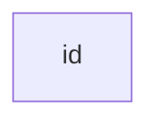
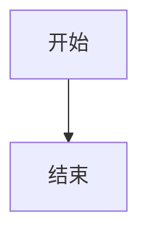
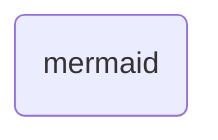
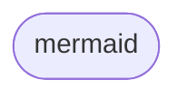
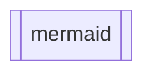
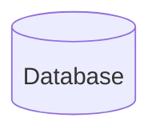
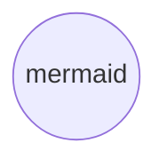
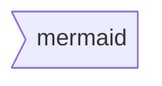
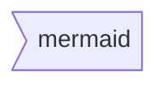
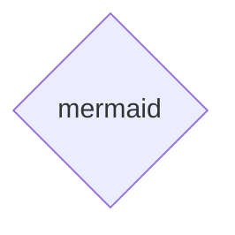

# Mermaid 语法 - 流程图

## 基本语法

所有流程图 均由**节点**，几何形状和**连线**，箭头或线条组成。mermaid 代码定义了这些节点和边的组成和交互方式。

你还可以选择不同的箭头类型，多方向箭头以及与子图之间的链接。

> 注意：请勿将关键字 `end` 用于流程图的节点名称。将所有或任何一个字母大写，以防止流程图中断，例如“End” 或 “END”。

### 一个节点（默认）

````

````


> 注意： `id` 即显示在矩形中的名称。

### 一个包含文本的节点

也可以在矩形框中设置与 id 不同的文本。如果多次设定文本，节点会使用最后一段文本用于显示。另外，如果稍后为节点定义连线，则可以省略文本定义。渲染矩形框时将使用之前定义的文本。

````

````


### 图

这条语句声明了流程图的方向。

下述代码声明了流程图是从上到下的（`TD` 或 `TB`）。

````


````


下述代码声明了流程图是从左到右的（`LR`）。

````
```mermaid
graph LR
    开始 --> 结束
````

```mermaid
graph LR
    开始 --> 结束
```

### 流程图方向

可设置的流程方向有：

- TB - 从上到下
- TD - 从上到下（和 TB 相同）
- BT - 从下到上
- RL - 从右到左
- LR - 从左到右

### 节点形状

#### 圆角矩形节点

````


````


#### 运动场形状节点

````

````


#### 子程序形状节点

````


````


#### 圆柱形节点



#### 圆形节点

````


````


#### 鱼尾旗形状节点

````

````



目前只有向右的鱼尾旗形状可用

#### 菱形节点

````

````


#### 六边形节点

````
```mermaid
graph LR
    id1{{mermaid}}
```
````

```mermaid
graph LR
    id1{{mermaid}}
```

#### 平行四边形节点

````
```mermaid
graph TD
    id1[/mermaid/]
```
````

```mermaid
graph TD
    id1[/mermaid/]
```

#### 平行四边形节点（不同方向）

````
```mermaid
graph TD
    id1[\mermaid\]
```
````

```mermaid
graph TD
    id1[\mermaid\]
```

#### 梯形节点（下宽上窄）

````
```mermaid
graph TD
    A[/mermaid\]
```
````

```mermaid
graph TD
    A[/mermaid\]
```

#### 梯形节点（上宽下窄）

````
```mermaid
graph TD
    B[\mermaid/]
```
````

```mermaid
graph TD
    B[\mermaid/]
```

### 节点之间的连接

节点可以用连线进行连接。可以用不同类型的边线连接节点或将文字附加在连线上。

#### 带箭头的连接

````
```mermaid
graph LR
    A-->B
```
````

```mermaid
graph LR
    A-->B
```

#### 开放式连接

````
```mermaid
graph LR
    A --- B
```
````

```mermaid
graph LR
    A --- B
```

#### 带文字的连接

````
```mermaid
graph LR
    A-- 文字 ---B
```
````

```mermaid
graph LR
    A-- 文字 ---B
```

或者

````
```mermaid
graph LR
    A---|文字|B
```
````

```mermaid
graph LR
    A---|文字|B
```

#### 带文字和箭头的连接

````
```mermaid
graph LR
    A-->|文字|B
```
````

```mermaid
graph LR
    A-->|文字|B
```

或者

```mermaid
graph LR
    A-- 文字 -->B
```

#### 虚线连接

````

```mermaid
graph LR;
   A-.->B;
```
````

```mermaid
graph LR;
   A-.->B;
```

#### 带文字的虚线连接

````
```mermaid
graph LR
   A-. 文字 .-> B
```
````

```mermaid
graph LR
   A-. 文字 .-> B
```

#### 加粗的连接

````
```mermaid
graph LR
   A ==> B
```
````

```mermaid
graph LR
   A ==> B
```

#### 带文字的加粗连接

````
```mermaid
graph LR
   A == 文字 ==> B
```
````

```mermaid
graph LR
   A == 文字 ==> B
```

#### 一串连接

可以在一行中声明多个连接：

````
```mermaid
graph LR
   A -- 文字 --> B -- 文字 --> C
```
````

```mermaid
graph LR
   A -- 文字 --> B -- 文字 --> C
```

也可以在同一行中声明多个节点连接：

````
```mermaid
graph LR
   a --> b & c--> d
```
````

```mermaid
graph LR
   a --> b & c--> d
```

可以以非常简洁的方式描述依赖关系，如下所示一行代码：

````
```mermaid
graph TB
    A & B--> C & D
```
````

```mermaid
graph TB
    A & B--> C & D
```

同样的图形，如果使用基本语法，需要四行代码。但也请注意，这可能会使流程图难以以 Markdown 形式阅读。我想到了瑞典语单词 `lagom`，意思是：不要太多也不要太少。

下面的代码和上面的一行代码等价：

````
```mermaid
graph TB
    A --> C
    A --> D
    B --> C
    B --> D
```
````

```mermaid
graph TB
    A --> C
    A --> D
    B --> C
    B --> D
```

#### 新的箭头类型

以下是支持的新类型的箭头：

````

```mermaid
graph LR
    A --o B
    B --x C
```

````

```mermaid
graph LR
    A --o B
    B --x C
```

#### 多方向箭头

````
```mermaid
graph LR
    A o--o B
    B <--> C
    C x--x D
```
````

```mermaid
graph LR
    A o--o B
    B <--> C
    C x--x D
```

#### 连接线的最小长度

流程图中的每个节点最终被分配到所呈现的图形中的一个级别，即被分配到垂直或水平级别 (取决于流程图的方向)，基于它所连接的节点。默认情况下，连接可以跨越任意数量的级别，但是您可以通过在连接定义中添加额外的破折号来指定一个连接比其他连接更长。

在下面的示例中，从节点 B 到节点 E 的连接中添加了两个额外的破折号，因此它比常规连接跨越了多两个级别：

````
```mermaid
graph TD
    A[开始] --> B{判断?};
    B -->|Yes| C[OK];
    C --> D[重新想想];
    D --> B;
    B ---->|No| E[结束];
```
````

```mermaid
graph TD
    A[开始] --> B{判断?};
    B -->|Yes| C[OK];
    C --> D[重新想想];
    D --> B;
    B ---->|No| E[结束];
```

> **注意：**渲染引擎可能会使连接长于定义的级别，以适应其他连接。

当连接标签写在连接的中间时，必须在连接的右侧添加额外的破折号。下面的例子和上述等价：

````

```mermaid
graph TD
    A[开始] --> B{判断?};
    B -- Yes --> C[OK];
    C --> D[重新想想];
    D --> B;
    B -- No ----> E[结束];
```
````

```mermaid
graph TD
    A[开始] --> B{判断?};
    B -- Yes --> C[OK];
    C --> D[重新想想];
    D --> B;
    B -- No ----> E[结束];
```

对于虚线或加粗的连接线，使用的字符看上去是同样的形状，如下表所示：

|**长度**|**1**|**2**|**3**|
|-|-|-|-|
|普通|`---`|`----`|`-----`|
|普通带箭头|`-->`|`--->`|`---->`|
|加粗|`===`|`====`|`=====`|
|加粗带箭头|`==>`|`===>`|`====>`|
|虚线|`-.-`|`-..-`|`-...-`|
|虚线带箭头|`-.->`|`-..->`|`-...->`|

## 中断语法的特殊字符

可以将文本放在引号中，以渲染会引起歧义的文字。如下例所示：

````
```mermaid
graph LR
    id1["这是 (text) 文本"]
```
````

```mermaid
graph LR
    id1["这是 (text) 文本"]
```

### 转义字符的实体代码

可以使用下述示例的语法转义字符：

```
```mermaid
graph LR
    A["一个双引号:#quot;"] -->B["一个十进制数字表示的符号:#9829;"]
```

```


```mermaid
graph LR
    A["一个双引号:#quot;"] -->B["一个十进制数字表示的符号:#9829;"]
```

数字为十进制，因此 # 符号可以编码为 `#35;`。此外，也支持使用 HTML 字符名称。

## 子图

````
```mermaid
subgraph title
    graph definition
end
```
````

```mermaid
subgraph title
    graph definition
end
```

一个例子：

````
```mermaid
graph TB
    c1-->a2
    subgraph A
    a1-->a2
    end
    subgraph B
    b1-->b2
    end
    subgraph C
    c1-->c2
    end
```
````

```mermaid
graph TB
    c1-->a2
    subgraph A
    a1-->a2
    end
    subgraph B
    b1-->b2
    end
    subgraph C
    c1-->c2
    end
```

您还可以为子图设置 id：

````
```mermaid
graph TB
    c1-->a2
    subgraph ide1 [A]
    a1-->a2
    end
```
````

```mermaid
graph TB
    c1-->a2
    subgraph ide1 [A]
    a1-->a2
    end
```

## 多子图流转

在多个子图中，可以在子图之间设置连接线，如下面的例子所示：

````
```mermaid
graph TB
    c1-->a2
    subgraph A
    a1-->a2
    end
    subgraph B
    b1-->b2
    end
    subgraph C
    c1-->c2
    end
    A --> B
    C --> B
    B --> c2
```
````

```mermaid
graph TB
    c1-->a2
    subgraph A
    a1-->a2
    end
    subgraph B
    b1-->b2
    end
    subgraph C
    c1-->c2
    end
    A --> B
    C --> B
    B --> c2
```

## 子图的方向

在多个流程图中，您可以使用方向语句来设置子图将呈现的方向，就像下面的例子所示：

````
```mermaid
graph LR
  subgraph TOP
    direction TB
    subgraph B1
        direction RL
        i1 -->f1
    end
    subgraph B2
        direction BT
        i2 -->f2
    end
  end
  A --> TOP --> B
  B1 --> B2
```
````

```mermaid
graph LR
  subgraph TOP
    direction TB
    subgraph B1
        direction RL
        i1 -->f1
    end
    subgraph B2
        direction BT
        i2 -->f2
    end
  end
  A --> TOP --> B
  B1 --> B2
```

## 交互

可以在节点上定义点击时跳转到超链接。

默认情况下，超链接在同一浏览器选项卡/窗口中打开。可以通过在 click 定义中添加链接目标来更改此设置 （支持 `_self`，`_blank`，`_parent` 和 `_top`）：

````
```mermaid
graph LR;
    A-->B;
    B-->C;
    C-->D;
    D-->E;
    click A "http://www.mermaid.com/downloads" _blank
    click B "http://www.mermaid.com/downloads" "Open this in a new tab" _blank
    click C href "http://www.mermaid.com/downloads" _blank
    click D href "http://www.mermaid.com/downloads" "Open this in a new tab" _blank
```
````

```mermaid
graph LR;
    A-->B;
    B-->C;
    C-->D;
    D-->E;
    click A "http://www.mermaid.com/downloads" _blank
    click B "http://www.mermaid.com/downloads" "Open this in a new tab" _blank
    click C href "http://www.mermaid.com/downloads" _blank
    click D href "http://www.mermaid.com/downloads" "Open this in a new tab" _blank
```

## 注释

可以在流程图中输入注释，解析器将忽略该注释。注释需要在独立的行内，并且必须以 `%%` 开头。注释开始到下一个换行符之后的任何文本都将被视为注释，包括任何流程图语法：

````
```mermaid
graph LR
%% this is a comment A -- text --> B{node}
   A -- text --> B -- text2 --> C
```
````

```mermaid
graph LR
%% this is a comment A -- text --> B{node}
   A -- text --> B -- text2 --> C
```

## 样式和类 class

### 连接线样式

可以对连接线进行样式设置。例如，您可能希望对流程中倒退的连接线进行样式设置。因为连接不像节点那样可以设置 id，所以需要其他确定连接应附加到哪种样式的方法。

使用在流程图中定义连接的序号指定连接。在下面的示例中，在 linkStyle 语句中定义的样式将属于图中的第四个连接：

````
```mermaid
linkStyle 3 stroke:#ff3,stroke-width:4px,color:red;
```
````

```mermaid
linkStyle 3 stroke:#ff3,stroke-width:4px,color:red;
```

### 节点样式

可以为节点定义指定的样式，例如更粗的边框或不同的背景色：

````
```mermaid
graph LR
    id1(开始)-->id2(结束)
    style id1 fill:#f9f,stroke:#333,stroke-width:4px
    style id2 fill:#bbf,stroke:#f66,stroke-width:2px,color:#fff,stroke-dasharray: 5 5
```
````

```mermaid
graph LR
    id1(开始)-->id2(结束)
    style id1 fill:#f9f,stroke:#333,stroke-width:4px
    style id2 fill:#bbf,stroke:#f66,stroke-width:2px,color:#fff,stroke-dasharray: 5 5
```

### 类 Class

比每次定义样式更方便的是定义一个样式 class，并将该 class 添加到不同的节点上。

class 定义如下所示：

````
```mermaid
classDef className fill:#f9f,stroke:#333,stroke-width:4px;
```
````

```mermaid
classDef className fill:#f9f,stroke:#333,stroke-width:4px;
```

将 class 添加到节点的示例如下：

````
```mermaid
class nodeId1 className;
```
````

```mermaid
class nodeId1 className;
```

也可以用一条语句将一个 class 添加到一系列的节点上：

```mermaid
class nodeId1,nodeId2 className;
```

添加 class 的一种更短的形式是使用 `:::` 运算符将 classname 添加到节点，如下所示：

````
```mermaid
graph LR
    A:::someclass --> B
    classDef someclass fill:#f96;
```
````

```mermaid
graph LR
    A:::someclass --> B
    classDef someclass fill:#f96;
```

### 默认 class

如果一个 class 被命名为 default，它的样式将被分配给所有没有指定 class 的节点。

````
```mermaid
classDef default fill:#f9f,stroke:#333,stroke-width:4px;
```
````

```mermaid
classDef default fill:#f9f,stroke:#333,stroke-width:4px;
```

# 顶点和连接线之间有空格且没有分号的图声明

- 在图的声明中，语句现在也可以在没有分号的情况下结束。用分号结束图形语句是可选的。因此，下面的图声明与图的过往声明同样有效。
- 在顶点和连接之间允许使用单个空格。但是，顶点及其文本与连接及其文本之间不应存在任何空格。图声明的旧语法也将起作用，因此此新功能是可选的，并被引入以提高可读性。

下面是流程图边线的新的声明方式，和过去的语法同样有效。

````
```mermaid
graph LR
    A[Hard edge] -->|Link text| B(Round edge)
    B --> C{Decision}
    C -->|One| D[Result one]
    C -->|Two| E[Result two]
```
````

```mermaid
graph LR
    A[Hard edge] -->|Link text| B(Round edge)
    B --> C{Decision}
    C -->|One| D[Result one]
    C -->|Two| E[Result two]
```