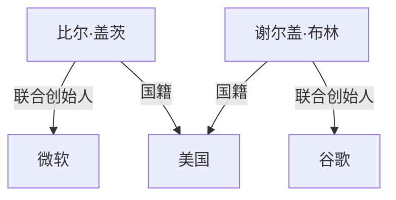

# 基于知识图谱的知识库初探

" 如果说思维导图是给人看的，那么知识图谱就是给计算机看的。"

### 大语言模型与 RAG 技术

大型语言模型（LLM, Large Language Model）是一种基于 Transformer 架构的神经网络，通过大量数据训练来识别和生成文本。但是大语言模型有上下文字数限制，较大的文档不可以一次读入，这就需要对文档进行切割（Splitting）。文档会被切割成小的片段（Chuck），片段的大小可以定义，同时为了保持上下文的连续性，片段之间还可以保留部分重叠，如下图 [^1] 所示。


文档片段会被嵌入（embedding），并保存在向量数据库中，作为知识库。在大语言模型的问答系统中，输入的问题首先会被嵌入，然后在向量数据库中进行相似度检索，找出与问题相似度最高的片段，并将其与问题本身一起输入给大语言模型。最后，大语言模型会根据输入的片段和问题生成答案。这个过程即为检索增强生成（RAG, Retrieval Augmented Generation），如下图 [^2] 所示。


相比于对大型语言模型进行微调（Fine Tuning），RAG 技术在知识库应用领域彰显了其独特的优势。它在以下几个方面表现出色：

- 增量学习：RAG 能够通过检索最新信息来不断更新知识，而无需对整个模型进行重新训练，这使得它在处理新数据时更为灵活和高效。
- 成本效益：由于避免了昂贵的重新训练过程，RAG 在成本控制方面更为优越，尤其适用于预算有限的项目。
- 泛化能力：RAG 不局限于特定领域的数据，它能够跨领域检索和整合信息，展现出更强的泛化能力，适用于更广泛的应用场景。

### 微软的大招：GraphRAG

当知识库的容量持续地增加，RAG 可能会面临检索效率低下、检索质量下降、上下文匹配困难、资源消耗增加、信息冗余和动态更新挑战等问题。为了解决传统 RAG 存在的问题，微软提出了 GraphRAG[^3] ，即通过结合知识图谱和图机器学习技术，从非结构化文本中提取有意义的结构化数据，并利用这些数据增强大语言模型的理解和推理能力。

做一个不太恰当的比喻，在一个庞大的知识库中寻找一个微小的知识点，就像在大海中捞针（RAG）；而知识图谱则如同穿针引线，将所有片段巧妙地串联在一起。

### 什么是知识图谱

千万不要小看知识图谱这根细线，谷歌搜索正是有赖于知识图谱技术的支持，使得搜索结果又快又准。

知识图谱 [^4][^5]（Knowledge Graph）是一种结构化的语义知识库，用于描述物理世界中的概念及其相互关系。它通过将复杂的数据转化为简单、清晰的“实体 - 关系 - 实体”三元组，来实现知识的快速响应和推理。例如，“中国 - 首都 - 北京”就是一个简单的三元组，其中“中国”和“北京”是实体，“首都”是它们之间的关系。

知识图谱被广泛应用于智能搜索、智能问答、个性化推荐、情报分析和反欺诈等领域。它不仅能帮助搜索引擎更智能地理解用户查询，还能在大数据分析和人工智能应用中发挥重要作用。


以上图为例，简单看一下知识图谱的检索逻辑。比如，我们想知道微软和谷歌有什么关联，通过图中的黄线即可实现。



注意箭头方向。

### 小试牛刀：GraphRAG

GraphRAG 的安装与设置可以参考王树义老师的文章 [^6]，需要特别注意的是，务必要把模型换成 GPT4o mini，不然成本暴增。这里我选择了自己公众号上的一些技术文章，来展示 GraphRAG 的效果。

⠴ GraphRAG Indexer
├── Loading Input (InputFileType.text) - 14 files loaded (1 filtered) ━━━━━━━━━━━━━━━━━━━━━━━━━━━━━ 100% 0:00:00 0:00:00
├── create_base_text_units
├── create_base_extracted_entities
├── create_summarized_entities
├── create_base_entity_graph
├── create_final_entities
├── create_final_nodes
├── create_final_communities
├── join_text_units_to_entity_ids
├── create_final_relationships
├── join_text_units_to_relationship_ids
├── create_final_community_reports
├── create_final_text_units
├── create_base_documents
└── create_final_documents

🚀 All workflows completed successfully.

导入成功后，我厚着脸皮问了它第一个问题。

```python
# my fisrt question
python -m graphrag.query --root ./GraphRAG-test --method global "介绍一下这些文章的作者：一刀"
```

GraphRAG 的回答：

```markdown
INFO: Reading settings from GraphRAG-test\settings.yaml
creating llm client with {'api_key': 'REDACTED,len=132', 'type': "openai_chat", 'model': 'gpt-4o-mini', 'max_tokens': 4000, 'temperature': 0.0, 'top_p': 1.0, 'n': 1, 'request_timeout': 180.0, 'api_base': None, 'api_version': None, 'organization': None, 'proxy': None, 'cognitive_services_endpoint': None, 'deployment_name': None, 'model_supports_json': True, 'tokens_per_minute': 0, 'requests_per_minute': 0, 'max_retries': 10, 'max_retry_wait': 10.0, 'sleep_on_rate_limit_recommendation': True, 'concurrent_requests': 25}

SUCCESS: Global Search Response: ## 作者简介：一刀

### 学术背景与专业领域
一刀是一位专注于材料科学的博士研究者，特别在电子元件的失效分析技术方面具有深厚的专业知识。其在包装失效分析领域的广泛经验和贡献，使其成为理解和减轻电子系统故障的关键人物。这种专业知识对于依赖电子元件可靠性的行业，如半导体制造业，具有重要意义 [Data: Reports (33)]。

### 所属机构
一刀隶属于哈尔滨工业大学，这是一所领先的工程与技术研究机构。该校在材料科学领域的学术研究推动了知识和创新的进步，体现了其在工程卓越方面的承诺。这种学术背景不仅增强了其个人的研究能力，也为整个行业的进步做出了贡献 [Data: Reports (33)]。

### 影响与贡献
一刀的研究工作可能会对电子元件的可靠性和性能产生深远的影响，尤其是在当前技术快速发展的背景下。通过其在失效分析方面的专业知识，一刀将有助于提升电子系统的整体可靠性，进而推动相关行业的技术进步和创新。

综上所述，一刀作为材料科学领域的专家，其研究和学术背景将对电子元件的可靠性和行业发展产生积极的影响。
```

回答基本靠谱，但仍存在进步的空间。可以注意到，某些段落给出了引用的来源。

既然是知识图谱增强的 RAG，很自然的就想看看这些图谱啦。如下图所示，GraphRAG 的输出是一堆 `.parquet` 文件，这是一种文本格式，可以直接用记事本打开。


我们可以用这些 `.parquet` 文件生成知识图谱，为此我尝试了以下三种方法。

1. 微软提供的 notebook[^7]，可以将 `.parquet` 的内容导入 neo4j 的图数据库中；
2. 将 `.parquet` 转为 `.csv` 文件，再在 neo4j 中导入 [^8][^9]；
3. 使用 GraphRAG Visualizer[^10]，支持直接导入 `.parquet` 文件。

限于篇幅，这里只展示最后一种方法生成的知识图谱。


图谱一共由 380 个结点（Nodes）和 378 个关系（Relationships）组成。

（PS：图谱看不清很正常，本来也不是给人看的...）

可以查看图谱中的结点，比如：

###### Node Details: 一刀

###### Node Information

ID: b785a9025069417f94950ad231bb1441

Name: 一刀

Type: PERSON

Description: The entity "\u4e00\u5200" is a doctoral researcher and expert in materials science, affiliated with the Harbin Institute of Technology. They hold a PhD in materials science and specialize in various failure analysis techniques, particularly in the management of packaging failure analysis laboratories. With extensive experience in the field, \u4e00\u5200 is recognized as an author and has contributed to discussions on NAND Flash technology, sharing personal insights and experiences related to their writing. Their expertise encompasses a focus on effective failure analysis techniques, especially in the context of packaging-related failures.

对于 " 一刀 " 的描述还是蛮准确的，哈哈。

### 集大成者：Neo4j LLM Knowledge Graph Builder

Neo4j 是一个高性能的 NoSQL 图形数据库，它将结构化数据存储在网络（从数学角度叫做图）上而不是表中。它采用属性图模型，提供原生的图数据存储、检索和处理功能。Neo4j 是图数据库领域的领导者之一，以其高性能、易用性和强大的社区支持而受到广泛认可。

由于微软提供的 Notebook 使用了 `CALL` 指令，本地化部署的 Neo4j 需要安装 APOC 插件。不出意外的，本地部署 Neo4j 失败了...而且在网上找不到解决方案。幸运的是，Neo4j 提供了免费的在线数据库 Aura，且已集成了 APOC 插件，真是山穷水尽疑无路，柳暗花明又一村呐。不过在这个过程中，我意外发现了 Neo4j 示例项目中的 LLM Knowledge Graph Builder。


LLM KG Builder 支持多种来源导入，包括 PDF、Markdown、图片、网页以及 YouTube 视频，同时也支持从 S3/GCS 云存储导入。该工具不仅能够生成知识图谱，还提供基于文档向量和图谱的在线问答功能，完美契合了我一直想要实现的文献管理软件的部分构想。文档上传完成后，可以立即生成图谱。此外，在 **Graph Enhancement** 选项中，还可以选择预设的或自定义的模式（Schema）。我使用 Kimi 基于文章生成了一些 Node Labels 和 Relationship Types，虽然结果不是特别精确，演示用足够了。如果能够直接导入 GraphRAG 抽取的 Node 和 Relationship，相信效果会更佳。


上图展示了由 14 篇技术文章生成的图谱，包含了从文档中抽取的词法图（Lexical Graph），该图展示了文档和片段（含嵌入）的关系，以及包含节点及其关系的实体图（Entity Graph），还有两者的结合体——知识图谱（Knowledge Graph, KG）。所有这些图均存储在 Neo4j 的数据库中。

不得不说，LLM KG Builder 的实体图效果与 Obsidian 中的关系图非常相似，这让我对 Obsidian 的设计理念再次心生敬佩。尽管 Obsidian 通过双向链接来连接不同的想法和笔记，这种做法与知识图谱的形成过程如出一辙，但这一过程显然需要耗费大量个人精力，远不如 GraphRAG 或 LLM KG Builder 来得便捷。与 Google NotebookLM 相比，LLM Graph Builder 明显更进一步，它让我看到了笔记软件、个人知识管理乃至知识库的未来形态。

### LLM KG Builder vs GraphRAG

话说回来，既然 LLM KG Builder 和 GraphRAG 都是 RAG 和知识图谱的结合体，我决定通过一个相对复杂的问题来考考它们。

我的问题：

```markdown
某批次NAND Flash芯片在做可靠性试验的过程中发生失效，帮我制定一套失效分析流程
```

LLM KG Builder vs GraphRAG 的回答：

| LLM Knowledge Graph Builder                                                                                                                                                                                                                                                                                                                                                                                                                                                                                                                                                                                                                                                                                                                                                                                                                                                                                | GraphRAG (Local Search)                                                                                                                                                                                                                                                                                                                                                                                                                                                                                                                                                                                                                                                                                                                                                                                                                                                                                                                                                                                                                                                                                                                                                                                                                                                                                          |
| :--------------------------------------------------------------------------------------------------------------------------------------------------------------------------------------------------------------------------------------------------------------------------------------------------------------------------------------------------------------------------------------------------------------------------------------------------------------------------------------------------------------------------------------------------------------------------------------------------------------------------------------------------------------------------------------------------------------------------------------------------------------------------------------------------------------------------------------------------------------------------------------------------------- | :--------------------------------------------------------------------------------------------------------------------------------------------------------------------------------------------------------------------------------------------------------------------------------------------------------------------------------------------------------------------------------------------------------------------------------------------------------------------------------------------------------------------------------------------------------------------------------------------------------------------------------------------------------------------------------------------------------------------------------------------------------------------------------------------------------------------------------------------------------------------------------------------------------------------------------------------------------------------------------------------------------------------------------------------------------------------------------------------------------------------------------------------------------------------------------------------------------------------------------------------------------------------------------------------------------------- |
| 针对 NAND Flash 芯片在可靠性试验中发生失效的情况，可以参考以下失效分析流程：<br><br>1. 初步检查和记录：    <br>    - 收集失效样品和相关的试验数据。<br>    - 记录失效现象和失效时间点，确保所有信息完整。<br>2. 非破坏性测试：<br>	- 进行直流测试（I-V Curve）以确定失效的电气特性。<br>    - 使用热定位方法（Thermal）来初步定位失效区域，通过缺陷或失效发出的热来缩小分析范围。<br>3. 失效模式验证：  <br>    - 根据直流测试和热定位结果，确定失效模式（如开路失效、短路失效等）。<br>    - 叠加 Marking 图面与 Bonding 图面，结合 Top 面的热点，确定失效位置（芯片中间、芯片边缘、Pad 附近、wire 之间、PCB Finger 附近等）。<br>4. 样品制备：<br>    - 根据初步定位结果，选择合适的制样技术进行样品制备。<br>    - 确保样品制备过程中不引入新的失效因素。<br>5. 显微分析：   <br>    - 使用光学显微镜、扫描电子显微镜（SEM）等设备进行显微观察，进一步确认失效位置和失效模式。<br>    - 结合能谱分析（EDS）等技术，分析失效区域的材料成分。<br>6. 失效原因分析：    <br>    - 结合失效模式和显微分析结果，分析失效原因。<br>    - 考虑 ESD 相关失效的可能性，进行 ESD 模型验证和 ESD 源探测。<br>7. 验证和改进：<br>    - 根据失效原因，制定改进措施并进行验证。<br>    - 记录和总结分析过程和结果，不断改进分析手法。<br>8. 报告和反馈：    <br>    - 编写详细的失效分析报告，包含失效现象、失效模式、失效原因和改进措施。<br>    - 将分析结果反馈给相关部门，确保改进措施得到实施。<br><br>通过以上流程，可以系统地分析 NAND Flash 芯片的失效原因，并制定相应的改进措施，提高产品的可靠性。 | ## NAND Flash 芯片失效分析流程<br><br>在进行 NAND Flash 芯片的失效分析时，制定一套系统化的流程是至关重要的。以下是一个推荐的失效分析流程，旨在帮助识别和解决在可靠性试验中发生的失效问题。<br><br>### 1. 初步数据收集与分析<br><br>首先，收集与失效相关的所有数据，包括测试条件、失效模式、环境因素等。通过对这些数据的初步分析，可以确定失效的可能原因和影响因素。<br><br>- 记录失效情况：详细记录失效发生的时间、环境条件、测试方法等信息。<br>- 数据分析：使用统计工具分析失效数据，识别出失效的趋势和模式。<br><br>### 2. 外观检查<br><br>进行外观检查是失效分析的第一步，目的是识别明显的物理缺陷。<br><br>- 检查外观：使用显微镜等工具检查芯片的外部状态，寻找裂纹、烧毁、短路等 明显缺陷 [Data: Entities (306); Relationships (332)]。<br>- 记录发现：将所有发现的缺陷记录在案，以便后续分析。<br><br>### 3. 非破坏性测试<br><br>在外观检查后，进行非破坏性测试以进一步分析芯片的内部结构。<br><br>- X-ray 检查：利用 X-ray 技术检查芯片内部结构，识别潜在的内部缺陷，如连接问题或封装缺陷 [Data: Entities (178); Relationships (108, 260)]。<br>- C-SAM 测试：使用 C-SAM 技术分析封装层，检测可能的分层或其他缺陷 [Data: Entities (307); Relationships (333)]。<br><br>### 4. 破坏性测试<br><br>如果非破坏性测试未能确定失效原因，则需要进行破坏性测试。<br><br>- 样品制备：准备样品进行磨样开封等破坏性测试，以深入分析芯片的内部结构 [Data: Entities (308); Relationships (334)]。<br>- 失效模式分析：通过破坏性测试，识别失效模式并记录相关数据。<br><br>### 5. 数据分析与报告<br><br>在完成所有测试后，进行数据分析并撰写失效分析报告。<br><br>- 分析结果：综合所有测试结果，分析失效原因，提出改进建议。<br>- 撰写报告：将分析过程、结果和建议整理成报告，供相关人员参考。<br><br>### 6. 改进措施与验证<br><br>根据失效分析的结果，制定改进措施，并进行验证。<br><br>- 实施改进：根据分析结果，调整生产工艺或材料，减少未来失效的可能性。<br>- 验证效果：通过后续的可靠性测试验证改进措施的有效性。<br><br>### 结论<br><br>通过以上流程，可以系统地分析 NAND Flash 芯片在可靠性试验中发生的失效，识别根本原因并提出有效的改进措施。这一流程不仅有助于解决当前的问题，还能为未来的 生产提供重要的参考和指导。 |

显然，LLM KG Builder 的回答更注重细节。尽管存在一些东拉西扯的问题，但其最大的优势在于回答的可追溯性。它不仅会提供参考的文档、片段和使用频率最高的实体，还可以基于这些实体生成一个新的图谱，如下图所示。


GraphRAG 的回答让我感到惊喜，不仅条理清晰，而且没有乱联想。根据我多年的工作经验，它给出的失效分析流程几乎没有问题。如果非要鸡蛋里挑骨头的话，就是泛化能力稍显不足。生成图谱的文章大致分为三个系列：封装失效分析系列、NAND Flash 系列以及科普系列。我的问题实际上包含了三个关键词：NAND Flash、失效分析和可靠性。然而，GraphRAG 和 LLM KG Builder 的回答仅引用了与失效分析相关的资料，未能考虑到 NAND Flash 和可靠性方面的内容。不过必须要指出的是，我所使用的仅仅是 14 篇自己撰写的小文章，而在 NAND Flash 系列和可靠性文章中也没有涉及失效分析的相关内容，因此这三者之间的共同实体可能并不多，难以形成足够的联系以生成更全面的答案。如果我把多年来积累的文献都输入进去...那这行业知识库是不是就成了？

### 最后升华一下主题

（以下内容是 GPT4o mini 生成的，当然，我帮它起了个头，也做了一些修改，算是共创吧，哈哈）

可以预见的是，在 LLM 时代，知识图谱的门槛已经低到不能再低，通过 LLM KG Builder 每个人都可以基于个人笔记、文献、网页、视频等来源轻松创建和管理自己的知识网络。这种便利使得知识的组织和获取变得更加高效，不再需要繁琐的手动链接和整理。个体可以更加专注于知识的积累和思维的扩展，而不是耗费时间在结构化数据的构建上。

随着技术的不断进步，未来的知识管理工具将更加智能化，能够自动识别和推荐相关内容，帮助用户发现潜在的联系和洞见。这不仅将提升个人学习和研究的效率，也将促进知识的共享与协作。GraphRAG 和 LLM KG Builder 等类似工具的出现，预示着一个更加开放和互联的知识生态系统的到来，让每个人都有机会成为知识的创造者和传播者。

在这样的背景下，基于知识图谱的知识库不仅是个人知识管理的利器，更将成为推动集体智慧与创新的重要基础。也许我们正站在一个全新的知识管理时代的风口，未来无限可能。

### 引用链接

[^1]: https://towardsdatascience.com/rag-how-to-talk-to-your-data-eaf5469b83b0
[^2]: https://medium.com/@onkarmishra/using-langchain-for-question-answering-on-own-data-3af0a82789ed
[^3]: https://microsoft.github.io/graphrag/
[^4]: https://www.cnblogs.com/huangyc/p/10043749.html
[^5]: https://neo4j.com/blog/what-is-knowledge-graph/
[^6]: https://sspai.com/post/90665
[^7]: https://github.com/microsoft/graphrag/blob/community/graphrag_import_neo4j_cypher/examples_notebooks/community_contrib/neo4j/graphrag_import_neo4j_cypher.ipynb
[^8]: https://www.youtube.com/watch?v=f7Puiilv5Tw
[^9]: https://mer.vin/2024/07/graphrag-neo4j/
[^10]: https://noworneverev.github.io/graphrag-visualizer/
[^11]: https://neo4j.com/labs/genai-ecosystem/llm-graph-builder/