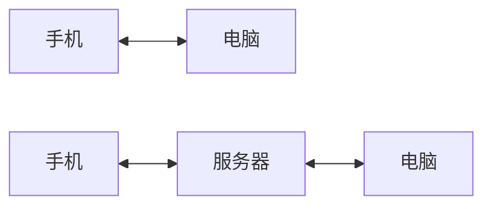

# Syncthing

## 什么是 Syncthing

[Syncthing](https://syncthing.net/) 是一款开源免费跨平台的文件同步工具，是基于**P2P 技术**实现设备间的文件同步。具体以下特性：

1. 隐私和安全：除了计算机上之外，您的任何数据都不会存储在其他任何地方。没有可能受到合法或非法损害的中央服务器。所有通信都使用 TLS 进行保护。使用的加密包括完全的前向保密，以防止任何窃听者访问您的数据。每个设备都由强加密证书标识。
2. 开放：开放协议，开源，开放开发，开放社区。
3. 强大且易用：有命令行模式，界面模式，可以同步任意文件夹
4. 跨端：支持 Android、Mac、Windows、Linux。

## Syncthing如何进行同步

大致来说有两种方式，一种是有云服务器的，一种是无服务器的。

无服务器的，类似于远距离蓝牙。两台设备安装 Syncthing，配对好，就可以进行同步。缺点是两台设备同步时都得在线。



有服务器的，服务器起到一个中转的功能，由于服务器不停机，所以其它设备可以在任意时刻同步内容。

## 安装

参考：[Syncthing - P2P文件同步工具 - 知乎 (zhihu.com)](https://zhuanlan.zhihu.com/p/69267020)

就是在[Syncthing](https://syncthing.net/) 官网下载对应的安装包，安装后添加文件夹用于同步，再添加远程设备，就这个流程。

## 云端搭建

> [!tips] 前提条件
> 1. 打开防火墙对应端口，这个在买服务器的控制台可以打开
> 2. 安装docker

- 官方参考资料：[syncthing/README-Docker.md](https://github.com/syncthing/syncthing/blob/main/README-Docker.md)
- [使用腾讯云搭建Syncthing来同步obsidian by 软通达](https://zhuanlan.zhihu.com/p/433024400)：山鸡哥的实践分享。安装完docker其实只需要一行命令，山鸡哥用它熟悉的宝塔面板安装的，可以优化有一下

==运行 docker 命令==

```bash
docker run -d -p 8384:8384 -p 22000:22000/tcp -p 22000:22000/udp -p 21027:21027/udp \
    -v /wherever/st-sync:/var/syncthing \
    --hostname=my-syncthing \
    syncthing/syncthing:latest
```

其中 `-d` 参数是后台运行 docker， 8384 是 UI 界面端口，22000 和 21027 是上传下载端口， hostname 是主机名称，可随意更改。

确保服务器打开三个端口后，访问 `<服务器地址>:8384` 便可打开 UI 界面。点击右上角操作按钮，获得设备 ID，添加到其他设备，则会在远程设备中显示已有设备。点击添加文件夹，便可创建一个同步文件夹，展开这个文件夹，便可有选项进行配置。如下图所示：


## 踩坑

- 同步文件夹里有mklink的文件夹，syncthing无法识别，但mklink文件夹的子文件夹，可以作为syncthing的根文件夹