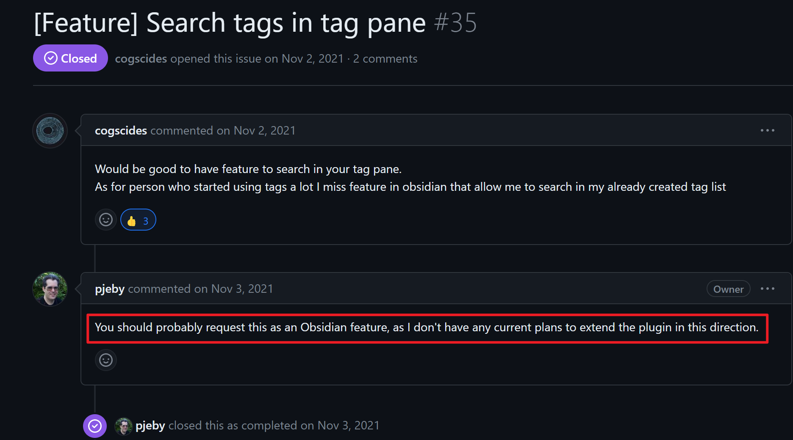

**TOC**

  - [一-前言](#一-前言)
  - [二-使用](#二-使用)
  - [三-期待的功能](#三-期待的功能)

# obsidian1.4.5 版本暗藏的彩蛋：多标签查询功能，帮助更好的利用标签检索笔记

## 一 - 前言

Obsidian 版本最近进行了更新，听说对旧版本 frontmatter 进行了较大的改动，增加了图形化操作 frontmatter 的特性。安装尝试后发现这个功能极大的提升了操作 frontmatter 字段的效率，特别是对于有使用 tag 进行元数据配置的用户来说，这个特性可以非常方便地编辑，修改，删除文档中的标签。

除了体验主要的这一改动，笔者想要看看 **系统自带标签面板** 是否也有功能更新 ，于是经过尝试发现也有一个增加了非常有用的功能——多标签查询检索。

Obsidian 默认就是支持 多标签查询检索（搜索框查询语法），不过直接在旧版本（1.4.5 之前）的标签面板中点击标签只会查询一个标签，并展示出包含此标签的笔记列表，如果想要选中多个标签查询，是办不到的，会替换之后点击的标签加入到查询，也就是只能查询一个标签。

## 二 - 使用

在 1.4.5 的版本中，标签面板支持了**多标签查询**，使用方法是先点击一个标签 A,然后按住键盘 `Ctrl` 键，再次点击其他标签 B，这样标签 A 和 标签 B 都加入到了查询框中

样子像这样

 ```css
 tag:#obsidian tag:#Tutorial
``` 

如果想要取消某个标签，比如想要将标签 B 从查询语法移除，则只需要**再次点击标签 B**，这样就只会查询标签 A。

通过多标签查询可以方便的对库中的笔记进行筛选查找，对于有使用标签进行笔记管理的用户来说，这是一个非常值得使用的特性。

## 三 - 期待的功能

加上了这个特性后，标签面板以及标签的价值得到发挥。**不过希望官方（官方出手，必是精品）能在此基础上增加一个标签查询框的功能

，直接在标签面板中输入关键字筛选出标签**。

之所以有这种需求，是因为 社区插件有一个 [tag wrangler](https://github.com/pjeby/tag-wrangler) 插件，此插件是对标签进行处理，其中可以批量修改库中的标签。借助这个特性可以更加方便整理维护库中的标签。不过此插件是基于 **系统标签面板** 的构建，插件作者表示，如果需要添加一个搜索框，建议寻求官方帮助 [^1]。



如果库中标签个数很多，那么在标签面板展示的标签也会很长，使用此插件需要手动定位到需要修改的标签上操作，这样效率很低。

所以如果能在此基础上添加一个搜索框功能，检索出需要操作的标签，然后批量修改，这样无疑是更加方便高效的方案。

[^1]: <https://github.com/pjeby/tag-wrangler/issues/35#issuecomment-957980138>