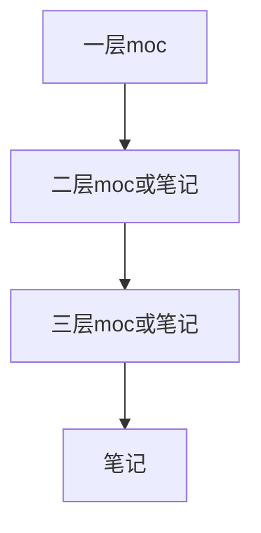

# Obsidian 窗口管理

对比其它笔记软件，Obsidian 的窗口模式是非常丰富的，同样有着极高的自由度。

- 基础使用
	- 在当前窗口打开
	- 以一个新标签页打开并聚焦到新窗口
- 跳转到下一标签页
	- 在新的标签组打开
	- 悬浮窗口打开
	- 标签页
		- 关闭标签页
		- 取消关闭标签页
		- 关闭标签组
		- 关闭窗口
		- 关闭右侧所有标签
		- 标签页历史记录
			- 前进
			- 后退
	- 上下左右拆分
	- 拖拽重组
	- 窗口聚焦
		- 聚焦到文件树
		- 聚焦到大纲
		- 聚焦到标签窗口
		- 聚焦到反链窗口
		- 聚焦到搜索窗口
		- 聚焦到笔记窗口
		- 聚焦到拆分后的上下左右窗口
- 进阶使用
	- 锁定模式
	- 堆叠模式
	- 工作区
- 插件增强
	- Folder-Note：点击文件夹就能打开对应的同名笔记
	- [[pane-relief]]：提供每个标签页独立的历史记录功能，快速跳转到具体标签页
	- [[cycle-through-panes]]：快速循环浏览标签页
	- [[obsidian-hover-editor]] ：悬浮预览任意笔记

## 基础使用

| 操作                             | 快捷键                                                     |
| -------------------------------- | ---------------------------------------------------------- |
| 在当前窗口打开                   | 直接点击或 `alt + enter`                                   |
| 以一个新标签页打开并聚焦到新窗口 | ctrl + 点击 或 `ctrl + enter` 或鼠标中键                   |
| 跳转到上/下一标签页              | `ctrl+tab` 和 `ctrl + shift + tab`                         |
| 在新的标签组打开                 | `ctrl + alt + 点击` 或 `ctrl + alt + enter`                |
| 在悬浮窗口打开                   | `ctrl + alt + shift + 点击` 或 `ctrl + alt + shift + enter` |
| 聚焦到笔记窗口                   | `esc`                                                           |

以上是默认按键，基本上是改不了的。如果不符合操作习惯，可以通过社区插件找找符合自己操作习惯的设置。除此之外，下列所有操作都能自定义快捷键，没啥好写的，写点我对这些常用快捷键的设置，大家可以参考一下：

| 操作                       | 快捷键               | 备注                                                                |
| -------------------------- | -------------------- | ------------------------------------------------------------------- |
| 左右拆分                   | `ctrl + \`           | 看起来好记                                                          |
| 上下拆分                   | `ctrl + shift + \`   |                                                                     |
| 聚焦到文件树               | `alt + e`            | 所有涉及到窗口变换的我都设置为 `alt`，`e` 是 `explore` 的意思       |
| 聚焦到大纲                 | `alt + t`            |                                                                     |
| 聚焦到标签窗口             |                      | 不是很常用，没设快捷键，通过命令面板输命令                          |
| 聚焦到反链窗口             |                      | 未设置                                                              |
| 聚焦到搜索窗口             | `ctrl + shit + f`    | 这个是全局搜索，和笔记搜索不一样                                    |
| 聚焦到拆分后的上下左右窗口 | `alt + 上/下/左/右`  | vscode 里这个默认是前进后退，我觉得我这简单直观点，把 vscode 给改了 |
| 前进后退                   | `ctrl + alt + 左/右` | vscode 里默认是 tab group 跳转                                      |
| 关闭当前标签页             | `ctrl + w`           | 和浏览器一致                                                        |
| 取消关闭标签页             | `ctrl + shift + t`   | 和浏览器一致                                                        |
| 关闭所有标签页             |                      |                                                                     |
| 关闭窗口                   | `ctrl + shift + w`   |                                                                     |

此外，你可以随意将 Obsidian 里的任意窗口通过拖拽窗口面板的图标或者名字，拖拽到任意位置，比如把文件树拖到右侧，下面放标签，左侧是大纲：

## 进阶使用

### 锁定模式

如图所示，最侧面板被锁定，点击左侧窗口任意链接，都会在右侧未锁定的窗口打开链接。这样一来，左侧窗口相当于一个目录，右侧相当于笔记窗口。同时此种模式可以和文件树配合，实现文件目录，链接目录打开的笔记都在同一窗口同一标签页打开。

使用步骤：

1. 打开一个包含链接的笔记
2. 将笔记 `pin` 住，即锁定住。可以在笔记名处右键选择锁定，也可使用命令面板输入锁定
3. 拆分成两个窗口

现在你在被锁定的链接里点击链接，就会在右边拆分出来的窗口显示笔记。

这个功能适用于组织和浏览 moc 文件，能够以非常高的效率浏览文件内容，并组织新的内容到 moc 文件内。

### 堆叠模式

堆叠 (stack) 模式又叫做 Andy mode，最初是 Andy[^1] 在其笔记中开发并应用的，后来放到了公开到了一个 [网站](https://notes.andymatuschak.org/) 上，大家可以访问这个网址，切身体验一下这个 Andy mode 带来的效率提升。其 [个人博客](https://andymatuschak.org/) 同样采用了类似这种方式组织：

使用步骤：

1. 点击右上角和最小化，最大化并排的下箭头图标
2. 第一个选项点击就进入了堆叠模式，也可以使用命令面板，输入 `stack` 或者 `堆叠` 即可看到选型

这乍一看有些唬人，不就是竖着的标签页吗？实际上这玩意儿在嵌套很深的 moc 文件作用非常大：

正常的标签页，你可以拆分三个窗口分别放不同层级的 moc，然后再在第四个窗口放笔记。但是窗口本身占据一定空间，很影响注意力的集中，而采用 Andy mode 的方式，可以自动聚焦到当前窗口，其它标签页自动缩小。不过 Obsidian 里的 andy mode 和真正的 andy mode 还是有点差异的，体会过那个网站就能清晰的感受到，原来的 Andy mode，每个标签页是有层级的，一层笔记的链接只能在二层打开，二层笔记的链接只能在三层打开。

### 工作区

Obsidian能一键保存并加载窗口布局。这在我们进行很多项目时非常有用，随时保存界面布局状态。这样省去了打开笔记，拖拽布局的时间。

使用步骤：

1. 确保打开了核心插件[[工作区]]
2. 打开笔记，拖拽进行布局直到需要保存的状态
3. 运行命令，管理工作区，给个名字，保存即可
4. 之后运行命令加载工作区，选中想要的工作区名字即可

## 插件增强

其中循环浏览标签页在Obsidian中是默认实现的，每个标签的历史跳转也没啥好说的

### Folder Note

这种方式提升了卡片笔记法在文件树中的浏览体验，不用在意一个文件夹下数不清的卡片笔记。

Folder Note其中一个插件是由pkmer成员 aidenlx佬开发的，[alx-folder-note](https://github.com/aidenlx/alx-folder-note)有一个完整的工作流，比较复杂，可以看看[相关教程](https://github.com/aidenlx/alx-folder-note/wiki)。除此之外，社区里也有很多类似插件，[obsidian-folder-note-plugin](https://github.com/xpgo/obsidian-folder-note-plugin)，开发者同样提供了相关使用方法。

### hover editor

这个插件极大的提升了浏览效率，当时刚出来时几乎人手必备的插件。你可以在任意地方悬浮任意笔记。

[^1]: 在苹果公司开发了 IOS 系统，领导并研发了可汗学院。曾在 Youtube 分享长达数个小时记录笔记的实况，Andy mode 影响力在国外也非常大。