# 脑图和流程图

你不需要安装任何插件，就可以在 Obsidian 画图，OB 天然支撑了 Mermaid 语法；当然你喜欢也可以使用其他 脑图插件；

## Mermaid 语法

### 基本形状

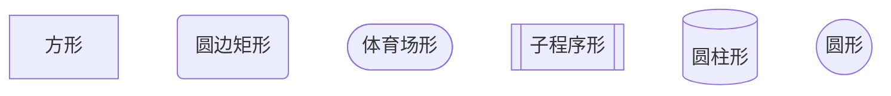

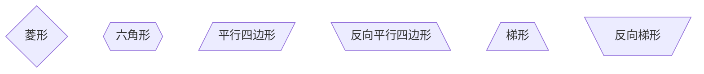

### 连线样式

- 实线箭头：分为无文本箭头和有文本箭头，有文本箭头有 2 种书写格式

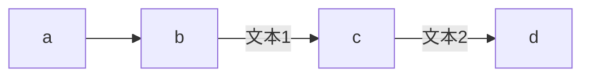

- 粗实线箭头：分为无文本箭头和有文本箭头

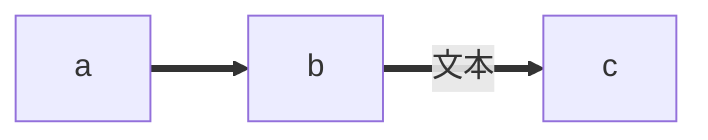

- 虚线箭头：分为无文本箭头和有文本箭头

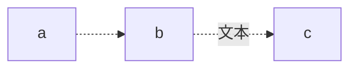

- 无箭头线：即以上三种连线去掉箭头后的形式

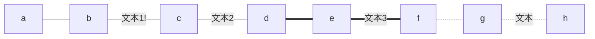

- 其他连线：需要将 `graph` 关键字改为 `flowchart`，除了新增加的连线形式外，上面三种线的渲染效果也会不同

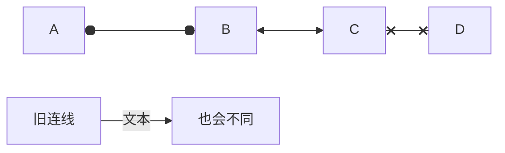

### mermaid 纵向

==普通流程（带流程提示）==


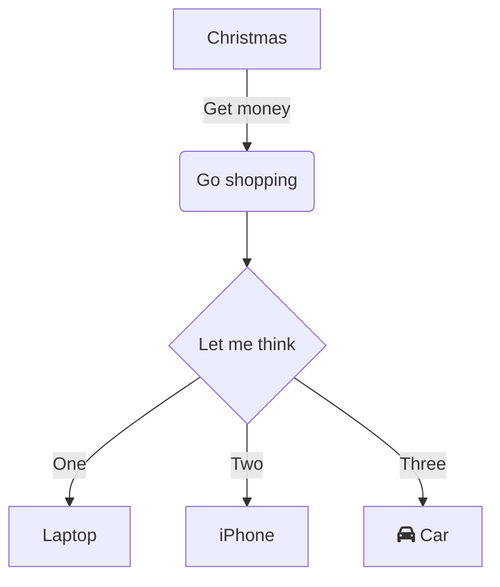


==带判断==

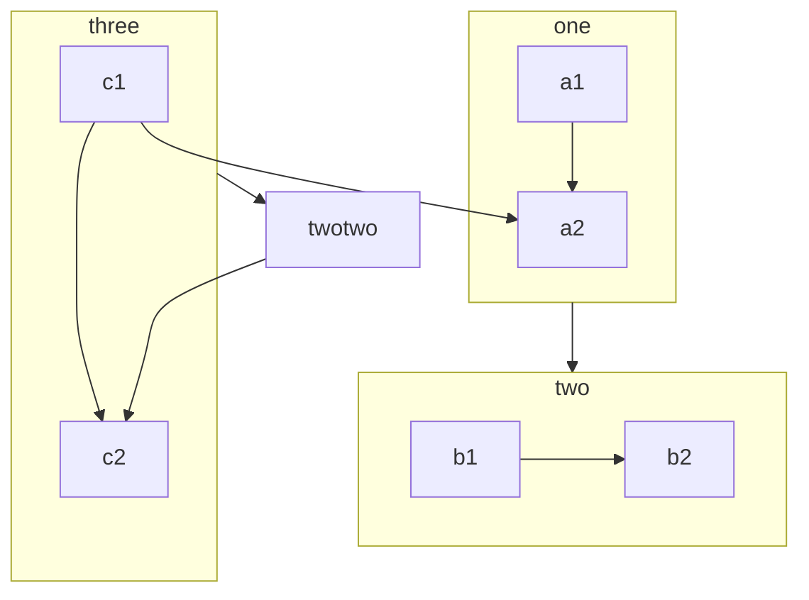

### mermaid 横向（LR）

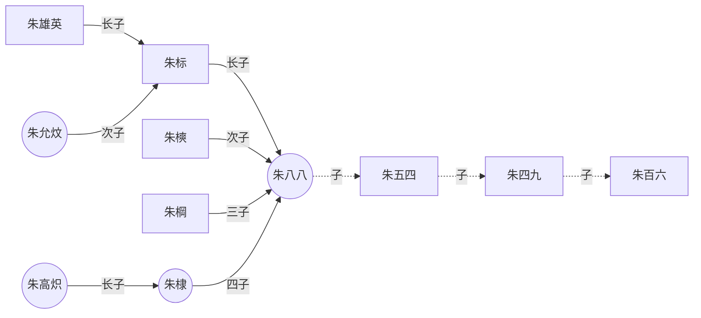

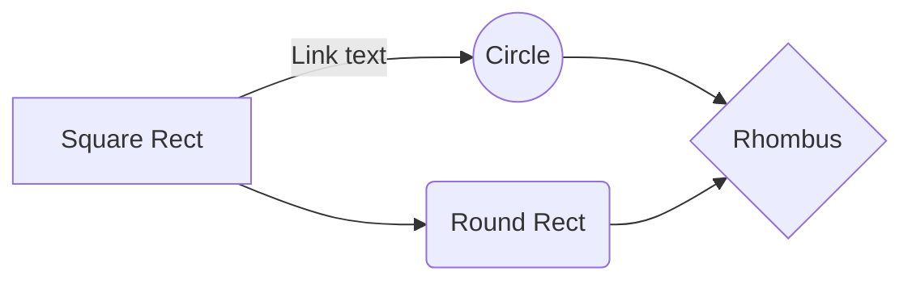

### mermaid timeline

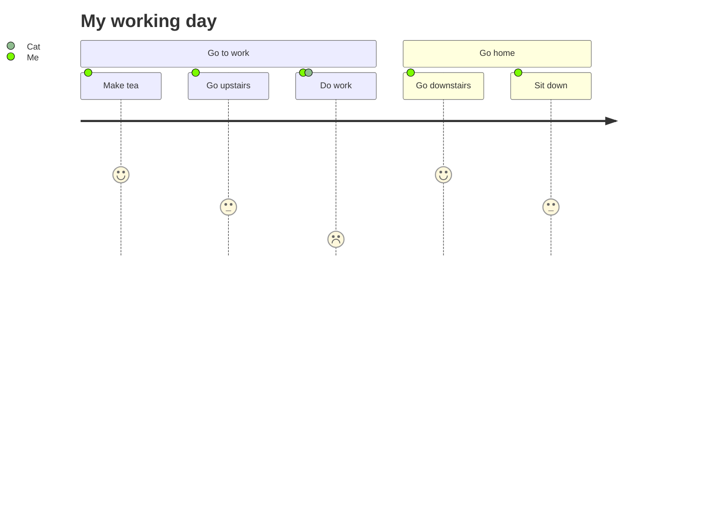

### mermaid 时序图

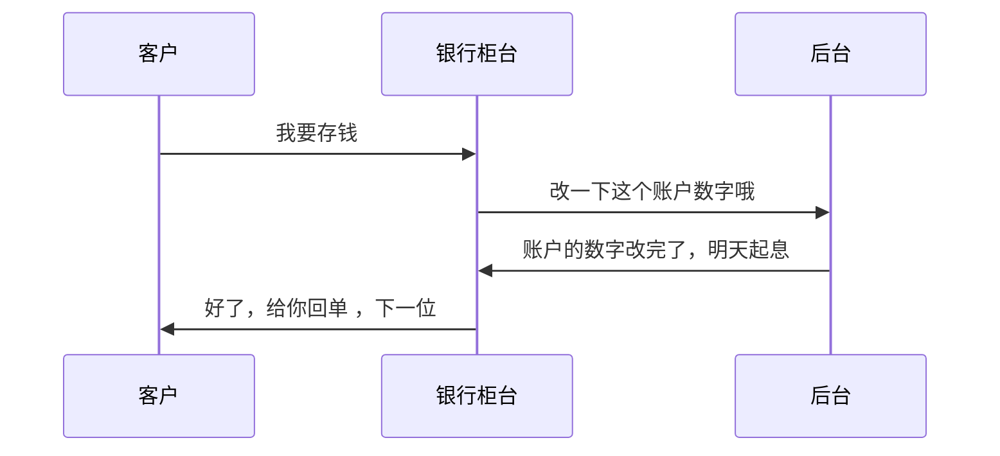

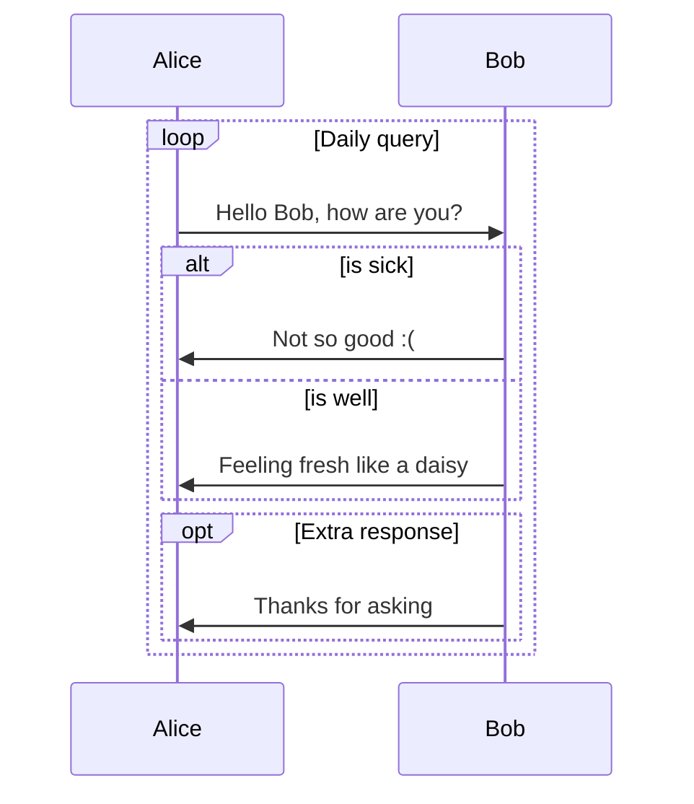

**源码：**

````text
```mermaid
sequenceDiagram
    %% 自动编号
    autonumber
    %% 定义参与者并取别名，aliases：别名
        participant A as Aly
        participant B as Bob
        participant C as CofCai
        %% 便签说明
        Note left of A: 只复习了一部分
        Note right of B: 没复习
        Note over A,B: are contacting

        A->>B: 明天是要考试吗？
        B-->>A: 好像是的！

        %% 显示并行发生的动作，parallel：平行
        %% par [action1]
        rect rgb(0, 25, 155)
            par askA
                C -->> A:你复习好了吗？
            and askB
                C -->> B:你复习好了吗？
            and self
                C ->>C:我还没准备复习......
            end
        end

        %% 背景高亮，提供一个有颜色的背景矩形
        rect rgb(25, 55, 0)
            loop 自问/Every min
            %% <br/>可以换行
            C ->> C:我什么时候<br/>开始复习呢？
            end
        end

        %% 可选择路径
        rect rgb(153, 83, 60)
            alt is good
                A ->> C:复习了一点
            else is common
                B ->> C:我也是
            end
            %% 没有else时可以提供默认的opt
            opt Extra response
                C ->> C:你们怎么不回答我
            end
        endsequenceDiagram
    %% 自动编号
    autonumber
    %% 定义参与者并取别名，aliases：别名
        participant A as Aly
        participant B as Bob
        participant C as CofCai
        %% 便签说明
        Note left of A: 只复习了一部分
        Note right of B: 没复习
        Note over A,B: are contacting

        A->>B: 明天是要考试吗？
        B-->>A: 好像是的！

        %% 显示并行发生的动作，parallel：平行
        %% par [action1]
        rect rgb(0, 25, 155)
            par askA
                C -->> A:你复习好了吗？
            and askB
                C -->> B:你复习好了吗？
            and self
                C ->>C:我还没准备复习......
            end
        end

        %% 背景高亮，提供一个有颜色的背景矩形
        rect rgb(25, 55, 0)
            loop 自问/Every min
            %% <br/>可以换行
            C ->> C:我什么时候<br/>开始复习呢？
            end
        end

        %% 可选择路径
        rect rgb(153, 83, 60)
            alt is good
                A ->> C:复习了一点
            else is common
                B ->> C:我也是
            end
            %% 没有else时可以提供默认的opt
            opt Extra response
                C ->> C:你们怎么不回答我
            end
        end
```
````

**渲染：**

```mermaid
sequenceDiagram
    %% 自动编号
    autonumber
    %% 定义参与者并取别名，aliases：别名
        participant A as Aly
        participant B as Bob
        participant C as CofCai
        %% 便签说明
        Note left of A: 只复习了一部分
        Note right of B: 没复习
        Note over A,B: are contacting

        A->>B: 明天是要考试吗？
        B-->>A: 好像是的！

        %% 显示并行发生的动作，parallel：平行
        %% par [action1]
        rect rgb(0, 25, 155)
            par askA
                C -->> A:你复习好了吗？
            and askB
                C -->> B:你复习好了吗？
            and self
                C ->>C:我还没准备复习......
            end
        end

        %% 背景高亮，提供一个有颜色的背景矩形
        rect rgb(25, 55, 0)
            loop 自问/Every min
            %% <br/>可以换行
            C ->> C:我什么时候<br/>开始复习呢？
            end
        end

        %% 可选择路径
        rect rgb(153, 83, 60)
            alt is good
                A ->> C:复习了一点
            else is common
                B ->> C:我也是
            end
            %% 没有else时可以提供默认的opt
            opt Extra response
                C ->> C:你们怎么不回答我
            end
        end
```

### 流程图


**源码 1：**

````text
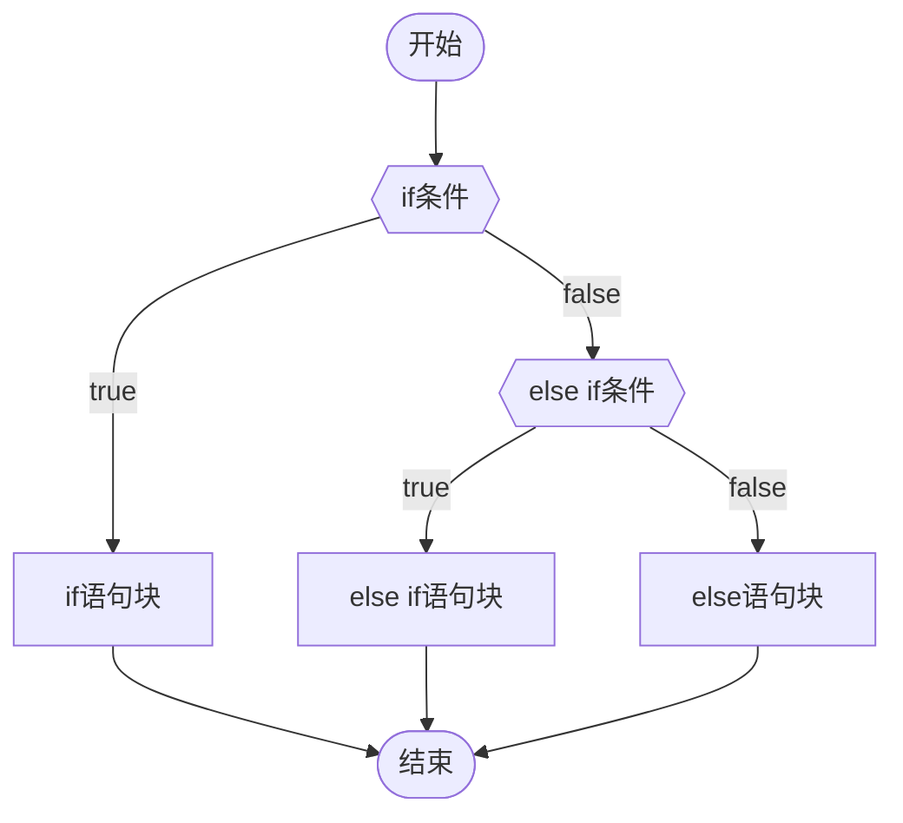
````

**渲染 1：**


**源码 2：**

````text
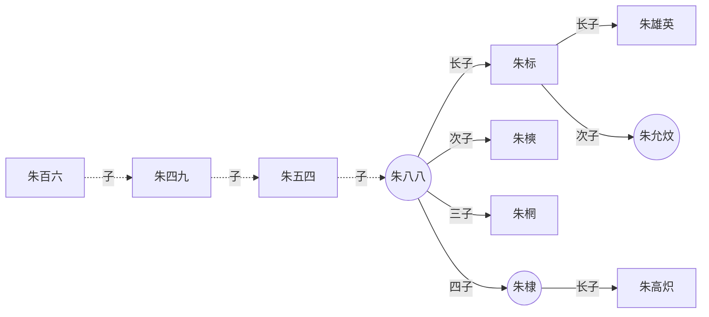
````

**渲染 2：**


### 饼图


**源码：**

````text
```mermaid
pie
    title 为什么总是宅在家里？
    "喜欢宅" : 45
    "天气太热" : 70
    "穷" : 500
    "关你屁事" : 95
```
````

**渲染：**

```mermaid
pie
    title 为什么总是宅在家里？
    "喜欢宅" : 45
    "天气太热" : 70
    "穷" : 500
    "关你屁事" : 95
```

### 甘特图

**源码：**

````text
```mermaid
gantt
    title A Gantt Diagram
    dateFormat  YYYY-MM-DD
    section Section
    A task           :a1, 2014-01-01, 30d
    Another task     :after a1  , 20d
    section Another
    Task in sec      :2014-01-12  , 12d
    another task      : 24d
```
````

**渲染：**

```mermaid
gantt
    title A Gantt Diagram
    dateFormat  YYYY-MM-DD
    section Section
    A task           :a1, 2014-01-01, 30d
    Another task     :after a1  , 20d
    section Another
    Task in sec      :2014-01-12  , 12d
    another task      : 24d
```

### 类图

**源码：**

````text
```mermaid
classDiagram
    Animal <|-- Duck
    Animal <|-- Fish
    Animal <|-- Zebra
    Animal : +int age
    Animal : +String gender
    Animal: +isMammal()
    Animal: +mate()
    class Duck{
      +String beakColor
      +swim()
      +quack()
    }
    class Fish{
      -int sizeInFeet
      -canEat()
    }
    class Zebra{
      +bool is_wild
      +run()
    }
```
````

**渲染：**

```mermaid
classDiagram
    Animal <|-- Duck
    Animal <|-- Fish
    Animal <|-- Zebra
    Animal : +int age
    Animal : +String gender
    Animal: +isMammal()
    Animal: +mate()
    class Duck{
      +String beakColor
      +swim()
      +quack()
    }
    class Fish{
      -int sizeInFeet
      -canEat()
    }
    class Zebra{
      +bool is_wild
      +run()
    }
```