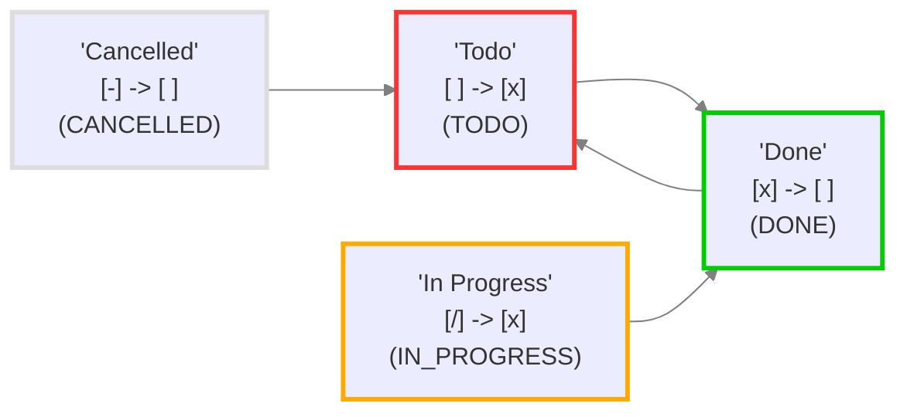

# 基于 QuickAdd+Modal Form 的任务 (Task) 编辑器


> 关于 QuickAdd+ModalForm 版的 Task 编辑器，推荐设置快捷键 `Ctrl + Shift + K`

## Task 简介

> Task 简介: <https://publish.obsidian.md/tasks/Introduction>

### Task 编辑器

Task 自带的任务编辑器，可以用来调整任务状态，可以通过 `Tasks:Create or edit task` 命令或者它的 API 调用 Task 的编辑器，eg: 调用 Task API 即可，采用 QuickAdd Capture 模式：

```js quickadd
// Source: https://publish.obsidian.md/tasks/Advanced/Tasks+Api
return await this.app.plugins.plugins['obsidian-tasks-plugin'].apiV1.createTaskLineModal() + '\n';
```


### 优先级 (Priority)

- ⏬Lowest|🔽Low|Normal|🔼Medium|⏫High|🔺Highest
- 可以将其按照四象限法则结构划分为 4 个等级
	- 🔴重要且紧急⏫|🟠不重要但紧急🔼|🟡重要但不紧急🔽|🟢不重要不紧急⏬

### 任务状态 (Status)

| 状态符号 | 下一个状态符号 | 状态名称 | 状态类型          |
| ---- | ------- | ---- | ------------- |
| `空格` | `x`     | 待办   | `TODO`        |
| `x`  | `空格`    | 已完成  | `DONE`        |
| `/`  | `x`     | 进行中  | `IN_PROGRESS` |
| `-`  | `空格`    | 取消   | `CANCELLED`   |



> [!tip] 可以自行导入其他主题的样式
> 

#### 拓展：【CSS】Minimal 主题复选框 (Checkout) 样式


```css
/* task选择器样式 来自Minimal v7.5.4 by 熊猫别熬夜*/

input[data-task="!"]:checked,
input[data-task="*"]:checked,
input[data-task="-"]:checked,
input[data-task="<"]:checked,
input[data-task=">"]:checked,
input[data-task=I]:checked,
input[data-task=b]:checked,
input[data-task=c]:checked,
input[data-task=d]:checked,
input[data-task=f]:checked,
input[data-task=k]:checked,
input[data-task=l]:checked,
input[data-task=p]:checked,
input[data-task=u]:checked,
input[data-task=w]:checked,
li[data-task="!"]>input:checked,
li[data-task="!"]>p>input:checked,
li[data-task="*"]>input:checked,
li[data-task="*"]>p>input:checked,
li[data-task="-"]>input:checked,
li[data-task="-"]>p>input:checked,
li[data-task="<"]>input:checked,
li[data-task="<"]>p>input:checked,
li[data-task=">"]>input:checked,
li[data-task=">"]>p>input:checked,
li[data-task=I]>input:checked,
li[data-task=I]>p>input:checked,
li[data-task=b]>input:checked,
li[data-task=b]>p>input:checked,
li[data-task=c]>input:checked,
li[data-task=c]>p>input:checked,
li[data-task=d]>input:checked,
li[data-task=d]>p>input:checked,
li[data-task=f]>input:checked,
li[data-task=f]>p>input:checked,
li[data-task=k]>input:checked,
li[data-task=k]>p>input:checked,
li[data-task=l]>input:checked,
li[data-task=l]>p>input:checked,
li[data-task=p]>input:checked,
li[data-task=p]>p>input:checked,
li[data-task=u]>input:checked,
li[data-task=u]>p>input:checked,
li[data-task=w]>input:checked,
li[data-task=w]>p>input:checked {
	--checkbox-marker-color: transparent;
	border: none;
	border-radius: 0;
	background-image: none;
	background-color: currentColor;
	-webkit-mask-size: var(--checkbox-icon);
	-webkit-mask-position: 50% 50%
}

input[data-task=">"]:checked,
li[data-task=">"]>input:checked,
li[data-task=">"]>p>input:checked {
	color: var(--text-faint);
	transform: rotate(90deg);
	-webkit-mask-position: 50% 100%;
	-webkit-mask-image: url("data:image/svg+xml,%3Csvg xmlns='http://www.w3.org/2000/svg' class='h-5 w-5' viewBox='0 0 20 20' fill='currentColor'%3E%3Cpath d='M10.894 2.553a1 1 0 00-1.788 0l-7 14a1 1 0 001.169 1.409l5-1.429A1 1 0 009 15.571V11a1 1 0 112 0v4.571a1 1 0 00.725.962l5 1.428a1 1 0 001.17-1.408l-7-14z' /%3E%3C/svg%3E")
}

input[data-task="<"]:checked,
li[data-task="<"]>input:checked,
li[data-task="<"]>p>input:checked {
	color: var(--text-faint);
	-webkit-mask-image: url("data:image/svg+xml,%3Csvg xmlns='http://www.w3.org/2000/svg' class='h-5 w-5' viewBox='0 0 20 20' fill='currentColor'%3E%3Cpath fill-rule='evenodd' d='M10 18a8 8 0 100-16 8 8 0 000 16zm1-12a1 1 0 10-2 0v4a1 1 0 00.293.707l2.828 2.829a1 1 0 101.415-1.415L11 9.586V6z' clip-rule='evenodd' /%3E%3C/svg%3E");
	-webkit-mask-image: url("data:image/svg+xml,%3Csvg xmlns='http://www.w3.org/2000/svg' class='h-5 w-5' viewBox='0 0 20 20' fill='currentColor'%3E%3Cpath fill-rule='evenodd' d='M6 2a1 1 0 00-1 1v1H4a2 2 0 00-2 2v10a2 2 0 002 2h12a2 2 0 002-2V6a2 2 0 00-2-2h-1V3a1 1 0 10-2 0v1H7V3a1 1 0 00-1-1zm0 5a1 1 0 000 2h8a1 1 0 100-2H6z' clip-rule='evenodd' /%3E%3C/svg%3E")
}

input[data-task="?"]:checked,
li[data-task="?"]>input:checked,
li[data-task="?"]>p>input:checked {
	--checkbox-marker-color: transparent;
	background-color: var(--color-yellow);
	border-color: var(--color-yellow);
	background-position: 50% 50%;
	background-size: 200% 90%;
	background-image: url('data:image/svg+xml,%3Csvg xmlns="http%3A%2F%2Fwww.w3.org%2F2000%2Fsvg" width="20" height="20" preserveAspectRatio="xMidYMid meet" viewBox="0 0 16 16"%3E%3Cpath fill="white" fill-rule="evenodd" d="M4.475 5.458c-.284 0-.514-.237-.47-.517C4.28 3.24 5.576 2 7.825 2c2.25 0 3.767 1.36 3.767 3.215c0 1.344-.665 2.288-1.79 2.973c-1.1.659-1.414 1.118-1.414 2.01v.03a.5.5 0 0 1-.5.5h-.77a.5.5 0 0 1-.5-.495l-.003-.2c-.043-1.221.477-2.001 1.645-2.712c1.03-.632 1.397-1.135 1.397-2.028c0-.979-.758-1.698-1.926-1.698c-1.009 0-1.71.529-1.938 1.402c-.066.254-.278.461-.54.461h-.777ZM7.496 14c.622 0 1.095-.474 1.095-1.09c0-.618-.473-1.092-1.095-1.092c-.606 0-1.087.474-1.087 1.091S6.89 14 7.496 14Z"%2F%3E%3C%2Fsvg%3E')
}

.theme-dark input[data-task="?"]:checked,
.theme-dark li[data-task="?"]>input:checked,
.theme-dark li[data-task="?"]>p>input:checked {
	background-image: url('data:image/svg+xml,%3Csvg xmlns="http%3A%2F%2Fwww.w3.org%2F2000%2Fsvg" width="20" height="20" preserveAspectRatio="xMidYMid meet" viewBox="0 0 16 16"%3E%3Cpath fill="black" fill-opacity="0.8" fill-rule="evenodd" d="M4.475 5.458c-.284 0-.514-.237-.47-.517C4.28 3.24 5.576 2 7.825 2c2.25 0 3.767 1.36 3.767 3.215c0 1.344-.665 2.288-1.79 2.973c-1.1.659-1.414 1.118-1.414 2.01v.03a.5.5 0 0 1-.5.5h-.77a.5.5 0 0 1-.5-.495l-.003-.2c-.043-1.221.477-2.001 1.645-2.712c1.03-.632 1.397-1.135 1.397-2.028c0-.979-.758-1.698-1.926-1.698c-1.009 0-1.71.529-1.938 1.402c-.066.254-.278.461-.54.461h-.777ZM7.496 14c.622 0 1.095-.474 1.095-1.09c0-.618-.473-1.092-1.095-1.092c-.606 0-1.087.474-1.087 1.091S6.89 14 7.496 14Z"%2F%3E%3C%2Fsvg%3E')
}

input[data-task="/"]:checked,
li[data-task="/"]>input:checked,
li[data-task="/"]>p>input:checked {
	background-image: none;
	background-color: rgba(0, 0, 0, 0);
	position: relative;
	overflow: hidden
}

input[data-task="/"]:checked:after,
li[data-task="/"]>input:checked:after,
li[data-task="/"]>p>input:checked:after {
	top: 0;
	left: 0;
	content: " ";
	display: block;
	position: absolute;
	background-color: var(--background-modifier-accent);
	width: calc(50% - .5px);
	height: 100%;
	-webkit-mask-image: none
}

input[data-task="!"]:checked,
li[data-task="!"]>input:checked,
li[data-task="!"]>p>input:checked {
	color: var(--color-orange);
	-webkit-mask-image: url("data:image/svg+xml,%3Csvg xmlns='http://www.w3.org/2000/svg' class='h-5 w-5' viewBox='0 0 20 20' fill='currentColor'%3E%3Cpath fill-rule='evenodd' d='M8.257 3.099c.765-1.36 2.722-1.36 3.486 0l5.58 9.92c.75 1.334-.213 2.98-1.742 2.98H4.42c-1.53 0-2.493-1.646-1.743-2.98l5.58-9.92zM11 13a1 1 0 11-2 0 1 1 0 012 0zm-1-8a1 1 0 00-1 1v3a1 1 0 002 0V6a1 1 0 00-1-1z' clip-rule='evenodd' /%3E%3C/svg%3E")
}

input[data-task='"']:checked,
input[data-task=“]:checked,
li[data-task='"']>input:checked,
li[data-task='"']>p>input:checked,
li[data-task=“]>input:checked,
li[data-task=“]>p>input:checked {
	--checkbox-marker-color: transparent;
	background-position: 50% 50%;
	background-color: var(--color-cyan);
	border-color: var(--color-cyan);
	background-size: 75%;
	background-repeat: no-repeat;
	background-image: url('data:image/svg+xml,%3Csvg xmlns="http%3A%2F%2Fwww.w3.org%2F2000%2Fsvg" width="20" height="20" preserveAspectRatio="xMidYMid meet" viewBox="0 0 24 24"%3E%3Cpath fill="white" d="M6.5 10c-.223 0-.437.034-.65.065c.069-.232.14-.468.254-.68c.114-.308.292-.575.469-.844c.148-.291.409-.488.601-.737c.201-.242.475-.403.692-.604c.213-.21.492-.315.714-.463c.232-.133.434-.28.65-.35l.539-.222l.474-.197l-.485-1.938l-.597.144c-.191.048-.424.104-.689.171c-.271.05-.56.187-.882.312c-.318.142-.686.238-1.028.466c-.344.218-.741.4-1.091.692c-.339.301-.748.562-1.05.945c-.33.358-.656.734-.909 1.162c-.293.408-.492.856-.702 1.299c-.19.443-.343.896-.468 1.336c-.237.882-.343 1.72-.384 2.437c-.034.718-.014 1.315.028 1.747c.015.204.043.402.063.539l.025.168l.026-.006A4.5 4.5 0 1 0 6.5 10zm11 0c-.223 0-.437.034-.65.065c.069-.232.14-.468.254-.68c.114-.308.292-.575.469-.844c.148-.291.409-.488.601-.737c.201-.242.475-.403.692-.604c.213-.21.492-.315.714-.463c.232-.133.434-.28.65-.35l.539-.222l.474-.197l-.485-1.938l-.597.144c-.191.048-.424.104-.689.171c-.271.05-.56.187-.882.312c-.317.143-.686.238-1.028.467c-.344.218-.741.4-1.091.692c-.339.301-.748.562-1.05.944c-.33.358-.656.734-.909 1.162c-.293.408-.492.856-.702 1.299c-.19.443-.343.896-.468 1.336c-.237.882-.343 1.72-.384 2.437c-.034.718-.014 1.315.028 1.747c.015.204.043.402.063.539l.025.168l.026-.006A4.5 4.5 0 1 0 17.5 10z"%2F%3E%3C%2Fsvg%3E')
}

.theme-dark input[data-task='"']:checked,
.theme-dark input[data-task=“]:checked,
.theme-dark li[data-task='"']>input:checked,
.theme-dark li[data-task='"']>p>input:checked,
.theme-dark li[data-task=“]>input:checked,
.theme-dark li[data-task=“]>p>input:checked {
	background-image: url('data:image/svg+xml,%3Csvg xmlns="http%3A%2F%2Fwww.w3.org%2F2000%2Fsvg" width="20" height="20" preserveAspectRatio="xMidYMid meet" viewBox="0 0 24 24"%3E%3Cpath fill="black" fill-opacity="0.7" d="M6.5 10c-.223 0-.437.034-.65.065c.069-.232.14-.468.254-.68c.114-.308.292-.575.469-.844c.148-.291.409-.488.601-.737c.201-.242.475-.403.692-.604c.213-.21.492-.315.714-.463c.232-.133.434-.28.65-.35l.539-.222l.474-.197l-.485-1.938l-.597.144c-.191.048-.424.104-.689.171c-.271.05-.56.187-.882.312c-.318.142-.686.238-1.028.466c-.344.218-.741.4-1.091.692c-.339.301-.748.562-1.05.945c-.33.358-.656.734-.909 1.162c-.293.408-.492.856-.702 1.299c-.19.443-.343.896-.468 1.336c-.237.882-.343 1.72-.384 2.437c-.034.718-.014 1.315.028 1.747c.015.204.043.402.063.539l.025.168l.026-.006A4.5 4.5 0 1 0 6.5 10zm11 0c-.223 0-.437.034-.65.065c.069-.232.14-.468.254-.68c.114-.308.292-.575.469-.844c.148-.291.409-.488.601-.737c.201-.242.475-.403.692-.604c.213-.21.492-.315.714-.463c.232-.133.434-.28.65-.35l.539-.222l.474-.197l-.485-1.938l-.597.144c-.191.048-.424.104-.689.171c-.271.05-.56.187-.882.312c-.317.143-.686.238-1.028.467c-.344.218-.741.4-1.091.692c-.339.301-.748.562-1.05.944c-.33.358-.656.734-.909 1.162c-.293.408-.492.856-.702 1.299c-.19.443-.343.896-.468 1.336c-.237.882-.343 1.72-.384 2.437c-.034.718-.014 1.315.028 1.747c.015.204.043.402.063.539l.025.168l.026-.006A4.5 4.5 0 1 0 17.5 10z"%2F%3E%3C%2Fsvg%3E')
}

input[data-task="-"]:checked,
li[data-task="-"]>input:checked,
li[data-task="-"]>p>input:checked {
	color: var(--text-faint);
	-webkit-mask-image: url("data:image/svg+xml,%3Csvg xmlns='http://www.w3.org/2000/svg' class='h-5 w-5' viewBox='0 0 20 20' fill='currentColor'%3E%3Cpath fill-rule='evenodd' d='M3 10a1 1 0 011-1h12a1 1 0 110 2H4a1 1 0 01-1-1z' clip-rule='evenodd' /%3E%3C/svg%3E")
}

body:not(.tasks) .markdown-preview-view ul li[data-task="-"].task-list-item.is-checked,
body:not(.tasks) .markdown-source-view.mod-cm6 .HyperMD-task-line[data-task]:is([data-task="-"]),
body:not(.tasks) li[data-task="-"].task-list-item.is-checked {
	color: var(--text-faint);
	text-decoration: line-through solid var(--text-faint) 1px
}

input[data-task="*"]:checked,
li[data-task="*"]>input:checked,
li[data-task="*"]>p>input:checked {
	color: var(--color-yellow);
	-webkit-mask-image: url("data:image/svg+xml,%3Csvg xmlns='http://www.w3.org/2000/svg' class='h-5 w-5' viewBox='0 0 20 20' fill='currentColor'%3E%3Cpath d='M9.049 2.927c.3-.921 1.603-.921 1.902 0l1.07 3.292a1 1 0 00.95.69h3.462c.969 0 1.371 1.24.588 1.81l-2.8 2.034a1 1 0 00-.364 1.118l1.07 3.292c.3.921-.755 1.688-1.54 1.118l-2.8-2.034a1 1 0 00-1.175 0l-2.8 2.034c-.784.57-1.838-.197-1.539-1.118l1.07-3.292a1 1 0 00-.364-1.118L2.98 8.72c-.783-.57-.38-1.81.588-1.81h3.461a1 1 0 00.951-.69l1.07-3.292z' /%3E%3C/svg%3E")
}

input[data-task=l]:checked,
li[data-task=l]>input:checked,
li[data-task=l]>p>input:checked {
	color: var(--color-red);
	-webkit-mask-image: url("data:image/svg+xml,%3Csvg xmlns='http://www.w3.org/2000/svg' class='h-5 w-5' viewBox='0 0 20 20' fill='currentColor'%3E%3Cpath fill-rule='evenodd' d='M5.05 4.05a7 7 0 119.9 9.9L10 18.9l-4.95-4.95a7 7 0 010-9.9zM10 11a2 2 0 100-4 2 2 0 000 4z' clip-rule='evenodd' /%3E%3C/svg%3E")
}

input[data-task=i]:checked,
li[data-task=i]>input:checked,
li[data-task=i]>p>input:checked {
	--checkbox-marker-color: transparent;
	background-color: var(--color-blue);
	border-color: var(--color-blue);
	background-position: 50%;
	background-size: 100%;
	background-image: url('data:image/svg+xml,%3Csvg xmlns="http%3A%2F%2Fwww.w3.org%2F2000%2Fsvg" width="20" height="20" preserveAspectRatio="xMidYMid meet" viewBox="0 0 512 512"%3E%3Cpath fill="none" stroke="white" stroke-linecap="round" stroke-linejoin="round" stroke-width="40" d="M196 220h64v172"%2F%3E%3Cpath fill="none" stroke="white" stroke-linecap="round" stroke-miterlimit="10" stroke-width="40" d="M187 396h138"%2F%3E%3Cpath fill="white" d="M256 160a32 32 0 1 1 32-32a32 32 0 0 1-32 32Z"%2F%3E%3C%2Fsvg%3E')
}

.theme-dark input[data-task=i]:checked,
.theme-dark li[data-task=i]>input:checked,
.theme-dark li[data-task=i]>p>input:checked {
	background-image: url('data:image/svg+xml,%3Csvg xmlns="http%3A%2F%2Fwww.w3.org%2F2000%2Fsvg" width="20" height="20" preserveAspectRatio="xMidYMid meet" viewBox="0 0 512 512"%3E%3Cpath fill="none" stroke="black" stroke-opacity="0.8" stroke-linecap="round" stroke-linejoin="round" stroke-width="40" d="M196 220h64v172"%2F%3E%3Cpath fill="none" stroke="black" stroke-opacity="0.8" stroke-linecap="round" stroke-miterlimit="10" stroke-width="40" d="M187 396h138"%2F%3E%3Cpath fill="black" fill-opacity="0.8" d="M256 160a32 32 0 1 1 32-32a32 32 0 0 1-32 32Z"%2F%3E%3C%2Fsvg%3E')
}

input[data-task=S]:checked,
li[data-task=S]>input:checked,
li[data-task=S]>p>input:checked {
	--checkbox-marker-color: transparent;
	border-color: var(--color-green);
	background-color: var(--color-green);
	background-size: 100%;
	background-image: url('data:image/svg+xml,%3Csvg xmlns="http%3A%2F%2Fwww.w3.org%2F2000%2Fsvg" width="20" height="20" preserveAspectRatio="xMidYMid meet" viewBox="0 0 48 48"%3E%3Cpath fill="white" fill-rule="evenodd" d="M26 8a2 2 0 1 0-4 0v2a8 8 0 1 0 0 16v8a4.002 4.002 0 0 1-3.773-2.666a2 2 0 0 0-3.771 1.332A8.003 8.003 0 0 0 22 38v2a2 2 0 1 0 4 0v-2a8 8 0 1 0 0-16v-8a4.002 4.002 0 0 1 3.773 2.666a2 2 0 0 0 3.771-1.332A8.003 8.003 0 0 0 26 10V8Zm-4 6a4 4 0 0 0 0 8v-8Zm4 12v8a4 4 0 0 0 0-8Z" clip-rule="evenodd"%2F%3E%3C%2Fsvg%3E')
}

.theme-dark input[data-task=S]:checked,
.theme-dark li[data-task=S]>input:checked,
.theme-dark li[data-task=S]>p>input:checked {
	background-image: url('data:image/svg+xml,%3Csvg xmlns="http%3A%2F%2Fwww.w3.org%2F2000%2Fsvg" width="20" height="20" preserveAspectRatio="xMidYMid meet" viewBox="0 0 48 48"%3E%3Cpath fill-opacity="0.8" fill="black" fill-rule="evenodd" d="M26 8a2 2 0 1 0-4 0v2a8 8 0 1 0 0 16v8a4.002 4.002 0 0 1-3.773-2.666a2 2 0 0 0-3.771 1.332A8.003 8.003 0 0 0 22 38v2a2 2 0 1 0 4 0v-2a8 8 0 1 0 0-16v-8a4.002 4.002 0 0 1 3.773 2.666a2 2 0 0 0 3.771-1.332A8.003 8.003 0 0 0 26 10V8Zm-4 6a4 4 0 0 0 0 8v-8Zm4 12v8a4 4 0 0 0 0-8Z" clip-rule="evenodd"%2F%3E%3C%2Fsvg%3E')
}

input[data-task=I]:checked,
li[data-task=I]>input:checked,
li[data-task=I]>p>input:checked {
	color: var(--color-yellow);
	-webkit-mask-image: url("data:image/svg+xml,%3Csvg xmlns='http://www.w3.org/2000/svg' class='h-5 w-5' viewBox='0 0 20 20' fill='currentColor'%3E%3Cpath d='M11 3a1 1 0 10-2 0v1a1 1 0 102 0V3zM15.657 5.757a1 1 0 00-1.414-1.414l-.707.707a1 1 0 001.414 1.414l.707-.707zM18 10a1 1 0 01-1 1h-1a1 1 0 110-2h1a1 1 0 011 1zM5.05 6.464A1 1 0 106.464 5.05l-.707-.707a1 1 0 00-1.414 1.414l.707.707zM5 10a1 1 0 01-1 1H3a1 1 0 110-2h1a1 1 0 011 1zM8 16v-1h4v1a2 2 0 11-4 0zM12 14c.015-.34.208-.646.477-.859a4 4 0 10-4.954 0c.27.213.462.519.476.859h4.002z' /%3E%3C/svg%3E")
}

input[data-task=f]:checked,
li[data-task=f]>input:checked,
li[data-task=f]>p>input:checked {
	color: var(--color-red);
	-webkit-mask-image: url("data:image/svg+xml,%3Csvg xmlns='http://www.w3.org/2000/svg' class='h-5 w-5' viewBox='0 0 20 20' fill='currentColor'%3E%3Cpath fill-rule='evenodd' d='M12.395 2.553a1 1 0 00-1.45-.385c-.345.23-.614.558-.822.88-.214.33-.403.713-.57 1.116-.334.804-.614 1.768-.84 2.734a31.365 31.365 0 00-.613 3.58 2.64 2.64 0 01-.945-1.067c-.328-.68-.398-1.534-.398-2.654A1 1 0 005.05 6.05 6.981 6.981 0 003 11a7 7 0 1011.95-4.95c-.592-.591-.98-.985-1.348-1.467-.363-.476-.724-1.063-1.207-2.03zM12.12 15.12A3 3 0 017 13s.879.5 2.5.5c0-1 .5-4 1.25-4.5.5 1 .786 1.293 1.371 1.879A2.99 2.99 0 0113 13a2.99 2.99 0 01-.879 2.121z' clip-rule='evenodd' /%3E%3C/svg%3E")
}

input[data-task=k]:checked,
li[data-task=k]>input:checked,
li[data-task=k]>p>input:checked {
	color: var(--color-yellow);
	-webkit-mask-image: url("data:image/svg+xml,%3Csvg xmlns='http://www.w3.org/2000/svg' class='h-5 w-5' viewBox='0 0 20 20' fill='currentColor'%3E%3Cpath fill-rule='evenodd' d='M18 8a6 6 0 01-7.743 5.743L10 14l-1 1-1 1H6v2H2v-4l4.257-4.257A6 6 0 1118 8zm-6-4a1 1 0 100 2 2 2 0 012 2 1 1 0 102 0 4 4 0 00-4-4z' clip-rule='evenodd' /%3E%3C/svg%3E")
}

input[data-task=u]:checked,
li[data-task=u]>input:checked,
li[data-task=u]>p>input:checked {
	color: var(--color-green);
	-webkit-mask-image: url("data:image/svg+xml,%3Csvg xmlns='http://www.w3.org/2000/svg' class='h-5 w-5' viewBox='0 0 20 20' fill='currentColor'%3E%3Cpath fill-rule='evenodd' d='M12 7a1 1 0 110-2h5a1 1 0 011 1v5a1 1 0 11-2 0V8.414l-4.293 4.293a1 1 0 01-1.414 0L8 10.414l-4.293 4.293a1 1 0 01-1.414-1.414l5-5a1 1 0 011.414 0L11 10.586 14.586 7H12z' clip-rule='evenodd' /%3E%3C/svg%3E")
}

input[data-task=d]:checked,
li[data-task=d]>input:checked,
li[data-task=d]>p>input:checked {
	color: var(--color-red);
	-webkit-mask-image: url("data:image/svg+xml,%3Csvg xmlns='http://www.w3.org/2000/svg' class='h-5 w-5' viewBox='0 0 20 20' fill='currentColor'%3E%3Cpath fill-rule='evenodd' d='M12 13a1 1 0 100 2h5a1 1 0 001-1V9a1 1 0 10-2 0v2.586l-4.293-4.293a1 1 0 00-1.414 0L8 9.586 3.707 5.293a1 1 0 00-1.414 1.414l5 5a1 1 0 001.414 0L11 9.414 14.586 13H12z' clip-rule='evenodd' /%3E%3C/svg%3E")
}

input[data-task=w]:checked,
li[data-task=w]>input:checked,
li[data-task=w]>p>input:checked {
	color: var(--color-purple);
	-webkit-mask-image: url("data:image/svg+xml,%3Csvg xmlns='http://www.w3.org/2000/svg' class='h-5 w-5' viewBox='0 0 20 20' fill='currentColor'%3E%3Cpath fill-rule='evenodd' d='M6 3a1 1 0 011-1h.01a1 1 0 010 2H7a1 1 0 01-1-1zm2 3a1 1 0 00-2 0v1a2 2 0 00-2 2v1a2 2 0 00-2 2v.683a3.7 3.7 0 011.055.485 1.704 1.704 0 001.89 0 3.704 3.704 0 014.11 0 1.704 1.704 0 001.89 0 3.704 3.704 0 014.11 0 1.704 1.704 0 001.89 0A3.7 3.7 0 0118 12.683V12a2 2 0 00-2-2V9a2 2 0 00-2-2V6a1 1 0 10-2 0v1h-1V6a1 1 0 10-2 0v1H8V6zm10 8.868a3.704 3.704 0 01-4.055-.036 1.704 1.704 0 00-1.89 0 3.704 3.704 0 01-4.11 0 1.704 1.704 0 00-1.89 0A3.704 3.704 0 012 14.868V17a1 1 0 001 1h14a1 1 0 001-1v-2.132zM9 3a1 1 0 011-1h.01a1 1 0 110 2H10a1 1 0 01-1-1zm3 0a1 1 0 011-1h.01a1 1 0 110 2H13a1 1 0 01-1-1z' clip-rule='evenodd' /%3E%3C/svg%3E")
}

input[data-task=p]:checked,
li[data-task=p]>input:checked,
li[data-task=p]>p>input:checked {
	color: var(--color-green);
	-webkit-mask-image: url("data:image/svg+xml,%3Csvg xmlns='http://www.w3.org/2000/svg' class='h-5 w-5' viewBox='0 0 20 20' fill='currentColor'%3E%3Cpath d='M2 10.5a1.5 1.5 0 113 0v6a1.5 1.5 0 01-3 0v-6zM6 10.333v5.43a2 2 0 001.106 1.79l.05.025A4 4 0 008.943 18h5.416a2 2 0 001.962-1.608l1.2-6A2 2 0 0015.56 8H12V4a2 2 0 00-2-2 1 1 0 00-1 1v.667a4 4 0 01-.8 2.4L6.8 7.933a4 4 0 00-.8 2.4z' /%3E%3C/svg%3E")
}

input[data-task=c]:checked,
li[data-task=c]>input:checked,
li[data-task=c]>p>input:checked {
	color: var(--color-orange);
	-webkit-mask-image: url("data:image/svg+xml,%3Csvg xmlns='http://www.w3.org/2000/svg' class='h-5 w-5' viewBox='0 0 20 20' fill='currentColor'%3E%3Cpath d='M18 9.5a1.5 1.5 0 11-3 0v-6a1.5 1.5 0 013 0v6zM14 9.667v-5.43a2 2 0 00-1.105-1.79l-.05-.025A4 4 0 0011.055 2H5.64a2 2 0 00-1.962 1.608l-1.2 6A2 2 0 004.44 12H8v4a2 2 0 002 2 1 1 0 001-1v-.667a4 4 0 01.8-2.4l1.4-1.866a4 4 0 00.8-2.4z' /%3E%3C/svg%3E")
}

input[data-task=b]:checked,
li[data-task=b]>input:checked,
li[data-task=b]>p>input:checked {
	color: var(--color-orange);
	-webkit-mask-image: url("data:image/svg+xml,%3Csvg xmlns='http://www.w3.org/2000/svg' class='h-5 w-5' viewBox='0 0 20 20' fill='currentColor'%3E%3Cpath d='M5 4a2 2 0 012-2h6a2 2 0 012 2v14l-5-2.5L5 18V4z' /%3E%3C/svg%3E")
}

```

## 基于 Modal Form 的 Task 编辑器


> 关于 QuickAdd+ModalForm 版的 Task 编辑器，推荐设置快捷键 `Ctrl + Shift + K`

### 可设置的参数


### Quickadd 脚本

```js
module.exports = {
  entry: async (QuickAdd, settings, params) => {
    let modalForm;
    try {
      modalForm = app.plugins.plugins.modalforms.api;
    } catch {
      new Notice("🔴本脚本需要Modal Form插件，请先安装或启动Modal Form插件！");
      return;
    }
    let type = true;
    let taskContent = ""; let tags = "";
    let startStr = "";
    let reminderDate = ""; let reminderTime = "";
    let createdDate = ""; let createdTime = ""; let createdTime2 = "";
    // 记录时间差
    let hours = 0; let minutes = 0;

    let due = "";
    let priority = "";
    let recurs = "";
    let status = "";
    // !获取当前编辑器
    let editor;
    try {
      editor = app.workspace.activeEditor.editor;
      // 选择所在的一行
      const line = editor.getLine(editor.getCursor().line);
      let selection = line ? line.replace(/<br>/gm, "\n") : "- [ ] ";
      console.log(selection);
      // 切换列表为复选框
      if (selection.match(/(^[\t\s>-]*-\s)(?!\[)/)) {
        selection = selection.replace(/(^[\t\s]*-\s)(?!\[)/, "$1[ ] ");
        type = false;
      }
      // !提取任务信息
      let regex = /(^[\t\s->]+-?)\s\[(.)\]\s(\d{2}:\d{2})?(\s-\s(\d{2}:\d{2})?)?([^🔽🔼⏬⏫🔁➕📅⏰⏳🛫✅]*)/;
      let matches = selection.match(regex);
      if (matches) {
        startStr = matches[1] ? matches[1] : "";
        status = matches[2] ? matches[2] : "";
        taskContent = matches[6] ? matches[6] : "";
        tags = taskContent.match(/\s(#\S+)/gm);
        console.log(`标签: ${tags}`);
        // 移除任务内容中的标签
        taskContent = taskContent.replace(/\s#[^\s]+/gm, "").trim();
      }

      // !提取优先级
      let priorityRegex = /(🔽|🔼|⏬|⏫|🔺)/;
      let priorityMatches = selection.match(priorityRegex);
      priority = priorityMatches ? priorityMatches[1] : "";

      // !提取重复周期🔁
      let recursRegex = /(🔁\severy)\s(\d+)?\s?(day|week)(\son\s\w+)?/;
      let recursMatches = selection.match(recursRegex);
      recurs = recursMatches ? (recursMatches[1] + " " + (recursMatches[3] + (recursMatches[4] !== undefined ? recursMatches[4] : ""))) : "";
      console.log(recurs);


      // !提取任务创建日期和时间➕
      let createRegex = /🛫\s(\d{4}-\d{2}-\d{2})\s(\d{2}:\d{2})?/;
      let createMatches = selection.match(createRegex);

      if (createMatches) {
        createdDate = createMatches[1] ? createMatches[1] : "";
        // createdTime = createMatches[2] ? createMatches[2] : "";
      }
      if (settings["AutoCreatedDate"]) {
        createdDate = createdDate ? createdDate : window.moment().format("YYYY-MM-DD");
      }

      // !2024-04-30_10:58 具体创建时间放到列表前面，适配其他时间线插件(Day Planer (OG)(✨) 和 Day Planer)
      // Day Planer (OG)可能更容易上手点，Day Planner 稍微复杂，流程比较多，可能需要多测试
      let createdTimeRegex = /\]\s(\d{2}:\d{2})?(\s-\s(\d{2}:\d{2}))?/;

      let createdTimeMatches = selection.match(createdTimeRegex);
      if (createdTimeMatches) {
        createdTime = createdTimeMatches[1] ? createdTimeMatches[1] : "";
        createdTime2 = createdTimeMatches[3] ? createdTimeMatches[3] : "";
        console.log([createdTime, createdTime2]);

        // 使用window.moment()计算createdTime2 - createdTime的时间差
        const timeFormat = 'HH:mm';

        const startTime = window.moment(createdTime, timeFormat);
        const endTime = window.moment(createdTime2, timeFormat);

        const duration = window.moment.duration(endTime.diff(startTime));
        hours = Math.floor(duration.asHours());
        minutes = Math.round(duration.asMinutes() % 60);

        const timeDiff = `${hours}小时${minutes}分钟`;
        console.log(timeDiff);
      }
      if (settings["AutoTime"]) {
        createdTime = createdTime ? createdTime : window.moment().format("HH:mm");
      }

      // !提取提醒日期和时间⏰
      let startRegex = /⏰\s(\d{4}-\d{2}-\d{2})\s(\d{2}:\d{2})?/;
      let startMatches = selection.match(startRegex);
      if (startMatches) {
        reminderDate = startMatches[1] ? startMatches[1] : "";
        reminderTime = startMatches[2] ? startMatches[2] : "";
      }
      reminderTime = reminderTime ? reminderTime : window.moment().format("HH:mm");

      // !提取deadline📅
      let dueRegex = /📅\s(\d{4}-\d{2}-\d{2})/;
      let dueMatches = selection.match(dueRegex);
      due = dueMatches ? dueMatches[1] : "";

      // !提取完成时间✅❌
      let doneDateRegex = /[✅❌]\s(\d{4}-\d{2}-\d{2})/;
      let doneDateMatches = selection.match(doneDateRegex);
      doneDate = doneDateMatches ? doneDateMatches[1] : "";

    } catch (e) {
      new Notice(`🔴无法获取选中的文本，请选重试！\nBug: \n${e}`);
      return;
    }

    // ! Bug：下拉选项无法设置默认值
    // !Fix: This helper returns a new list with the defValue item always being the first item.
    // !ref: https://github.com/danielo515/obsidian-modal-form/issues/227
    const moveDefaultToTop = (defValue, list) => {
      const orderedList = [...list];
      const index = orderedList.findIndex(item => item.value === defValue);
      if (index > 0) {
        const [item] = orderedList.splice(index, 1);
        orderedList.unshift(item);
      }
      return orderedList;
    };

    const recursOptions = [
      {
        "value": "",
        "label": "none"
      },
      {
        "value": "🔁 every day",
        "label": "每天"
      },
      {
        "value": "🔁 every week on Monday",
        "label": "星期一"
      },
      {
        "value": "🔁 every week on Tuesday",
        "label": "星期二"
      },
      {
        "value": "🔁 every week on Wednesday",
        "label": "星期三"
      },
      {
        "value": "🔁 every week on Thursday",
        "label": "星期四"
      },
      {
        "value": "🔁 every week on Friday",
        "label": "星期五"
      },
      {
        "value": "🔁 every week on Saturday",
        "label": "星期六"
      },
      {
        "value": "🔁 every week on Sunday",
        "label": "星期天"
      },
    ];

    const priorityOptions = [
      {
        "value": "",
        "label": "none"
      },
      {
        "value": "⏫",
        "label": "🔴重要且紧急⏫"
      },
      {
        "value": "🔼",
        "label": "🟠不重要但紧急🔼"
      },
      {
        "value": "🔽",
        "label": "🟡重要但不紧急🔽"
      },
      {
        "value": "⏬",
        "label": "🟢不重要且不紧急⏬"
      },
      {
        "value": "🔺",
        "label": "❗非常紧急且重要🔺"
      },
    ];

    let statusOptions = [
      {
        "value": " ",
        "label": "🔳ToDo"
      },
      {
        "value": "!",
        "label": "⚠Important"
      },
      {
        "value": "?",
        "label": "❓Question"
      },
      {
        "value": "/",
        "label": "⏳Doing"
      },
      {
        "value": "x",
        "label": "✅Done"
      },
      {
        "value": "-",
        "label": "❌Cancel"
      },
    ];
    const index = statusOptions.findIndex(item => item.value === status);
    if (index < 0) {
      statusOptions.push({
        "value": status,
        "label": `Unknown(${status})`
      });
    }

    // Modal Form Task表单
    const editorForm1 = {
      "title": "Creat or Edit Task",
      "name": "creat-or-edit-task",
      "fields": [
        {
          "name": "taskContent",
          "label": "Task Content",
          "description": "",
          "isRequired": true,
          "input": {
            "type": "textarea"
          }
        },
        // 设定s开始日期加时间
        {
          "name": "reminderDate",
          "label": "⏰",
          "description": "",
          "input": {
            "type": "date"
          }
        },
        {
          "name": "reminderTime",
          "label": "⏱",
          "description": "",
          "input": {
            "type": "time"
          }
        },
        // 设定deadline
        {
          "name": "due",
          "label": "📅",
          "description": "",
          "input": {
            "type": "date"
          }
        },
        // 重复周期，注意如果设定每2周，请手动添加罗马数字(2、3...)，应该用不到吧......
        // eg：every 2 week on Thursday
        {
          "name": "recurs",
          "label": "重复(Recurs)",
          "description": "",
          "input": {
            "type": "select",
            "source": "fixed",
            "options": moveDefaultToTop(recurs, recursOptions)
          }
        },
        // ➕创建日期：
        {
          "name": "createdDate",
          "label": "🛫",
          "description": "",
          "input": {
            "type": "date"
          }
        },
        {
          "name": "createdTime",
          "label": "⏱",
          "description": "",
          "input": {
            "type": "time"
          }
        },
        {
          "name": "priority",
          "label": "优先级(Priority)",
          "description": "",
          "input": {
            "type": "select",
            "source": "fixed",
            "options": moveDefaultToTop(priority, priorityOptions)
          }
        },
        {
          "name": "status",
          "label": "状态(Status)",
          "description": "",
          "input": {
            "type": "select",
            "source": "fixed",
            "options": moveDefaultToTop(status, statusOptions)
          }
        },
        {
          "name": "tags",
          "description": "",
          "input": {
            "type": "tag"
          }
        },
      ],
    };

    let result = await modalForm.openForm(
      editorForm1,
      {
        values: {
          "taskContent": taskContent,
          "reminderDate": reminderDate,
          "reminderTime": reminderTime,
          "due": due,
          "recurs": "",
          "createdDate": createdDate,
          "createdTime": createdTime,
          "status": status,
          "tags": tags ? tags : settings["Tag"] || "",
        }
      }
    );
    if (!result) {
      return;
    }

    // 取消任务会自动添加终止时间❌，完成任务则是由task插件来添加✅，故不需要干预
    // 获取输入标签
    const getTags = result.getValue('tags').value;
    console.log("getTags", getTags);
    let tagsStr = "";
    if (getTags.length >= 1) {
      tagsStr = getTags.map(t => "#" + t.trim().replace("#", "")).join(" ");
    } else {
      tagsStr = "";
    }
    // task的基本内容
    const task_content = result.getValue('taskContent').value.replace(/\n/gm, "<br>");
    const task_status = result.getValue('status').value;
    let task_doneDate = "";
    if (task_status === "x") {
      task_doneDate = "✅ " + (doneDate ? doneDate : String(window.moment().format("YYYY-MM-DD")));
    } else if (task_status === "-") {
      task_doneDate = "❌ " + (doneDate ? doneDate : String(window.moment().format("YYYY-MM-DD")));
    }

    // task的安排获取
    // !任务创建日期
    const task_creatDate = result.getValue('createdDate').value ? "🛫 " + result.getValue('createdDate').value : "";
    // 如果没有日期，则不显示时间
    // const task_creatTime = task_creatDate ? result.getValue('createdTime').value : "";
    let task_creatTime = result.getValue('createdTime').value ? result.getValue('createdTime').value : "";
    console.log(task_creatTime, hours, minutes);
    // 修正推断出createdTime2的逻辑
    const task_creatTime2 = window.moment(task_creatTime, 'HH:mm').add(hours, 'hours').add(minutes, 'minutes').format('HH:mm');
    console.log(`延迟后时间: ${task_creatTime2}`);
    if (task_creatTime && task_creatTime !== task_creatTime2) {
      task_creatTime = `${task_creatTime} - ${task_creatTime2}`;
    }

    // !任务提醒日期
    const task_reminderDate = result.getValue('reminderDate').value ? "⏰ " + result.getValue('reminderDate').value : "";
    // 如果没有日期，则不显示时间
    const task_reminderTime = task_reminderDate ? result.getValue('reminderTime').value : "";

    // !deadline Time
    // 注意事项，如果存在task_reminderDate但不存在due，则无法提醒，故当due不存在时，采用与reminderDate相同的日期。
    const task_due = result.getValue('due').value ? "📅 " + result.getValue('due').value : task_reminderDate.replace("⏰", "📅");

    // !任务优先级
    const task_priority = result.getValue('priority').value;
    // !任务周期
    const task_recurs = result.getValue('recurs').value;

    console.log(tagsStr, task_content);

    const output = (type ? `${startStr} \[${task_status}\] ` : `${startStr} `) +
      `${task_creatTime} ${tagsStr} ${task_content} ${task_reminderDate} ${task_reminderTime} ${task_priority} ${task_recurs} ${task_creatDate} ${task_due}  ${task_doneDate}`.replace(/\s+/g, " ").trim();

    console.log(output);

    // 替换当前行文本
    const line = editor.getLine(editor.getCursor().line);
    editor.replaceRange(output, { line: editor.getCursor().line, ch: 0 }, { line: editor.getCursor().line, ch: line.length });
    // 光标移动到末尾
    editor.setCursor({ line: editor.getCursor().line, ch: output.length });
  },
  settings: {
    name: "创建或编辑Task任务",
    author: "熊猫别熬夜",
    options: {
      "Tag": {
        type: "text",
        defaultValue: "",
        description: "设置默认标签，eg: #Project/学习"
      },
      "AutoCreatedDate": {
        type: "toggle",
        defaultValue: true,
        description: "是否自动插入创建日期(➕)"
      },
      "AutoTime": {
        type: "toggle",
        defaultValue: true,
        description: "是否自动插入时间前缀(HH:mm)"
      },
    }
  }
};
```

### 拓展: 【CSS】Modal Form 界面调整

这段 CSS 会让编辑界面更加紧凑一点

```css
.modal-content.modal-form {
  .setting-item:has(.dropdown, .checkbox-container) ,
  .setting-item:has(input[type="date"], input[type="time"]) {
    display: inline-flex;
    grid-template-columns: auto;
    grid-column: auto;
    flex-wrap: wrap;
    margin-left: 10px;
    margin-right: 10px;
    border: 0;
    width: auto;
    justify-items: start;
    justify-content: space-between;
  }
}
```

## 基于 Canvas 构建的四象限任务管理系统


可以利用 Task Queries 查询任务，并利用 Canvas 排布为四象限结构，我这里利用了 [QuickAdd 脚本 - 利用 Canvas 平铺笔记]( https://pkmer.cn/show/20240222233410 ) 的脚本对文档进行转换：


利用 Task 自带任务编辑器可以调整任务状态：


> PS: 建议把该 Canvas 界面🔒锁定住，用 Task 创建分类

### 四象限任务管理的 Task 查询文档

Task 的查询语法详细请阅读: <https://publish.obsidian.md/tasks> ，作者写的很详细，每个版本更新内容都说明了，功能非常丰富。

````markdown

# 重要且紧急

```tasks
priority is above medium
group by status.name
limit 10
sort by priority
starts in this month
```

# 不重要但紧急

```tasks
priority is medium
hide priority

group by status.name
limit 10
sort by due
starts in this month
```

# 重要但不紧急

```tasks
priority is low
hide priority

group by status.name
limit 10
sort by due
starts in this month
```

# 不重要且不紧急

```tasks
priority is lowest
hide priority

group by status.name
limit 10
sort by due
starts in this month
```

# 未规划任务

```tasks
priority is none
hide priority
not done
group by function task.file.filename
limit 20
sort by due
starts in this month
path regex does not match /(010|200)/
```

````

### 拓展：【CSS】如何隐藏反向链接 (Backlink)

> Source: <https://publish.obsidian.md/tasks/How+To/How+to+style+backlinks>

在“任务查询结果”中，默认情况下，每个任务都显示其文件名和上一个标题的名称，例如 `(ACME > Steps to world domination)` 。这称为反向链接 (BackLink)。

虽然可以使用 `short mode` 模式，它会用图标替换反向链接文本，但这会隐藏任务的所有其他属性，例如截止日期和重复周期。

也可以使用 `hide backlink` 直接不显示反向链接，但这样将失去导航到源文件的能力。

#### 简单修改颜色及透明度


```css
/* By David Phillips (autonia) https://github.com/autonia
   From https://github.com/obsidian-tasks-group/obsidian-tasks/discussions/622#discussioncomment-2649299
*/
.tasks-backlink {
    font-size: 0.7em;
    opacity: 0.6;
    filter: grayscale(60%);
}
```

#### 使用 CSS 将反向链接替换为图标


```css
/* By Anna Kornfeld Simpson (@AnnaKornfeldSimpson) https://github.com/AnnaKornfeldSimpson
   From https://github.com/obsidian-tasks-group/obsidian-tasks/discussions/834#discussioncomment-3028600

   Then converted to embed the icon inside this .css file, to remove the need
   for an internet connection, as follows:
   1. Link icon downloaded from https://twemoji.twitter.com
      https://github.com/twitter/twemoji/blob/master/assets/svg/1f517.svg
      licensed under the CC-BY 4.0
   2. SVG encoded for embedding here with https://yoksel.github.io/url-encoder/

Tasks 3.0.0 compatibility note.

    Prior to Tasks 3.0.0, the first CSS line below was the following, with a '>'
    separator.

li.plugin-tasks-list-item > span.tasks-backlink > a {
*/
li.plugin-tasks-list-item span.tasks-backlink > a {
    content: url("data:image/svg+xml,%3Csvg xmlns='http://www.w3.org/2000/svg' viewBox='0 0 36 36'%3E%3Cpath fill='%238899A6' d='M15 9l6-6s6-6 12 0 0 12 0 12l-8 8s-6 6-12 0c-1.125-1.125-1.822-2.62-1.822-2.62l3.353-3.348S14.396 18.396 16 20c0 0 3 3 6 0l8-8s3-3 0-6-6 0-6 0l-3.729 3.729s-1.854-1.521-5.646-.354L15 9z'/%3E%3Cpath fill='%238899A6' d='M20.845 27l-6 6s-6 6-12 0 0-12 0-12l8-8s6-6 12 0c1.125 1.125 1.822 2.62 1.822 2.62l-3.354 3.349s.135-1.365-1.469-2.969c0 0-3-3-6 0l-8 8s-3 3 0 6 6 0 6 0l3.729-3.729s1.854 1.521 5.646.354l-.374.375z'/%3E%3C/svg%3E");
    height: .9em;
}
```