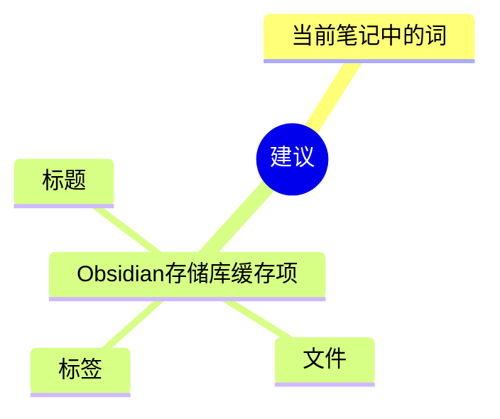
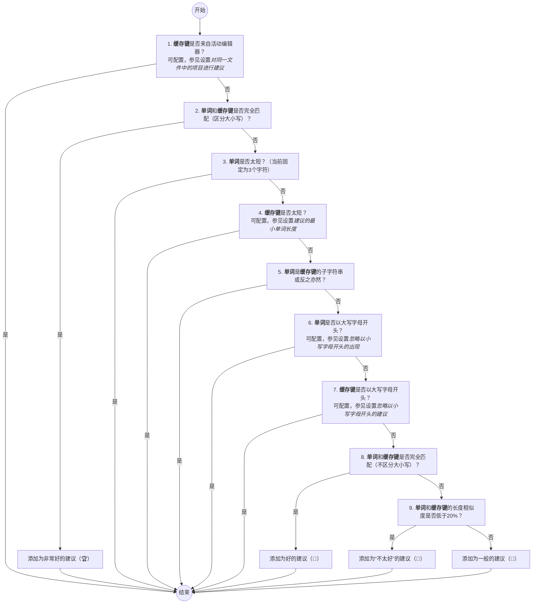
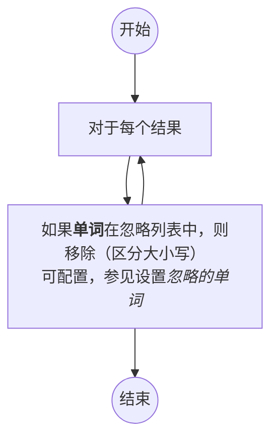

# Obsidian 插件：Crossbow

> [!Note] 插件名片
> - 插件名称：Crossbow
> - 插件作者：shoedler
> - 插件说明：在您的笔记中查找反向链接
> - 插件分类：['obsidian 插件 ', 'readme']
> - 项目地址：[点我访问](https://github.com/shoedler/crossbow)
> - 国内下载地址：[下载安装](https://pkmer.cn/products/plugin/pluginMarket/?crossbow)

## 概述

在您的笔记中查找反向链接

> [!tip] 原文出处
>
>下面自述文件的来源于 [Readme](https://ghproxy.net/https://raw.githubusercontent.com/shoedler/crossbow/master/README.md)

---

## Readme(翻译）

下面是 [[crossbow]] 插件的自述翻译

# 🏹 十字弓

Crossbow 是 [Obsidian](https://obsidian.md) 的一个插件。

通过这个插件，可以为标题、标签和文件提供方便的链接建议，帮助您轻松地编织一个相互连接的笔记网络，提升您的笔记图谱的能力。

如何使用

只需点击丝带上的弩标志，即可打开弩侧边栏。所有建议将显示在侧边栏中。

应用建议

在侧边栏中点击建议会显示当前笔记中该单词的出现列表。

点击其中一个出现的位置将滚动到该位置，并显示一个匹配的缓存项列表，您可以链接到这些匹配项。这些匹配项是根据匹配的质量进行排名的。

您可以通过点击匹配项旁边的适当图标来应用匹配项：

这将插入以下链接：

> 在 Obsidian 中，链接中的管道符（`|`）表示链接的“显示文本”。这意味着管道符后面的文本将显示为链接的文本，而不是链接本身。

### 暂时禁用建议

您可以通过右键单击弓箭视图的弓箭图标并选择“关闭”来暂时禁用建议。这将关闭侧边栏并禁用建议。要重新启用建议，只需再次在功能区中单击弓箭图标。

## 在引擎盖下

### 什么是建议？

建议是您活动编辑器（当前笔记）中的一个词，可以链接到您的存储库中的**标题**、**标签**或**文件**：

Crossbow 利用 Obsidian 的内部缓存，不会手动解析您的存储库。

为了在当前笔记中找到匹配项，它会将活动编辑器的内容剥离任何 Markdown 语法，然后在剥离后的内容中搜索建议。

关于匹配建议的说明

Crossbow 在创建建议时具有自己的观点，但也可以进行配置。从 1.1.1 版本开始，过滤的过程如下：

首先，它收集活动编辑器（当前笔记）中的所有单词和存储库中的所有缓存项（通过它们的缓存键进行标识）。

然后，它按照每个单词和缓存键的简单过程创建建议：

然后，移除与忽略的单词匹配的建议：

请记住，这些步骤是按顺序处理的。例如，看一下第 9 步中的长度过滤器。此时，单词和缓存键已经是彼此的子字符串（第 5 步），这意味着此步骤会添加类似 "donut" 和 "donut hole punching machine manual" 的内容。而不是一般差异很大的内容，这会产生很多误报。

## 手动安装方法

1. 克隆这个仓库。
2. 运行 `npm i` 或 `yarn` 安装依赖。
3. 运行 `npm run build` 构建 Crossbow。
4. 将 `main.js`、`styles.css` 和 `manifest.json` 复制到你的 Vault 的 `.obsidian/plugins/` 文件夹中的一个名为 `crossbow` 的文件夹中。

如果你喜欢这个插件，请考虑：
 
 

