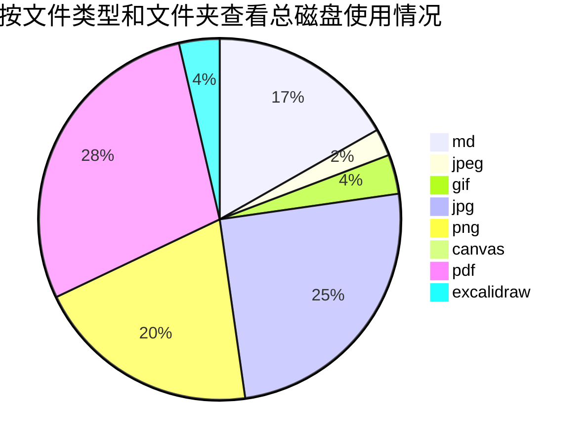
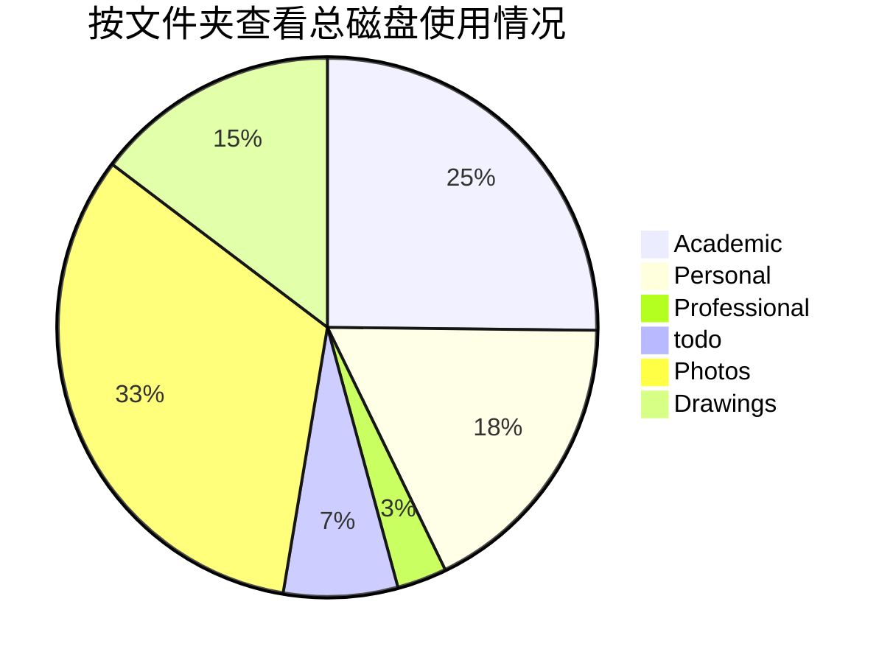
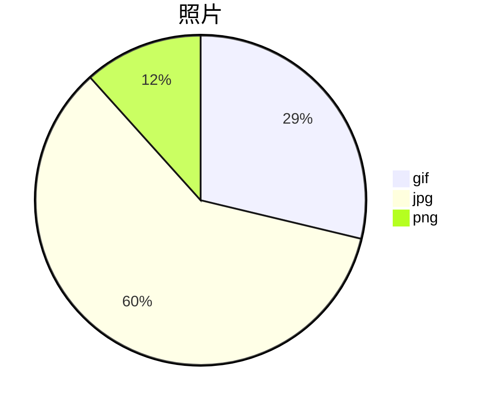
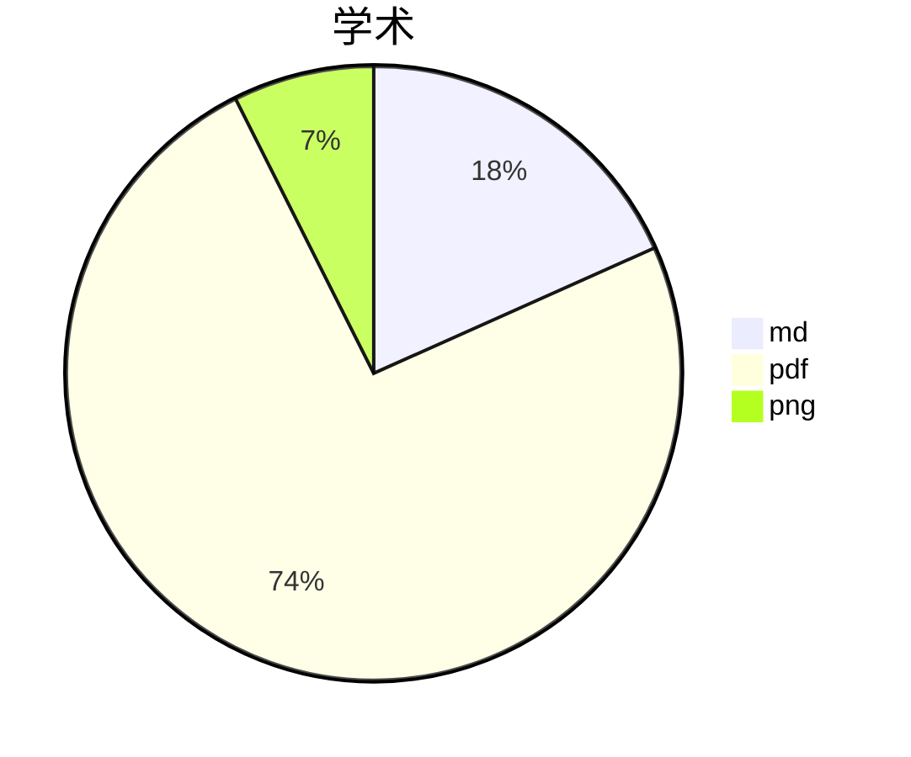
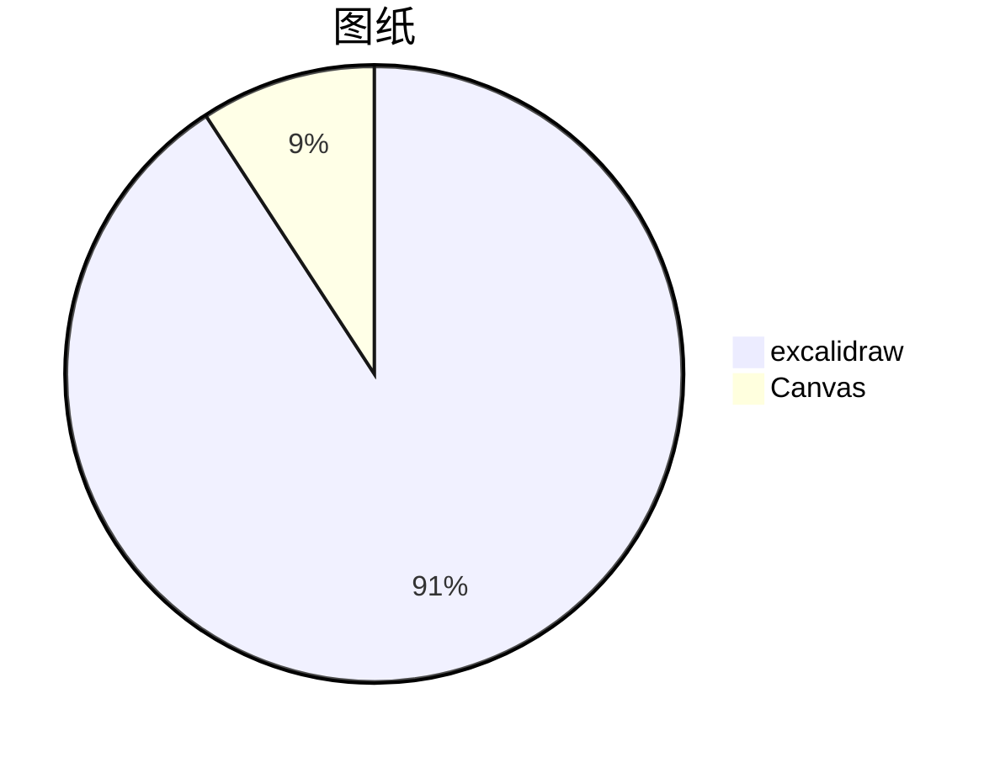

# Obsidian 插件：【Readme】Disk Usage

> [!Note] 插件名片
> - 插件名称：Disk Usage
> - 插件作者：Promptier
> - 插件说明：Measures disk usage for tracking size of folders and file types.
> - 插件分类：['obsidian插件', 'readme']
> - 项目地址：[点我访问](https://github.com/Promptier/disk-usage)
> - 国内下载地址：[下载安装](https://pkmer.cn/products/plugin/pluginMarket/?disk-usage)

## 概述

Measures disk usage for tracking size of folders and file types.

> [!tip] 原文出处
> 
>下面自述文件的来源于 [Readme](https://ghproxy.net/https://raw.githubusercontent.com/Promptier/disk-usage/master/README.md)
> 

---

## Readme(翻译）

下面是 [[disk-usage]] 插件的自述翻译

【机翻】
This plugin is currently in early development. It's purpose is simple, to manage the file space and size of your vault. Whether you want to know which folder is slowing your loading speed, or you are reaching your size limit for the sync service, this plugin will be helpful in managing your vault.
### 特点
##### 显示Vault的摘要

#### 按文件夹查看文件类型

### 如何使用

安装并启用此插件后，您将在屏幕左侧找到一个`磁盘使用情况报告`的带状图标/按钮。这将创建一个包含上面所有图表的markdown文件。完成后，您可以将其保存在某个地方或删除它。

