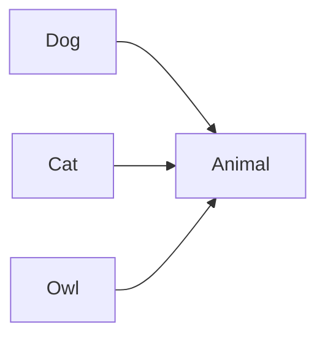
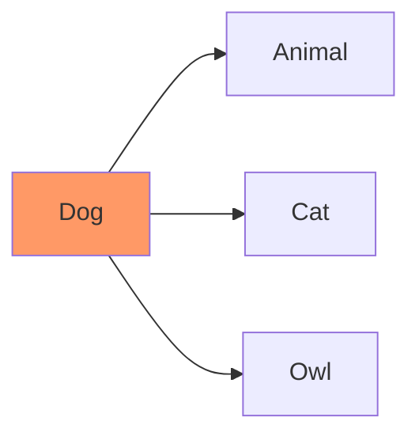
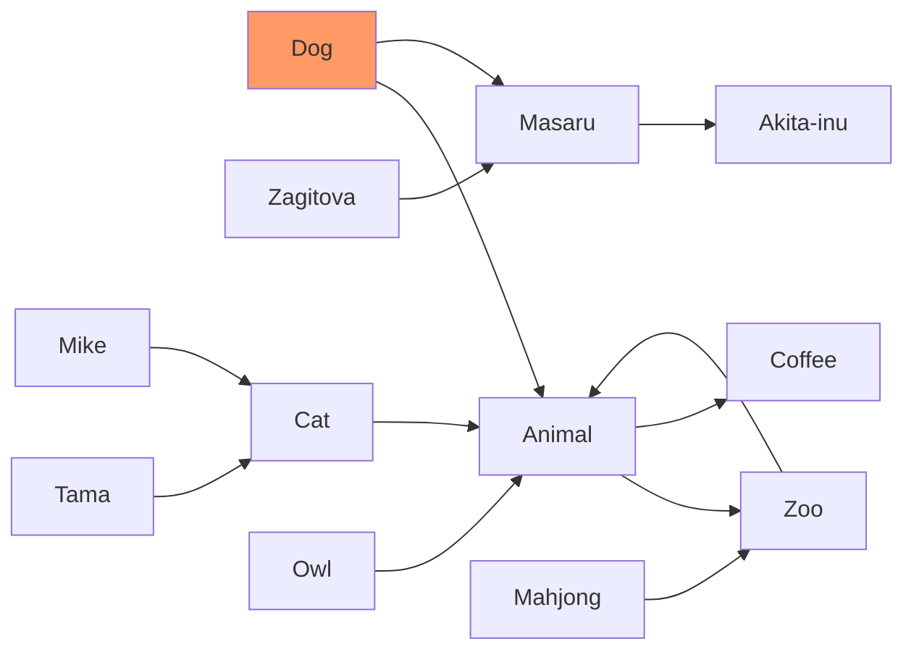
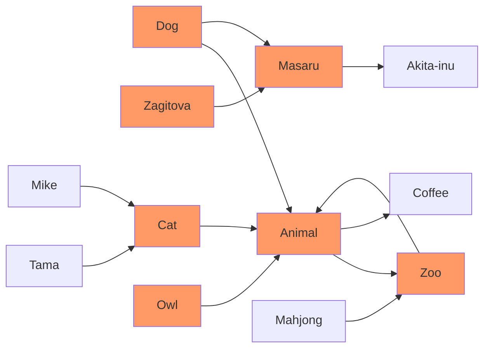

# Obsidian 插件：Another Quick Switcher

> [!Note] 插件名片
> - 插件名称：Another Quick Switcher
> - 插件作者：tadashi-aikawa
> - 插件说明：这是一个 Obsidian 插件，是另一种快速切换的选择。
> - 插件分类：['obsidian 插件 ', 'readme']
> - 项目地址：[点我访问](https://github.com/tadashi-aikawa/obsidian-another-quick-switcher)
> - 国内下载地址：[下载安装](https://pkmer.cn/products/plugin/pluginMarket/?obsidian-another-quick-switcher)

## 概述

这是一个 Obsidian 插件，是另一种快速切换的选择。


> [!tip] 原文出处
>
>下面自述文件的来源于 [Readme](https://ghproxy.net/https://raw.githubusercontent.com/tadashi-aikawa/obsidian-another-quick-switcher/master/README.md)
>

---

## Readme(翻译）

下面是 [[obsidian-another-quick-switcher]] 插件的自述翻译

# Obsidian 另一个快速切换插件

[](https://github.com/tadashi-aikawa/obsidian-another-quick-switcher/releases/latest)

[](https://github.com/tadashi-aikawa/obsidian-another-quick-switcher/actions)


这是一个 Obsidian 插件，是快速切换器的另一个选择。

- 它可以创建自定义搜索命令（`自定义搜索`）
- 它允许您根据自己的喜好自定义快速切换器中的热键
- 它可以搜索反向链接并将它们**在不离开键盘的情况下**移动（`反向链接搜索`）
- 它可以将文件移动到另一个文件夹（`将文件移动到另一个文件夹`）
- 它可以搜索**不考虑令牌的出现顺序**
- 默认情况下，它不执行非常模糊的搜索，但可以选择启用此类搜索的选项
- 它可以搜索**考虑前缀表情符号**
- 它将文件名和目录名分开显示

## ⏬ 安装

您可以在 Obsidian 设置中的 `社区插件` 中进行下载。

## ⌨️特点

### 1. 自定义搜索


自定义搜索功能使您能够创建自己的搜索命令。


#### 搜索目标

| 名称                               | 描述                                          |
| ---------------------------------- | ---------------------------------------------------- |
| markdown                           | 所有的 markdown 文件                                   |
| backlink                           | 当前文件的反向链接中的 markdown 文件      |
| link                               | 当前文件的外部链接中的 markdown 文件 |
| [2-hop-link] | 当前文件的 2 跳链接中的 markdown 文件  |

#### 排序优先级

您可以使用以下名称作为“排序优先级”。

| 名称                        | 描述                                            | 版本  |
| --------------------------- | ------------------------------------------------------ | ------ |
| 完全匹配          | 查询与文件名中的单词完全匹配 | 6.0.0  |
| 前缀匹配           | 文件名或别名以查询开头             | 6.0.0  |
| 包含匹配                  | 文件名或别名包含查询                | 6.0.0  |
| 模糊匹配            | 文件名或别名与查询模糊匹配      | 8.10.0 |
| 标签匹配                   | 文件中的标签名包含查询              | 6.0.0  |
| 标题匹配                | 文件中的标题名包含查询           | 6.0.0  |
| 链接匹配                  | 文件中的内部链接名包含查询    | 6.0.0  |
| 长度                      | 文件名或别名的长度                       | 6.0.0  |
| 最后打开                 | 文件最后打开的时间                          | 6.0.0  |
| 最后修改               | 文件最后修改的时间                        | 6.0.0  |
| 星标                        | 文件有星标                                    | 6.0.0  |
| 按字母顺序排列                | 文件名或别名按字母顺序升序排列      | 6.2.0  |
| 按字母顺序反向排列        | 文件名或别名按字母顺序降序排列     | 7.0.0  |
| 最新创建              | 文件创建日期从最新到最早     | 7.0.0  |
| 最早创建            | 文件创建日期从最早到最新     | 7.0.0  |
| (逗号分隔的标签)       | 文件具有特定的标签                             | 7.0.0  |
| (逗号分隔的扩展名) | 文件具有特定的扩展名                       | 8.3.0  |

> **警告**
> 在关闭 Obsidian 之前，请不要忘记点击“保存”按钮。否则，当您下次打开 Obsidian 时，设置**将永远无法恢复**。
> 

> **注意**
> `(逗号分隔的标签)` 的示例包括 `#hoge`，`#hoge,#huga` 等等。

> **注意**
> `(逗号分隔的扩展名)` 的示例包括 `.md`，`.md,.canvas` 等等。

#### 预设搜索命令

<details>
  <summary>最近搜索</summary>
  
</details>

<details>
  <summary>文件名搜索</summary>
  
</details>

<details>
  <summary>地标搜索</summary>
  
</details>

<details>
  <summary>星标搜索</summary>
  
</details>

<details>
  <summary>反向链接搜索</summary>
  
</details>

#### 注意

##### 用双引号括起来的查询会按原样搜索

- `"ho ge"` 只匹配 `ho ge` 而不匹配 `hoge`
- `ho ge` 匹配 `ho ge` 和 `hoge`

##### 在开头的减号排除了匹配的候选项

例如：如果有三个文件。

- hoge.md
- hoge
- mdhoge

`hoge -md` 只建议 `hoge`。

### 2. 文件中的标题浮动搜索/文件中的标题搜索


- 即使在过滤后保留文件结构，也会显示所有标题
- 默认情况下，自动跳转到第一个匹配建议，并通过 `Tab/Shift+Tab` 进行下一个/上一个跳转
- 用双引号括起来的查询将按原样搜索
    - `"ho ge"` 只匹配 `ho ge` 而不匹配 `hoge`
    - `ho ge` 同时匹配 `ho ge` 和 `hoge`

### 3. Grep

此功能需要 [ripgrep](https://github.com/BurntSushi/ripgrep) 并将可执行命令设置为“Ripgrep 命令”选项。


它按修改时间降序排序结果。

#### 默认快捷键

- `TAB`：搜索（非实时）
- `Ctrl+,`：预览

#### 注意事项

- 输入被视为正则表达式模式
- Grep 默认只搜索 markdown 文件。如果您想搜索其他扩展名的文件，请更新 "Grep > Extensions" 设置。

### 4. 可自定义的热键

每个对话框都可以进行详细的热键自定义设置。


### 5. 在对话框中显示反向链接

您可以在对话框中显示有关建议的反向链接（默认快捷键为 `Mod h`）。

它可以显示不仅是现有笔记的反向链接，还包括幻影（不存在的）笔记的反向链接。


### 6. 在对话框中导航出站链接/反向链接

您可以使用“显示链接”、“显示反向链接”、“前进导航”和“后退导航”命令，在不离开对话框的情况下导航到出站链接/反向链接。


### 7. 预览

您可以在不关闭对话框的情况下预览文件。它会显示一个浮动视图，不会干扰内容。此外，在预览文件并关闭对话框后，它会恢复编辑器的状态。

对于使用早于 v8.0.0 版本的用户

请阅读 [发布说明](https://github.com/tadashi-aikawa/obsidian-another-quick-switcher/releases/tag/8.0.0) 中的“🔥 Breaking changes”部分。

对于使用早于 v7.0.0 版本的用户

请阅读 [发布说明](https://github.com/tadashi-aikawa/obsidian-another-quick-switcher/releases/tag/7.0.0) 中的“🔥 Breaking changes”部分。

对于使用低于 v6.0.0 版本的用户

请阅读 [发布说明](https://github.com/tadashi-aikawa/obsidian-another-quick-switcher/releases/tag/6.0.0) 中的“🔥 Breaking changes”部分。

📱 移动设备支持

它同时支持桌面和移动设备。

## 功能请求 / 错误

请创建一个新的 [问题]。

## 🖥️ 对于开发者/贡献者

抱歉，除非符合以下情况，否则我不会接受拉取请求。

1. 修复明显的错误
2. 修正拼写错误或错误的文档
3. 如果我在 GitHub 问题或讨论中要求这样做

### 开发

需要执行 [Task]。

```console
task init
task dev
```

发布

# 稳定

任务发布 版本=1.2.3

# Beta

任务发布 版本=1.2.3-beta1

附录

什么是“2-hop-link”？

[2-hop-link] 是指当前文件中的出站链接以及具有指向它们的出站链接的文件。

例如，如果存在以下关系，



从“Dog”到 [2-hop-link] 如下所示。



更复杂的例子。



从“Dog”到 [2-hop-link] 如下所示。



[task]: <https://github.com/go-task/task>
[issue]: <https://github.com/tadashi-aikawa/obsidian-another-quick-switcher/issues>
[discussion]: <https://github.com/tadashi-aikawa/obsidian-another-quick-switcher/discussions>

[2-hop-link]: #what-is-the-2-hop-link


