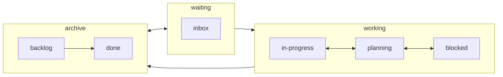

# Obsidian 插件：Bellboy

> [!Note] 插件名片
> - 插件名称：Bellboy
> - 插件作者：Shaked Lokits
> - 插件说明：具有主见的文件结构管理器。
> - 插件分类：['obsidian插件', 'readme']
> - 项目地址：[点我访问](https://github.com/shakedlokits/obsidian-bellboy)
> - 国内下载地址：[下载安装](https://pkmer.cn/products/plugin/pluginMarket/?obsidian-bellboy)

## 概述

具有主见的文件结构管理器。

> [!tip] 原文出处
> 
>下面自述文件的来源于 [Readme](https://ghproxy.net/https://raw.githubusercontent.com/shakedlokits/obsidian-bellboy/master/README.md)
> 

---

## Readme(翻译）

下面是 [[obsidian-bellboy]] 插件的自述翻译

Obsidian Bellboy是为Obsidian打造的一个有主见的文件结构管理工具。旨在保持一个干净可读的知识管理文件系统，同时简化笔记重命名和组织冗余的繁琐任务。

## 特点

### 文件命名方案

Bellboy会查找你的文件中的第一个标题，将其转换为`kebab-case`并将文件重命名为匹配的名称。

此外，如果添加了`icon`的前置元数据，该图标也会添加到名称中，以便更容易找到你的文件。

但为什么呢？为了保持文件系统无关的命名方案，我选择使用`kebab-case`作为我们的主要命名约定风格。为了支持更好的视觉效果，我还添加了前置图标(!)，这些图标已集成到文件名中。

### 文件结构

Bellboy试图实现“Idea Processor”方法指南，旨在通过自动管理您的想法过程并让您专注于执行来改善您的输出。
它通过在您更新元数据时查找其状态并将文件移动到相应的文件夹中来实现这一点。

#### 创意处理器
这是一种基于研发创意过程的方法，每个创意都经过验证流程，最终要么执行，要么被放弃。它在多个专业领域中使用，旨在优化执行结果，最大化我们的潜力。

下面是该过程中的一般状态流程，更多阅读材料将很快添加。

## 贡献

如此作为一个实验性插件，预计会出现错误。请在此存储库中打开一个问题，并详细描述您遇到的错误。

### 如何在本地运行
- 克隆这个仓库。
- 运行 `npm i` 或 `yarn` 安装依赖。
- 运行 `npm run dev` 以启动编译并进入观察模式。

### 手动安装插件
- 将 `main.js`、`styles.css`、`manifest.json` 复制到你的 vault 文件夹 `VaultFolder/.obsidian/plugins/obsidian-bellboy/` 中。

### API文档
请参阅https://github.com/obsidianmd/obsidian-api

