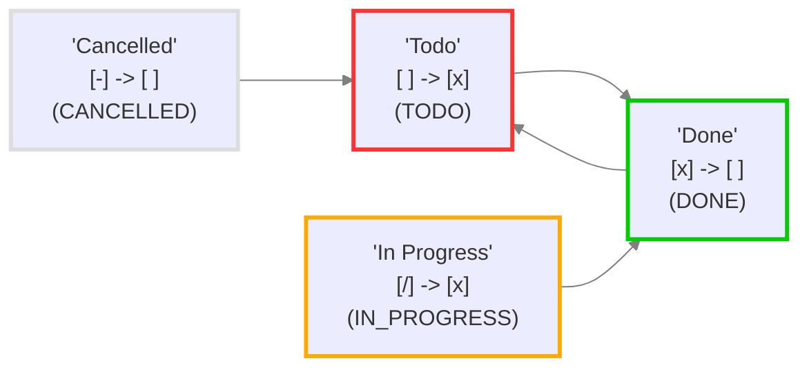

# DataViewJS+Tasks- 最佳的每周任务管理及周报


## Tasks 查询语法

基本的 Tasks 查询语法来列出本周今日的完成或未完成的任务 (包含今日日记为规划的任务)，按任务状态分组。

````md
```tasks
{(done on today) OR (happens on today)} OR {(happens on or before today) AND (not done) AND (happens on this week)} \
OR {filter by function \
    const filename = task.file.filenameWithoutExtension; \
    const date1 = window.moment(filename).format('YYYY-MM-DD');\
    const date2 = window.moment().format('YYYY-MM-DD');\
    return date1 === date2;}
# show tree
# group by recurring reverse
group by status.name reverse
limit groups 4
short mode
```
````

## 基于 DataviewJS 的改造

结合 dvjs 控件的 tasks 查询。

- 参考案例：[How to get tasks in current file - Tasks User Guide - Obsidian Publish](https://publish.obsidian.md/tasks/How+To/How+to+get+tasks+in+current+file#Using+Dataview+to+generate+Tasks+blocks+-+the+old+way)

````md
```dataviewjs
// 获取当前日期
const today = window.moment();
let selectedDate = today.clone();
let currentWeekOffset = 0;

// showTree 状态
let showTree = true;
let showWeekTasks = false;

// 创建一个用于显示当前周次的标签
const weekControlsContainer = document.createElement("div");
weekControlsContainer.style.textAlign = "center";
weekControlsContainer.style.marginBottom = "10px";

// 创建 week input
const weekInput = document.createElement("input");
weekInput.type = "week";

// 为 week input 设置样式
Object.assign(weekInput.style, {
  fontSize: "1.2rem", 
  color: "var(--text-normal)",
  backgroundColor: "var(--background-primary)", 
  border: "1px solid var(--background-modifier-border)", 
  borderRadius: "4px", 
  padding: "0.2rem", 
  outline: "none"
});

// 设置初始值为当前周
function getFormattedWeekString(date) {
  const year = date.format("GGGG"); // 使用ISO年
  const week = date.format("WW");
  return `${year}-W${week}`;
}
weekInput.value = getFormattedWeekString(today);

// 设置 week input 的事件监听
weekInput.addEventListener("change", () => {
  const [year, week] = weekInput.value.split('-W').map(str => parseInt(str));
  const firstWeek = today.clone().year(year).startOf('year').week(1);
  const targetWeekStart = firstWeek.add(week - 1, 'weeks');
  currentWeekOffset = targetWeekStart.week() - today.week();
  dayButtonsContainer.children[0].click();
});

// 创建操作按钮
const leftButtonWeek = document.createElement("button");
const rightButtonWeek = document.createElement("button");
const toggleShowTreeButton = document.createElement("button");
const toggleShowWeekTasksButton = document.createElement("button");
const todayButton = document.createElement("button");

[leftButtonWeek, rightButtonWeek, todayButton, toggleShowTreeButton,toggleShowWeekTasksButton].forEach(button => {
  button.style.border = "none";
  button.style.margin = "0 5px";
  button.style.padding = "5px 10px";
  button.style.backgroundColor = "var(--interactive-accent)";
  button.style.fontSize = "large";
  button.style.color = "var(--text-on-accent)";
  button.style.cursor = "pointer";
});
leftButtonWeek.textContent = "←";
rightButtonWeek.textContent = "→";
toggleShowTreeButton.textContent = "↳";
toggleShowWeekTasksButton.textContent = "周报";
todayButton.textContent = "今日";

// 添加按钮逻辑
leftButtonWeek.addEventListener("click", () => {
  currentWeekOffset -= 1;
  updateWeekInput();
  dayButtonsContainer.children[0].click();
});

rightButtonWeek.addEventListener("click", () => {
  currentWeekOffset += 1;
  updateWeekInput();
  dayButtonsContainer.children[0].click();
});

todayButton.addEventListener("click", () => {
  currentWeekOffset = 0;
  updateWeekInput();
  const todayIndex = today.day() === 0 ? 6 : today.day() - 1;
  dayButtonsContainer.children[todayIndex].click();
});

// 初始化 可选按钮
function initButtonTheme(button, active) {
  if (active) {
    button.style.color = "var(--text-on-accent)";
    button.style.backgroundColor = "var(--interactive-accent)";
  } else {
    button.style.color = "var(--text-normal)";
    button.style.backgroundColor = "transparent";
  }
}

toggleShowTreeButton.addEventListener("click", () => {
  showTree = !showTree;
  initButtonTheme(toggleShowTreeButton, showTree);
  dayButtonsContainer.querySelector("button[style*='interactive-accent']").click();
});

toggleShowWeekTasksButton.addEventListener("click", () => {
  showWeekTasks = !showWeekTasks;
  initButtonTheme(toggleShowWeekTasksButton, showWeekTasks);
  dayButtonsContainer.querySelector("button[style*='interactive-accent']").click();
});

// 初始化按钮主题色
initButtonTheme(toggleShowTreeButton, showTree);
initButtonTheme(toggleShowWeekTasksButton, showWeekTasks);

// 更新周次选择框
function updateWeekInput() {
  const startDate = today.clone().startOf('week').add(currentWeekOffset, 'weeks');
  weekInput.value = getFormattedWeekString(startDate);
}

// 插入控件
weekControlsContainer.appendChild(toggleShowWeekTasksButton);
weekControlsContainer.appendChild(leftButtonWeek);
weekControlsContainer.appendChild(weekInput);
weekControlsContainer.appendChild(rightButtonWeek);
weekControlsContainer.appendChild(toggleShowTreeButton);
weekControlsContainer.appendChild(todayButton);
// 添加到页面中
document.body.appendChild(weekControlsContainer);
dv.container.appendChild(weekControlsContainer);

// 创建星期按钮
const daysOfWeek = ["星期一", "星期二", "星期三", "星期四", "星期五", "星期六", "星期天"];
const dayButtonsContainer = document.createElement("div");
dayButtonsContainer.style.display = "flex";
dayButtonsContainer.style.justifyContent = "center";
dayButtonsContainer.style.width = "100%";

// 存储当前选中的按钮
let selectedButton;
// 添加样式的默认值
const defaultButtonStyle = {
  border: "none",
  borderRadius: "0px",
  cursor: "pointer",
  fontSize: "large",
  flex: "1 1 auto",
  color: "var(--text-normal)",
  backgroundColor: "transparent",
};

daysOfWeek.forEach((day, index) => {
  const button = document.createElement("button");
  Object.assign(button.style, defaultButtonStyle);
  button.textContent = day;
  
  button.addEventListener("click", () => {
    // 设置选中的日期
    selectedDate = today.clone().startOf("week").add(currentWeekOffset, "weeks").add(index, "days");
    updateTasksView();

    // 更新先前选中按钮的样式
    if (selectedButton) {
      Object.assign(selectedButton.style, defaultButtonStyle);
    }

    // 更新选中按钮的样式
    button.style.backgroundColor = "var(--interactive-accent)";
    button.style.color = "var(--text-on-accent)";
    selectedButton = button;
  });

  dayButtonsContainer.appendChild(button);
});
// 插入星期按钮容器
dv.container.appendChild(dayButtonsContainer);

function updateTasksView() {
  dv.container.innerHTML = "";
  dv.container.appendChild(weekControlsContainer);
  dv.container.appendChild(dayButtonsContainer);

  const dateStr = selectedDate.format("YYYY-MM-DD");
  const weekStr = selectedDate.format("YYYY-[W]WW");
  const showTreeOption = showTree ? "show tree" : "";
  const queryDayOfWeek = `
    {(done on ${dateStr}) OR (happens on ${dateStr}) }\\
     OR {(happens before ${dateStr}) AND (not done) AND (happens on ${weekStr}) }\\
     OR {filter by function \\
        const filename = task.file.filenameWithoutExtension;\\
        const date1 = window.moment(filename).format('YYYY-MM-DD');\\
        return date1 === '${dateStr}';}
    ${showTreeOption}
    group by status.name reverse
    short mode
    is not recurring
    # limit groups 5
    `;
  const queryWeek = `
    group by function task.description.includes("http") ? "🌐阅读记录" : "📅任务记录"
    {(done on ${weekStr}) OR (happens on ${weekStr})}
    ${showTreeOption}
    is not recurring
    # group by status.name
    group by done reverse
    short mode
    limit 100
    `;
  const query = !showWeekTasks ? queryDayOfWeek : queryWeek;

  dv.paragraph("```tasks\n" + query + "\n```");
}

// 初始化：选择今天
todayButton.click()

// 监听今日按钮的双击事件
todayButton.addEventListener("dblclick", () => {
  app.commands.executeCommandById("daily-notes");
});
```
````

- [[241226_修改版本记录]]

## Tip：固定到侧边

可以将该查询笔记放到侧边栏，固定住就行，可以用 CSS 隐藏固定按钮：

```css
/* !在左右侧边栏中不显示固定按钮 */  
.workspace-split.mod-horizontal.mod-right-split,  
.workspace-split.mod-horizontal.mod-left-split {  
  .workspace-tab-header-status-container {  
    display: none;  
  }  
  /* 缩减底部空白 不然可能加载成空白页 */  
  .markdown-preview-section {  
    padding-bottom: 0px !important;  
    min-height: unset !important;  
  }  
  
  .embedded-backlinks {  
    display: none;  
  }  
}
```

## 关于如何规划任务

### 任务状态

首先得了解下 Tasks 插件定义的任务状态 (task.status.type)，任务状态类型只有 4 种：TODO、DONE、IN_PROGRESS、CANCELLED。

| 状态符号 | 下一个状态符号 | 状态名称 | 状态类型          |
| ---- | ------- | ---- | ------------- |
| `空格` | `x`     | 待办   | `TODO`        |
| `x`  | `空格`    | 已完成  | `DONE`        |
| `/`  | `x`     | 进行中  | `IN_PROGRESS` |
| `-`  | `空格`    | 取消   | `CANCELLED`   |



<!--section: 4.1.1-->

### 任务名称

可能这些状态对于任务管理的分类来说有点简单了，Tasks 插件还支持自定义的任务样式以及设置不同的任务状态名称 (task.status.name)，你可以通过在 tasks 插件设置中进行添加自定义任务名称以及设置对应的任务类型。


### 拓展：导入其他主题定义的任务样式

幸运的是，Tasks 插件支持一键导入个别主题定义的复选框样式，只需要点击你需要主题定义的样式既可。


如果你不想专门为了一个复选框样式去更改主题，可以使用如下的 Minimal 主题的复选框样式的片段：[[Obsidian样式-Minimal主题复选框(Checkout)样式]]

导入后也可以二次编辑，比如修改一些任务名称的任务类型，或者删除一些你需要的状态。


## Reference

- [Introduction - Tasks User Guide - Obsidian Publish](https://publish.obsidian.md/tasks/Introduction)
- [[基于 QuickAdd+Modal Form的任务 (Task) 编辑器]]
- [[Obsidian样式-Kanban魔改之四象限模式和康奈尔笔记模式]]
- [How to get tasks in current file - Tasks User Guide - Obsidian Publish](https://publish.obsidian.md/tasks/How+To/How+to+get+tasks+in+current+file#Using+Dataview+to+generate+Tasks+blocks+-+the+old+way)
- [今日任务面板（附实用美化技巧） - 经验分享 - Obsidian 中文论坛](https://forum-zh.obsidian.md/t/topic/38641)

## 存在问题

- [基于DataviewJS的Tasks查询每周的任务#6，来自 benx - 经验分享 - Obsidian 中文论坛](https://forum-zh.obsidian.md/t/topic/44304/6?u=熊猫别熬夜)
- momentJS 可以用 ISOWeek 来替代，因为它默认也是周日 day1
  - 

