# Obsidian 插件：AnyBlock 一个简易而又强大的块编辑器

> [!Note] 插件名片
> - 插件名称：AnyBlock
> - 插件版本：3.3.2
> - 插件作者：[LincZero](https://github.com/LincZero) (国人)
> - 插件描述：您可以通过某种方式灵活地创建一个“块”。它还提供了一些有用的功能，比如 `列表转表格`
> - 插件项目地址：[点我跳转](https://github.com/LincZero/obsidian-any-block)
> - 国内下载地址：[下载安装](https://pkmer.cn/products/plugin/pluginMarket/?any-block)

## AnyBlock是什么?

- 一个高通用markdown扩展的解析和渲染的模块/插件。
  (**Obsidian插件, Markdown-it插件, Vuepress插件, CodeMirror插件, 在线App**)
- 功能: 你可以通过许多方式灵活地创建一个“块”。它还提供了许多有用的功能，如“列表转表格”等
- 功能 (详细): 你可以通过列表/标题/表格/引用块/代码块/Markdown-it的首尾`:::`等方式来快速选择一个片段，并将该片段转换为表格/标签页/目录/卡片/分栏/时间线/思维导图/plantuml图表/节点图等结果

## 文档、相关链接

- 相关链接：**教程**、使用技能、贡献、二次开发、在线使用
- [效果展示/**教程**](https://lincdocs.github.io/AnyBlock/README.show.html), 你可以通过切换里面的标签页来学习用法
- [在线交互/Demo](https://any-block.github.io/any-block/)，你可以在这里编写体验、通过模板学习用法
- [文档](https://lincdocs.github.io/AnyBlock/)
- 安装和使用
  - [在Obsidian中安装和使用](https://lincdocs.github.io/AnyBlock/docs/en/04.%20InstallAndUse_Obsidian.html)
  - [在Vuepress/Markdown-it中安装和使用](https://lincdocs.github.io/AnyBlock/docs/en/04.%20InstallAndUse_VuePress.html)
- 备用网站链接：如果网站失效，则将网站链接部分的 `linczero.github.io` 替换成 `linczero-github-io.pages.dev` 就可以了
	  （**本文的默认网站链接指向 github.io，如果国内有不能访问的朋友，那么大概率需要做这一步**）
- [体积超小的min版anyblock](https://github.com/any-block/obsidian-any-block-min)，你可以手动下载，或使用BRAT插件自动下载/更新该obsidian插件

## 亮点

- 无语法
  - 没有新语法、没有语法入侵
  - 这也导致没有过度的插件依赖。我认为好的插件不应该导致 —— 当你用了一段时间插件后，离开该插件会导致原来的内容变形，不可读或维护
- 可扩展性
  - 插件方便二次开发
- 灵活且强大
  - 选择器 (灵活)：选择范围灵活，六种选择方式，简单易用
  - 处理器 (强大)：丰富多样、功能强大、扩展性强
- 多平台, 高通用
  - 可用于: **Obsidian插件, Markdown-it插件, 在线App, Vuepress插件**
  - 支持markdown-it解析的博客，如vuepress/vitepress等

## 效果展示、语法

`多叉表格`/`跨行表格`

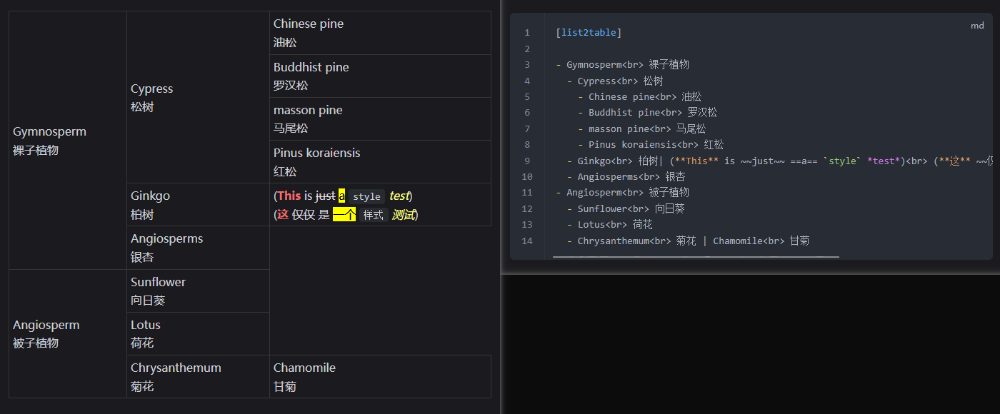

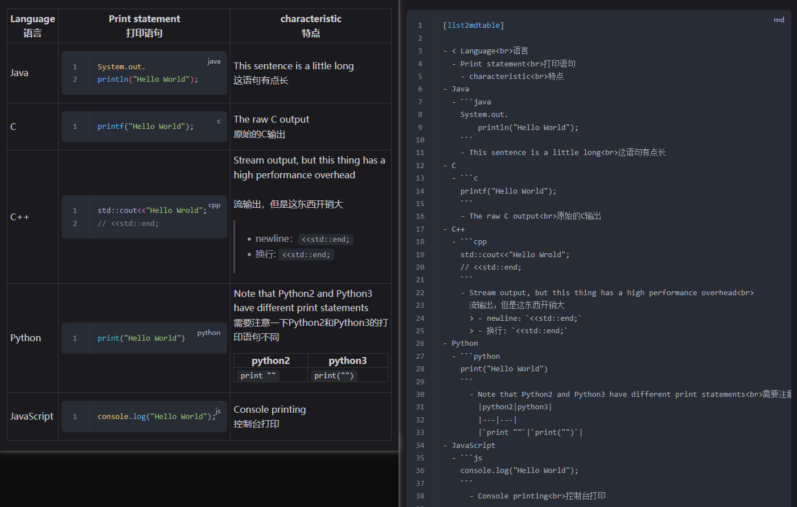

`列表格`/`树型表格`

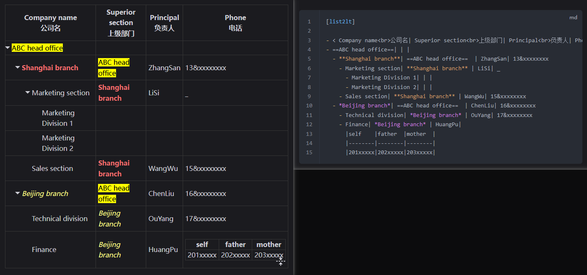

优化列表

本质是 "列表格" 的基础上增加仿列表样式

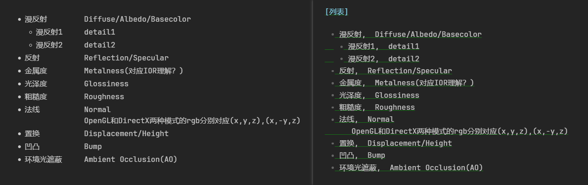

目录树

本质是"列表格"的基础上增加仿目录样式

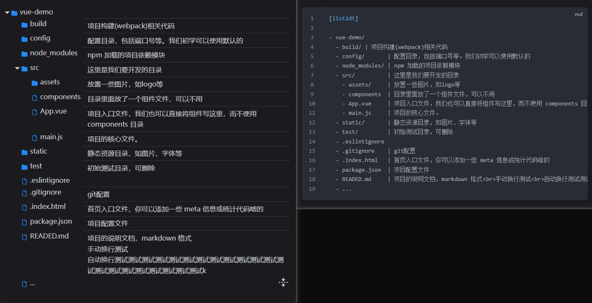

ascii 目录树

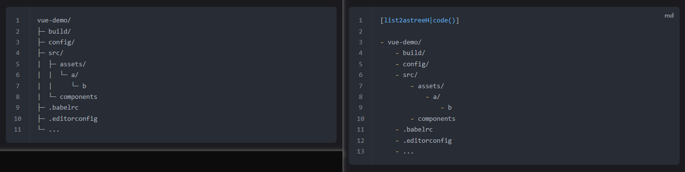

WBS (Work Breakdown Structure, 工作分解结构)

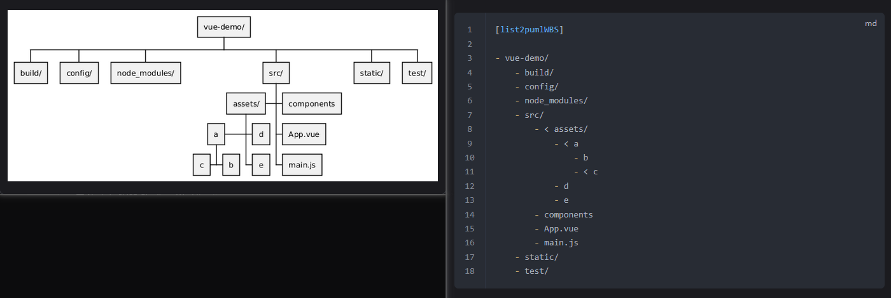

时间线

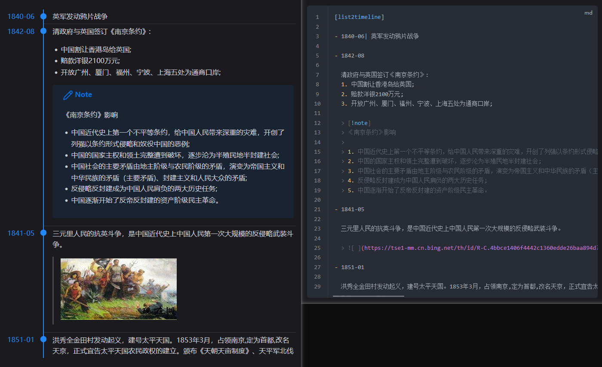

标签页和卡片

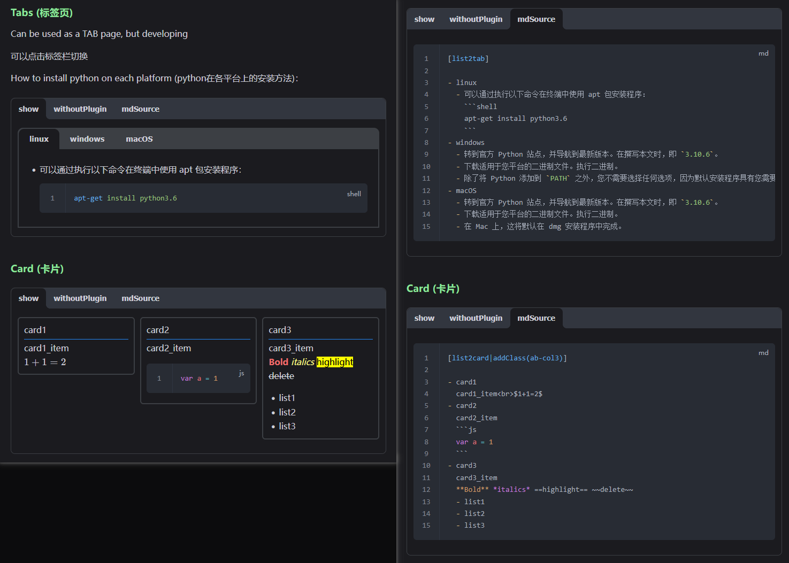

mermaid流程图

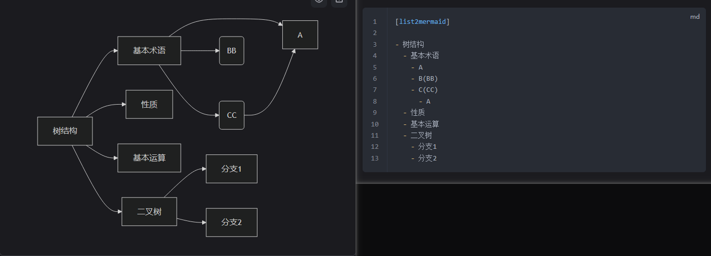

plantuml 思维导图

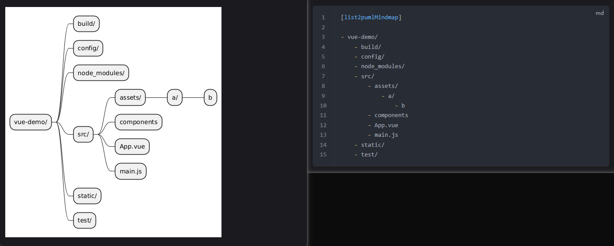

转节点树图，AnyBlock版思维导图

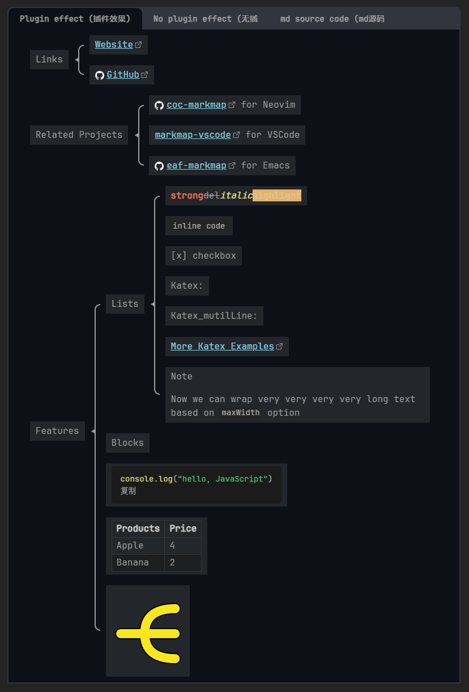

markmap 思维导图

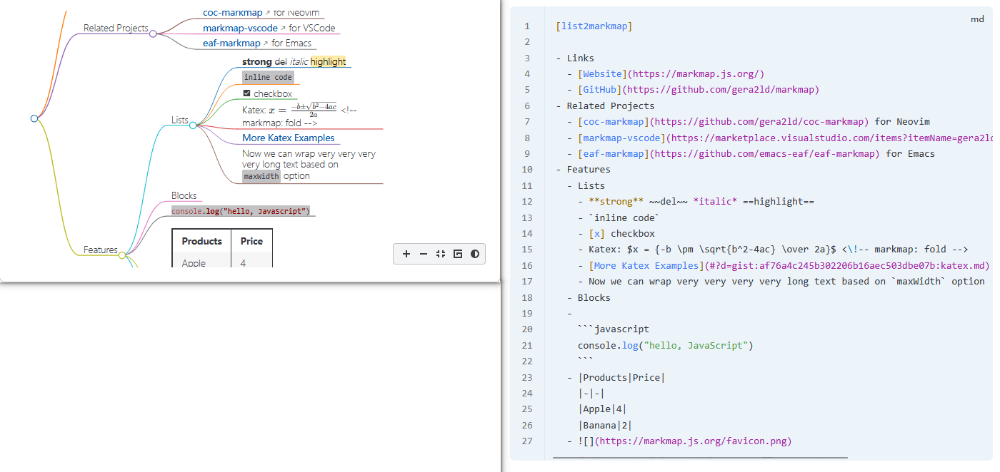

mermaid 思维导图

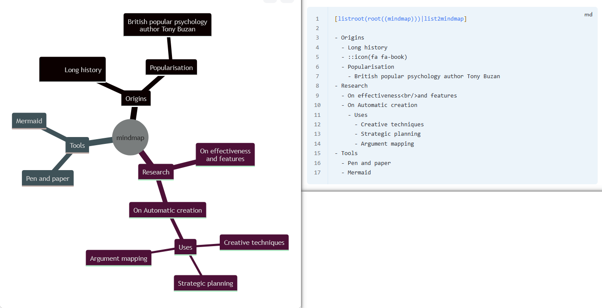

上面只是插件的**其中的几种**处理器。实际上**还支持非常多的处理器和功能**，处理器间还能随意串行组合，并且除了列表选择器外还支持标题、代码块、引用块等诸多选择器。更多的功能参见[更多文档](https://linczero.github.io/MdNote_Public/%E4%BA%A7%E5%93%81%E6%96%87%E6%A1%A3/AnyBlock/)

## 旧效果展示

说其中一些比较常用的处理器：

- 列表转表格
- 列表转列表格
- 列表转流程图
- 列表转思维导图
- 列表转标签栏
- 列表转时间线
- 标题转列表从而转其他（can use title2list processor）


AnyBlock 最容易理解的一个功能就是 List 转 Table，但这并不是插件的核心，只是一种比较有用的附带功能。

- [[0 - 基础教程]]
- [[1 - 使用示例 - 列表选择器]]
- [[2 - 使用示例 - 代码块引用块选择器]]
- [[3 - 使用示例 - 全局选择器]]
- [[4 - 使用示例 - 更多处理器]]
- [[9 - For Developer]]
- [[10 - TODO]]

# AnyBlock 插件系列教程之 -- 插件类别理念

## 插件分类

首先我们来分类一下渲染类的插件（我大体将 OB 插件分为管理类、辅助输入类、和渲染类）

渲染类中：现在大多数的特殊语法解析，有五种

1. 大都在**代码框**里做，比较著名的就是 Ad 的代码块语法
   （感觉 Ad 的代码框当“特殊引用块”的做法就有点难受了，甚至会觉得 Callout 是上位替代品）
2. callout 是在**引用框**里做，其他的没见过
3. **整篇 md 文章**作为语法的解析，例如 Kanban
4. **前缀方式**，从前缀标识到空行为止的区域作为特殊语法格式的区域。优点是这是表格的超集，完全兼容传统表格的语法
5. **标签方式**（~~不过现有接口没有直接支持，如果要实现这种方式，就得自己重写一套 md 后处理器~~，好了，写出来了）

## 他们各自的优缺点

|方式|   |缺点|优点|插件举例|
|:----|---|:----|----:|---|
|方式 1|   |**不能进行 Md 语法解析**， <br> **解析语法失效会变得非常难看** ，<br>**不属于嵌套容器，虽然能强行嵌套**|可以使用代码解析来着色，适合代码内容。能避免 md 语法干扰|插件如：`dataview`, `mermaid` 等 <br> 反例插件非常多，如：`Ad的代码框语法`、`聊天记录软件`(支持 Md 信息发送版)、里面嵌套有 Md 语法或图片的所有插件、`mindmap`(list 生成脑图)|
|方式 2|   |**每行 ">" 符号和嵌套缩进非常麻烦**，特别是内容非常长时<br>（相较于代码块）|可以使用 Md 语法解析来着色|插件如：`Ad的Callout` 语法|
|方式 3|   |整篇文章使用|有方法 2 所有的优点，此外还不需要加代码块和引用块|插件如：`kanban`，`mindmap`|
|方式 4|   |因为需要空行作为结束符，一般不能作为嵌套容器，也意味着内容不能有空格|有方法 2,3 所有的优点。此外标识符只需要加在前面|插件如：`list-callout`， <br> `Table Extended` 的 `-tx-` 前缀（不要也行但偶尔出错），<br>` checklist` 的 `#todo` 前缀（这个是全库识别与单独渲染），<br>`AnyBlock` 的局部和标题选择器|
|方式 5<br>--------|   |如果用了嵌套语法由于没缩进会比较难找|其实就是方式 4 的分支。有方法 2,3 所有的优点。此外加标签只需要加在前后即可|插件如：HTML 代码、`AnyBlock` 的首尾选择器|

## 为什么大部分插件都通过代码块实现？

上面我将特殊语法分为了五大类，然后你们会发现，OB 的语法解析类插件大多数是通过方式一实现，为什么？

可能这些特殊语法需要被包括起来、正文无关、害怕特殊语法的格式会被误识别（需要避免被 md 语法解析），这些都是原因。

但有的插件明显是不利于用方式一来实现的，但他们依然会使用，例如：Ob 未支持 callout 语法之前的 ad 插件，就是一个绝佳的例子

（没有贬低这个插件的意思，ad 插件也对 callout 语法提供了大量的支持，可以通过命令快捷插入 callout 语法（不是 ad 语法），设置面板可以同时扩展 ad 语法和 callout 语法的类型，都是非常好用的。像 `BT示例库` 就利用了 ad 插件扩展 callout 语法类别的方式，区分了每个块的 class 类型，从而进行扩展）

目前大部分的插件都能通过代码块渲染特殊格式的一个很大的原因，是 obsidian 提供了一个很方便的 api 接口：

```js
this.registerMarkdownCodeBlockProcessor("chat-qq", (source, el, _) => {
    new Chat_qq(source, el, _, this).render()
});

```

只要实现这么一处接口，就可以轻松在实时和渲染模式中实现局部文本在特殊格式下渲染

## 语法块转化

但正如前面所说的，各种解析语法的 选择器 (这里将选择特殊语法范围的方式称为选择器) 都是各有弊端和长处的。

AnyBlock 做的，就是混淆这些语法的选择方式。无论是引用块选择、代码块选择、前后缀选择、还是其他方式。都能通过 AnyBlock 互相转化

AnyBlock 有两种方式做到这一点：

1. 通过 [[5 - 插件设计理念#语法块转化]] 功能，将不在代码块内的文本假装成是在代码块内。
   你可以通过该方式处理几乎所有的使用代码块的插件
2. 插件开发人员可以使用 AnyBlock 提供的 [[9 - For Developer#注册新的处理器]]，注册新的处理器来处理

此外，AnyBlock 还将降低开发难度

1. 原本想要实现一个代码块以外的特殊语法解析程序，可能非常困难（例如你想做个和 callout 语法相似功能的插件）
   但你可以选择 AnyBlock 作为前置插件，提醒用户先安装该插件，你就可以只用实现 OB 提供的代码块注册模块，而不用实现其他复杂的东西！
2. 文本处理器可以叠加使用，即可以复用组件，处理器之间松耦合，有的环节可以使用现有的工具，而不再需要自己造轮子

# 插件类别理念 - 为什么要用 AnyBlock？

为什么要用 AnyBlock？

前面说了原理，可能不太直观，这里举几个可以使用 AnyBlock 优化原有插件的例子。

## callout 杂谈

前面的优缺点可能不那么直观，现在看一下实例：

（请反复切换 源码、实时、渲染模式 查看这一节内容）

### Ad 插件写法

在 callout 语法出来之前，写起来是这样的：

```ad-note
### 标题

### 标题2

### 标题3

- 一个普通的列表
  - 一个普通的列表
    - 一个普通的列表
  - - 一个普通的列表

```

### Callout 写法

在 callout 语法出来之后，写起来是这样的：

> [!note]
> ### 标题
> ### 标题 2
> ### 标题 3
> - 一个普通的列表
>  - 一个普通的列表
>    - 一个普通的列表
>    - 一个普通的列表

### Any-Block 写法

用 Any-Block（本插件），写起来是这样的（写法非常自由）

写法一：首尾选择器写法

{[code]

ad-note

#### 标题

#### 标题 2

#### 标题 3

- 一个普通的列表
  - 一个普通的列表
    - 一个普通的列表
  - - 一个普通的列表
}.

写法二：块转化写法（如果 ob 不支持 callout 语法，可以这样写，但 ob 0.14 支持了，现在就没必要了，这里仅供演示）

[quote2code]

> ad-note
> ### 标题
> ### 标题 2
> ### 标题 3
> - 一个普通的列表
>  - 一个普通的列表
>    - 一个普通的列表
>    - 一个普通的列表

写法三：标题选择器写法：

[!note]

#### 标题

##### 标题 2

##### 标题 3

- 一个普通的列表
  - 一个普通的列表
    - 一个普通的列表
  - - 一个普通的列表

## 列表转表格 list2table

这是 AnyBlock 自带的一项比较好用的功能，仔细想想，该功能的实现是否正正是依赖于 AnyBlock 的范围选择再处理的能力？

固然可以将列表内容放入代码块内再渲染，但是不是就没那么好用了？

题外话一

其实作者是先想到了要实现 `列表转表格` 这一插件，然后思考如果要实现这一插件会有什么问题，然后才总结了各种插件进行“特殊语法解析”的方式，才提出了 `AnyBlock` 这个插件。提出了 “首尾选择器” 和只需要标注头部的 “列表 引用块 代码块 标题 等选择器”

题外话二

在实现这个插件之前，其实还有两种方式来实现 `列表转表格` 的功能。

一种是 `Bosidian群群友@九炎` 写的纯 css 实现。缺点是……略丑

	（不需要头部标识不算较于ab的优点，其实anyblock也可以不需要头部标识选择列表。将设置里的 `总是选择` 开启就行，但强烈不建议）

	（这里透露了一点实现细节：AnyBlock不是先选择的头部再选则下面的，而是先选择块，再看上面有没有头部信息的）

另一种是我用 dataviewjs 硬写的模拟。缺点是没有真正合并单元格，用 `^^` 符号来假装单元格被合并了

## chat-view-qq（with md）

再来举点用处：

比如我之前写了一个聊天记录插件 chat-view-qq，能快捷记录聊天对话

我后来想要将说出来的话可以以 md 格式被渲染，这个效果我可以做出来，但会有一个问题：

在代码块里写 md 代码会非常奇怪，就像 ob 不支持 callout 语法之前的 ad 插件的写法

## BT 示例库版 callout 优化

BT 示例库里，很多 callout 扩展效果用 AnyBlock 来写，语法上会更加简单（不需要为了方便 css 选择器选择而去使用不太方便的写发）

例如时间线、多分栏、等等。

## 折叠或压缩长代码

在 AB 插件自带的很多处理器上，你都会发现，这些处理器处理的范围如果只能写在代码块或引用块里，都不会那么强大。

例如：自动折叠代码块、或代码块超长时自动折叠一部分、代码转文档等。直接在代码块上面写上处理器就能做到很好的效果，简单快捷

# 列表转化理念

AB 的核心能力是范围选择并处理，但很多人对该特性缺乏了解。

反而更多人可能会因为列表转表格或其他树形图而使用 AnyBlock，所以有人可能会疑惑这插件为啥不叫 List2Table 或 List2Tree。

从功能上讲，列表转化依赖于 AnyBlock 选择器，是一种功能扩展。

但从开发者的实现意图上，列表转树类结构也确实是 AB 插件的核心之一。

## 共性 - 树结构

树结构是一种很好用的结构，人类可读性非常高，看起来也很清晰。

列表可以表示一种树结构，还有很多东西可以表示树结构，例如有一定限制的可跨行合并的表格、一定限制的流程图、\

一定限制的思维导图、括弧包含图、树形树状图，等等

那么为什么不能让他们互相转化呢？

## 代替 md 表格

在我看来，ab 扩展的列表远比 md 的表格好用。

为了完全代替 md 原生的表格写法，我为启用列表转表格的列表添加了两项扩展操作：

- 可以用 `| ` 进行内联分隔，就像表格一样（未来可能能支持其他内联分割符，如 `:`、`&`、`/|*/`）
- 可以在第一行前面加上 `> ` 表示表头

下面我们来对比一下

[list2mdutT]

- 对比项
	- 例子
	- 源代码可读性
	- 扩展性
	- 书写
	- 表格直接编辑
	- 数据性
- ab 列表
	- 例子

	  ```html
	  [2table]
	  - 测试1|测试2
	  - 测试3|测试4
       ```

	- 极高，且在单元格内容较多时表现更出色
	- 允许嵌套 md
	  暂不允许左右中对齐
	  允许一定程度合并单元格
	- 快
	- 新插件，暂时没有，但理论上可扩展做到
	- 强，数据和显示分离，
	  未来制作导出为数据的扩展都很方便
- md 表格
	- 例子

	  ```html
	  |测试1|测试2|
	  |---  |---  |
	  |测试3|测试4|
		```

	- 极高，但在内嵌长文本（如图片或大段文字）表现不佳
	- 允许少量 md 样式
	  允许左右中对齐
	  使用插件 table-extend 才能合并
	- 中等
	- 可用 enhance 等插件
	- 弱


---

> 接下来是 [[9 - For Developer]]