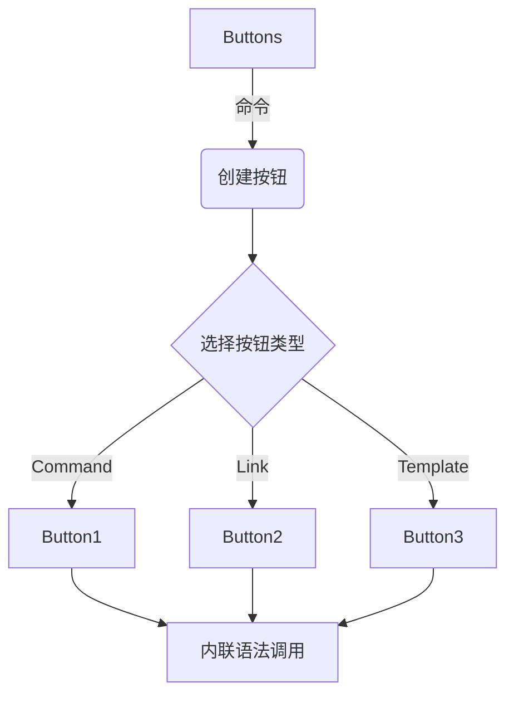

# Obsidian 插件：Buttons 美化必备的按钮插件

按钮插件是 Obsidian 中为数不多的自定义程度比较强的插件了，通过 Buttons 插件可以把系统和插件内置的命令可视化展示，类似建立快捷方式一样，可以迅速执行你设置好的命令。

## 概述

> [!Note] 插件名片
> - 插件名称：Buttons
> - 插件作者：Sam Morrison
> - 插件说明：在 Obsidian 笔记中创建按钮，执行相关运行命令。按钮样式支持自定义，支持调用 Ob 命令和其他插件命令，也可以执行 JS 脚本命令。
> - 插件分类：自动化, 效率
> - 插件项目地址：[点我访问](https://github.com/shabegom/buttons)
> - 国内下载地址：[下载安装](https://pkmer.cn/products/plugin/pluginMarket/?buttons)

## 特性

buttons 的官方文档关于这个插件的功能非常详细，主要有下面几个功能：

| 按钮类型        | Button Type            | 介绍                                                         |
| --------------- | ---------------------- | ------------------------------------------------------------ |
| 命令            | command                | 选择要运行的命令面板命令                                     |
| 链接            | Link                   | 写入 URL 或 URI                                              |
| 计算            | calculate              | 编写数学公式                                                 |
| 模板 - 前置     | Prepend Template       | 点按按钮以将模板预置到当前笔记                               |
| 模板 - 追加     | Append Template        | 点按按钮以将模板追加到当前笔记                               |
| 模板 - 在行添加 | Add Template at Line   | 单击按钮将模板添加到指定行的当前注释中                       |
| 模板 - 新建笔记 | New Note From Template | 选取模板，输入新笔记的名称，选取是否应在拆分窗格中打开新笔记 |
| 文本 - 前置     | Prepend                | 点按按钮以在当前笔记前追加文本                               |
| 文本 - 追加     | Append                 | 点按按钮以将当前笔记末追加文本                               |
| 文本 - 在行添加 | Add Text at Line       | 单击按钮以将文本添加到指定行的笔记中                         |
| 文本 - 新建笔记 | New Note               | 写下新笔记的名称，选择是否应在新的面板中打开笔记             |
| 交换            | Swap                   | 写下每次点击时交换按钮的按钮块 ID，例如 [id1, id2]           |

## 使用

buttons 使用流程图如下：



### 创建按钮

- 使用 buttons 插件首先需要 `Ctrl+p` 打开命令行，选择创建一个按钮。


- 输入一个按钮名称，选择按钮类型，输入一个不重复的 id ，其他选项默认即可创建一个按钮。
  
主要就是设置这几个选项
1. button 名称，button 上显示的名称；
2. button 类型，类型是最重要的；
3. button id,其他笔记调用是用

创建好的按钮，在编辑模式下看类似下面这样的代码块

比如 Buttons 中最常用的功能就是 执行命令和跳转网页链接

- 执行命令的按钮

````xml
```button
name Pkmer
type command
action 在新面板中打开光标处链接
```
^button-pkmer
````

- 跳转到网页链接的按钮

````xml
```button
name pkmer website
type link
action https://pkmer.cn
```
^button-shyu
````

### 使用按钮

配置好按钮后，就可以通过按钮 ID 使用这些按钮

`Ctrl+p` 选择 “insert inline button”


显示的就是刚创建的 buttons id，通过 id 即可实现按钮复用。


### 扩展应用

- 通过 buttons link 类型，配合 [[obsidian-advanced-uri]] 插件 调用 `Obsidian://` 开头的链接实现 ob 的功能。
- 通过 buttons link 类型，调用 `file:///` 比如 `file:///D:/Documents` 打开电脑中的文件
- 通过 buttons command 类型，调用插件创建的链接，比如 [[quickadd]] [[templater-obsidian]] 都可以生成对应指令
- 通过 buttons template 类型 ,配合 [[templater-obsidian]]，直接调用模板。
- 通过 buttons 自定义 css，利用 [[obsidian-admonition]] 插件生成一个容器，把按钮进去进行归类。 更多样式参考 [[Blue Topaz 示例库简介|Blue Topaz example]]
  


