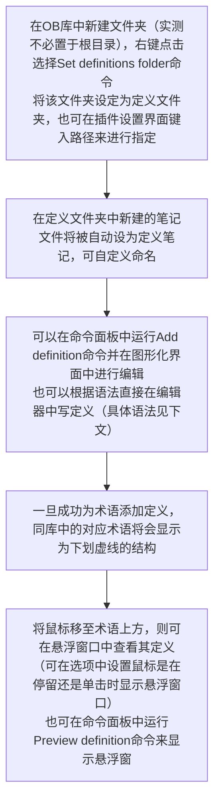

# Obsidian 插件：note definitions 创建属于你自己的术语表

## 概述

Obsidian Note Definitions 是一个个人词典插件，可以在笔记中方便地查找。只需在 Obsidian vault 的根目录下创建一个名为 `definitions` 的文件夹，然后在其中创建定义文件，并按照定义规则添加定义。一旦定义注册成功，笔记中的单词将被下划线标记，右键单击单词或使用命令即可触发下拉菜单显示单词的定义。此外，还可以通过编辑器菜单和命令来预览或跳转到单词的定义。插件使用 Markdown 语法解析定义文件，需要遵循严格的规则，包括单词、别名（可选）和定义的顺序，以及使用三个破折号作为分隔符。插件可以帮助用户快速查找笔记中的单词定义，提高阅读效率。

> [!Note] 插件名片
> - 插件名称：Note Definitions
> - 插件作者：Dominic Let
> - 插件版本：0.25.0
> - 插件概述：打造笔记的个人词典
> - 插件项目地址：[点我跳转](https://github.com/dominiclet/obsidian-note-definitions?tab=readme-ov-file#definition-context)
> - 国内下载地址：[下载安装]( https://pkmer.cn/show/20240611085920 )

## 基本用法



目前 `定义笔记` 分 `consolidated` 和 `atomic` 两种类型，需要在文档属性中用 `def-type` 指定，如果未在文档属性中指定 `定义笔记` 类型则默认为 `consolidated` 类型，但由于未来的更新可能会改变这一规则，故建议为每一个 `定义笔记` 指定类型，既可通过命令面板中的 `Register consolidated definition type` 或 `Register atomic definition type` 来快捷指定，也可直接在文档属性中写入指定类型：

```
---
def-type: consolidated 或 atomic
---
```

## consolidated 类型定义笔记的语法规则

`consolidated` 类型的 `定义笔记` 可以容纳多项定义，适合作为文献笔记的术语表、文学作品的人物表或个人词典的略语表这样单个 `术语` 的 `定义` 较短

`定义块`（definition block）是其基本组成部分，由 `术语`、`别名`（可选）、`定义` 和 `分隔符` 构成，必须按照句中的顺序排列，彼此之间需要空一行。

- `术语` 是被定义的对象，格式为 `# 术语`，即 Markdown 的标题语法，`术语` 可以是多个单词组成的句子。
- `术语` 下另起一行可以添加 `别名`，格式为 `*别名*`，即 Markdown 的斜体语法，`别名` 并不是必须的，一个 `术语` 可以有多个 `别名`，`别名` 和 `别名` 之间用英文逗号隔开
- `术语` 和别名下方直到下一个 `术语` 的语句被视为 `定义`，支持 Markdown 语法，可以跨越多行，由分隔符 `---` 或 `___` 来标记其结束的位置（可在选项中选择）
- 示例：

```
# 诸葛亮

*孔明*,*丞相*,*卧龙*

三国时期政治家、军事家

---
```

## atomic 类型定义笔记的语法规则

顾名思义，`atomic` 类型的 `定义笔记` 仅包含一个 `术语`，适合 `定义` 内容较多的 `术语`，或可配合个人的维基知识库使用

- 笔记名即是被定义的 `术语`
- `别名` 在文档属性中用 `aliases` 指定，多个 `别名` 以无序列表的形式写入：

```
---
aliases:
  - 别名1
  - 别名2
---
```

- 笔记内容即是 `术语` 的 `定义`，与其他 OB 笔记的写法无异，自由发挥即可

## 指定特定定义笔记

一篇笔记可以指定一篇或多篇特定的 `定义笔记`，既可以在命令面板中运行 `Add definition context` 命令并选择所需的 `定义笔记`，也可以直接在笔记的文档属性中添加键 `def-context` 并键入 `定义笔记` 的路径来实现这一效果：

```
---
def-context:
	- definitions/定义笔记1.md
	- definitions/定义笔记2.md
---
```
