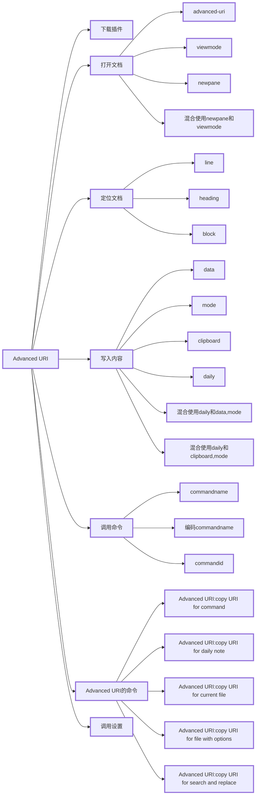

# obsidian-advanced-uri

> [!note] Advanced URI
> 插件 ID：obsidian-advanced-uri
> 插件作者：Vinzent
> 插件描述：obsidian URI 的功能增强
> 插件版本：1.35.0
> 插件源码地址：[obsidian-advanced-uri (github.com)](https://github.com/Vinzent03/obsidian-advanced-uri)
> 插件文档地址：[Obsidian Advanced URI Docs](https://vinzent03.github.io/obsidian-advanced-uri/)
> 彩蛋：[[obsidian-advanced-uri-青年与禅师的技术尬聊]]



## 基本功能

URI（Uniform Resource Identifier）翻译成中文就是统一资源标识符。RFC2396 分别对这 3 个单词进行了如下定义：

1. Uniform：规定统一的格式可方便处理多种不同类型的资源，而不用根据上下文环境来识别资源指定的访问方式。另外，加入新增的协议方案（如 http: 或 ftp:）也更容易。
2. Resource：资源的定义是“可标识的任何东西”。除了文档文件、图像或服务（例如当天的天气预报）等能够区别于其他类型的，全都可作为资源。另外，资源不仅可以是单一的，也可以是多数的集合体。
3. Identifier：表示可标识的对象。也称为标识符。

其实说白了就是通过一个链接定位资源的方式，也可以理解为通过一个链接告诉目标软件需要干什么事。

Obsidian 自带了一些 URI，该插件的主要功能是增加一些 URI，让其能执行更多操作。理论上通过这个插件能执行任意操作，因为该 URI 允许执行 Obsidain 的命令，结合脚本插件能大大拓宽能做的范畴。


如上图所示：我在 typora 中写好了一个打开 `table-test` 文件的 URI，在 typora，浏览器或者任意支持点击链接的地方都能定位到 Obsidian 的 `table-test` 文件。一个链接定位万物。

## 用法

### 打开文档

（1）advanced-uri

Advanced URI 以 obsidian://advanced-uri 开头，后接参数，以参数控制 URI 的行为，比如，参数 valut 表示 Obsidian 的库，参数表示目标文档，如下是在 testNote 库里打开 emoji 文档的示例：

```
[打开emoji文档](obsidian://advanced-uri?vault=testNote&filepath=emoji)
```

（2）viewmode

参数 viewmode 控制打开后的文档的显示模式，其中 viewmode 的值可为：preview（阅读视图），live（实时阅览），source（源码视图）。

以下在 testNote 库中以阅读模式打开 emoji 文档的示例：

```
[以阅读模式打开emoji文档](obsidian://advanced-uri?vault=testNote&filepath=emoji&viewmode=preview)
```

（3）newpane

参数 newpane 控制 Advanced URI 插件在打开新文档的时候，是否在新页面打开，newpane 为 true 则在新页面打开，newpane 为 false 在当前页面打开。

```
[在新页面打开emoji文档](obsidian://advanced-uri?vault=testNote&filepath=emoji&newpane=true)

[在当前页面打开emoji文档](obsidian://advanced-uri?vault=testNote&filepath=emoji&newpane=false)
```

（4）混合使用 newpane 和 viewmode

多个参数 key-value 之间通过 `&` 链接，如下在 testNote 库中以 preview 模式在新页面打开 emoji 文档：

```
[以阅读视图在新页面打开emoji文档](obsidian://advanced-uri?vault=testNote&filepath=emoji&newpane=true&viewmode=preview)
```

### 定位文档

（1）line

在打开新文档后，参数 line 可将编辑光标定位到行，如下在 testNote 库中打开 emoji 文档，并将编辑光标定位到第 10 行：

```
[打开文件定位到第10行](obsidian://advanced-uri?vault=testNote&filepath=emoji&line=10)
```

（2）heading

在打开新文档后，参数 heading 可将编辑光标定位到标题上，如下在 testNote 库中打开 emoji 文档，并将编辑光标定位到“标题二”上：

```
[打开emoji文档定位到标题二](obsidian://advanced-uri?vault=testNote&filepath=emoji&heading=标题二)
```

（3）block

在打开新文档后，参数 block 可将编辑光标定位到块上，如下在 testNote 库中打开 emoji 文档，并将编辑光标定位到索引为“20230419”的块上：

```
我是一个自然段落 ^20230419

[打开emoji文档定位到块](obsidian://advanced-uri?vault=testNote&filepath=emoji&block=20230419)
```

### 写入内容

（1）data

参数 data 可以在打开文档后填入内容，不过，默认只在新文档中填入参数 data 的值，如果打开已有的文档是不会填进内容的

```
[只对新文档写入](obsidian://advanced-uri?vault=testNote&filepath=emoji&data=20230419)
```

（2）mode

当参数 mode 的值为 new 时，总是打开新文档，如下，在 testNote 库中新建文档，文档名为 emoji，并在文档中添加内容“222”，注意：如果 testNote 库中已有 emoji 文档，则文档名会以从 1 开始的递增数字进行命名。

```
[新建文档](obsidian://advanced-uri?vault=testNote&filepath=emoji&data=222&mode=new)
```

当 mode 值为 append 时，会将 data 值添加到目标文档的末尾。

```
[将data值添加到文档末尾](obsidian://advanced-uri?vault=testNote&filepath=emoji&data=222&mode=append)
```

当 mode 值为 prepend 时，会将 data 值添加到目标文档的起始位置。

```
[将data值添加到文档起始位置](obsidian://advanced-uri?vault=testNote&filepath=emoji&data=222&mode=prepend)
```

（3）clipboard

参数 clipboard 决定是否将剪切板的内容添加到文档中，如下在 testNote 库中打开 emoji 文档的同时将剪切板内容追加到 emoji 文档之后。

```
[将剪切板内容追加到文档](obsidian://advanced-uri?vault=testNote&filepath=emoji&clipboard=true&mode=append)
```

（4）daily

参数 daily 决定是否直接打开当天日志文档，daily 值为 true 则允许打开，false 则不可打开。

```
[打开当天日记](obsidian://advanced-uri?vault=testNote&daily=true)
```

（5）混合使用 daily 和 data、mode

在 testNote 库中在打开日志文档，在文档内容后追加内容“222”

```
[追加到日志](obsidian://advanced-uri?vault=testNote&daily=true&data=222&mode=append)
```

（6）混合使用 daily 和 clipboard、mode

在 testNote 库中在打开日志文档，在文档内容后追加剪切板内容。

```
[将剪切板内容追加到日志](obsidian://advanced-uri?vault=testNote&daily=true&clipboard=true&mode=append)
```

### 调用命令

（1）commandname

通过参数 commandname 调用 Obsidian 命令，如下，调用“代码块”命令，并作用在 testNote 库中的 emoji 文档末尾处：

```
[在emoji文档中调用‘代码块’命令](obsidian://advanced-uri?vault=testNote&filepath=emoji&commandname=代码块&mode=append)
```

（2）编码 commandname

在 Advanced URI 里中文以及空格会被编码转换为 ASCII 码，否则命令无法正常调用，如下在 testNote 库中的 emoji 文档中调用“导出为 PDF”命令。

```
[调用命令将emoji导出为PDF（编码转换）](obsidian://advanced-uri?vault=testNote&filepath=emoji&commandname=%E5%AF%BC%E5%87%BA%E4%B8%BA%20PDF)
```

（3）commandid

由于 commandname 需要编码转换，因此调用命令最好使用 commandid，commandid 无须手动填写，Advanced URI 插件已经提供了获取途径：

Ctrl+P 打开命令框，搜索“Advanced URI”，选择“Advanced URI：copy URI for command”


选择 emoji 文档：


选择命令“导出为 PDF”：


自动生成 Advanced URI 并自动复制进剪切板“

```
obsidian://advanced-uri?vault=testNote&commandid=workspace%253Aexport-pdf&uid=9d53b498-c1bd-4295-844e-1555764b9cbd
```

粘贴到文档中，配合 markdown 语法，生成带有 commandid 的 Advanced URI 链接：

```
[copy URI for 导出为PDF](obsidian://advanced-uri?vault=testNote&commandid=workspace%253Aexport-pdf&uid=9d53b498-c1bd-4295-844e-1555764b9cbd)
```

### Advanced URI 的命令

Ctrl+P 打开命令框，在命令框里输入“Advanced URI”，可以看到几个以 Advanced URI 开头的命令：


（1）Advanced URI：copy URI for command

这个命令是用来生成调用 Obsidian 命令的 URI，生成的 URI 存放在剪切板里，具体使用流程：

Ctrl+P 打开命令框 -> 搜索“Advanced URI” -> 选择“Advanced URI：copy URI for command” -> 选择目标文档 -> 选择命令 ->自动生成 URI 进剪切板 -> 配合 markdown 语法粘贴使用。

```
[copy URI for 导出为PDF](obsidian://advanced-uri?vault=testNote&commandid=workspace%253Aexport-pdf&uid=9d53b498-c1bd-4295-844e-1555764b9cbd)
```

（2）Advanced URI：copy URI for daily note

这个命令是用来生成日志文档的 URI，生成的 URI 存放在剪切板里，具体使用流程：

Ctrl+P 打开命令框 -> 搜索“Advanced URI” -> 选择“Advanced URI：copy URI for daily note” -> 输入待添加内容 -> 选择待添加内容定位方式 ->自动生成 URI 进剪切板 -> 配合 markdown 语法粘贴使用。

```
[打开今日日记](obsidian://advanced-uri?vault=testNote&daily=true&data=222&mode=prepend)
```

（3）Advanced URI：copy URI for current file

这个命令是用来生成当前文档的 URI，生成的 URI 存放在剪切板里，具体使用流程：

Ctrl+P 打开命令框 -> 搜索“Advanced URI” -> 选择“Advanced URI：copy URI for current file” ->自动生成 URI 进剪切板 -> 配合 markdown 语法粘贴使用。

```
[使用uid访问文档](obsidian://advanced-uri?vault=testNote&uid=1111)
```

（4）Advanced URI：copy URI for file with options

这个命令是用来生成目标文档的 URI，生成的 URI 存放在剪切板里，具体使用流程：

Ctrl+P 打开命令框 -> 搜索“Advanced URI” -> 选择“Advanced URI：copy URI for file with options” -> 选择目标文档 -> 输入待添加内容 -> 选择待添加内容定位方式 ->自动生成 URI 进剪切板 -> 配合 markdown 语法粘贴使用。

```
[打开uid为111的文档](obsidian://advanced-uri?vault=testNote&uid=111&data=222&mode=prepend)
```

（5）Advanced URI：copy URI for search and replace

这个命令是用来生成目标文档的 URI，生成的 URI 存放在剪切板里，具体使用流程：

Ctrl+P 打开命令框 -> 搜索“Advanced URI” -> 选择“Advanced URI：copy URI for search and replace” -> 选择目标文档 -> 输入待查找内容 -> 输入待替换内容 ->自动生成 URI 进剪切板 -> 配合 markdown 语法粘贴使用。

```
[在uid文档中将所有22替换为11](obsidian://advanced-uri?vault=testNote&search=22&replace=11&uid=111)
```

### 调用设置

在 Obsidian 设置页面，每个设置项都有一个 settingid，在使用 Advanced URI 的时候，可以使用 settingid 打开对应的设置项：

```
[打开设置](obsidian://advanced-uri?vault=testNote&settingid=editor)
```

settingid 对应的中文含义，想打开哪个设置就使用对应的 id 吧。

| id                | 含义       |
| ----------------- | ---------- |
| editor            | 编辑器     |
| file              | 文件及链接 |
| appearance        | 外观       |
| hotkeys           | 快捷键     |
| about             | 关于       |
| account           | 账户       |
| core-plugins      | 核心插件   |
| community-plugins | 第三方插件 |
| theme-browser     | 主题浏览   |
| plugin-browser    | 插件浏览   |
| note-composer     | 笔记重组   |
| backlink          | 反链       |
| switcher          | 快速切换   |
| command-palette   | 命令面板   |
| daily-notes       | 日记       |
| file-recovery     | 文件恢复   |
| page-preview      | 页面预览   |
|                   |            |