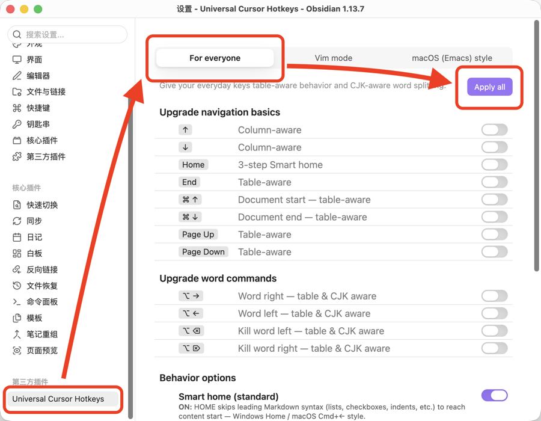
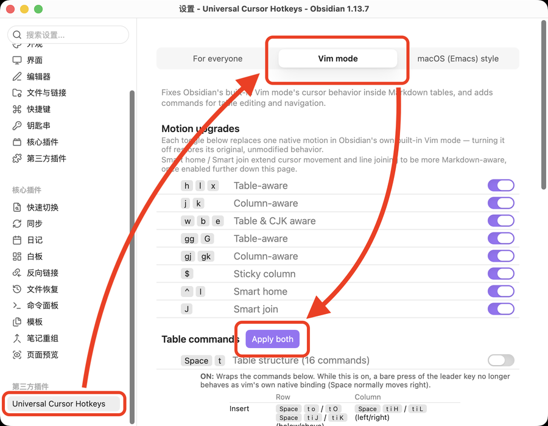

# Obsidian 插件：Universal Cursor Hotkeys

> [!Note] 插件名片
> - 插件名称：Universal Cursor Hotkeys
> - 插件作者：shichishima
> - 插件说明：让你平时使用的方向键、Home/End、Page Up/Down、单词跳转，在 Live Preview 表格里也能正常工作，并支持中文分词。Vim 模式、macOS 风格 Emacs 快捷键同样获得这一升级。
> - 插件分类：['快捷键', '编辑工具', 'Vim', '中文分词', '表格', 'obsidian插件']
> - 项目地址：[点我访问](https://github.com/shichishima/obsidian-universal-cursor-hotkeys)
> - 国内下载地址：[下载安装](https://pkmer.cn/products/plugin/pluginMarket/?universal-cursor-hotkeys)
> - 自述文件：[Readme](https://ghproxy.net/https://raw.githubusercontent.com/shichishima/obsidian-universal-cursor-hotkeys/main/README.md)

## 概述

### 主要功能

**不用 Vim/Emacs 也一样有效（For everyone）**
不用 Vim 模式，也不用 Emacs 风格快捷键。方向键、Home/End、Page Up/Down、按词跳转（Ctrl+←/→），装上插件后自动获得表格感知能力，同时支持中文分词。而且不是"暗地里"接管按键——每一项都是 Obsidian 标准 Hotkeys 系统里真实可见的一条设置，随时能在 设置 → 快捷键 里看到、关闭或者改绑，跟其他任何 Obsidian 快捷键完全一样。

**Vim 模式的表格对应**
在 Obsidian 表格内，Vim 模式的 `hjkl`/`w`/`b`/`e`/`gg`/`G` 终于能像在普通文本中一样顺畅移动了，不再卡在单元格边界。搭配 leader-key（默认 leader 为 Space），可以直接用 Vim 方式增删移动表格的行和列，以及在单元格之间跳转——光标移动和表格结构操作都覆盖到了。

**macOS 风格 Emacs 快捷键的表格对应**
即使不用 Vim 模式，Ctrl+P/N/B/F/A/E 等 macOS 风格光标移动、Kill & Yank、Kill Region 等编辑命令，在表格单元格内同样正常工作。Windows 用户启用这一整套后，也能在 Obsidian 全局获得 macOS 同款的光标操作体验。

### 适用场景
- 用 Vim 模式编辑 Markdown 笔记、经常需要编辑表格的用户
- 中文用户：双击选择文本、Vim 单词移动（`w`/`b`/`e`）都基于分词，而不是把一长串汉字当成一个词
- 想要 macOS 风格光标快捷键（Ctrl+P/N/B/F/A/E）的用户
- 不用 Vim 模式、也不用 Emacs 风格快捷键，只想保持平时按键习惯的用户

### 核心特色
这个插件的出发点是让 Vim 模式**认识表格**：`w`/`b`/`e` 要在单元格之间正确移动，就必须接管 Vim 自己的按词移动逻辑（`Vim.defineMotion`）。也正因为接管了这一层，如果同时装了其他修改同一逻辑的中文分词插件（比如 `cm-chs-patch`），两者会相互覆盖——具体哪一个生效取决于加载顺序，无法真正同时用上两边的效果。

于是 Universal Cursor Hotkeys 自己内置了基于 `Intl.Segmenter` 的分词，不用额外装分词插件，双击选择文本、`w`/`b`/`e` 按词移动都能正确识别中文词语边界，而不是把一长串汉字当成一整个词。分词精度不追求堪比专业分词库，但保证表格内外都能正确识别中文词语边界。

同一套"表格感知"逻辑也注册成了普通的 Obsidian 命令，所以不用 Vim 模式、只想要 macOS 风格 Emacs 快捷键（Ctrl+P/N/B/F/A/E、Kill & Yank）的用户一样能用，包括在表格里。

其他细节：
- Vim 模式下，`<leader>t` + 按键额外提供 16 个表格结构命令（插入/删除/移动/复制行列、对齐），原生的 `dd`/`o` 等按键含义不变，纯粹是新增，不覆盖原有习惯
- For everyone / Vim 模式 / macOS 风格 Emacs 快捷键，各自设置标签页都有专属的 Apply all（或 Apply recommended）按钮，一键分配该标签页的所有推荐快捷键

### 使用建议
1. 只想保持平时按键习惯：打开 **设置 → Universal Cursor Hotkeys → For everyone**，点击 **Apply all**

2. 使用 Vim 模式：打开 Obsidian 内置 **Vim 按键绑定**（设置 → 编辑器）即可，表格内的光标移动修复已经默认生效。如果还想用 leader-key 的表格结构命令，再到 **设置 → Universal Cursor Hotkeys → Vim mode** 点击 **Apply both**

3. 使用 macOS 风格 Emacs 快捷键：打开 **设置 → Universal Cursor Hotkeys**，对 Cursor movement / Editing / Other hotkeys 三组分别点击 **Apply recommended**

如果你觉得这个插件对你有帮助，欢迎去 GitHub 点个 ⭐ Star 支持一下作者！
