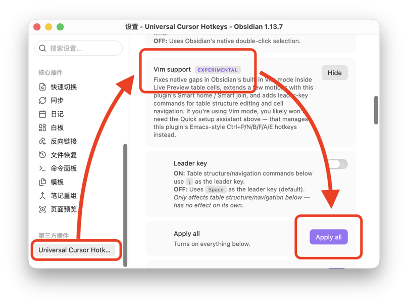

# Obsidian 插件：Universal Cursor Hotkeys

> [!Note] 插件名片
> - 插件名称：Universal Cursor Hotkeys
> - 插件作者：shichishima
> - 插件说明：让 Obsidian 内置 Vim 模式和 macOS 风格 Emacs 快捷键在实时预览（Live Preview）表格内也能正常工作，并内置中文分词支持。
> - 插件分类：['快捷键', '编辑工具', 'vim', '分词', '表格', 'obsidian插件', '自定义命令', '文字处理']
> - 项目地址：[点我访问](https://github.com/shichishima/obsidian-universal-cursor-hotkeys)
> - 国内下载地址：[下载安装](https://pkmer.cn/products/plugin/pluginMarket/?universal-cursor-hotkeys)
> - 自述文件：[Readme](https://ghproxy.net/https://raw.githubusercontent.com/shichishima/obsidian-universal-cursor-hotkeys/main/README.md)

## 概述

### 主要功能
在 Obsidian 表格内，Vim 模式的 `hjkl`/`w`/`b`/`e`/`gg`/`G` 终于能像在普通文本中一样顺畅移动了，不再卡在单元格边界。0.10.0 新增了一整套 leader-key 命令（默认 leader 为 Space），可以直接用 Vim 方式增删移动表格的行和列，以及在单元格之间跳转——光标移动和表格结构操作都覆盖到了。

### 适用场景
- 用 Vim 模式编辑 Markdown 笔记、经常需要编辑表格的用户
- 中文用户：双击选中、Vim 单词移动（`w`/`b`/`e`）都基于分词，而不是把一长串汉字当成一个词
- 非 Vim 用户：只想要 macOS 风格光标快捷键（Ctrl+P/N/B/F/A/E）的用户，插件同样支持

### 核心特色
这个插件的出发点是让 Vim 模式**认识表格**：`w`/`b`/`e` 要在单元格之间正确移动，就必须接管 Vim 自己的按词移动逻辑（`Vim.defineMotion`）。也正因为接管了这一层，如果同时装了其他修改同一逻辑的中文分词插件（比如 `cm-chs-patch`），两者会相互覆盖——具体哪一个生效取决于加载顺序，无法真正同时用上两边的效果。

于是 Universal Cursor Hotkeys 自己内置了基于 `Intl.Segmenter` 的分词，不用额外装分词插件，双击选中、`w`/`b`/`e` 按词移动都能正确识别中文词语边界，而不是把一长串汉字当成一整个词。

同一套"表格感知"逻辑也注册成了普通的 Obsidian 命令，所以不用 Vim 模式、只想要 macOS 风格 Emacs 快捷键（Ctrl+P/N/B/F/A/E、Kill & Yank）的用户一样能用，包括在表格里。

其他细节：
- `<leader>t` + 按键额外提供 16 个表格结构命令（插入/删除/移动/复制行列、对齐），原生的 `dd`/`o` 等按键含义不变，纯粹是新增，不覆盖原有习惯
- 设置页的 Quick setup assistant / Apply all 一键分配所有推荐快捷键

### 使用建议
1. 使用 Vim 模式：打开 Obsidian 内置 **Vim 按键绑定**（设置 → 编辑器），再到 **设置 → Universal Cursor Hotkeys → Vim support** 点击 **Apply all**
2. 使用 Emacs 风格快捷键：打开 **设置 → Universal Cursor Hotkeys**，对 Cursor movement / Editing / Other hotkeys 三组分别点击 **Apply recommended**

如果你觉得这个插件对你有帮助，欢迎去 [GitHub](https://github.com/shichishima/obsidian-universal-cursor-hotkeys) 点个 ⭐ Star 支持一下作者！

---

