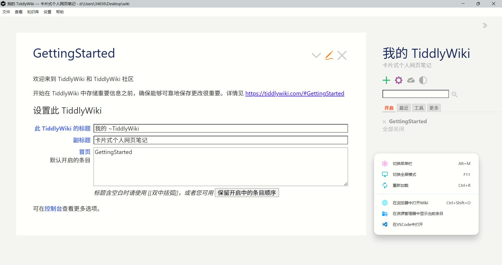
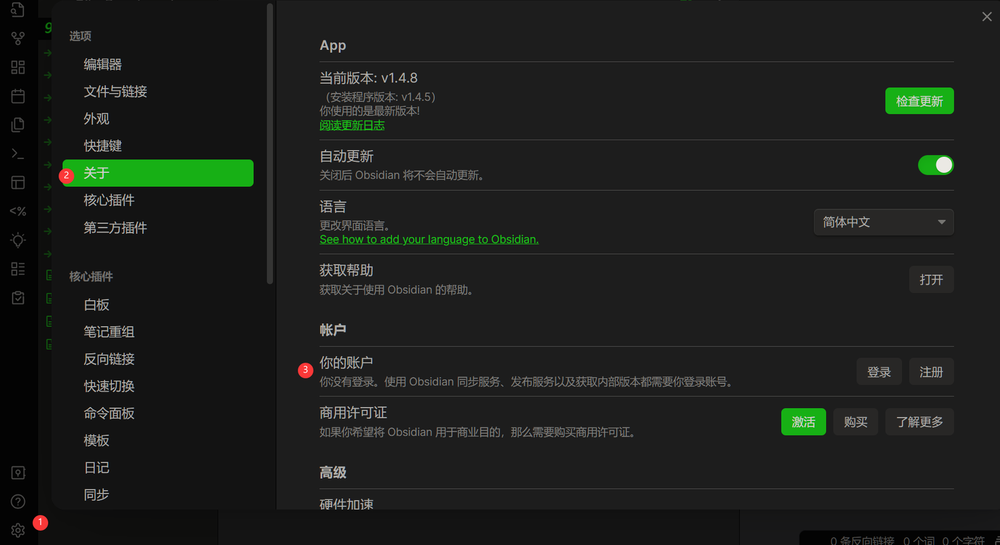
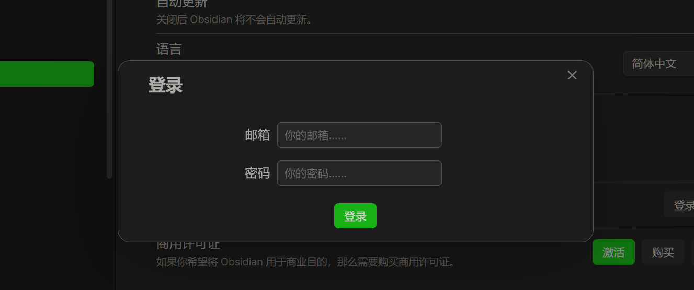
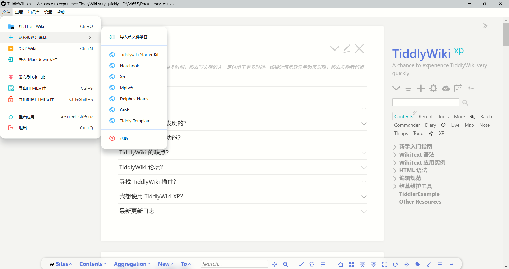

# TiddlyWiki App

-   GitHub: https://github.com/oeyoews/tiddlywiki-app
-   下载地址: https://github.com/oeyoews/tiddlywiki-app/releases
-   文档: https://oeyoews.github.io/tiddlywiki-app/README.zh-CN.html

## 🌟 简介

TiddlyWiki-App 是一款基于 Electron 的跨平台桌面应用程序，它可封装了 TiddlyWiki，可以运行在 Windows、Mac 和 Linux 平台上。

## ✨ 功能特点

-   🔧 系统托盘支持，最小化到托盘
-   📂 支持模板导入, 单文件导入
-   📂 支持 Markdown 批量导入
-   🔒 支持加密构建 HTML
-   🚀 支持多种启动方式：
    -   💻 本地服务器模式
    -   🌐 浏览器打开
-   📄 支持子 Wiki
-   📝 Wiki 管理功能：
    -   📂 打开/切换 Wiki
    -   🔨 构建静态 Wiki
    -   📁 在系统文件管理器中打开
    -   🚀 一键部署到 GitHub Pages
-   🌍 国际化支持
    -   🇨🇳 简体中文
    -   🇺🇸 English
-   🔄 自动更新功能

## ⚡ 基本操作

使用菜单栏或系统托盘进行操作：

-   📋 文件菜单：
    -   📂 打开 Wiki：选择其他 Wiki 文件夹
    -   🔨 构建 Wiki：生成静态 HTML 文件
    -   🌐 在浏览器中打开：使用默认浏览器打开当前 Wiki
    -   📁 打开当前 Wiki 文件夹：在文件管理器中查看
-   🔽 系统托盘：
    -   🖱️ 左键点击：切换窗口显示/隐藏
    -   📌 右键菜单：快速访问常用功能
-   ⌨️ 快捷操作
    -   🔽 最小化：窗口会自动隐藏到系统托盘
    -   ❌ 关闭按钮：默认最小化到托盘，可通过托盘菜单完全退出

## 🌈 截图

### 空白版本

### TiddlyWiki Starter Kit 版本

### TiddlyWiki xp 版本

### 导入模板

## 其他

其他讨论和问题可以在上述仓库中提出。
