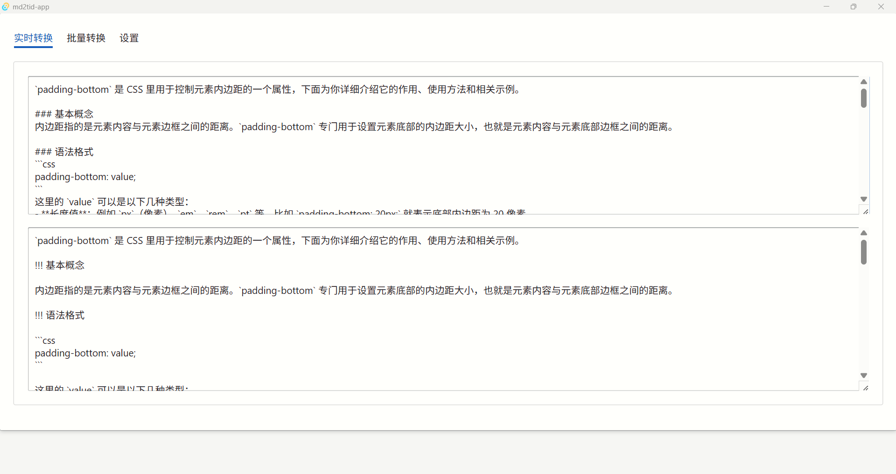
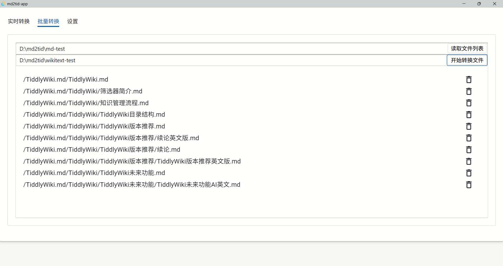

# MD2TID

## 简介

-   项目地址：https://github.com/Zacharia2/md2tid-app
-   在线体验：https://github.com/tiddly-gittly/md-to-tid

有时候想保存 AI 生成的笔记内容，发现 AI 使用的 markdown 格式，并非 TiddlyWiki 里的 wikitext 格式。所以就有了这个项目，可以把 AI 生成的 markdown 文件转换成 wikitext 格式的 tid 文件。

另一个使用场景是当你想从其他笔记软件转换到 TiddlyWiki 时，可以用这个软件批量转换。

TiddlyWiki 本身是支持 markdown 格式的，但 markdown 格式在很多方面与 TiddlyWiki 的 wikitext 语法有所不同，因而还是推荐在 TiddlyWiki 里使用 wikitext 语法保存笔记。

## 安装

在上面 GitHub 仓库中下载安装包，解压后运行 md2tid.exe 即可。

## 实时转换

## 批量转换

## 其他

目前功能还不够完备，但己足够使用。

有些非常复杂或特殊的 markdown 语法还不支持，问题主要是 [MD2TID](https://github.com/tiddly-gittly/md-to-tid) 没有做兼容处理，因而有问题可以在[此处](https://github.com/tiddly-gittly/md-to-tid/issues/11)提交。

也可以使用网页版在线体验。
