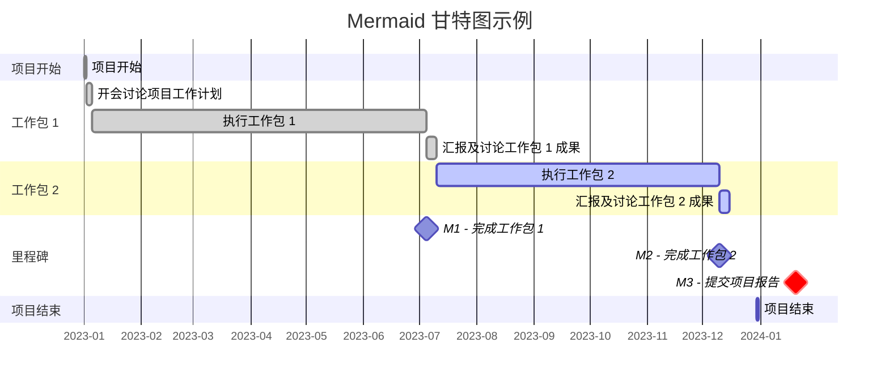

# 利用 Mermaid 甘特图在 Obsidian 中管理项目进度

## 背景

Obsidian 社区存在很多任务管理相关插件，自己常用来实现任务管理的一些插件包括但不限于：

- [[dataview|Dataview]]
	- 该插件可以用来查询及列出满足特定条件的、不同状态的、可以嵌套层级的任务
- [[obsidian-tasks-plugin|Tasks]]
	- 该插件和 Dataview 能够实现的功能类似，只不过其对于诸如如下方面的支持较好：
		- 快速给出满足查询条件的任务
		- 通过界面管理任务优先级、截止日期等属性
		- 循环发生的任务
- obsidian-task-marker
	- 该插件是本人开发的，可以方便更改任务状态、添加时间戳等
- [[obsidian-kanban|Kanban]]
	- 该插件可以用可视化的看板视图展示任务、笔记等
- [[obsidian-periodic-notes|Periodic Notes]]
	- 该插件可以用来管理周期性笔记，比如，每日、每周、每月、季度笔记等
		- 在其中可以创建对应的任务
- tasks-calendar|Tasks Calendar
	- 该插件可以用简化的语法查询通过 Tasks 及 Dataview 创建的任务
- todoist-sync-plugin|Todoist Sync
	- 该插件可以将 Obsidian 中的任务同步到 Todoist，也可以在 Obsidian 中显示 Todoist 中的任务
- [[obsidian-memos|Memos]]
	- 该插件可以创建带有时间戳前缀的任务
- [[白板]]
	- 这是一个 Obsidian 官方插件，可以用图示、箭头的方式来表示任务之间的依赖关系

上面简单介绍了一些任务管理插件的功能；可以看出，他们功能很丰富，涵盖任务管理的多个方面。但是，假如想要从更高层级的角度管理整个项目的进度，可能就需要借助其他项目管理工具。

本文介绍如何利用 [[Mermaid语法]] 创建甘特图（Gantt Chart），以便从宏观的角度管理项目进度。

## 甘特图语法

### 代码框

简单来说，利用 Mermaid 语法创建甘特图时，有如下要点：

- 在代码框第一行用 `mermaid` 字样表明这是要创建 Mermaid 图
- 在代码框第二行指明所要创建的图类型，比如 `gantt`
- 每个命令后面用一个空格隔开，接下来给出对应于该命令的具体内容
	- 比如，`title Mermaid 甘特图示例` 会给出甘特图的标题
- 代码框的剩余部分可以定义更为详细的成分

考虑到上述准则， 如下是一个利用 Mermaid 创建甘特图的示例代码框：

````
```mermaid
gantt
	title Mermaid 甘特图示例
	xx
```
````

### 常用命令

具体到如何利用 Mermaid 语法创建甘特图，下面介绍一些常用的命令：

- title
	- 甘特图标题
- dateFormat
	- 任务起止日期的格式
	- 比如，YYYY-MM-DD 代表 2023-01-01 这样的日期格式
- axisFormat
	- 甘特图下方时间轴显示日期的格式
	- 比如，%Y-%m 代表 2023-01 这样的月份格式
- tickInterval
	- 甘特图下方时间轴显示日期的间隔
	- 比如，1month 表示会以一个月的间隔给出显示日期
- todayMarker
	- 表示今天日期在甘特图中的位置
		- `off` 表示不显示今天日期标记
	- 比如，`stroke-width:3px,stroke:#FBBC05,opacity:0.6` 这个语法调整了如下方面的显示样式：
		- 线宽度
		- 线颜色
		- 线透明度
- section
	- 定义任务分类/区

### 任务属性

定义具体任务相关的属性时，可以包含如下成分：

- 任务名称
	- 这个在命令的最开始
- 任务状态
	- 可能选择的任务状态包括：
		- active
		- done
		- 留空不填写任何内容
	- 简单来说，将任务定义为不同状态时，对应任务块在甘特图上会以不同颜色显示
- 任务标签
	- 比如，a1 可以用来代表一个任务标签
	- 这个可以用来在定义其他任务时引用该任务
		- 比如，定义第二个任务时，可以用 `after a1` 的形式表示这个任务在第一个任务结束后才开始
- 任务开始日期
	- 可能的定义方式包括：
		- 2023-01-01 这样的绝对日期格式
		- after a1 这样的相对日期格式
- 任务截止日期
	- 可能的定义方式包括：
		- 2023-02-01 这样的绝对日期格式
		- 1d, 1M 这样的持续时间格式
			- 这两个分别代表一天、一个月
- 里程碑
	- 定义里程碑时，只需用 `milestone` 这个关键词来表示即可

总结下来，定义一个任务时可能用如下方式来定义：

```
section 工作包 1
开会讨论项目工作计划: done, a1, after a0, 2023-01-05

section 里程碑
M1 - 完成工作包 1: milestone, after a2, 0d
```

## 甘特图示例

结合之前的介绍，如下是一个完整的甘特图代码框和对应的图示效果：

````

````


从这个甘特图中，可以看到每个任务的起止日期及状态、任务之间的时间依赖情况、里程碑等，方便从总体上把握项目的进展，以便适时调整对应任务。

## 结语

本文介绍了如何利用 Mermaid 创建甘特图管理项目进度。感兴趣的读者还可从如下和 Mermaid 及甘特图相关的文档了解更为详细的内容：

- [[Mermaid语法]]

## 参考文献

撰写本篇文章时，主要参考了如下 Mermaid 官方资源：

- [mermaid-js/mermaid: Generation of diagrams like flowcharts or sequence diagrams from text in a similar manner as markdown](https://github.com/mermaid-js/mermaid)
- [Mermaid | Diagramming and charting tool](https://mermaid.js.org/)

感兴趣的读者还可从这些资源中找到更为丰富的 Mermaid 甘特图命令、显示样式等使用和定义方式。
