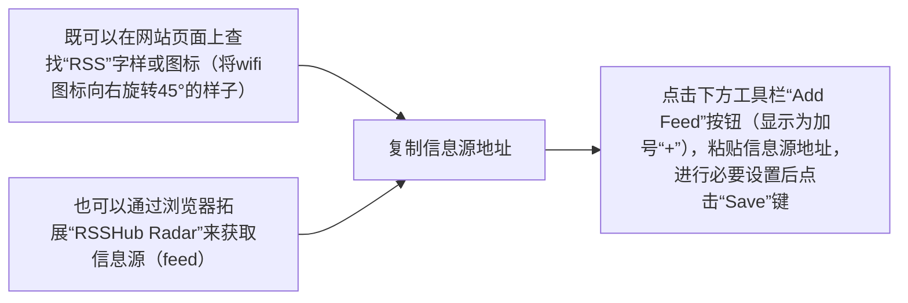

# Obsidian 插件：RSS Dashboard 在 Obsidian 中阅读 RSS 文章

> [!INFO] 本文档由 PKMer 论坛导入  
> - 作者: 血海狂屠
> - 原始链接: [Obsidian 插件：RSS Dashboard 在 Obsidian 中阅读 RSS 文章](https://forum.pkmer.net/t/7049)

---

> [!example] 插件名片
> - 插件名称：RSS Dashboard
> - 插件作者：amatya-aditya
> - 插件版本：2.1.0
> - 插件概述：`RSS Dashboard`插件可在`Obsidian`内部创建面板以查看RSS文章，除此之外，它还内置了油管以及播客播放器。自带的阅读器可抓取文章完整内容，并设置模板将其转化为Markdown格式。可通过文件夹和标签两套系统来管理信息源和文章。
> - 插件项目地址：[点我跳转](https://github.com/amatya-aditya/obsidian-rss-dashboard)
> - 国内下载地址：[下载安装](https://pkmer.cn/products/plugin/pluginMarket/?RSS Dashboard)

## 术语解说

RSS（英文全称：RDF Site Summary 或 Really Simple Syndication），中文译作简易信息聚合，也称聚合内容，是一种消息来源格式规范，用以聚合多个网站更新的内容并自动通知网站订阅者。使用RSS后，网站订阅者无需手动查看网站是否有新的内容，同时RSS能将多个网站的更新集成并以摘要形式呈现，有助于订阅者快速获取重要信息，并选择性点击查看。[^1]

## 基本用法

`RSS Dashboard`插件的界面类似于`Grid Explorer`插件 ，左侧边栏是信息源列表，可用文件夹或标签组织文章，右边主页面通过列表或卡片模式显示某信息源、文件夹或标签下的文章

左侧边栏从上到下依次为：
- “Dashboard”和“Discover”按钮可在看板和发现视图切换，看板视图所展示的是用户已订阅的信息源，而发现视图则是热门信息源的集合，帮助用户发现自己可能感兴趣的内容。
- 筛选器，如启用全部筛选器，则从上到下依次为“所有文章”、“星标文章”、“未读文章”、“已读文章”、“已存文章”、“视频”、“播客”、“标签”和“搜索”，除了“所有文章”、“标签”和“搜索”以外的筛选器均可在插件设置中禁用
- 信息源列表，以文件夹形式组织，这部分一目了然，不再赘述
- 快捷操作栏，从左到右依次为“添加新文件夹”、“排序（支持按照文件夹名、修改时间或创建时间排序）”、“折叠/展开所有文件夹”、“添加信息源”、“添加油管频道”、“导入OPML”、“导出OPML”或“管理信息源”

右侧主界面：
- 上方快捷操作栏按钮从左到右依次为“收起左侧边栏”、“当前筛选器/信息源名称”、“文章最大时限调整”、“按时间先后升序/降序”、“由信息源/时间/文件夹分组 或 不分组”、“列表或卡片视图”和“刷新”

点击任意文章后将打开RSS阅读器，默认打开与看板左右分屏，可左右拖动以调节大小，缩放自适应做得比较好，右上角按钮分别为“保存文章”和“在浏览器中打开（可选择是在OB自带网页浏览器中打开还是在系统浏览器中打开）”

## 设置说明

- General
	- `View style`：在卡片和列表视图之间切换
	- `Dashboard View Location`：选择看板是显示在主页面、左侧边栏还是右侧边栏
	-  `Reader View Location`：选择打开的文章是显示在主页面、左侧边栏还是右侧边栏
	- `Use Web Viewer`：如启用，则会在可用时，调用Obsidian核心插件`网页浏览器`而非系统浏览器打开原网页
	- `Refresh Intervals`：在滚动条中选择每次的刷新间隔（5-120分钟，每档差值为5）
	- `Maximum Items`：在滚动条中选择每个消息源最多可显示的文章数量（10-500，每档差值为10）
	- `Page Size for 'All Articles'`：在滚动条中选择在“All Articles”视图下，一次性展示的文章数量（20-200，每档差值为10）
	- `Page Size for 'Unread Items'`：在滚动条中选择一次性展示的未读文章数量（20-200，每档差值为10）
	- `Page Size for 'Read Items'`：在滚动条中选择一次性展示的已读文章数量（20-200，每档差值为10）
	- `Page Size for 'Saved Items'`：在滚动条中选择一次性展示的已存文章数量（20-200，每档差值为10）
	- `Page Size for 'Starred Items'`：在滚动条中选择一次性展示的星标文章数量（20-200，每档差值为10）
- Display
	- `Show Cover Image`：如启用，则将在阅读视图中显示封面图片
	- `Show Summary`：如启用，则将在卡片视图中显示内容摘要
	- `Use Domain Favicons` ：如启用，则将用域名图标，而非通用的RSS图标
	- `Filter Display Style`：选择左侧边栏的置顶筛选按钮是以水平列表还是图标的形式显示
	- `Default Filter`：在下拉列表中选择打开看板时的默认筛选器
	- Filter Visibility
		- `Starred Items`：如启用，则将在左侧边栏中显示“星标文章”筛选器
		- `Unread Items`：如启用，则将在左侧边栏中显示“未读文章”筛选器
		- `Read Items`：如启用，则将在左侧边栏中显示“已读文章”筛选器
		- `Saved Items`：如启用，则将在左侧边栏中显示“已存文章”筛选器
		- `Video`：如启用，则将在左侧边栏中显示“视频”筛选器
		- `Podcasts`：如启用，则将在左侧边栏中显示“播客”筛选器
- Media
	- `Auto-detect Media Type`：如启用，则插件将自动区分媒体类型
	- Youtube settings
		- `Default Youtube Folder`： 在空白栏中输入的文件夹路径，将被视作存放油管信息源的默认文件夹
		- `Default Youtube Tag`：在空白栏中输入的文本，将被视作油管信息源的默认标签
	- Podcast settings
		- `Default Podcast Folder`：在空白栏中输入的文件夹路径，将被视作存放播客信息源的默认文件夹
		- `Default Podcast Tag`：在空白栏中输入的文本，将被视作播客信息源的默认标签
- Article Saving
	- `Save Path`：在空白栏中输入的文件夹路径，将被视作保存文章的默认路径
	- `Add 'Saved' Tag`：如启用，则已存文章将被自动添加“Saved”标签
	- `Save Full Content`：如启用，则保存文章时将保存全文，而非仅保存内容摘要
	- `Fetch Timeout`：在滚动条中选择（5-30，每档差值为1）
	- Article Templates
		- `Default Article Template`：在空白栏中输入的模板，将被视作保存文章的默认模板，可使用设置中列举的变量
- Import/Export
	- Backup & Restore (data.json)：创建`data.json`文件备份 & 从`data.json`文件恢复数据
	- Import/Export OPML：从`OPML`文件导入数据/导出`OPML`文件
- Tags
	Add New Tag
		- `Tag Name`：在空白栏中输入想要新建的标签名称
		- `Tag Color`：在取色盘中选择想要赋予新建标签的颜色

[^1]: https://zh.wikipedia.org/wiki/RSS#:~:text=RSS%EF%BC%88%E8%8B%B1%E6%96%87%E5%85%A8%E7%A7%B0%EF%BC%9ARDF%20Site%20Summary%20%E6%88%96%20Really%20Simple%20Syndication%5B2%5D%EF%BC%89%EF%BC%8C%E4%B8%AD%E6%96%87%E8%AF%91%E4%BD%9C%E7%AE%80%E6%98%93%E4%BF%A1%E6%81%AF%E8%81%9A%E5%90%88%5B3%5D%EF%BC%8C%E4%B9%9F%E7%A7%B0%E8%81%9A%E5%90%88%E5%86%85%E5%AE%B9%5B4%5D%EF%BC%8C%E6%98%AF%E4%B8%80%E7%A7%8D%E6%B6%88%E6%81%AF%E6%9D%A5%E6%BA%90%E6%A0%BC%E5%BC%8F%E8%A7%84%E8%8C%83%EF%BC%8C%E7%94%A8%E4%BB%A5%E8%81%9A%E5%90%88%E5%A4%9A%E4%B8%AA%E7%BD%91%E7%AB%99%E6%9B%B4%E6%96%B0%E7%9A%84%E5%86%85%E5%AE%B9%E5%B9%B6%E8%87%AA%E5%8A%A8%E9%80%9A%E7%9F%A5%E7%BD%91%E7%AB%99%E8%AE%A2%E9%98%85%E8%80%85%E3%80%82
