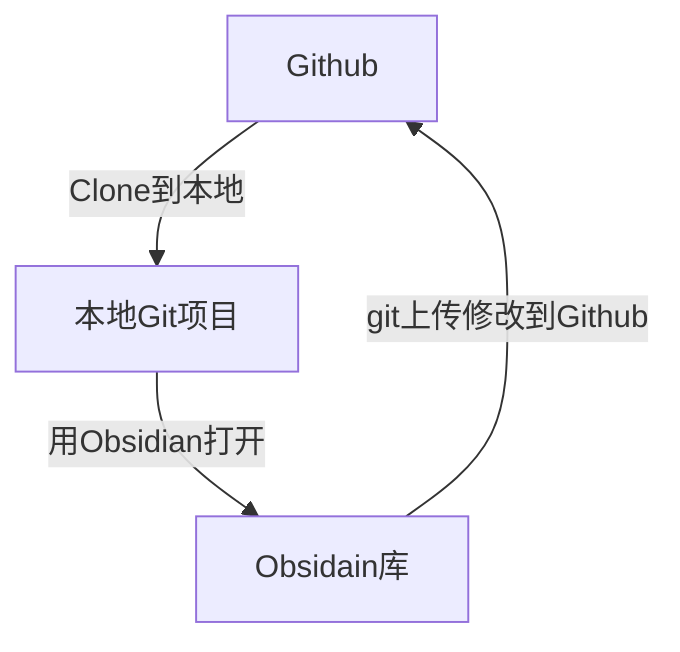

# README

## Pkmer 共建指南

### 前置条件

1. 本地安装obsidian笔记软件
2. 本地安装`git`软件：git是一款多人协作版本控制系统，能够流程化管理多人的协作项目，可以在 [git官网](https://git-scm.com/downloads) 下载。
3. 注册`Github`帐号：[Github地址](https://github.com/)

### 协作流程概述

我们将obsidian库整个托管在Github上，这样任何人都能下载并且修改该库的内容，其基本流程如下：

