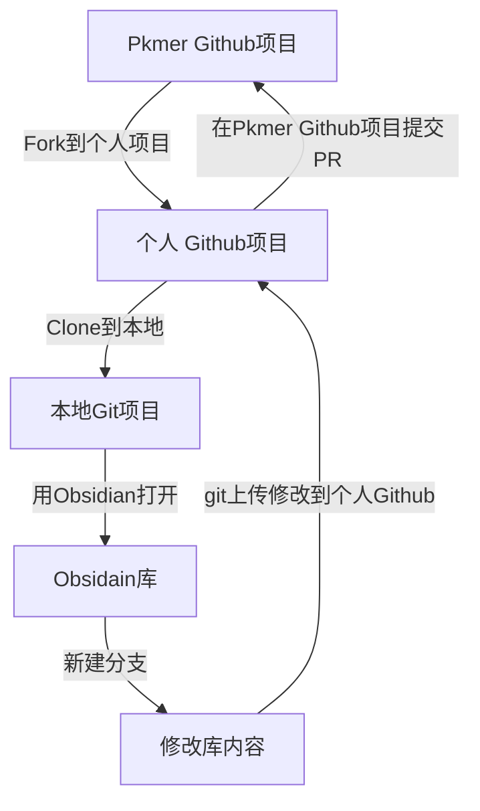

# README

## Pkmer 共建指南

### 前置条件

1. 本地安装 obsidian 笔记软件
2. 本地安装 `git` 软件：git 是一款多人协作版本控制系统，能够流程化管理多人的协作项目，可以在 [git官网](https://git-scm.com/downloads) 下载。
3. 注册 `Github` 帐号：[Github地址](https://github.com/)

### 目录结构

```txt
Pkmer-Docs
├── 00-关于
├── 01-知识管理基础
├── 02-Markdown
├── 10-Obsidian
├── 20-深入理解知识管理
├── 30-知识管理具体应用
├── 40-知识管理工具
├── 50-开发者指南
├── Config
│   └── QuickAdd
│       └── update-yaml-title.js
├── License
├── README.md
└── Resource
    └── Images
```

- 编号以 0 开头的是基础内容
- 编号以 1 开头的是笔记软件的使用
- 编号以 2 开头的是知识管理进阶内容
- 编号以 3 开头的是知识管理具体应用
- 编号以 4 开头的是其它软件工具
- 编号以 5 开头的是插件开发，脚本等内容
- Config 文件夹放置本库的脚本，库内配置
- Resource 文件夹放置本地图片，canvas，excalidraw 等其它非 md 资源

### 协作流程概述

我们将 obsidian 库整个托管在 Github 上，这样任何人都能下载并且修改该库的内容，其基本流程如下：



请注意，您最好需要了解什么是 `Git` 再进行操作，[Git - Book](https://git-scm.com/book/zh/v2) 是很好的资源，大致翻看一下有个概念就好了。

1. `Fork` 到个人项目：打开 [Pkmer-Docs](https://github.com/PKM-er/Pkmer-Docs) 链接地址，点击右上角 `Fork` 按钮，此操作会在用户的个人 Github 生成和地址一样的项目，这里称之为个人 Github 项目
2. `Clone` 到本地：在 Github 网站点击头像，接着点击 `Your Repositories` 跳到你个人项目的页面，找到刚刚 `Fork` 的 `Pkmer-Docs` 项目，进入项目。然后点击绿色按钮 `Code`，复制那一串链接。在本地找个目录，右键打开控制台，输入 `git clone <刚刚复制的链接>`(不要带尖括号)，这会在该目录下载这个个人项目到本地。
3. 用 obsidian 打开：打开 Obsidian，点击左下角打开其它仓库，打开本地仓库，选中个人项目的位置，即可打开这个项目。
4. `新建分支`：这个 Obsidian 库带有一个 git 插件，`ctrl + p` 打开命令窗口，输入 `create new branch`，回车，接着输入新分支名 (一般是对你想要修改内容的简短总结，如 `doc-md-tutorial` 表示一个 md 教程的文档，记得用英文)。
5. 为 Pkmer 文档添砖加瓦
6. `git` 上传到个人 Github：`ctrl + p` 打开命令窗口，输入并选择 `commit all changes with specific message`，接着输入你做出的修改概要 (如：添加了一个 md 教程)；最后，打开 Ob 库所在文件夹路径下的命令行，输入 `git push origin <分支名称>`(不要带尖括号)，即可完成上传。
7. `PR`：Pull Request 的简称，你可以理解为申请合并到 Pkmer Github 主项目。登录到个人 Github 项目的网站，即第一步的做完后的网址，会有一个 `Pull Request` 的绿色提示，点击后按照指示操作即可。
8. 和项目的维护者沟通，最后维护者会将您的贡献合并到主项目，完成整个贡献流程。

## 库内置插件

- `dataview`：用于库的统计和追踪
- `obsidian-git`：用于查看和可视化操作 git
- `obsidian-linter`：规范和格式化 md 文档，按 `ctrl + s` 进行格式化，建议没事按着玩
- `qucikadd`：自动化处理脚本，帮助处理一些繁琐内容，目前有快捷打开命令行，css 片段，script 文件夹，gvim，Vscode 和自动更新 frontmatter 的 `title` 字段的功能，`ctrl + p` 打开命令窗口选择对应的命令即可。
- `obsidian-advanced-table`：快捷输入表格
- `obsidian-outliner`：快捷操作无序列表

对于其它您爱使用的插件和主题，请随意安装，由于有 `.gitignore` 文件，并不会影响到上游库的更改。


## 开源协议

[GNU General Public License version 3](https://opensource.org/license/gpl-3-0/)