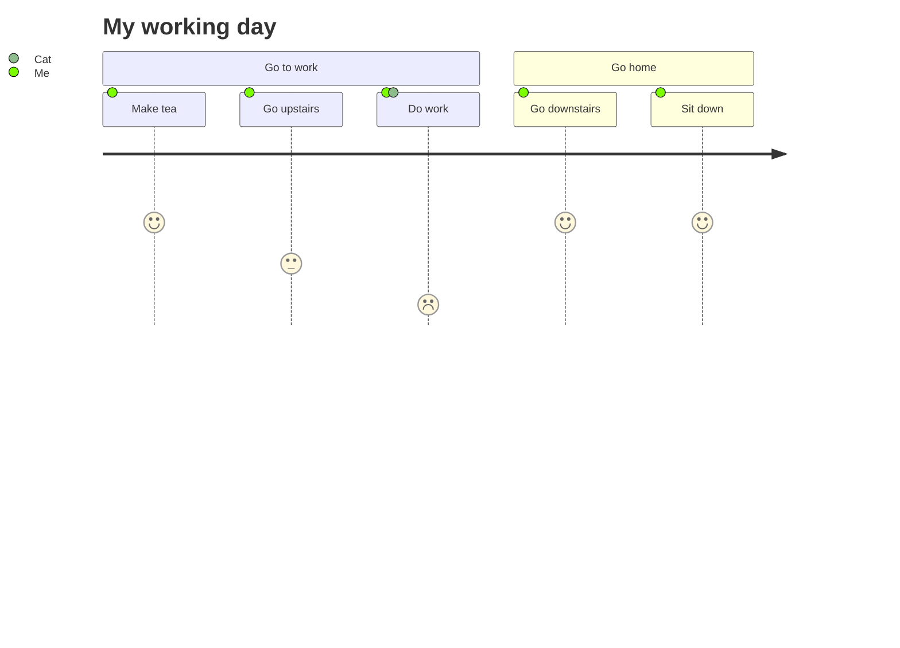

# 主页

## 文档概览

```dataview
table without id 
file.link as "文件名",
type as "类型",
tags as "标签",
uid,
modified as "修改时间"
from "" and !"Config"
sort tags desc
where modified = null
limit 15
```

## 重复 UID 检测

```dataviewjs
const pages = dv.pages()

const pagesId = pages.map((page)=> page.uid)
function findDuplicates(arr) {
  const count = {};
  const duplicates = [];

  for (let i = 0; i < arr.length; i++) {
    if (count[arr[i]] === undefined) {
      count[arr[i]] = 1;
    } else if (count[arr[i]] === 1) {
      duplicates.push(arr[i]);
      count[arr[i]]++;
    }
  }

  return duplicates;
}
const result = findDuplicates(pagesId)
if(result.length > 0){
	dv.list(result)
}else{
	dv.paragraph('==没有结果就是最好的结果==')
}

```

## 网站样式测试

## Order List

1. aaa
2. aaa
	1. 2222
		1. 4444
			1. 333
			2. 5555
		2. 55555
	2. 2333
3. aaa
   1. [x] 2222
      1. [x] 22222
      2. [ ] 33333
         1. [ ] 222

- 无序列表
	- 无序列表
	- 222
- 无序列表 2222


1. 有序列表
	- 1.1 无序列表
	- 1.2 无序列表
2. 有序列表
	- 无序列表 1
	- 无序列表 2
- 无序列表套有序
	1. 有序列表
	2. 有序列表套无序
		- 无序列表
		- 无序列表 2
	3. 第三点
- 无序列表第二节

## callout

> [!note]
> - aaa
>
> - 测试
>
> 1. 测试
> 	1. 测试
> 	2. 测

## 不同的字体样式

*italic*

**bolded**

***bolded italic***

`In-line code (also used as emphasis)`

==Highlighting==

==*italic highlighting*==

*==Sign works in reverse==*

==**Bold highlighting**== 
==***bold italic highlighting***==
==Highlighting `in-line code`==

三更灯火五更鸡，*==~~正是男儿读书时~~==*。
==~~黑发不知勤学早~~==，白首方悔读书迟。

### Math
$$
\begin{aligned}
\frac{\partial f}{\partial x} =0 \\
\frac{\partial f}{\partial y} =0
\end{aligned}
$$


### Codebox 
```java TI:"测试"
public class HelloWorld {
  public static void main(String[] args) {
    System.out.println("Hello, world!");
  }
}
```

### Title of Images

![[pkmer.png|Figure 2. No, it is not an egg!|140]]
 
### Footnote 
要在您的项目中配置 stylelint，您需要在项目根目录下创建一个名为 `.stylelintrc` 的文件。此文件可以包含您的项目的 stylelint 规则[^1]。要了解更多信息，请访问 [https://stylelint.io/。](https://stylelint.io/%E3%80%82)

[^1]: stylelint 是一种用于检查 CSS 代码风格的工具。它可以帮助开发人员检查 CSS 代码是否符合特定的代码规范，并提供指导意见来改进代码质量。stylelint 可以通过命令行或插件集成到常用的文本编辑器中，以便在写代码时实时检查代码质量。


## table

|         What you typed         |     What you got     |
|:------------------------------:|:--------------------:|
|       \=\=your words\=\=       |    ==your words==    |
|     \*\=\=your words\=\=\*     |   *==your words==*   |
|   \=\=\*\*your words\*\*\=\=   |  ==**your words**==  |
| \=\=\*\*\*your words\*\*\*\=\= | ==***your words***== |
|   \*\*\=\=your words\=\=\*\*   |  **==your words==**  |
| \*\*\*\=\=your words\=\=\*\*\* | ***==your words==*** |


## mermaid




 
 